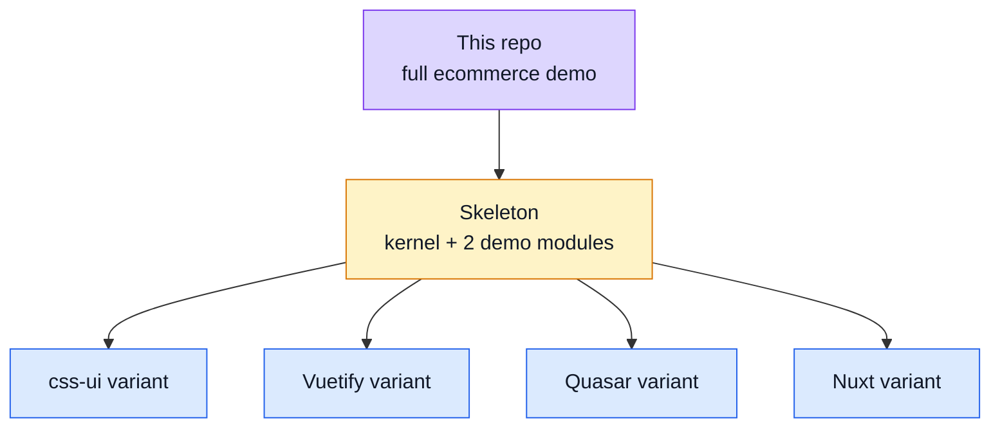

# Roadmap

What is planned but not built.

Reviewed 2026-08-14. Everything the old README roadmap listed as pending and which has since
shipped — the registration-confirmation page, both password-reset pages, image upload in forms,
the Vitest suite, the Cypress suite — has been removed rather than left to rot. A roadmap that
lists finished work stops being read.

## Variants

The largest item, and the one that depends on a decision made outside this repository.

**The skeleton comes first, and every variant descends from it.** Producing variants from this
repository instead would mean maintaining the same twelve domains four times over. The extraction
plan lives outside both repositories, at `BOILERPLATE_SPLIT_PLAN.md` in the workspace root.

- **Skeleton** — the kernel, the infrastructure layer, the tooling and two demo modules. Blocked
  on the current polishing pass finishing.
- **css-ui variant** — from the skeleton. When doing it, recover the old `_root.scss` and
  `_cards.scss` (for `simple-card`) from earlier commits rather than rewriting them.
- **Vuetify variant** — from the skeleton. Note this repository already *is* the Vuetify one; the
  variant is what remains once the domains are gone.
- **Quasar variant**, **Nuxt variant** — from the skeleton.

## A home for teaching code

Everything that exists only to demonstrate the framework now lives in one module, `src/modules/demo`:
the counter store, the teaching route guard and the Playground sandbox. Deleting it is `rm -rf
src/modules/demo` plus its line in `src/modules.ts`, and nothing else in the app refers to it.

| File                                    | What it is                                            |
| --------------------------------------- | ----------------------------------------------------- |
| `src/modules/demo/store.ts`             | the Pinia counter from the Vue scaffold               |
| `src/modules/demo/guards.ts`            | a guard that shows what a guard can and cannot reach   |
| `src/modules/demo/views/Playground.vue` | the component sandbox                                  |

They are genuinely useful in a boilerplate and genuinely noise in an application, so the decision to
make is **not "delete or keep"** — it is *where does teaching code live*. A `demo` module the
registry can drop in one line would answer it, and would put these three under the same deletion
rule as every other domain instead of leaving them permanent residents of `app/`.

Related and cheap: one live `TODO`, at `src/modules/account/views/Profile.vue:232`.

## Conventions to enforce

- **Always call `useXYZStore()` inside a function, never at module top level**, unless the
  dependency is explicit and intended. A top-level call runs at import time, before Pinia is
  necessarily active, and is how circular-import failures appear as `getActivePinia()` errors far
  from their cause. Worth a lint rule rather than a note.

## Maybe

Genuinely undecided, listed so the idea is not lost.

- Extend `useI18n` — or add a sibling composable — to carry the custom helpers currently in the
  i18n utilities.
- A Bootstrap variant from the skeleton.
- Lighthouse metrics as a test layer. It would sit next to the accessibility and visual suites,
  and the open question is whether a score threshold is stable enough in CI to gate on.
