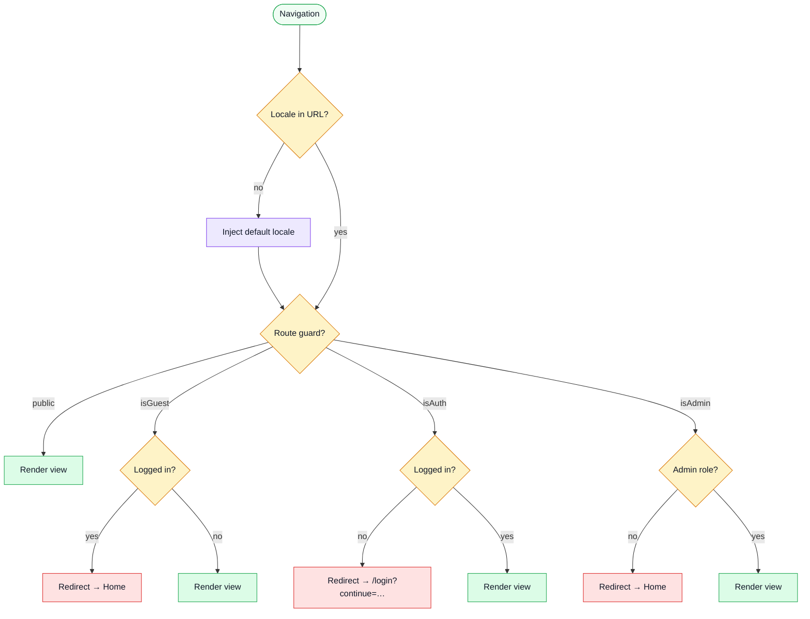

# Sitemap & Access Control

All routes are locale-prefixed (`/:locale/…`). A missing locale is injected automatically by the `localeChoice` middleware using `VITE_APP_DEFAULT_LOCALE`.

## Route table

| Route | Route name | Access |
| ----- | ---------- | ------ |
| `/:locale/` | `Home` | public |
| `/:locale/playground` | `Playground` | public |
| `/:locale/playground/realtime` | `RealtimePlayground` | public |
| `/:locale/error/:status/:message?` | `Error` | public |
| `/:locale/login` | `Login` | guest only |
| `/:locale/signup` | `Signup` | guest only |
| `/:locale/password-reset` | `PasswordResetRequest` | guest only |
| `/:locale/password-reset/confirm` | `PasswordResetConfirm` | guest only |
| `/:locale/account-delete/confirm` | `AccountDeleteConfirm` | public |
| `/:locale/profile` | `Profile` | auth |
| `/:locale/logout` | `Logout` | public (redirects to Home) |
| `/:locale/products` | `ProductsList` | public |
| `/:locale/products/:id` | `ProductTarget` | public |
| `/:locale/products/:id/edit` | `ProductEdit` | admin |
| `/:locale/cart` | `Cart` | auth |
| `/:locale/orders` | `OrdersList` | auth |
| `/:locale/orders/:id` | `OrderTarget` | auth |
| `/:locale/orders/:id/edit` | `OrderEdit` | admin |
| `/:locale/users` | `UsersList` | admin |
| `/:locale/users/create` | `UserCreate` | admin |
| `/:locale/users/:id` | `UserTarget` | admin |
| `/:locale/users/:id/edit` | `UserEdit` | admin |
| `/:locale/admin` | `Admin` | admin |
| `/:locale/:catchAll(.*)` | — | redirect → `Error 404` |

**Access level legend:**
- **public** — no guard, anyone can enter
- **guest only** — `isGuest` guard, logged-in users are redirected away (e.g. Login page)
- **auth** — `isAuth` guard, must be logged in
- **admin** — `isAdmin` guard, must have admin role; others are redirected to Home

## Navigation flow

## Where guards live

| Guard | File | Effect |
| ----- | ---- | ------ |
| `isAuth` | `src/middlewares/authentications.ts` | Must be logged in; redirects to Login on failure |
| `isAdmin` | `src/middlewares/authentications.ts` | Must have admin role; redirects to Home on failure |
| `isGuest` | `src/middlewares/authentications.ts` | Must NOT be logged in; redirects to Home if already authenticated |
| `localeChoice` | `src/middlewares/localeChoice.ts` | Injects locale prefix when missing; validates supported locales |
| `tryRestoreAuth` | `src/middlewares/authentications.ts` | Silently restores token + profile on every navigation from localStorage |

## Auth persistence

`tryRestoreAuth` runs in `router.beforeEach` on **every** navigation, not just guarded ones.
This ensures that public pages (e.g. `ProductsList`) still render the correct admin controls after a hard page reload, without requiring a separate protected route guard.

## Related pages

- [Request Flow](./request-flow.md)
- [Security](../tools/security.md)
- [State & Routing](../tools/state-and-routing.md)
