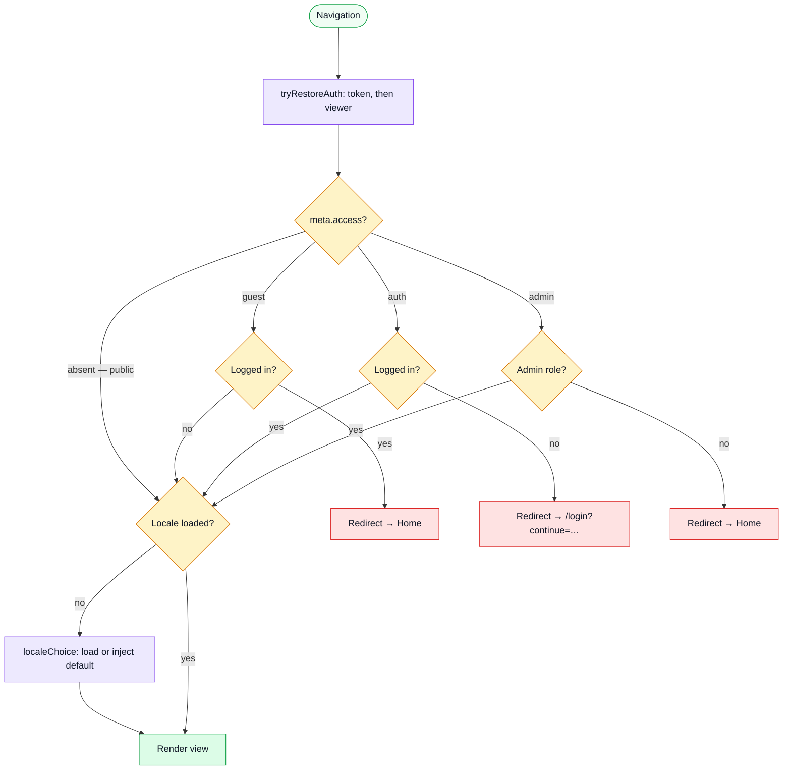

# Sitemap & Access Control

All routes are locale-prefixed (`/:locale/…`). A missing locale is injected automatically by the `localeChoice` guard using `VITE_APP_DEFAULT_LOCALE`.

## Route table

Every screen the enabled modules contribute, generated from their route records — the same records
each [module page](../modules/) renders, so the two cannot disagree.

<!-- gen:all-screens:start -->

| Module                                 | Path                     | Route name             | Access   | View                             |
| -------------------------------------- | ------------------------ | ---------------------- | -------- | -------------------------------- |
| [`account`](../modules/account.md)     | `login`                  | `Login`                | `guest`  | `views/Login.vue`                |
| [`account`](../modules/account.md)     | `signup`                 | `Signup`               | `guest`  | `views/Signup.vue`               |
| [`account`](../modules/account.md)     | `password-reset`         | `PasswordResetRequest` | `guest`  | `views/PasswordResetRequest.vue` |
| [`account`](../modules/account.md)     | `password-reset/confirm` | `PasswordResetConfirm` | `guest`  | `views/PasswordResetConfirm.vue` |
| [`account`](../modules/account.md)     | `account-delete/confirm` | `AccountDeleteConfirm` | `public` | `views/AccountDeleteConfirm.vue` |
| [`account`](../modules/account.md)     | `verify-email/confirm`   | `VerifyEmailConfirm`   | `public` | `views/VerifyEmailConfirm.vue`   |
| [`account`](../modules/account.md)     | `profile`                | `Profile`              | `auth`   | `views/Profile.vue`              |
| [`account`](../modules/account.md)     | `logout`                 | `Logout`               | `public` | `—`                              |
| [`admin`](../modules/admin.md)         | `admin`                  | `Admin`                | `admin`  | `views/Admin.vue`                |
| [`cart`](../modules/cart.md)           | `cart`                   | `Cart`                 | `auth`   | `views/Cart.vue`                 |
| [`demo`](../modules/demo.md)           | `playground`             | `Playground`           | `public` | `views/Playground.vue`           |
| [`feedback`](../modules/feedback.md)   | `contact`                | `Contact`              | `public` | `views/Contact.vue`              |
| [`feedback`](../modules/feedback.md)   | `feedback`               | `FeedbackInbox`        | `admin`  | `views/FeedbackInbox.vue`        |
| [`inventory`](../modules/inventory.md) | `inventory`              | `InventoryLedger`      | `admin`  | `views/InventoryLedger.vue`      |
| [`locales`](../modules/locales.md)     | `locales`                | `LocalesList`          | `admin`  | `views/LocalesList.vue`          |
| [`locales`](../modules/locales.md)     | `locales/dictionary`     | `LocalesDictionary`    | `admin`  | `views/LocalesDictionary.vue`    |
| [`locales`](../modules/locales.md)     | `locales/:tag`           | `LocaleEntries`        | `admin`  | `views/LocaleEntries.vue`        |
| [`orders`](../modules/orders.md)       | `orders`                 | `OrdersList`           | `auth`   | `views/OrdersList.vue`           |
| [`orders`](../modules/orders.md)       | `orders/:id`             | `OrderTarget`          | `auth`   | `views/Order.vue`                |
| [`orders`](../modules/orders.md)       | `orders/:id/edit`        | `OrderEdit`            | `admin`  | `views/OrderEdit.vue`            |
| [`products`](../modules/products.md)   | `products`               | `ProductsList`         | `public` | `views/ProductsList.vue`         |
| [`products`](../modules/products.md)   | `products/create`        | `ProductCreate`        | `admin`  | `views/ProductCreate.vue`        |
| [`products`](../modules/products.md)   | `products/:id`           | `ProductTarget`        | `public` | `views/Product.vue`              |
| [`products`](../modules/products.md)   | `products/:id/edit`      | `ProductEdit`          | `admin`  | `views/ProductEdit.vue`          |
| [`realtime`](../modules/realtime.md)   | `playground/realtime`    | `RealtimePlayground`   | `admin`  | `views/RealtimePlayground.vue`   |
| [`users`](../modules/users.md)         | `users`                  | `UsersList`            | `admin`  | `views/UsersList.vue`            |
| [`users`](../modules/users.md)         | `users/create`           | `UserCreate`           | `admin`  | `views/UserCreate.vue`           |
| [`users`](../modules/users.md)         | `users/:id`              | `UserTarget`           | `admin`  | `views/User.vue`                 |
| [`users`](../modules/users.md)         | `users/:id/edit`         | `UserEdit`             | `admin`  | `views/UserEdit.vue`             |
| [`wishlist`](../modules/wishlist.md)   | `wishlist`               | `Wishlist`             | `auth`   | `views/Wishlist.vue`             |

30 screens across 12 modules. Paths are relative to the localised root. **Access** is the route’s own `meta.access`, which is the only place a permission is declared — a menu entry inherits it rather than restating it.

<!-- gen:all-screens:end -->

### Navigation sections

A navigation entry also says **where** it sits, with `section` — placement, never permission:

| Section   | Desktop (`lg` and up)                                                              | Phone drawer           |
| --------- | ---------------------------------------------------------------------------------- | ---------------------- |
| `main`    | Inline in the app bar, icon-only: the label is the tooltip and the accessible name | Under "Browse"         |
| `account` | The account menu (the signed-in visitor's icon), with logout at the end            | Under "Your account"   |
| `admin`   | The administration menu, rendered only when at least one entry is reachable        | Under "Administration" |

Every entry carries a lucide `icon`. Whether a section's chrome renders at all follows from the same `meta.access` rule as the entries: an anonymous visitor sees neither menu, and a drawer heading appears only above something visible.

### The platform's own routes

These come from `src/app/router/`, not from a module, which is why they are not in the table above.
They exist whether or not any domain is enabled.

| Route                                             | Route name      | Access                 |
| ------------------------------------------------- | --------------- | ---------------------- |
| `/:locale/`                                       | `Home`          | public                 |
| `/:locale/error/:status/:message?`                | `Error`         | public                 |
| `/:locale/about` · `/faq` · `/terms` · `/privacy` | `StaticAbout` … | public                 |
| `/:locale/:catchAll(.*)`                          | —               | redirect → `Error 404` |

## Navigation flow

Order is the router's, not this diagram's convenience: `beforeEach` (session, then access) runs
**before** `beforeResolve` (locale), so an unauthorised visitor is redirected before any dictionary
is fetched.

```mermaid
%%{init: {'flowchart': {'nodeSpacing': 70, 'rankSpacing': 90}}}%%
flowchart TD
    Nav([Navigation]) --> Restore[tryRestoreAuth: token, then viewer]
    Restore --> Guard{meta.access?}

    Guard -->|absent — public| Locale

    Guard -->|guest| GuestCheck{Logged in?}
    GuestCheck -- yes --> GuestHome[Redirect → Home]
    GuestCheck -- no --> Locale

    Guard -->|auth| AuthCheck{Logged in?}
    AuthCheck -- no --> AuthLogin[Redirect → /login?continue=…]
    AuthCheck -- yes --> Locale

    Guard -->|admin| AdminCheck{Admin role?}
    AdminCheck -- no --> AdminHome[Redirect → Home]
    AdminCheck -- yes --> Locale

    Locale{Locale loaded?} -- no --> Inject[localeChoice: load or inject default]
    Inject --> View[Render view]
    Locale -- yes --> View

    classDef entry fill:#f0fdf4,stroke:#16a34a,color:#111827;
    classDef decision fill:#fef3c7,stroke:#d97706,color:#111827;
    classDef guard fill:#ede9fe,stroke:#7c3aed,color:#111827;
    classDef success fill:#dcfce7,stroke:#16a34a,color:#111827;
    classDef redirect fill:#fee2e2,stroke:#dc2626,color:#111827;

    class Nav entry;
    class Guard,GuestCheck,AuthCheck,AdminCheck,Locale decision;
    class Restore,Inject guard;
    class View success;
    class GuestHome,AdminHome,AuthLogin redirect;
```

## Where guards live

| Guard                | File                                | Registered on                 | Effect                                                                                                                                            |
| -------------------- | ----------------------------------- | ----------------------------- | ------------------------------------------------------------------------------------------------------------------------------------------------- |
| `tryRestoreAuth`     | `src/app/guards/authentications.ts` | `beforeEach` (first)          | Silently restores the access token from the refresh endpoint, then loads the viewer, so `isAuth`/`isAdmin` are settled before anything reads them |
| `enforceRouteAccess` | `src/app/guards/authentications.ts` | `beforeEach` (second)         | Applies `canAccess` to `meta.access`; redirects and notifies the visitor when it refuses                                                          |
| `localeChoice`       | `src/app/guards/locale-choice.ts`   | `beforeResolve`               | Loads and activates the `:locale` dictionary; redirects with the default locale injected when the param is missing or unsupported                 |
| `exampleGuard`       | `src/modules/demo/guards.ts`        | `beforeEnter` on `Playground` | Teaching-only: shows what a guard can and cannot reach. Scoped to one route, never app-wide                                                       |

`canAccess` in the same file is not a guard — it is the shared predicate both `enforceRouteAccess`
and `AppNavigation` call.

## Auth persistence

`tryRestoreAuth` runs in `router.beforeEach` on **every** navigation, not just guarded ones.
This ensures that public pages (e.g. `ProductsList`) still render the correct admin controls after a hard page reload, without requiring a separate protected route guard.

## Related pages

- [Request Flow](./request-flow.md)
- [Security](../tools/security.md)
- [State & Routing](../tools/state-and-routing.md)
