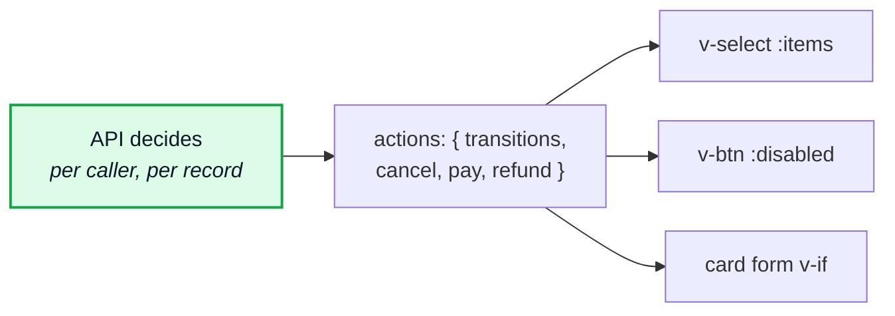

# Strategic DDD

**The part of Domain-Driven Design that survives on a client** — bounded contexts, context mapping,
ubiquitous language and subdomain distillation. All four are in the code — as folders, imports,
identifiers and docblocks, which is where a reader actually meets them rather than in a manifest
field asserted by a spec.

The other half — entities, value objects, aggregates, repositories — is **not** here, and on a
frontend that is more emphatic than a preference. [Domain layer](./domain-layer.md) explains why:
prices, totals, eligibility and permissions are decided server-side, and a client that
re-implements them has two implementations of one rule.

::: tip This page mirrors the backend's
`boilerplate-node-api-mongodb-mongoose/docs/theory/strategic-ddd.md` states the same four ideas for
the API. Read them together — the interesting parts are where the two **disagree**, and each of
those disagreements is a fact about where the domain actually lives.
:::

---

## The problem this solves

Every architecture document says things like "the cart owns checkout" and "admin depends on
nothing". Those sentences are true when written and unverifiable forever after. Six months later the
document says one thing, the imports say another, and the document is the one that loses — quietly,
because nothing fails.

This client had exactly that, twice:

- `cart` declared `dependsOn: ['orders']` long after checkout moved into the cart store and the
  import disappeared.
- `orders` published `useOrdersStore` "for the cart's checkout" — same vanished import, and the
  export outlived its reason by a whole refactor.

Both were found the day a typed `dependsOn` field and a spec reconciling it against real imports
went in — and both are still findable, because what caught them was never the typed field. It was
comparing a declared edge to a real import. That comparison now happens where a change actually
shows up: `eslint.config.ts`'s generated coupling rule, checked on every `npm run lint`. See §2.

---

## 1. Bounded context — the folder

One module is one context. `rm -rf src/modules/wishlist` plus one line in `src/modules.ts` deletes
the domain, and anything that breaks is real coupling worth seeing. Covered in
[Modules](./modules.md).

## 2. Context map — how a module reaches its siblings

A module's imports are its dependency list. What they do not say is what KIND of reach each one is,
and the kinds differ enormously in what they cost when the upstream moves:

| Kind                 | What it means                                                        | Cost when the upstream changes                  | Example                |
| -------------------- | -------------------------------------------------------------------- | ----------------------------------------------- | ---------------------- |
| `conformist`         | reads another module's store as it is, no translation, no say        | **high** — its shape is your shape too          | `inventory → products` |
| `customer-supplier`  | calls a sibling's store to make something happen                     | medium — the call survives, the payload may not | `products → cart`      |
| `published-language` | receives vocabulary, not state: a schema, a self-contained component | **low** — neither side learns the other's store | `orders → payments`    |

### Where the map lives

In the docblock at the top of each module's `module.ts`, in prose, next to the imports it describes.
`cart` reaches five siblings, and its docblock says how it depends on each: two `conformist` reads,
two `customer-supplier` calls, one `published-language`. The last is the cheapest relationship in
the table and the one to copy: `delivery` publishes a component and no storage at all.

This used to be a `dependsOn` field on the manifest — a typed array of `{ module, as, because }`
edges — held to a 108-line cross-cutting spec that checked every edge was really imported, every
import had a declared edge, and every `because` was a written sentence. Both are gone, and it is
worth saying why, because the reasoning applies to any labelled-graph field someone is tempted to add
back:

- **Nothing read it at runtime.** Not the router, not a store, not a guard. It was documentation
  with a type annotation.
- **It was self-reported.** Because it was not derived from real imports, it could only prove a
  developer's annotations agreed with each other — the actual proof still needed a spec scanning
  every `.ts` and `.vue` file for `@/modules/` strings.
- **The enforcement that matters is structural and still there.** `eslint.config.ts` generates one
  `no-restricted-imports` rule per module from a hand-maintained `MODULE_EDGES` map: a module may
  reach only the siblings that map names for it, checked at the offending import on every
  `npm run lint`. A new coupling fails immediately, at the line that adds it, rather than on a
  separate spec run.

### The one worth still noticing

The backend has a fourth kind, `shared-kernel`, and exactly one edge that is one: `account → users`,
because both modules write the same User record. Here the same pair is `published-language` —
`account` and `users` share `usersSchema`/`usersPasswordSchema`, field rules rather than a store,
because neither module writes anything; the API does. That divergence is what
[Domain layer](./domain-layer.md) means by the domain living behind the API, and it is worth reading
`account/module.ts`'s docblock for, even though nothing checks it holds.

## 3. Ubiquitous language — per context, not per app

**The language lives in the identifiers.** That is Evans' actual requirement: the model and the
language co-evolve, and the code is the primary expression of both.

What an identifier cannot carry is the meaning behind it, and that lives in
**[Glossary](./glossary.md)** — one section per module. On a client it is worth more than it first
looks, because this repo's word is frequently not the server's: a `Cart` here is _a view of the
server's cart, not a second copy of it_, while the backend's `Cart` is _one open basket per user,
priced against the live catalogue_. Both are right in their own context, and a single shared
glossary would have to pick one and be wrong in the other place.

Writing the client's definition down is also the cheapest guard there is against someone deciding
the store should compute a total.

::: tip It used to be a manifest field
Each module declared a `language: {}` map. It was removed: nothing read it, nothing checked it was
true, and it sat in `module.ts` rather than beside the store or component each entry described. The
prose moved to the glossary page.
:::

## 4. Subdomain distillation — where to spend effort

DDD's own advice is the part most often skipped: tactical patterns belong in the **core** domain,
and everything else should use the simplest thing that works.

| Subdomain    | Meaning                                                         | Here                                                |
| ------------ | --------------------------------------------------------------- | --------------------------------------------------- |
| `core`       | the reason the product exists — worth client-side rules         | `products`, `cart`, `orders`                        |
| `supporting` | specific to this business, not a differentiator — keep it plain | `delivery`, `payments`, `inventory`, `wishlist`     |
| `generic`    | a solved problem, interchangeable with something bought         | `account`, `users`, `admin`, `feedback`, `realtime` |

The rule of thumb that follows: **a `generic` module should not carry a `domain/` folder.** A
pure-rules layer inside authentication or i18n is effort spent on the part of the client that should
stay replaceable.

This used to be a required `subdomain` field on the manifest, held to that rule by a cross-cutting
spec. Both are gone: nothing read the field at runtime, and the check it enabled — refusing a
`domain/` folder inside a module classified `generic` — was a test acting on a label nothing else
ever consulted. The classification above is still true and still useful to a reader deciding where
to put a new rule; it just is not proven by a passing test any more, the same way `core` never was.

There is deliberately **no** rule, enforced or otherwise, that `core` must have a `domain/`. `cart`
has one because quantity clamping is a genuine client-side rule. `products` and `orders` are core and
have none — prices and status transitions are the server's to decide, and a second implementation
here would be drift, not thoroughness.

::: tip These values are this project's, not a rule for the next one
A boilerplate has no core domain. The table above is this shop's answer, and the first thing a real
project built from this one should do is re-decide it for its own business.
:::

::: warning A `core` label here marks screens, not logic
This application owns almost none of the domain it displays. `orders` is core because the order
history and the admin status screens are load-bearing, not because an invariant lives here. Nothing
in this table is an argument for building an aggregate.
:::

### How a client asks instead of deciding

"The server's to decide" is easy to write and easy to quietly break. The pressure is real: a screen
has to know whether to show a cancel button, which statuses to offer, whether to render a card form
— and the shortest path to each answer is a comparison written here.

Three of them existed. A status dropdown listed every value of the enum, a cancel button tested for
`pending` or `paid`, a pay form tested for `pending`. All three agreed with the API on the day they
were written, and nothing could have told us when they stopped.

They are gone, and what replaced them is not a better comparison — it is no comparison. Every read
of an order or a payment carries an `actions` block the server computed for that caller:

A control is enabled when the server says so and disabled otherwise. The rules can change on the
API — a new status, a different role boundary, a cancel window that closes earlier — and this
application follows without being edited, because it never held an opinion to update.

The test for whether a new screen is doing this right: **if you can delete the API and still say
what the button would do, the rule is in the wrong repository.**

## 5. Published language — the barrel, held to a size

**A module publishes exactly what a sibling imports. No sibling, no barrel.**

Applying that removed three whole barrels — `admin`, `orders`, `realtime` — and four stores nobody
had ever imported.

What survived says something specific about a client. The modules that publish a **store** are the
ones siblings ask to change state: `cart` and `wishlist`. The ones that publish a **component** or a
**schema** are answering a narrower question, and are the better shape — `PaymentPanel` renders a
payment without its caller learning what a provider is. `delivery` publishes two components and
deliberately not its store, because offering both would mean offering a wider way to do the same
thing, and the wider one always wins.

---

## What this does not give you

Everything above is about **boundaries and vocabulary**. None of it makes an invalid order
unconstructable or turns `status: string` into a closed set — and on this side of the API, none of it
should. See [Domain layer](./domain-layer.md) §5 for when a client genuinely does own rules
(offline-first, a complex editor, a client-side pricing engine), and what changes if it does.
