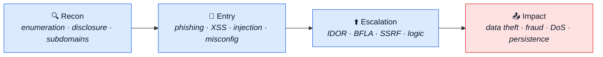

# Web Attack Catalog

A theory-only reference: every kind of flaw a website can have and every kind of attack it can
receive, grouped by **where the attack lands**. Nothing on this page is about this codebase — what
the boilerplate actually does about each item lives in [Security](../tools/security.md), and the
row-by-row mapping from this catalog to the code is
[Web Attack Defences](./web-attack-defences.md).

Use it as a checklist when threat-modelling a feature: walk the groups top to bottom and ask
"could this one apply here?". Each row is deliberately one line — the name, what it is, and the
mechanism. Follow the standard references at the bottom for depth.

## The attack surface in one picture

```mermaid
%%{init: {'flowchart': {'nodeSpacing': 40, 'rankSpacing': 55}}}%%
flowchart LR
    H["🧑 Human<br/><i>phishing · social engineering</i>"]
    B["🌐 Browser<br/><i>XSS · CSRF · clickjacking · XS-Leaks</i>"]
    N["🔌 Transport<br/><i>TLS · smuggling · cache poisoning · DoS</i>"]
    A["⚙️ Application<br/><i>injection · auth · authz · logic · files · SSRF</i>"]
    D["🗄️ Data & infra<br/><i>DB exposure · secrets · misconfig · supply chain</i>"]

    H --> B --> N --> A --> D

    classDef human fill:#fef3c7,stroke:#d97706,color:#111827;
    classDef client fill:#ddd6fe,stroke:#7c3aed,color:#111827;
    classDef net fill:#dbeafe,stroke:#2563eb,color:#111827;
    classDef app fill:#fee2e2,stroke:#dc2626,color:#111827;
    classDef data fill:#dcfce7,stroke:#16a34a,color:#111827;
    class H human;
    class B client;
    class N net;
    class A app;
    class D data;
```

Every section below sits on one of those five boxes. An attacker rarely stays in one: a phishing
mail (human) leads to an open redirect (browser) that lands on an IDOR (application) that dumps a
collection (data). Chains are the norm, which is why a "low" finding is rarely low on its own.

## How to read the tables

| Column   | Meaning                                                          |
| -------- | ---------------------------------------------------------------- |
| **Name** | the term you will find in write-ups, CVEs and scanner output     |
| **What** | the flaw or the attack, in one sentence                          |
| **How**  | the mechanism — the one thing that has to be true for it to work |

"Flaw" and "attack" are two sides of one row: the flaw is the missing control, the attack is the
way someone exploits its absence. Where a group is mostly one or the other, the section says so.

## 1. Injection — untrusted data interpreted as code

The oldest family and still the most damaging. The pattern is always the same: user input reaches
an interpreter (SQL, shell, template engine, XML parser, regex engine…) without being separated
from the instructions.

| Name | What | How |
| ------------------------------------- | ------------------------------------------------------ | ------------------------------------------------------------------------------------ | -------------------- |
| SQL injection (SQLi) | input alters a SQL statement | string concatenation into a query; variants: error-based, union, blind, time-based |
| Second-order SQLi | stored input becomes injection later | value is sanitised on entry but re-used raw in a later query |
| NoSQL injection | input alters a document query | JSON body carrying operators (`$gt`, `$ne`, `$where`, `$regex`) into a filter object |
| Aggregation / pipeline injection | input alters a pipeline stage | user-controlled field names or stages reach an aggregation |
| ORM / query-builder injection | ORM helpers bypassed | raw fragments, unsafe `where` strings, dynamic sort/order fields |
| OS command injection | input becomes part of a shell command | `exec`-style calls with interpolated strings; `;`, `                                |`, `$( )`, backticks |
| Argument injection | input becomes an extra flag | safe `spawn` but a value beginning with `-` is read as an option by the binary |
| Code injection / `eval` | input executed by the language runtime | `eval`, `new Function`, `vm` sandboxes, dynamic `import` |
| Server-side template injection (SSTI) | input parsed as a template | user text goes into a template string rather than a template variable |
| Client-side template injection | same, but in a browser framework | user text reaches an expression evaluator (legacy Angular, Vue `v-html`+expressions) |
| Expression-language injection | input reaches an EL evaluator | SpEL, OGNL, JEXL, MVEL… in frameworks that evaluate expressions from parameters |
| LDAP injection | input alters an LDAP filter | unescaped `*`, `(`, `)`, `\|`, `&` in a directory query |
| XPath / XQuery injection | input alters an XML query | same shape as SQLi, against XML documents |
| XML external entity (XXE) | XML parser resolves attacker entities | DTD with external entities enabled → local file read, SSRF, DoS |
| XML injection | input alters XML structure | unescaped angle brackets in generated XML |
| GraphQL injection | input alters a query or reaches a resolver interpreter | string-built queries; resolvers passing arguments to SQL/shell |
| Log injection / log forging | input alters log lines | newlines or ANSI codes in a value written to logs; fake entries, hidden ones |
| JNDI / lookup injection | logger or config resolves remote references | `${jndi:ldap://…}`-style lookups in logged strings (Log4Shell) |
| CRLF injection | input inserts line breaks into a protocol | `\r\n` in a header value, log line, SMTP dialogue |
| HTTP header injection | input becomes a response header | CRLF inside redirect targets, cookie values, custom headers |
| HTTP response splitting | one response becomes two | CRLF injection producing a second, attacker-shaped response |
| Email header injection | input alters SMTP headers | newline in a `subject`/`from` field adds `Bcc:` or new recipients |
| CSV / formula injection | exported cell executes in a spreadsheet | value starting with `=`, `+`, `-`, `@` treated as a formula when opened |
| Regex injection | input becomes a pattern | user value passed to `new RegExp`; leads to ReDoS or filter bypass |
| Server-side includes (SSI) injection | input reaches an SSI directive | `<!--#exec … -->` in a page the server processes for includes |
| Insecure deserialization | untrusted bytes rebuilt into objects | serialised payloads with gadget chains; language-native formats, `pickle`, YAML |
| Prototype pollution | input modifies `Object.prototype` | recursive merge / `__proto__` keys → later logic reads attacker defaults |
| Mass assignment / autobinding | input sets fields it should not | request body bound directly to a model; `isAdmin`, `price`, `ownerId` overwritten |
| Host header injection | input controls the `Host` used server-side | absolute URLs, password-reset links, cache keys built from `Host` |
| Path / URL parameter injection | input alters a path built server-side | user value concatenated into a filesystem path or internal URL |

## 2. Client-side — attacks that run in the victim's browser

The site's own origin is the prize. Anything that executes or reads inside it inherits the
victim's cookies, storage and permissions.

| Name                                           | What                                                     | How                                                                                          |
| ---------------------------------------------- | -------------------------------------------------------- | -------------------------------------------------------------------------------------------- |
| Cross-site scripting (XSS) — reflected         | script from the request echoed in the response           | unescaped parameter rendered in HTML; delivered by a crafted link                            |
| XSS — stored                                   | script saved once, served to many                        | unescaped user content (comments, names, profiles) rendered later                            |
| XSS — DOM-based                                | script never touches the server                          | client code writes `location`, `hash`, `postMessage` data into the DOM unsafely              |
| XSS — mutation (mXSS)                          | sanitiser bypassed by the parser                         | markup that is safe as text but mutates into script when the browser re-serialises it        |
| XSS — blind                                    | payload fires where the attacker cannot see              | stored in a support ticket, log viewer, admin dashboard                                      |
| XSS — universal (UXSS)                         | browser bug crossing origins                             | flaw in the browser rather than the site; site cannot prevent, only reduce impact            |
| HTML injection                                 | markup, not script, injected                             | phishing forms, fake login boxes, defacement inside a trusted page                           |
| CSS injection                                  | attacker-controlled stylesheet                           | attribute selectors leaking values char by char, layout for clickjacking                     |
| Dangling markup injection                      | unclosed tag swallows following HTML                     | `` overrides `window.config` that scripts trust                               |
| Cross-site request forgery (CSRF)              | victim's browser sends a request the victim did not mean | cookies auto-attached to a cross-site form/fetch; no token or SameSite check                 |
| Login CSRF                                     | victim logged into the attacker's account                | forged login form; victim's later actions land in a session the attacker can read            |
| Cross-site WebSocket hijacking (CSWSH)         | CSRF on the WebSocket handshake                          | cookie-authenticated upgrade with no `Origin` check                                          |
| Clickjacking / UI redress                      | victim clicks something hidden                           | target page in an invisible iframe under a decoy; no frame-ancestors / X-Frame-Options       |
| Drag-and-drop / cursorjacking                  | clickjacking variants                                    | offset cursor, drag data across frames                                                       |
| Tabnabbing (reverse)                           | opened tab rewrites the opener                           | `window.opener` without `noopener` lets the new page navigate the original                   |
| Open redirect                                  | site sends users to any URL                              | `?next=` / `returnUrl` not validated; used for phishing and OAuth token theft                |
| `postMessage` abuse                            | cross-window messages trusted                            | listener without origin check; sender to `*` leaking data                                    |
| Cross-site script inclusion (XSSI)             | JSON/JS with data read cross-origin                      | dynamic script response included via `<script src>`; JSONP hijacking is the classic case     |
| Cross-site leaks (XS-Leaks)                    | infer cross-origin state from side channels              | timing, frame counting, error events, cache probing, `history.length`                        |
| Cross-origin resource sharing (CORS) misconfig | browser allowed to read cross-origin responses           | reflected `Origin`, `null` origin allowed, wildcard with credentials                         |
| Content-Security-Policy bypass                 | CSP present but escapable                                | `unsafe-inline`, permissive `script-src`, JSONP endpoints on allowed hosts, base-uri missing |
| Subresource without integrity                  | CDN script modified in transit or at source              | `<script src="cdn…">` without SRI hash                                                       |
| Mixed content                                  | HTTPS page loads HTTP resources                          | active mixed content lets a network attacker inject script                                   |
| Service-worker abuse                           | persistent script for the origin                         | XSS registers a worker that survives the original bug                                        |
| Web cache deception                            | private page cached as public                            | `/account/me.css`-style URL confuses cache rules; attacker fetches the cached copy           |
| Browser cache poisoning                        | poisoned response reused locally                         | cacheable response with injected content persists for the victim                             |
| Client-side prototype pollution                | same as server-side, in the browser                      | query-string parsers, deep-merge utilities → DOM XSS gadgets                                 |
| Client-side path traversal                     | relative URL escapes intended API path                   | `../` in a value used to build a fetch URL                                                   |
| Drive-by download                              | file delivered without consent                           | compromised page or ad triggers download or exploit kit                                      |
| Formjacking / Magecart                         | injected script skims form data                          | compromised third-party script exfiltrates card numbers as they are typed                    |
| Clipboard / autofill abuse                     | browser conveniences leak data                           | hidden fields autofilled, `copy` events rewritten                                            |
| History sniffing                               | visited links inferred                                   | timing / rendering side channels on `:visited`                                               |
| Browser fingerprinting                         | tracking without cookies                                 | canvas, fonts, audio, hardware quirks; a privacy flaw more than an exploit                   |
| Sensitive data in client storage               | secrets readable by any script                           | tokens in `localStorage`, PII in IndexedDB — one XSS away from theft                         |

## 3. Authentication — proving who you are

Mostly flaws (missing controls); the attacks are the ways credentials and sessions get taken.

| Name                                  | What                                     | How                                                                                            |
| ------------------------------------- | ---------------------------------------- | ---------------------------------------------------------------------------------------------- |
| Brute force                           | guess one account's password             | no lockout, no rate limit, no MFA                                                              |
| Credential stuffing                   | replay leaked credential pairs           | password reuse across sites; automated login attempts at scale                                 |
| Password spraying                     | one common password across many accounts | evades per-account lockout                                                                     |
| Default / hard-coded credentials      | vendor or seed accounts still valid      | `admin/admin`, demo users, credentials in the repo                                             |
| Weak password policy                  | trivially guessable secrets allowed      | short, common, or breached passwords accepted                                                  |
| User / account enumeration            | discover which identifiers exist         | different messages, status codes, or timing on login, signup, reset                            |
| Timing attack on comparison           | secret leaked byte by byte               | non-constant-time string compare on tokens, hashes, HMACs                                      |
| Credential leakage                    | secrets end up somewhere readable        | passwords/tokens in URLs, logs, error pages, analytics, referrer                               |
| Session fixation                      | attacker picks the session id            | id accepted from URL/cookie and not rotated at login                                           |
| Session hijacking / sidejacking       | attacker steals a live session           | XSS, network sniffing without TLS, log exposure, malware                                       |
| Predictable session tokens            | ids can be guessed                       | sequential, timestamp-based, or weak PRNG identifiers                                          |
| Insufficient session expiry           | sessions live too long                   | no idle timeout, no absolute timeout, no server-side revocation                                |
| Missing invalidation                  | old sessions stay valid                  | logout, password change, role change do not revoke existing tokens                             |
| Cookie flag omissions                 | cookie exposed to script or network      | missing `HttpOnly`, `Secure`, `SameSite`; over-broad `Domain`/`Path`                           |
| Cookie tossing                        | subdomain overwrites parent cookie       | attacker-controlled subdomain sets a cookie the parent trusts                                  |
| JWT — `alg: none`                     | signature check disabled                 | library accepts unsigned tokens                                                                |
| JWT — key confusion                   | RS256 verified as HS256                  | public key used as HMAC secret                                                                 |
| JWT — weak secret                     | HMAC key brute-forced offline            | short or dictionary secret                                                                     |
| JWT — `kid` / `jku` / `x5u` injection | verifier fetches attacker key            | header points to attacker-controlled key material or a path traversal                          |
| JWT — missing claims validation       | expired or foreign token accepted        | `exp`, `aud`, `iss`, `nbf` not checked                                                         |
| JWT — no revocation                   | stolen token valid until expiry          | stateless tokens with no denylist or version check                                             |
| Refresh-token misuse                  | long-lived token stolen or replayed      | stored accessibly, not rotated, not bound to client, family not revoked on reuse               |
| Password-reset poisoning              | reset link points at the attacker        | link built from `Host` / `X-Forwarded-Host` header                                             |
| Weak reset tokens                     | reset link guessable or reusable         | short, predictable, non-expiring, not single-use                                               |
| Reset via security questions          | knowledge-based recovery                 | answers guessable or public                                                                    |
| Email-change without re-verification  | account takeover by swapping the address | change accepted without confirming the new address and the old one                             |
| Magic-link flaws                      | login link abused                        | reusable, long-lived, leaked through referrer, no device binding                               |
| OTP / 2FA bypass                      | second factor skipped                    | no rate limit on codes, response tampering (`{"ok":false}`→`true`), step skipped, backup codes |
| MFA fatigue / push bombing            | user approves out of annoyance           | repeated push prompts until one is accepted                                                    |
| SIM swap                              | SMS factor hijacked                      | carrier social engineering moves the number                                                    |
| Remember-me token flaws               | persistent login token weak              | predictable, non-rotating, not revoked                                                         |
| OAuth — missing `state`               | login CSRF on the callback               | attacker's code delivered to victim's callback                                                 |
| OAuth — `redirect_uri` manipulation   | code or token sent to attacker           | loose matching, open redirect on an allowed domain, path traversal                             |
| OAuth — implicit flow token leakage   | access token in the fragment             | leaks via referrer, history, logs                                                              |
| OAuth — missing PKCE                  | authorization code interception          | public client without proof-of-key                                                             |
| OAuth — scope / consent abuse         | more access than intended                | scope upgrade, consent phishing with a look-alike app                                          |
| OAuth — account linking confusion     | wrong account linked                     | unverified email from provider trusted for matching                                            |
| SAML — signature wrapping / comment   | assertion altered yet "valid"            | XML signature wrapping, comment truncation of `NameID`                                         |
| SSO misconfiguration                  | any tenant's users accepted              | issuer / audience not pinned                                                                   |
| Account lockout as DoS                | attacker locks victims out               | lockout by username with no CAPTCHA / IP context                                               |
| Pre-account-takeover                  | attacker registers before victim         | unverified email at signup; victim later "links" into attacker's account                       |
| Insecure "keep me logged in"          | client-side auth state trusted           | `isLoggedIn=true` cookie, role in a cookie                                                     |

## 4. Authorization — proving what you may do

The most common class in modern APIs. Authentication was fine; the check on _this object_ or
_this function_ was missing.

| Name                                           | What                                            | How                                                                     |
| ---------------------------------------------- | ----------------------------------------------- | ----------------------------------------------------------------------- |
| Insecure direct object reference (IDOR) / BOLA | access another user's object                    | change the id in the URL/body; no ownership check                       |
| Horizontal privilege escalation                | act as a peer                                   | same role, different user's data or actions                             |
| Vertical privilege escalation                  | act as a higher role                            | admin endpoints reachable without the admin check                       |
| Broken function-level authorization (BFLA)     | function callable by the wrong role             | route exists, middleware missing                                        |
| Broken object-property-level authorization     | field readable/writable by the wrong role       | over-fetching responses; mass assignment on write                       |
| Forced browsing                                | hidden URL is not protected                     | guessing `/admin`, `/export`, `/v1/internal`                            |
| Parameter tampering                            | role or owner supplied by the client            | `role=admin`, `userId=…` in body trusted                                |
| Path normalisation bypass                      | check sees one path, handler another            | `/Admin`, `/admin/`, `/admin%2f`, `/admin;x`, `..;/`, double encoding   |
| HTTP verb tampering                            | check applied to some methods only              | `GET` guarded, `HEAD`/`PUT`/`OPTIONS` not; method-override headers      |
| Referer / origin-based access control          | check trusts a spoofable header                 | `Referer` used as authorization                                         |
| IP-based trust                                 | check trusts a spoofable address                | `X-Forwarded-For` honoured from untrusted proxies                       |
| Multi-step / workflow bypass                   | step reached out of order                       | pay step skipped by calling the confirm step directly                   |
| State-machine violations                       | transition not allowed from current state       | cancel after shipped, refund twice                                      |
| Context-dependent authorization gaps           | rule depends on data not checked                | "owner can edit" but owner check reads a stale or client-supplied value |
| Tenant isolation failure                       | one customer sees another's data                | missing tenant scope on queries, shared caches, shared ids              |
| Confused deputy                                | privileged component acts on behalf of attacker | internal service trusts callers; SSRF into an admin API                 |
| Time-of-check / time-of-use (TOCTOU)           | check passes, state changes, action runs        | race between validation and use                                         |
| GraphQL field-level authorization              | resolver reachable via another path             | nested fields or aliases skip the guard on the top-level query          |
| Admin functionality in client bundle           | UI hides, server does not                       | disabled buttons but live endpoints                                     |
| Insecure direct file access                    | files served by guessable path                  | uploads under a public directory with predictable names                 |
| Missing rate limit on sensitive functions      | abuse of allowed function at scale              | export, invite, coupon generation without quotas                        |

## 5. Business logic — the rules themselves are exploitable

No parser or bug involved; the application does exactly what it was told, and what it was told
was wrong. These are the ones scanners never find.

| Name                                    | What                                       | How                                                          |
| --------------------------------------- | ------------------------------------------ | ------------------------------------------------------------ |
| Race condition / double spend           | limit checked once, used many times        | parallel requests pass the same check before any commits     |
| Coupon / voucher reuse                  | single-use item used repeatedly            | race, missing uniqueness, case/whitespace variants           |
| Price manipulation                      | client sends the price                     | price, discount, currency, or total trusted from the request |
| Negative or zero quantities             | arithmetic inverted                        | `quantity=-1` credits instead of charging                    |
| Integer overflow / precision loss       | number wraps or rounds                     | large totals, floating-point money, rounding per line item   |
| Currency confusion                      | amount in the wrong unit                   | cents vs. units, currency code changed after pricing         |
| Workflow step skipping                  | later step called without earlier          | order confirmed without payment callback                     |
| Replay of one-time actions              | action repeated                            | resend webhook, resubmit form; no idempotency key            |
| Inconsistent validation across channels | one path stricter than another             | web form validates, API or import does not                   |
| Trusting client-side validation         | only the browser checks                    | JavaScript rules, HTML `required`, `max` attributes          |
| Refund / return abuse                   | money out without goods in                 | refund larger than paid, refund after partial cancel         |
| Gift-card / code enumeration            | valuable codes guessable                   | short codes, no rate limit on balance check                  |
| Referral / promo abuse                  | self-referral, fake accounts               | bonus granted before verification                            |
| Inventory reservation abuse             | stock locked without buying                | carts hold stock indefinitely; scalping bots                 |
| Feature-flag / config exposure          | unreleased or internal behaviour reachable | flags evaluated client-side, toggled by parameter            |
| Trusting user-supplied identifiers      | server derives nothing                     | `sellerId` chosen by the buyer                               |
| Insufficient anti-automation            | human-only actions scripted                | signups, reviews, votes, polls without CAPTCHA/proof-of-work |
| Denial of inventory / wallet            | lock a resource the attacker never uses    | reserve, then abandon                                        |
| Unit / measurement confusion            | rule assumes one unit                      | weight in kg vs. g on shipping fee                           |

## 6. Files and paths — reading and writing where you should not

| Name                                  | What                                         | How                                                                            |
| ------------------------------------- | -------------------------------------------- | ------------------------------------------------------------------------------ |
| Path traversal                        | read outside the intended directory          | `../../etc/passwd`, encoded variants, null bytes                               |
| Local file inclusion (LFI)            | server includes a local file as code/content | `?page=../../log` in `include`-style loaders                                   |
| Remote file inclusion (RFI)           | server includes a remote file                | `?page=http://evil/shell` where remote includes are allowed                    |
| Unrestricted file upload              | attacker-chosen file stored and served       | no type/size/name checks; web shell, HTML, SVG with script                     |
| Content-type / extension confusion    | check sees one type, server serves another   | `shell.php.jpg`, `.phtml`, `.htaccess`, polyglot files                         |
| Filename injection                    | name used in paths or commands               | traversal or shell metacharacters in the original filename                     |
| Zip slip                              | archive entry escapes extraction dir         | `../` inside entry names                                                       |
| Decompression bomb                    | tiny archive expands to fill disk/RAM        | nested or highly compressible archives; also PNG/GIF pixel floods              |
| XML bomb (billion laughs)             | entity expansion exhausts memory             | recursive entity definitions                                                   |
| Image-processing exploits             | crafted image triggers library bug           | ImageMagick / libpng / libjpeg CVEs; SVG with embedded script or external refs |
| Symlink / hardlink tricks             | link resolved to sensitive target            | attacker-controlled path on shared storage                                     |
| Insecure temp files                   | predictable temp names                       | race to replace the file before use                                            |
| Metadata leakage                      | files carry hidden data                      | EXIF GPS, author names, revision history in Office docs                        |
| Stored file served with wrong headers | upload rendered inline                       | HTML/SVG served as `text/html` on the main origin → stored XSS                 |
| Backup / source exposure              | files never meant to be served               | `.git/`, `.env`, `*.bak`, `*.swp`, `*.orig`, editor temp files                 |
| Directory listing                     | index of a folder exposed                    | autoindex enabled on upload or static directories                              |

## 7. Server-side request forgery — the server as the attacker's client

| Name                        | What                                       | How                                                                               |
| --------------------------- | ------------------------------------------ | --------------------------------------------------------------------------------- |
| SSRF — basic                | server fetches an attacker-chosen URL      | webhook URL, image import, PDF renderer, URL preview                              |
| SSRF — blind                | fetch happens, response not shown          | timing or out-of-band DNS/HTTP callbacks reveal it                                |
| SSRF — via redirect         | allowed URL redirects to internal one      | validator checks the first hop only                                               |
| SSRF — DNS rebinding        | hostname resolves publicly, then privately | TTL-0 record switches between checks                                              |
| SSRF — parser confusion     | validator and fetcher disagree             | `http://allowed@evil/`, `evil#@allowed`, IPv6 forms, decimal/octal IPs, `0.0.0.0` |
| Cloud metadata access       | credentials from `169.254.169.254`         | any SSRF in a cloud VM / container without IMDSv2-style protection                |
| Internal service reach      | admin panels, databases, message brokers   | unauthenticated internal HTTP interfaces trusted by network position              |
| Protocol smuggling via SSRF | non-HTTP protocol spoken over the fetch    | `gopher://`, `dict://`, `file://` where the client library allows it              |
| Webhook / callback abuse    | user-registered URLs hit by the server     | SSRF as a feature; also port scanning through response timing                     |

## 8. HTTP protocol and intermediaries — proxies, caches, load balancers

Attacks that exploit disagreement between two parsers, or that abuse shared caches.

| Name                                        | What                                                | How                                                                                     |
| ------------------------------------------- | --------------------------------------------------- | --------------------------------------------------------------------------------------- |
| HTTP request smuggling                      | front-end and back-end split the stream differently | `CL.TE`, `TE.CL`, `TE.TE`, `CL.0`, `H2.CL`, `H2.TE` desync → hijack next user's request |
| HTTP desync / connection poisoning          | smuggled prefix poisons a keep-alive connection     | subsequent requests on that socket are rewritten                                        |
| Request tunnelling                          | second request hidden inside the first              | back-end sees two requests, front-end one                                               |
| Web cache poisoning                         | cached response includes attacker content           | unkeyed input (headers, params) reflected into a cacheable response                     |
| Cache-key confusion                         | cache serves the wrong response                     | parameter cloaking, fat GET, normalisation differences                                  |
| Web cache deception                         | private page stored as public                       | see client-side section; the flaw is in cache rules                                     |
| Host header attacks                         | server trusts `Host`                                | password-reset poisoning, virtual-host routing, cache poisoning                         |
| HTTP parameter pollution (HPP)              | duplicate parameters parsed differently             | `?id=1&id=2`: first wins here, last wins there                                          |
| Method override abuse                       | proxy allows a method the app forbids               | `X-HTTP-Method-Override`, `_method` param                                               |
| Hop-by-hop header abuse                     | intermediary strips headers it should not           | `Connection: X-Forwarded-For` removes the real IP                                       |
| Trusted-proxy misconfiguration              | forwarded headers accepted from anyone              | `trust proxy` too broad → IP spoofing, HTTPS spoofing                                   |
| Reverse-proxy path confusion                | proxy and app normalise paths differently           | `/api/../admin`, `%2e%2e`, semicolons, Unicode                                          |
| Header size / count abuse                   | oversized headers crash or bypass                   | limits differ between layers                                                            |
| HTTP/2 rapid reset                          | cheap stream resets exhaust the server              | protocol-level DoS                                                                      |
| HTTP/2 pseudo-header / CONTINUATION attacks | frame-level desync or memory exhaustion             | malformed frames handled inconsistently                                                 |
| WebSocket upgrade smuggling                 | proxy tunnels raw traffic after a fake upgrade      | `Upgrade` accepted by proxy, rejected by back-end                                       |
| Range header abuse                          | many ranges amplify work                            | overlapping ranges on static files                                                      |
| Range / partial-content leaks               | proxy caches partial private content                | inconsistent handling of `206`                                                          |
| Early hints / `103` confusion               | interim responses mishandled                        | parser differences across layers                                                        |
| Slow HTTP (Slowloris, slow POST, slow read) | connections held open with minimal traffic          | one client exhausts the connection pool                                                 |

## 9. Cryptography and transport — secrets, keys and TLS

| Name                                | What                                      | How                                                                      |
| ----------------------------------- | ----------------------------------------- | ------------------------------------------------------------------------ |
| Missing or optional TLS             | traffic readable and modifiable           | HTTP endpoints, no redirect, cookies sent over HTTP                      |
| SSL stripping / downgrade           | HTTPS silently becomes HTTP               | no HSTS, no preload; attacker on the path rewrites links                 |
| Weak TLS configuration              | old protocols or ciphers                  | TLS 1.0/1.1, RC4, export ciphers, no forward secrecy                     |
| Certificate validation disabled     | any certificate accepted                  | `rejectUnauthorized: false`, ignored hostname mismatch                   |
| Certificate / key exposure          | private key leaked                        | in repo, in image, in backups                                            |
| Weak password hashing               | passwords recoverable from a dump         | MD5/SHA-1, unsalted, fast hashes; rainbow tables                         |
| Insufficient work factor            | strong algorithm, cheap parameters        | bcrypt cost too low, PBKDF2 iterations too few                           |
| Insecure randomness                 | tokens predictable                        | `Math.random`, seeded PRNGs, timestamps                                  |
| Hard-coded / shared keys            | one secret for everything, forever        | same key across environments, in source, never rotated                   |
| Encryption without authentication   | ciphertext malleable                      | CBC without MAC, no AEAD                                                 |
| Padding oracle                      | plaintext recovered via error differences | different errors for bad padding vs. bad MAC                             |
| ECB mode                            | patterns visible                          | identical blocks encrypt identically                                     |
| IV / nonce reuse                    | keystream reuse                           | fixed IV with CTR/GCM                                                    |
| Key confusion / algorithm confusion | verifier uses wrong primitive             | JWT RS/HS confusion is the famous case                                   |
| Length-extension                    | MAC forged from a known hash              | `H(secret ‖ message)` with Merkle–Damgård hashes                         |
| Timing side channel                 | secret leaks through duration             | non-constant-time compare, early-exit loops                              |
| Compression side channel            | secret leaks through size                 | CRIME, BREACH: reflecting input next to secrets in a compressed response |
| Homegrown crypto                    | unreviewed algorithm                      | custom ciphers, custom token formats                                     |
| Bleichenbacher / ROBOT              | RSA padding oracle in TLS                 | server-side TLS library flaw                                             |
| Secrets at rest in plaintext        | database dump equals full compromise      | tokens, API keys, PII stored unencrypted                                 |
| Weak key length                     | brute-forceable keys                      | RSA-1024, short HMAC secrets                                             |
| Cross-purpose key use               | one compromise cascades                   | same key for signing and encryption, for access and refresh tokens       |
| Mixed content                       | HTTPS page weakened by HTTP subresources  | see client-side; the transport flaw is the same                          |

## 10. Information disclosure — the site tells you too much

| Name                               | What                                    | How                                                                 |
| ---------------------------------- | --------------------------------------- | ------------------------------------------------------------------- |
| Verbose error messages             | stack traces, queries, paths shown      | debug mode in production, unhandled exceptions rendered             |
| Debug / diagnostic endpoints       | internal tooling reachable              | profilers, debug consoles, `/actuator`, `/__debug__`                |
| Source code disclosure             | server-side code readable               | exposed `.git`, misconfigured handlers serving `.ts`/`.php` as text |
| Source maps in production          | original client source readable         | `.map` files deployed                                               |
| Version banners                    | exact software versions advertised      | `Server`, `X-Powered-By`, framework error pages                     |
| HTML comments and dead code        | hints left in the page                  | TODOs with hostnames, commented-out admin links                     |
| Directory listing                  | folder contents enumerable              | see files section                                                   |
| API documentation exposure         | full route list public                  | Swagger/OpenAPI with internal endpoints, GraphQL introspection on   |
| Excessive data exposure            | API returns more than the UI shows      | whole document serialised; hidden fields still present              |
| Enumeration via responses          | existence inferred                      | status codes, messages, timing on users, orders, coupons            |
| Sequential / guessable identifiers | ids reveal counts and let you walk them | auto-increment ids, timestamps in ObjectIds                         |
| Sensitive data in URLs             | secrets logged and shared               | tokens, emails in query strings → logs, referrer, history           |
| Referrer leakage                   | URL leaked to third parties             | no `Referrer-Policy`, outbound links from private pages             |
| Metrics / health endpoints exposed | internal state readable                 | `/metrics`, `/health` with dependency details, on the public origin |
| Log exposure                       | logs reachable or shipped insecurely    | log viewer without auth, logs in public buckets                     |
| Sensitive data in logs             | secrets written to logs                 | request bodies, tokens, card numbers                                |
| Cached sensitive responses         | private data stored by shared caches    | missing `Cache-Control: private/no-store`                           |
| Autocomplete on sensitive fields   | browser stores the value                | no `autocomplete="off"` on OTP, card fields                         |
| Metadata files                     | hints for attackers                     | `robots.txt` listing admin paths, `sitemap.xml` with private pages  |
| Subdomain / asset enumeration      | forgotten hosts discovered              | certificate transparency logs, DNS brute force                      |
| DNS zone transfer                  | full DNS map given away                 | AXFR allowed to anyone                                              |
| Memory disclosure                  | server RAM leaked                       | Heartbleed-style bugs, buffer over-reads in native code             |
| Side-channel timing                | secret state inferred from delay        | database hits vs. misses, cache hits vs. misses                     |
| Error-based schema leakage         | database structure revealed             | validation errors echoing field names and types                     |
| Third-party analytics leakage      | PII sent to vendors                     | user ids, emails in event payloads                                  |

## 11. Denial of service — availability

| Name                            | What                            | How                                                       |
| ------------------------------- | ------------------------------- | --------------------------------------------------------- |
| Volumetric DDoS                 | bandwidth exhausted             | botnets, reflection/amplification (DNS, NTP, memcached)   |
| Protocol DoS (L3/L4)            | network stack exhausted         | SYN flood, fragmentation attacks                          |
| Application-layer DoS (L7)      | expensive requests at scale     | search, export, report endpoints hit repeatedly           |
| Slow HTTP                       | connections held open           | Slowloris, slow POST, slow read                           |
| ReDoS                           | catastrophic regex backtracking | nested quantifiers on user input                          |
| Algorithmic complexity          | worst-case behaviour triggered  | hash-collision flooding, quadratic sorting, deep JSON     |
| XML / zip / image bombs         | small input, huge expansion     | see files section                                         |
| Unbounded queries               | one request scans everything    | no pagination limits, wildcard regex, `$where`            |
| GraphQL depth / breadth abuse   | one query fans out              | deep nesting, aliases, batching, circular fragments       |
| Large request bodies            | memory exhausted                | no body-size limit; multipart floods                      |
| Connection / pool exhaustion    | database or thread pool starved | long transactions, held connections, missing timeouts     |
| Event-loop blocking             | single thread stalled           | synchronous CPU work, sync I/O in a request path          |
| Account lockout DoS             | victims locked out              | see authentication                                        |
| Cache stampede                  | expiry causes a thundering herd | many workers rebuild the same key at once                 |
| Retry storms                    | clients amplify an outage       | aggressive retries without backoff/jitter                 |
| Email / SMS bombing             | messaging abused                | unlimited resend endpoints; SMS pumping (toll fraud)      |
| Storage exhaustion              | disk filled                     | unlimited uploads, log flooding                           |
| Notification / webhook floods   | outbound work amplified         | user-triggered fan-out with no quota                      |
| Redirect / recursion loops      | server chases its own tail      | self-referencing includes, redirect cycles                |
| HTTP/2 rapid reset              | see protocol section            |                                                           |
| Third-party dependency outage   | site depends on something down  | synchronous calls to non-essential services; no fail-open |
| Resource-limit misconfiguration | one tenant starves others       | no per-user quotas, no circuit breakers                   |

## 12. Data layer — databases, caches, queues

| Name                                | What                                 | How                                                         |
| ----------------------------------- | ------------------------------------ | ----------------------------------------------------------- |
| Exposed database                    | DB reachable from the internet       | MongoDB/Redis/Elasticsearch bound to `0.0.0.0` without auth |
| Default / weak DB credentials       | trivial login                        | vendor defaults, shared passwords                           |
| Missing tenant / owner scope        | query returns other users' rows      | filter built from client input, not from session            |
| Operator injection                  | see injection section                |                                                             |
| Unencrypted at rest                 | dump = breach                        | no disk/field encryption, backups in plaintext              |
| Backup exposure                     | old data in reachable places         | public buckets, snapshots with wide ACLs                    |
| Over-privileged DB account          | app user can drop or read everything | one superuser for all services                              |
| Unbounded / unindexed queries       | DoS by query                         | see DoS section                                             |
| Replication-lag inconsistencies     | stale read after write               | authorization decided on a replica that has not caught up   |
| Orphaned / residual data            | deleted things still readable        | soft-delete not filtered, cascades missing                  |
| Cache poisoning (application cache) | wrong value served to others         | cache key missing user/tenant/locale                        |
| Stale authorization in cache        | revoked rights still cached          | role or token status cached longer than the change          |
| Exposed message broker              | queues readable or writable          | AMQP/MQTT management without auth                           |
| Queue / event poisoning             | malicious message processed          | consumers trust message shape; deserialization              |
| Event replay                        | consumer re-runs side effects        | no idempotency on handlers                                  |
| Secrets in database                 | credentials stored with the data     | third-party tokens in plaintext columns                     |
| ObjectId / UUID v1 leakage          | ids reveal timestamps or hosts       | ids used as secrets                                         |

## 13. Infrastructure, configuration and deployment

| Name                                    | What                                  | How                                                                    |
| --------------------------------------- | ------------------------------------- | ---------------------------------------------------------------------- |
| Security misconfiguration               | insecure defaults left as-is          | debug on, sample apps, permissive ACLs                                 |
| Missing security headers                | browser protections not enabled       | no CSP, HSTS, X-Content-Type-Options, frame-ancestors, Referrer-Policy |
| Permissive CORS                         | see client-side section               |                                                                        |
| Outdated / vulnerable components        | known CVEs in runtime, libraries, OS  | no patch process, pinned old versions                                  |
| Exposed management interfaces           | admin ports public                    | database UIs, dashboards, container APIs, SSH with password auth       |
| Secrets in environment / images         | credentials baked in                  | `.env` in repo, `ENV` in Dockerfile, secrets in CI logs                |
| Container running as root               | escape = host root                    | no user switch, privileged flag                                        |
| Container escape                        | break out of isolation                | kernel bugs, mounted Docker socket, host paths                         |
| Over-permissive cloud IAM               | one credential does everything        | wildcard policies, long-lived keys                                     |
| Public object storage                   | bucket readable or writable           | wrong ACL, "authenticated users" group                                 |
| Subdomain takeover                      | dangling DNS points at unclaimed host | CNAME to a deleted cloud resource                                      |
| DNS hijacking / registrar compromise    | domain itself stolen                  | weak registrar account, no lock                                        |
| Missing egress controls                 | compromised host phones home freely   | no outbound filtering                                                  |
| Unnecessary services and ports          | more surface than needed              | leftover daemons                                                       |
| Insecure defaults of frameworks         | framework ships open                  | CORS `*`, introspection on, `trust proxy` true                         |
| No WAF / rate limiting at the edge      | every request reaches the app         | edge protections absent                                                |
| Insufficient logging and monitoring     | breach unnoticed                      | no audit trail, no alerts, logs unretained                             |
| Tamperable audit logs                   | trail rewritten by the attacker       | writable log store, no integrity                                       |
| Exposed CI/CD                           | build system as attack entry          | runner with cloud creds reachable, PR-triggered secrets                |
| Infrastructure-as-code drift            | deployed differs from declared        | manual hotfixes reopen closed holes                                    |
| Lack of network segmentation            | one box reaches all                   | flat network; DB reachable from web tier and from anything compromised |
| Exposed Kubernetes / orchestration APIs | cluster control from outside          | dashboard, kubelet, etcd without auth                                  |
| Time / clock drift                      | token expiry and logs unreliable      | no NTP                                                                 |
| Backup and disaster-recovery gaps       | ransomware or deletion is final       | no offline backups, untested restore                                   |

## 14. Supply chain — code you did not write

| Name                            | What                                 | How                                                             |
| ------------------------------- | ------------------------------------ | --------------------------------------------------------------- |
| Vulnerable dependencies         | known CVE in a package               | transitive dependencies, unmaintained packages                  |
| Malicious packages              | package does harm on install or run  | credential theft in `postinstall`, backdoors                    |
| Typosquatting                   | look-alike package name              | `lodahs`, `reqeusts`                                            |
| Dependency confusion            | public package shadows a private one | registry resolves the higher version from the public index      |
| Compromised maintainer          | legitimate package turned            | stolen npm account, hijacked repo, protestware                  |
| Lockfile tampering              | resolved URL changed                 | PR edits `package-lock.json` to a malicious tarball             |
| Install scripts                 | arbitrary code at install time       | lifecycle scripts run with developer privileges                 |
| Third-party scripts             | remote script runs in your origin    | tag managers, analytics, chat widgets — formjacking entry point |
| CDN compromise                  | served file altered                  | no SRI                                                          |
| Base-image vulnerabilities      | container starts vulnerable          | outdated OS packages in the image                               |
| Build-pipeline compromise       | artefact altered after review        | poisoned build tools, cache, or signing keys                    |
| Unsigned / unverified artefacts | provenance unknown                   | no signatures, no SBOM, no reproducible builds                  |
| Browser extension abuse         | user's extension reads the page      | outside your control; reduces the value of client-side secrets  |
| Vendor / SaaS breach            | integrated service leaks your data   | over-shared data, long-lived integration tokens                 |

## 15. API-specific — REST, GraphQL, webhooks

The OWASP API Top 10 items are mostly covered above (BOLA, BFLA, property-level auth, resource
consumption, SSRF, misconfiguration). These are the ones that only make sense for APIs.

| Name                                | What                              | How                                                            |
| ----------------------------------- | --------------------------------- | -------------------------------------------------------------- |
| Improper inventory management       | forgotten APIs still live         | shadow, zombie, old-version endpoints without the newer checks |
| Version downgrade                   | older API version lacks a fix     | `/v1/` still routable                                          |
| Unsafe consumption of upstream APIs | trusting a third party's response | no validation of data from partners; SSRF via their redirects  |
| API key leakage                     | key in client code or logs        | mobile app, front-end bundle, public repo                      |
| Missing rate limits per key / user  | abuse of legitimate access        | quotas absent or IP-only                                       |
| Webhook forgery                     | attacker posts a fake event       | no signature, no timestamp, no replay protection               |
| Webhook replay                      | real event resent                 | no idempotency on the receiver                                 |
| GraphQL introspection exposure      | full schema public                | introspection enabled in production                            |
| GraphQL batching brute force        | rate limit bypassed               | many operations in one request                                 |
| GraphQL alias / nesting abuse       | DoS in one query                  | see DoS section                                                |
| GraphQL field suggestions           | hidden fields discovered          | "Did you mean…" error hints                                    |
| Mutation without CSRF protection    | GraphQL over GET or form-encoded  | simple requests bypass preflight                               |
| Bulk / export endpoints             | mass extraction                   | one call returns everything; no quota                          |
| Content negotiation confusion       | parser chosen by attacker         | XML accepted where JSON expected → XXE                         |
| Content-type sniffing               | body parsed as the wrong type     | `text/plain` parsed as JSON avoids CORS preflight              |
| Insecure API gateway rules          | routing bypass                    | path rules differ from upstream                                |

## 16. Real-time and messaging — WebSockets, SSE, brokers

| Name                              | What                            | How                                        |
| --------------------------------- | ------------------------------- | ------------------------------------------ |
| Unauthenticated upgrade           | socket opened without auth      | handshake skips the middleware chain       |
| Cross-site WebSocket hijacking    | see client-side section         |                                            |
| Missing origin check              | any site can connect            | `Origin` ignored on upgrade                |
| Message injection                 | server trusts message payloads  | no schema validation per message type      |
| Authorization per message missing | auth checked once at connect    | later messages target other users' rooms   |
| Message flood                     | DoS via the socket              | no per-connection rate limit or size limit |
| Stale connection authorization    | rights revoked, socket lives on | no re-check on role/session change         |
| Broadcast leakage                 | messages fan out too widely     | room/topic scoping errors                  |
| Unencrypted `ws://`               | plaintext traffic               | no `wss://`                                |
| Exposed broker                    | see data-layer section          |                                            |

## 17. Email and notifications

| Name                         | What                                              | How                                                            |
| ---------------------------- | ------------------------------------------------- | -------------------------------------------------------------- |
| Email spoofing               | mail claiming to be from you                      | no SPF, DKIM, DMARC                                            |
| Header injection             | see injection section                             |                                                                |
| Template injection in email  | user content rendered as HTML/template            | names, messages into templates without escaping                |
| Link poisoning               | links in mail point to the attacker               | host header used to build URLs                                 |
| Open relay                   | server sends anyone's mail                        | misconfigured SMTP                                             |
| Email bombing / resend abuse | see DoS section                                   |                                                                |
| Address parser differentials | validator and mailer disagree                     | `user@victim.com(@attacker.com)`, Unicode/punycode look-alikes |
| Unverified email at signup   | account bound to an address the user does not own | see pre-account-takeover                                       |
| Notification content leakage | sensitive data in push/SMS previews               | order details, codes in plaintext notifications                |
| Tracking pixels / privacy    | mail opens tracked                                | privacy issue for recipients                                   |

## 18. Human and social — attacks on people, not code

| Name                                | What                                | How                                                 |
| ----------------------------------- | ----------------------------------- | --------------------------------------------------- |
| Phishing                            | fake page harvests credentials      | look-alike domain, urgent message                   |
| Spear phishing / whaling            | targeted at one person or executive | researched pretext                                  |
| Smishing / vishing / quishing       | phishing over SMS, voice, QR codes  | same idea, other channel                            |
| Homograph / IDN attack              | domain looks identical              | Unicode characters resembling ASCII                 |
| Typosquatted domains                | mistyped domain owned by attacker   | `exmaple.com`                                       |
| Open-redirect-assisted phishing     | trusted domain in the link          | see client-side section                             |
| Consent phishing                    | OAuth app that looks legitimate     | user grants scopes to the attacker's app            |
| Pretexting support                  | attacker convinces staff            | fake identity to reset passwords or change emails   |
| SIM swap                            | see authentication                  |                                                     |
| MFA fatigue                         | see authentication                  |                                                     |
| Watering hole                       | site the target visits compromised  | third-party site, not yours, delivers the payload   |
| Baiting / malvertising              | ads or files lure the user          | malicious ad networks, fake downloads               |
| Insider threat                      | legitimate access misused           | over-privileged staff, no least privilege, no audit |
| Shoulder surfing / device theft     | physical access                     | no screen lock, no device encryption                |
| Fake browser updates / tech support | user installs malware               | injected banners on compromised pages               |

## 19. Runtime and language level — Node.js and native code

Bugs that live below the application logic but surface through it.

| Name                                    | What                                          | How                                                        |
| --------------------------------------- | --------------------------------------------- | ---------------------------------------------------------- |
| Prototype pollution                     | see injection section                         |                                                            |
| ReDoS                                   | see DoS section                               |                                                            |
| Event-loop blocking                     | see DoS section                               |                                                            |
| Unhandled rejections / exceptions       | process crash                                 | one bad request kills a worker; restart storms             |
| `child_process` misuse                  | see command injection                         |                                                            |
| `vm` / sandbox escape                   | "sandboxed" code reaches the host             | `vm` is not a security boundary                            |
| Unsafe `eval` / `Function`              | see code injection                            |                                                            |
| Path resolution quirks                  | `path.join` vs. `path.resolve` surprises      | absolute segments discard the prefix                       |
| Buffer over-read / uninitialised memory | native module or old `Buffer()` API           | memory disclosure                                          |
| Buffer overflow / use-after-free        | memory corruption in native code              | image, compression, crypto libraries                       |
| Integer overflow in native code         | size checks wrap                              | leads to memory corruption                                 |
| Format-string bugs                      | native logging with user format               | rare in Node, present in C dependencies                    |
| Environment-variable trust              | config from `process.env` unvalidated         | proxy vars, `NODE_OPTIONS`, `NODE_TLS_REJECT_UNAUTHORIZED` |
| Debugger / inspector exposed            | `--inspect` reachable                         | remote code execution                                      |
| Weak `Math.random` / `Date.now` tokens  | see cryptography                              |                                                            |
| Header parsing leniency                 | `Transfer-Encoding` / duplicate header quirks | contributes to smuggling                                   |
| Case-insensitive / Unicode filesystem   | checks bypassed                               | `Admin.TS` on macOS/Windows; normalisation forms           |

## 20. Payments and money — where logic flaws become theft

| Name                           | What                                    | How                                                  |
| ------------------------------ | --------------------------------------- | ---------------------------------------------------- |
| Price / total tampering        | see business logic                      |                                                      |
| Payment callback forgery       | fake "paid" notification                | webhook without signature or with a guessable secret |
| Callback replay                | one payment, many orders                | no idempotency key on the receiver                   |
| Checkout race                  | pay once, receive twice                 | parallel confirms                                    |
| Currency confusion             | see business logic                      |                                                      |
| Card testing / carding         | stolen cards validated on your checkout | no velocity limits on small purchases                |
| Refund abuse                   | see business logic                      |                                                      |
| Stored card data               | PCI scope and breach impact             | PANs in your database                                |
| 3-D Secure bypass              | strong customer auth skipped            | client-side result trusted                           |
| Chargeback fraud               | goods kept, money returned              | weak proof of delivery                               |
| Gift-card / wallet enumeration | see business logic                      |                                                      |
| Rounding and precision         | pennies harvested at scale              | floating point, per-line rounding                    |
| Amount sign / unit tricks      | negative or fractional units            | `-100`, `0.001`                                      |

## 21. Automation and abuse — legitimate features at machine scale

| Name                             | What                     | How                                         |
| -------------------------------- | ------------------------ | ------------------------------------------- |
| Scraping                         | content harvested        | no bot management; public APIs mirrored     |
| Fake account creation            | Sybil accounts           | signup without friction; disposable emails  |
| Review / vote manipulation       | ratings gamed            | no proof of purchase, no velocity checks    |
| Spam via forms                   | your site sends the spam | contact/invite features relay attacker text |
| Scalping / inventory hoarding    | see business logic       |                                             |
| Click / ad fraud                 | monetisation abused      | fake impressions and clicks                 |
| CAPTCHA bypass                   | anti-automation defeated | solver farms, ML solvers, replayed tokens   |
| API scraping via mobile app keys | see API section          |                                             |
| Credential stuffing              | see authentication       |                                             |
| SMS pumping                      | see DoS section          |                                             |

## The chain, again

Information disclosure feeds entry, entry feeds escalation, escalation feeds impact. Fixing the
"boring" recon-stage items is what turns a chain into a dead end.

## Standard references

| Reference                                                                                       | What it gives you                                                |
| ----------------------------------------------------------------------------------------------- | ---------------------------------------------------------------- |
| [OWASP Top 10](https://owasp.org/Top10/)                                                        | the ten most common web risk categories, revised every few years |
| [OWASP API Security Top 10](https://owasp.org/API-Security/)                                    | the same idea, for APIs                                          |
| [OWASP ASVS](https://owasp.org/www-project-application-security-verification-standard/)         | a verifiable checklist of controls, by level                     |
| [OWASP Web Security Testing Guide](https://owasp.org/www-project-web-security-testing-guide/)   | how to test for each item                                        |
| [OWASP Cheat Sheet Series](https://cheatsheetseries.owasp.org/)                                 | one page of concrete defence per topic                           |
| [CWE Top 25](https://cwe.mitre.org/top25/)                                                      | weakness types ranked by real CVE data                           |
| [CAPEC](https://capec.mitre.org/)                                                               | attack pattern catalogue, the "attack" side of CWE               |
| [MITRE ATT&CK](https://attack.mitre.org/)                                                       | adversary tactics and techniques, beyond the web layer           |
| [PortSwigger Web Security Academy](https://portswigger.net/web-security)                        | hands-on labs for most rows in this catalog                      |
| [STRIDE](https://learn.microsoft.com/en-us/azure/security/develop/threat-modeling-tool-threats) | six-letter threat-modelling mnemonic                             |

## What this page is not

- Not a statement about this codebase. What is mitigated, how, and where is
  [Web Attack Defences](./web-attack-defences.md).
- Not a severity ranking. Impact depends on the chain, not the row.
- Not complete forever. New classes appear (HTTP/2 desync and XS-Leaks are both recent); revise
  it when a reference above does.
