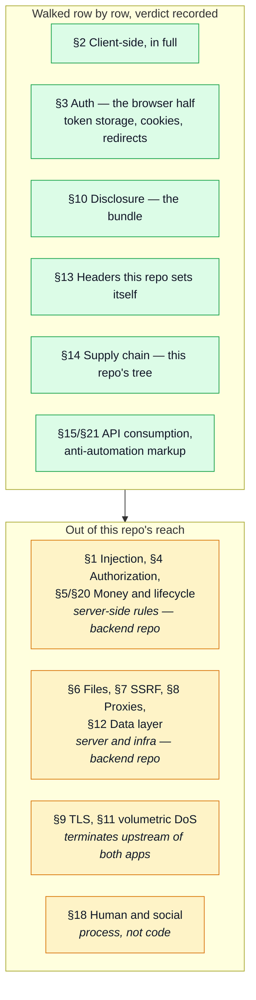

# Web Attack Defences

The [Web Attack Catalog](./web-attack-catalog.md) is deliberately theory-only — every flaw a
website can have, with no word about this codebase. This page is the other half, scoped to
**this frontend**: which catalog row each control stops, and where that control lives.

This is one of two defences pages for one pair of repos. The split follows where a defence
actually runs, not which repo "owns" the feature it protects:

- **This page** answers the rows only a browser can decide — what the DOM renders, what a script
  can read, what a cross-site page can trick a visitor's browser into sending, and what ships in
  this bundle's own dependency tree.
- **[The backend's Web Attack Defences](https://github.com/Guebbit/boilerplate-node-backend/blob/main/docs/theory/web-attack-defences.md)**
  answers the rows a server decides — the ones needing a database, a signing key, or a header the
  browser cannot be trusted to set honestly.

A handful of rows need both halves to close: the browser enforces what the server declares (CORS,
clickjacking, cookie flags), or the frontend's architecture is what makes a backend control
sufficient (Bearer-token transport is what makes the backend's CSRF surface small in the first
place). Those rows are marked **shared** below and appear, with their own half of the story, on
both pages — see [Shared with the backend](#shared-with-the-backend) for the full cross-reference.

## How far this page goes

"Walked" means every row in the section was read against the code and given a verdict — a
control with a location, an explicit "not mitigated, and why", or "this app has no such surface".
Silence is not one of the three.

## The trust boundary this app is built around

The full login → refresh flow is diagrammed in [Security](../tools/security.md). The one fact
worth repeating here, because most of §2's rows below trace back to it: the access token lives in
a Pinia ref, in memory only, and is attached explicitly per request; it is never in a cookie, never
in `localStorage`. The only thing the browser sends automatically is the refresh cookie, and that
one is `HttpOnly` — set by the backend, unreadable from here by construction.

| Catalog row (§3)                                     | Control                                                                                                                                                                                  | Where                                                                                            |
| ---------------------------------------------------- | ---------------------------------------------------------------------------------------------------------------------------------------------------------------------------------------- | ------------------------------------------------------------------------------------------------ |
| Sensitive data in client storage                     | the access token is a Pinia `ref`, never written to `localStorage`/`sessionStorage`/a JS-readable cookie — a stolen bundle or a `localStorage`-reading extension gets nothing live       | `infrastructure/session.ts#accessToken`                                                          |
| Session hijacking / sidejacking (partial)            | the one long-lived credential (`HttpOnly` refresh cookie) never reaches JS at all, on this side or an attacker's                                                                         | `infrastructure/session.ts`, backend's `account/session/jwt.ts`                                  |
| Insecure "keep me logged in"                         | `isAuth`/`rememberMe` are hints, not credentials — a forged `isAuth=true` cookie makes `tryRestoreAuth` attempt a refresh that the real `HttpOnly` cookie (or its absence) still decides | `infrastructure/session.ts#setAccessToken`, `app/guards/authentications.ts#restoreTokenIfNeeded` |
| Predictable session tokens / remember-me token flaws | this app mints nothing — both tokens are the backend's; the frontend's own `rememberMe` marker only changes a cookie's `max-age`, never a token's shape                                  | `infrastructure/session.ts`                                                                      |

## XSS and script execution — §2

No occurrence of `v-html`, `innerHTML`/`outerHTML`, `eval`, `new Function`, or `document.write`
anywhere in `src/` — checked by grep, not by reading every file, so this is a repo-wide fact
rather than a sample. Vue's `{{ }}` interpolation HTML-escapes by default, which is the only way
user or API text ever reaches the DOM in this codebase.

| Catalog row (§2)                   | Control                                                                                                                                                                           | Where                                                             |
| ---------------------------------- | --------------------------------------------------------------------------------------------------------------------------------------------------------------------------------- | ----------------------------------------------------------------- |
| XSS — reflected, stored, DOM-based | no template renders raw HTML; every dynamic string goes through `{{ }}` or a bound attribute, both escaped by Vue's compiler                                                      | — (repo-wide; no `v-html` in `src/`)                              |
| XSS — via a malformed API response | every response is `safeParse`d against the OpenAPI-generated Zod schema before a store reads it — a field of the wrong shape throws rather than being trusted into the DOM        | `infrastructure/http/validate.ts#validateResponseAgainstContract` |
| DOM clobbering                     | no code reads a global (`window.<name>`) that an HTML element with a matching `id`/`name` could shadow                                                                            | — (no surface found)                                              |
| `postMessage` abuse                | nothing registers a `message` listener and nothing calls `postMessage`; this app has no cross-window messaging surface                                                            | —                                                                 |
| Tabnabbing (reverse)               | no `target="_blank"` anchor anywhere in `src/`, so there is no opened tab to hold `window.opener`                                                                                 | —                                                                 |
| Client-side prototype pollution    | no recursive merge / deep-assign utility reads a client-supplied key into an object; `lodash-es` is used for read-only helpers (`mapValues`, etc.), not merges of untrusted input | `infrastructure/observability/store.ts`                           |
| Client-side template injection     | no client-side template evaluator (`v-html` + expressions, legacy Angular-style binding) exists to reach                                                                          | —                                                                 |
| Client-side path traversal         | every fetch URL is either a fixed API route (`@api`'s generated functions) or built by `toPathname`, which parses rather than concatenates                                        | `infrastructure/http/url.ts`                                      |
| Subresource without integrity      | **open — see [What is still open](#found-by-this-walk-not-yet-answered)**: the Umami tracker is injected with a plain `<script src>`, no `integrity` attribute                    | `infrastructure/observability/store.ts#initUmami`                 |

## CSRF, clickjacking and cross-origin trust — §2 / §13 (shared)

| Catalog row                                                       | Control                                                                                                                                                                                                                                                                                                                                                                     | Where                                                                               |
| ----------------------------------------------------------------- | --------------------------------------------------------------------------------------------------------------------------------------------------------------------------------------------------------------------------------------------------------------------------------------------------------------------------------------------------------------------------- | ----------------------------------------------------------------------------------- |
| Cross-site request forgery (§2) — **shared**                      | every state-changing call carries its credential as an explicit `Authorization: Bearer` header this app attaches in code — never a cookie the browser would attach on its own to a forged cross-site request. The one cookie the browser DOES send automatically (the refresh token) only answers `GET /account/refresh`, which mints a token rather than mutating anything | `infrastructure/http/interceptors.ts#onRequest`, backend's `account/session/jwt.ts` |
| Login CSRF on the OAuth callback (§3) — **shared**                | this app's only role is a top-level navigation to a URL this app hard-codes (`${apiBaseURL}/account/oauth/:provider}`); the `state` cookie that defeats login CSRF is minted and checked entirely server-side                                                                                                                                                               | `modules/account/stores/oauth.ts#oauthStartUrl`, backend's `account/oauth/state.ts` |
| Clickjacking / UI redress (§2) — **shared**                       | `X-Frame-Options: SAMEORIGIN` on every response this app's own web server sends, `always` so it survives error pages too — the enforcement is the browser's, but the header comes from THIS repo's server, not the API's                                                                                                                                                    | `.docker/nginx.conf`                                                                |
| Content-Security-Policy (§2) — **shared, and open on both sides** | no CSP is set, here or at the API. Documented as deliberate rather than missed: a correct policy needs to know whether Faro/Umami are enabled and which origins they need, which this static file cannot see — see the comment at the point it would go                                                                                                                     | `.docker/nginx.conf`                                                                |
| Permissive CORS (§13/§2) — **shared**                             | this app has no CORS configuration of its own (a browser loading `index.html` needs none) but sets `withCredentials: true` on every API call — which is what makes the backend's explicit origin allowlist load-bearing rather than a nicety: a credentialed request from an unlisted origin is refused by the BROWSER, reading the backend's own CORS response             | `infrastructure/http/client.ts`, backend's `app/security.ts`                        |
| Missing security headers (§13) — **shared**                       | `X-Content-Type-Options: nosniff`, `Referrer-Policy: strict-origin-when-cross-origin`, `Permissions-Policy` denying camera/microphone/geolocation/payment — repeated in every `location` block because nginx does not merge `add_header` across levels (see the comment at the top of the file)                                                                             | `.docker/nginx.conf`                                                                |
| Mixed content                                                     | no surface: every asset is same-origin (`/assets/…`) or a `VITE_*`-configured HTTPS-or-local origin; nothing hard-codes `http://` in a production build                                                                                                                                                                                                                     | —                                                                                   |
| Cross-site script inclusion (XSSI)                                | no surface: no JSON or JS response is loaded via `<script src>`, and the API answers only to callers this app's own axios instance calls                                                                                                                                                                                                                                    | —                                                                                   |
| Web cache deception / poisoning                                   | no surface here: this app sets no cache-relevant response of its own besides the static-file rules below; the API's caching is the backend's row                                                                                                                                                                                                                            | —                                                                                   |

## Session, cookies and the redirect targets this app trusts — §3

Beyond the token model above, two more rows follow from how login and OAuth hand control back to
this app.

| Catalog row (§3 unless noted)                 | Control                                                                                                                                                                                                                                                                                                         | Where                                                                                                                                                                     |
| --------------------------------------------- | --------------------------------------------------------------------------------------------------------------------------------------------------------------------------------------------------------------------------------------------------------------------------------------------------------------- | ------------------------------------------------------------------------------------------------------------------------------------------------------------------------- |
| Cookie flag omissions — **shared**            | the two cookies this app writes itself (`isAuth`, `rememberMe`) carry `SameSite=Lax`, plus `Secure` whenever `location.protocol` is `https:` — checked at write time rather than hard-coded, since a `Secure` cookie is silently dropped by the browser on plain HTTP and that would break the local dev server | `infrastructure/session.ts#secureAttribute`                                                                                                                               |
| Open redirect (§2)                            | the login/OAuth `?continue=` target is handed to `router.push({ path })`, never `location.href` — vue-router resolves it against ITS OWN route table, so a value like `https://evil.example` cannot become a cross-origin navigation, only a route miss                                                         | `app/router/navigation.ts#loginContinueTo`, `modules/account/composables/use-post-login-redirect.ts`, `modules/account/views/OAuthCallback.vue`                           |
| OAuth — `redirect_uri` manipulation (partial) | the button never accepts or forwards a redirect target — it always points at this app's own hard-coded `${apiBaseURL}/account/oauth/:provider`, so there is no client-supplied URL for a callback to honour in the first place                                                                                  | `modules/account/stores/oauth.ts#oauthStartUrl`                                                                                                                           |
| HTML injection via an error/status parameter  | the OAuth callback's `?error=` is matched against a closed set of known codes before it is used to look up a translation key; an unrecognised value falls back to a generic message rather than being rendered                                                                                                  | `modules/account/views/OAuthCallback.vue#KNOWN_ERROR_CODES`                                                                                                               |
| Autocomplete on sensitive fields (§10)        | password fields use `autocomplete="new-password"`/`"current-password"` (never left unset, never `off`) and every OTP input uses `autocomplete="one-time-code"`, so a browser or password manager fills the right box instead of guessing                                                                        | `modules/account/components/ProfilePasswordChange.vue`, `Signup.vue`, `PasswordResetConfirm.vue`, `TwoFactorChallenge.vue`, `TwoFactorEnroll.vue`, `ProfileTwoFactor.vue` |

## Information disclosure — what ships in the bundle — §10

| Catalog row (§10)                        | Control                                                                                                                                                                                                                                                                                                           | Where                                                                                                        |
| ---------------------------------------- | ----------------------------------------------------------------------------------------------------------------------------------------------------------------------------------------------------------------------------------------------------------------------------------------------------------------- | ------------------------------------------------------------------------------------------------------------ |
| Source maps in production                | Vite's `build.sourcemap` is left at its default (`false`) — no override anywhere in `vite.config.ts` — so a production build ships no `.map`, and the original source is not reconstructable from it                                                                                                              | `vite.config.ts`                                                                                             |
| Sensitive data in logs / error reporting | the rejection envelope every `catch` receives (`onResponseReject`) carries `status`/`message`/`errors`/`requestId`/`traceId` only — never a request body — so `captureException` forwarding it to Faro cannot leak a password or token typed into a form                                                          | `infrastructure/http/interceptors.ts#onResponseReject`, `infrastructure/utils/errors.ts#notifyErrorMessages` |
| Third-party analytics leakage            | `identifyUser` sends the visitor's id AND email to Faro — this deployment's own error/session tool, so a reasonable trade for triage — but the email is stripped before the best-effort call to Umami's `identify()`; Umami gets the id only, since it markets itself as privacy-respecting, cookieless analytics | `infrastructure/observability/store.ts#identifyUser`                                                         |
| Version banners                          | `server_tokens off` — nginx does not advertise its version in the `Server` header or its default error pages                                                                                                                                                                                                      | `.docker/nginx.conf`                                                                                         |
| Referrer leakage                         | `Referrer-Policy: strict-origin-when-cross-origin` on every response                                                                                                                                                                                                                                              | `.docker/nginx.conf`                                                                                         |
| Directory listing                        | nginx serves the SPA via `try_files`; no `autoindex` directive is set anywhere, so it defaults off                                                                                                                                                                                                                | `.docker/nginx.conf`                                                                                         |

## Security headers this repo sets itself — §13 (shared)

The API sets its own headers via `helmet()`; this repo answers for a different set of responses
(the HTML shell and static assets) and cannot rely on the API's `helmet()` call reaching them —
they are served by an entirely separate process. See the CSRF/clickjacking table above for the
individual rows; this is the artifact they all point at.

| Catalog row (§13)                   | Control                                                                                                                                                                                                                                                                                                               | Where                |
| ----------------------------------- | --------------------------------------------------------------------------------------------------------------------------------------------------------------------------------------------------------------------------------------------------------------------------------------------------------------------- | -------------------- |
| Security misconfiguration           | every `location` block repeats its four security headers rather than relying on `add_header` inheriting from `server` — `nginx` silently drops the parent's headers the moment a location sets even one of its own, which is exactly the bug the file's own comment says was caught by curl-ing the running container | `.docker/nginx.conf` |
| Missing `Strict-Transport-Security` | not set here, deliberately — this container speaks plain HTTP on a private network and cannot know the public scheme; HSTS belongs at the TLS-terminating proxy, same reasoning as the backend's                                                                                                                      | `.docker/nginx.conf` |
| Insecure defaults of frameworks     | `strictPort: true` in dev — a port collision fails loudly rather than silently serving from a port nothing else expects                                                                                                                                                                                               | `vite.config.ts`     |

## Supply chain — this repo's own tree — §14

A separate dependency tree from the backend's, audited on its own: sharing a contract does not
mean sharing a `node_modules`.

| Advisory                                                         | Reachable?                                                                                                     | Status                                         |
| ---------------------------------------------------------------- | -------------------------------------------------------------------------------------------------------------- | ---------------------------------------------- |
| `nanoid` — non-secure/zero-size generators can loop indefinitely | **No** — a build-time dependency of the CSS toolchain; nothing in the shipped bundle calls `nanoid` at runtime | fix available (`npm audit fix`), not yet taken |
| `postcss` — source-map path traversal when `from` is unset       | **No** — same tier: PostCSS runs during `vite build`, never in the browser                                     | fix available, not yet taken                   |

Both are `high` in `npm audit --omit=dev`'s severity scoring but neither ships to a browser — the
same shape of finding as the backend's own supply-chain table, and the same caveat applies:
"unreachable" is a claim about today's build graph, re-provable rather than permanent.

| Catalog row (§14)                         | Control                                                                                                                                                                                                                                                                   | Where                                             |
| ----------------------------------------- | ------------------------------------------------------------------------------------------------------------------------------------------------------------------------------------------------------------------------------------------------------------------------- | ------------------------------------------------- |
| Third-party scripts — **open, see above** | the Umami tracker is a `<script src>` injected at runtime; it points at a self-hosted instance this deployment's own `docker-compose` provisions (never a third-party SaaS domain), which lowers the blast radius of a compromise but does not remove the missing-SRI gap | `infrastructure/observability/store.ts#initUmami` |
| CDN compromise                            | no surface: fonts (`@fontsource/roboto`) are npm-installed and bundled, not loaded from a font CDN; there is no other remote `<script>`/`<link>` in `index.html`                                                                                                          | `index.html`, `package.json`                      |
| Vulnerable dependencies                   | `npm audit --omit=dev` — see the table above; nothing wired into CI to gate on it yet (open, tracked with the rest of this section)                                                                                                                                       | `package.json`                                    |
| Install scripts / lockfile tampering      | `.docker/Dockerfile` and `.docker/Dockerfile.production` both run `npm ci`, never `npm install`                                                                                                                                                                           | `.docker/Dockerfile.production`                   |

## API consumption and anti-automation — §15 / §21 (shared)

| Catalog row                                            | Control                                                                                                                                                                                                                                                                                                          | Where                                                                        |
| ------------------------------------------------------ | ---------------------------------------------------------------------------------------------------------------------------------------------------------------------------------------------------------------------------------------------------------------------------------------------------------------- | ---------------------------------------------------------------------------- |
| Unsafe consumption of upstream APIs (§15) — **shared** | every 2xx response is `safeParse`d against the same Zod schema the backend's own OpenAPI contract generates, before a store trusts any field of it — production included, not just dev                                                                                                                           | `infrastructure/http/validate.ts#shouldValidateResponses`                    |
| Spam via forms (§21) — **shared**                      | the contact form's honeypot FIELD — `aria-hidden`, `tabindex="-1"`, invisible to a sighted human and to a screen reader, but present in the DOM for a bot that fills every field — is built here; deciding what a non-empty value MEANS (mark as spam, skip the notification, still answer 201) is the backend's | `modules/feedback/views/Contact.vue`, backend's `feedback/service.ts#create` |
| Missing rate limits per key/user (§21)                 | no surface here — a rate limit is a server-side budget by construction; this app cannot enforce one against itself                                                                                                                                                                                               | — (backend's row)                                                            |
| CAPTCHA bypass (§21)                                   | no surface: this deployment ships no CAPTCHA to bypass, on either side — see the backend's anti-automation plan                                                                                                                                                                                                  | —                                                                            |

## Business logic — this app computes no money — §5

| Catalog row (§5)                          | Control                                                                                                                                                                                                            | Where                                |
| ----------------------------------------- | ------------------------------------------------------------------------------------------------------------------------------------------------------------------------------------------------------------------ | ------------------------------------ |
| Trusting client-side validation (partial) | the cart badge and summary render `liveSummary.value.total` — a server-computed field from `GET /cart/summary` — never a client-side sum of line items; there is no arithmetic here to disagree with the backend's | `modules/cart/store.ts#badgeTotal`   |
| Price manipulation                        | no surface: no request built by this app ever carries a price, a total, or a currency — every checkout/payment call takes only ids the backend resolves itself                                                     | `modules/cart/`, `modules/payments/` |

## What is still open

### Deliberate, and why

- **§2 Content-Security-Policy** — not set. A correct policy has to know whether Faro/Umami are
  enabled and which origins they need, which the static nginx config cannot see at build time.
  `.docker/nginx.conf` documents the exact `Content-Security-Policy-Report-Only` line to start
  from once those choices are made at the reverse proxy. Same reasoning, same file, as the
  backend's own "no CSP guessed here" stance.
- **§9 TLS, `Strict-Transport-Security`** — this container speaks plain HTTP on a private network;
  both belong at the TLS-terminating proxy in front of it, exactly as on the backend.
- **§21 Anti-automation beyond the honeypot** — the contact form's honeypot is the only
  human-detection this app ships. No CAPTCHA, no proof-of-work, deliberately — see the backend's
  `ANTI_AUTOMATION_PLAN.md` for why a boilerplate should not pick a vendor on a project's behalf.

### Found by this walk, not yet answered

- **§2 Subresource without integrity.** The Umami tracker script is injected with a plain
  `<script src>` and no `integrity` attribute (`infrastructure/observability/store.ts#initUmami`).
  The instance is self-hosted by this deployment's own compose stack rather than a third-party
  CDN, which limits who could tamper with it, but the same reasoning that added `server_tokens
off` and the Permissions-Policy line argues for closing this too once the script's build hash is
  stable enough to pin.
- **§14 Two `high` advisories in the production tree** (`nanoid`, `postcss`) — see
  [Supply chain](#supply-chain--this-repos-own-tree--14). Both are build-time-only and a fix is
  available; neither has been taken yet, and nothing in CI currently gates a merge on
  `npm audit` the way the backend's `audit` job does.

## Shared with the backend

Every row above marked **shared** has its other half on the backend's page. This table is the
cross-reference, so a reader following one thread does not have to guess where the rest of it
lives.

| Row                                 | This repo's half                                                                     | Backend's half                                                                    |
| ----------------------------------- | ------------------------------------------------------------------------------------ | --------------------------------------------------------------------------------- |
| CSRF                                | Bearer-token transport, attached explicitly per request                              | no ambient cookie authenticates a mutation; the refresh cookie only mints a token |
| Login CSRF on the OAuth callback    | fixed, hard-coded start URL; no client-controlled redirect target                    | the double-submit `state` cookie, minted and checked server-side                  |
| Clickjacking                        | `X-Frame-Options` on this app's own nginx responses                                  | `helmet()` on the API's JSON responses                                            |
| Content-Security-Policy             | not set — depends on choices only the reverse proxy can make                         | not set — same reasoning                                                          |
| Permissive CORS                     | `withCredentials: true` on every call, which is what makes an allowlist load-bearing | the explicit origin allowlist itself                                              |
| Missing security headers            | `X-Content-Type-Options`, `Referrer-Policy`, `Permissions-Policy` on the static site | the same three (plus more `helmet()` defaults) on the API                         |
| Cookie flag omissions               | `isAuth`/`rememberMe` — non-credential hints, `SameSite=Lax` and `Secure` over https | the refresh token cookie — `HttpOnly`, `SameSite=Lax`, `Secure` in production     |
| Spam via forms                      | the honeypot field's markup                                                          | deciding what a filled honeypot means, and answering 201 either way               |
| Unsafe consumption of upstream APIs | validates every inbound response against the shared OpenAPI contract                 | validates every inbound request body against the same contract                    |

## Keeping this page true

Same caveat as the catalog and the backend's page: nothing enforces this structurally. A file
named in a row above that moves or is renamed should update that row in the same commit. The
supply-chain table has the shortest shelf life here too — it records what `npm audit --omit=dev`
said on the day it was walked, not a durable fact.
