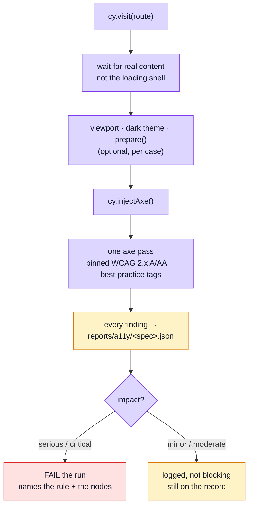

# Accessibility Testing

Automated accessibility checks over the routes a user actually reaches. `axe` is injected into the running page and run against the DOM as it currently stands — and, for the states a visitor has to act to reach, against the page after that action. A second, smaller suite presses real keys, and a lint plugin reads every template before any of it runs.

## What this can and cannot tell you

Worth stating plainly, because automated a11y testing is easy to over-trust.

Automated rules catch perhaps **30–40%** of real accessibility problems. They are very good at the mechanical, checkable ones — a control with no accessible name, an image with no alternative text, a form field with no label, an ARIA attribute on an element that may not carry it. They are blind to everything that needs judgement: whether the focus order makes sense, whether an error message explains what to do, whether a custom widget is actually operable by keyboard.

So this suite is a **floor, not a ceiling**. Passing means the obvious mechanical failures are absent. It does not mean the app is accessible, and it is not a substitute for keyboard-navigating the thing or hearing it read aloud.



## Where the line is drawn, and why

The run fails on **`serious` and `critical` only**. Everything lighter is still run and still logged.

That is a deliberate trade. `minor` and `moderate` findings are largely advisory — a contrast ratio a designer chose on purpose, a landmark preference, a heading-order nicety. Gating merges on those produces failures nobody agrees with, and **a gate nobody agrees with is a gate that gets disabled**. Once disabled, the serious findings stop being caught either.

`serious`/`critical` are the ones that mean _unusable_: no accessible name on a control, no alt text, no label. Those are not matters of taste.

The lighter findings are logged rather than dropped so the information exists on the record. Tightening the threshold later is then a decision made from data, not a rediscovery.

### The record is a file, not a log line

"Logged" used to mean a line in the Cypress command log — which is read in `cypress open` and by nobody in `cypress run`. Every finding now also goes through a `cy.task` to **`reports/a11y/<spec-safe-name>.json`**: one file per spec, one entry per audited state, each with the rule id, impact, help URL, tags and the selectors of the nodes. Gitignored under `reports/`, and uploaded by CI as the `a11y-reports` artifact on every run, green included — the point is the data a passing run still produced.

A retried test overwrites its own entry rather than appending; the four CI shards each run different specs, so no two processes write the same file.

### The rule set is pinned

axe's default is "everything except experimental", and what "everything" means moves with every axe-core release: an `npm update` could add a rule and fail a page that had not changed. `cy.checkPageA11y()` therefore passes `runOnly` by tag — `wcag2a`, `wcag2aa`, `wcag21a`, `wcag21aa`, `wcag22aa`, `best-practice`. The contract is written down; widening it is an edit to one list.

## Waiting for content, not the shell

Every case waits for real content (`cy.get('h1')`) before running axe. Auditing a loading skeleton reports a nearly-empty page as nearly perfect — a green result that means nothing, which is worse than a red one.

## A page is more than its first paint

A route audited once, as it loads, misses everything that only exists after the visitor acts — and those states are where hand-written ARIA lives, so they are where the defects are. A sweep entry can therefore be an object rather than a `[name, path]` pair:

```ts
sweepA11y('the shell', [
    ['home', '/en'],
    { name: 'home, dark theme', route: '/en', theme: 'dark' },
    {
        name: 'home, navigation drawer open on a phone',
        route: '/en',
        viewport: [390, 844],
        prepare: () => {
            cy.get('[aria-controls=app-drawer]').click();
            cy.get('#app-drawer').should('be.visible');
        }
    }
]);
```

- **`viewport`** is applied before the visit, so the page lays itself out for a phone from the start.
- **`theme: 'dark'`** clicks the app bar's toggle (`data-test="theme-toggle"`) and waits for `.v-theme--dark` — the way the visitor switches, not a direct write to Vuetify, so the audited state is one a click can reach.
- **`prepare`** runs after the content wait and before axe: plain Cypress commands, enqueued in order.

The states audited this way, and why each one:

| State                                   | Where                      | What it guards                                                                        |
| --------------------------------------- | -------------------------- | ------------------------------------------------------------------------------------- |
| Navigation drawer open, 390×844         | shell, home                | The drawer's landmark label, its list, focus inside it                                |
| Language menu open                      | shell, home                | `role="menu"` / `menuitem` and the activator's name                                   |
| Navigation tooltip shown                | shell, home                | An icon-only entry's name, its tooltip, and the `aria-describedby` between them       |
| Account menu open                       | shell, home, as `user`     | The account menu's `menu` / `menuitem` roles and its activator's name, email included |
| Administration menu open                | shell, home, as `admin`    | Same, for the administration menu                                                     |
| Drawer open with every section, 390×844 | shell, home, as `admin`    | The three section headings and their entries                                          |
| Dark theme                              | home, products list, login | Every colour pair, measured on the other surface                                      |
| Italian                                 | shell, `/it`               | A translated label that lost its `aria-` counterpart                                  |
| Entry form dialog open                  | locales, `/en/locales/it`  | A modal named by its title, the page behind it hidden                                 |
| Address dialog open                     | account, profile           | Same, for the other hand-written dialog                                               |
| Form submitted empty                    | login, product create      | Each error tied to its field and announced, not only coloured                         |

## What it actually found

Worth recording, because all five are **boilerplate** defects rather than demo-app ones — every project copied from this repository would have inherited them, and none is visible in any other test layer.

| Violation               | Where it lived                                         | Fix                                                                                                                                                                                                            |
| ----------------------- | ------------------------------------------------------ | -------------------------------------------------------------------------------------------------------------------------------------------------------------------------------------------------------------- |
| `aria-progressbar-name` | `LayoutDefault.vue` — the full-page and corner loaders | An `aria-label` on each. `role="progressbar"` with no name is announced as an unlabelled control, and the full-page one is the _only_ thing on screen while the app boots                                      |
| `aria-progressbar-name` | `v-data-table`'s internal loading bar                  | The `#loader` slot, replacing Vuetify's unnamed bar with a named one. Component `defaults` cannot fix this: `aria-label` is not a declared prop of `v-progress-linear`, so the value never reaches the element |
| `color-contrast` 3.32:1 | every input label in the app                           | Vuetify's "medium emphasis" resolves to `#898d95` on white. Raised via a rule on `.v-label`/`.v-field-label` in `main.css`                                                                                     |
| `color-contrast` ~2:1   | the "Forgot password?" link                            | It used `text-primary`. Brand `primary` is designed as a _background_ with `on-primary` text over it; used as text on white it fails badly. A dedicated `link` colour now exists in both themes                |
| `color-contrast` 1.74:1 | table column headers, while loading                    | Vuetify dims the header row to `opacity: 0.38` for as long as `loading` is set. Undimmed — the loading bar is already the cue, and it is announced as well as drawn                                            |

The last one also made the suite **timing-dependent**: audit before the rows arrived and it failed, audit after and it passed, with nothing about the code having changed. A gate whose result depends on how fast the API replied is not a gate, so this was a correctness fix as much as an accessibility one.

Two of these were only reachable at all after a bug in the shared `cy.visit()` override was fixed — until then most cases were quietly auditing the _previous_ route. That story is in [Visual Regression](./visual-regression.md#the-bug-this-suite-found-in-the-test-harness), which is where it surfaced.

## Everything on the page is ours

The sweep audits the whole document, with no exclusions and no suppressed rules.

That is a property of the server, not of the audit. Every headless e2e script serves a BUILT bundle through `vite preview`, and `vite-plugin-vue-devtools` is `apply: 'serve'` — so its floating anchor, which axe used to report `aria-prohibited-attr` on across all 13 routes, is not in the page at all. Auditing a dev server meant carrying a selector exclusion for markup the visitor never receives, and an exclusion list is a place for real findings to hide.

If an exclusion ever becomes necessary again, exclude the ELEMENT and never the rule: suppressing a rule globally suppresses it on our own markup too.

## Why a sweep per module, and not one central list

This was one central spec listing every route in the app, and that shape had real arguments behind it: the coverage was a list you could read, a failure named the route rather than the domain spec it was hiding inside, and adding a route was adding a line.

What it could not survive is a **deleted module**. `rm -rf src/modules/users` left the central list still naming `/en/users` and `/en/users/create`, so the a11y suite failed on routes the app no longer served — an orphan, and precisely the failure that moved the other e2e specs into their modules. Routes belong to modules; their accessibility coverage does too.

The readable list was not discarded, it was **upgraded into an assertion**. `tests/cross-cutting/a11y-coverage.spec.ts` fails when a module declaring routes has no sweep, and fails the other way too when a sweep outlives the routes it audited. A list that is checked beats a list that is merely readable, because nothing obliges a reader to read it.

Modules serving no page — `delivery`, `payments`, reached through the cart and the order flow — are exempt, and that exemption is the rule rather than a hole in it: there is nothing for axe to visit.

### The guard is route-aware

The first version of that guard asked only whether a routed module **had** an `a11y.cy.ts`. That let `products/:id` and `products/:id/edit` go unaudited behind a sweep that visited the list and the create form: a file existed, so the guard was satisfied.

It now parses every `path:` in each module's `routes.ts` and every `/en/...` or `/it/...` literal in the module's sweep, matches route params (`:id`, `:tag`, an optional `:message?`) against whatever the sweep put there, and **fails on any route no swept path reaches** — naming the module and the path. The shell's own routes in `src/app/router/index.ts` (home, the four prose pages, the error page) get the same treatment against `tests/e2e/specs/a11y.cy.ts`, including the prose pages that are declared by mapping over a list rather than as four literals. It also fails the other way: a swept path that matches no route is a sweep auditing a 404 under an old name.

A commented **`EXEMPT`** list names the routes no sweep can or should visit — `logout` (a `beforeRouteEnter` that returns Home), the bare `/` and `/:locale` containers, the two catch-all redirects. Each entry carries its reason, because adding to that list is a decision to leave a route unaudited.

Detail and edit pages are addressed by **seeded ids** from the backend's `db/demo/demo-data.json`, the rows every other e2e spec already relies on. The three account confirm pages (`password-reset/confirm`, `account-delete/confirm`, `verify-email/confirm`) take a one-time token the demo outbox issues and the flow specs spend, so they are audited with `?token=a-token-nobody-issued`: the form renders exactly as it does for a real link, and that is also the state an expired link lands a visitor in.

**The cost is real**: ten extra Cypress spec startups, about +50s on the e2e gate. That is what co-location costs here, and it buys coverage that cannot rot into an orphan.

### It found a bug immediately

Splitting per module meant auditing routes the central list had never contained. `/en/playground/realtime` turned out to have a serious colour-contrast violation on its empty-state paragraph — `opacity-60` on a card background. Raised to `opacity-75`, the codebase's dominant muted level. A route nobody had listed was a route nobody had checked.

## What axe cannot see: the keyboard

An axe sweep reads the DOM and asks whether the markup is well-formed. It cannot press a key, and the shell's accessibility is mostly **behaviour**: the skip link being the first Tab stop, focus following a page change, a drawer returning focus to the control that opened it, a dialog keeping focus inside it. `tests/e2e/specs/keyboard.cy.ts` performs those, with real keystrokes:

| Case                                                                                       | What it protects, and where it lives         |
| ------------------------------------------------------------------------------------------ | -------------------------------------------- |
| First Tab reaches the skip link; Enter lands on `#main-content`                            | `LayoutDefault.vue` — WCAG 2.4.1             |
| A page change moves focus to the main region and retitles the tab                          | the router's `afterEach` — WCAG 2.4.2, 2.4.3 |
| The drawer opens onto its first entry; Escape closes it and returns focus to the hamburger | `AppNavigation.vue`'s focus watch            |
| An icon-only entry shows its label as a tooltip on focus                                   | `AppNavIconButton.vue` — WCAG 1.4.13, 2.5.3  |
| ArrowDown opens the administration menu; Escape closes it and leaves focus on the button   | `AppNavMenu.vue` over Vuetify's `v-menu`     |
| The confirmation dialog keeps focus inside; Escape declines                                | `DialogHost.vue`                             |
| A facet chip toggles `aria-pressed` with Enter and with Space                              | `ProductsList.vue`                           |

`cypress-real-events` is what makes this possible: Cypress' own `.type('{tab}')` dispatches an event and moves nothing, because focus traversal is the browser's behaviour rather than a handler's. `cy.realPress()` sends the keystroke through the DevTools Protocol, so the browser performs it. The trade is Chromium only, which is every headless run here.

## Before any of it runs: the lint plugin

`eslint-plugin-vuejs-accessibility`'s `flat/recommended` set is enabled on `src/**/*.vue`. It is the static half of what the sweeps check at runtime — and it reads **every** template, rendered or not, failing the edit rather than the e2e run: a `<div @click>` with no key handler, an `` with no `alt`, an `aria-` attribute an element may not carry, a `tabindex` above zero.

The whole set, nothing switched off. The rules that look at native `<label>`/`<input>` pairs see nothing in a Vuetify component (`v-text-field` renders its own associated label) and stay silent rather than noisy; the runtime sweep covers that gap, since an unlabelled field is a `critical` axe finding. Enabling the plugin on this codebase reported zero violations — the sweeps had already found and fixed what it looks for — which is the right order to discover that in.

## File map

| Path                                        | Contents                                                                                                                                                                        |
| ------------------------------------------- | ------------------------------------------------------------------------------------------------------------------------------------------------------------------------------- |
| `src/modules/<name>/tests/e2e/a11y.cy.ts`   | One per routed module: the route list, and the auth level to read it at                                                                                                         |
| `tests/e2e/specs/a11y.cy.ts`                | The shell's own routes — home, the prose pages, the error page — and the chrome's states: drawer, language menu, tooltip, account and administration menus, dark theme, Italian |
| `tests/e2e/specs/keyboard.cy.ts`            | The keyboard contract: skip link, focus on navigation, tooltip, menus, drawer, dialog, chips                                                                                    |
| `tests/support/e2e/a11y-sweep.ts`           | `sweepA11y()`: the describe, the login, the wait-for-content, the optional viewport / theme / `prepare`, the axe call. Names no domain                                          |
| `tests/cross-cutting/a11y-coverage.spec.ts` | Parses every `routes.ts` against its sweep; fails on an unswept route, a swept path no route serves, or a sweep that outlives its module. Holds `EXEMPT`                        |
| `tests/support/e2e/commands.ts`             | `cy.checkPageA11y()`: the single axe pass with pinned tags, the impact threshold, the report task call                                                                          |
| `tests/support/e2e/a11y-task.ts`            | The Node side: writes every finding to `reports/a11y/<spec>.json`. Registered in `cypress.config.ts`                                                                            |
| `tests/support/e2e/e2e.ts`                  | Imports `cypress-axe` (`cy.injectAxe()` / `cy.checkA11y()`) and `cypress-real-events` (`cy.realPress()`)                                                                        |
| `eslint.config.ts`                          | `eslint-plugin-vuejs-accessibility`, `flat/recommended`, scoped to `src/**/*.vue`                                                                                               |

## Commands

| Command                                                                 | Effect                                               |
| ----------------------------------------------------------------------- | ---------------------------------------------------- |
| `npm run test:e2e`                                                      | Runs every module's sweep with the rest of the suite |
| `E2E_SPEC='src/modules/*/tests/e2e/a11y.cy.ts' npm run test:e2e:spec`   | Every sweep, and nothing else                        |
| `E2E_SPEC=src/modules/users/tests/e2e/a11y.cy.ts npm run test:e2e:spec` | One module's                                         |
| `E2E_SPEC=tests/e2e/specs/keyboard.cy.ts npm run test:e2e:spec`         | The keyboard suite alone                             |
| `npx vitest run tests/cross-cutting/a11y-coverage.spec.ts`              | Just the "is every route covered" check              |
| `npm run lint`                                                          | Includes the template a11y rules                     |

## Adding a route

Add a line to the owning module's sweep:

```ts
sweepA11y(
    'products — admin',
    [['product edit', '/en/products/65dc8a99604c307b702b5ccc/edit']],
    'admin'
);
```

A **new module** with pages needs its own `src/modules/<name>/tests/e2e/a11y.cy.ts`. You will not forget: the coverage guard fails until it exists, and names the module — and, once it exists, names every route in the module's `routes.ts` the sweep does not yet visit. A route that genuinely renders nothing (a redirect) goes in `EXEMPT`, with its reason.

A page with a state worth auditing separately — a dialog, a submitted form, a phone layout — gets an object entry with a `prepare` step; see above.

## Extending it

Add a route to the relevant list in the spec. If it needs a session, it goes in the user or admin list, which handle login.

If you want to tighten the threshold, change `BLOCKING_IMPACTS` in the command — and expect to fix things, because the lighter findings are already being logged and are therefore already known.

## Related pages

- [Visual Regression](./visual-regression.md) — the other layer that looks at the rendered page; it records appearance, this one judges it
- [The demo profile](./demo-profile.md) — the backend these run against
- [Component Testing](./component-testing.md) — the layer below, where markup is asserted directly
- [Testing & Docs](./testing-and-docs.md) — the map
