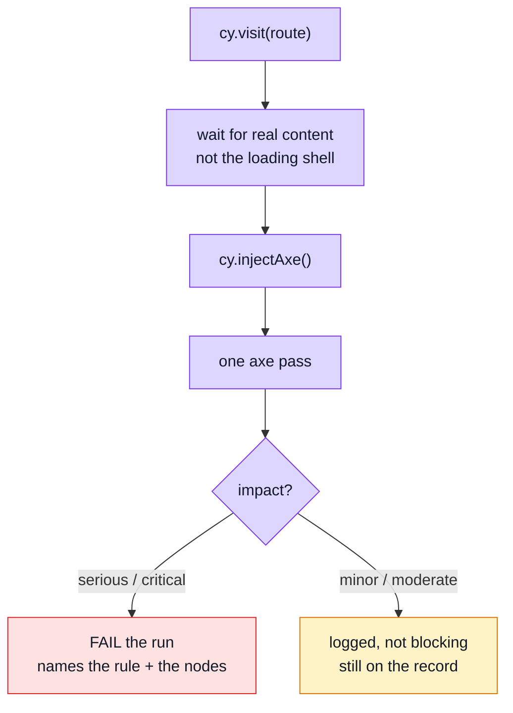

# Accessibility Testing

Automated accessibility checks over the routes a user actually reaches. `axe` is injected into the running page and run against the DOM as it currently stands.

## What this can and cannot tell you

Worth stating plainly, because automated a11y testing is easy to over-trust.

Automated rules catch perhaps **30–40%** of real accessibility problems. They are very good at the mechanical, checkable ones — a control with no accessible name, an image with no alternative text, a form field with no label, an ARIA attribute on an element that may not carry it. They are blind to everything that needs judgement: whether the focus order makes sense, whether an error message explains what to do, whether a custom widget is actually operable by keyboard.

So this suite is a **floor, not a ceiling**. Passing means the obvious mechanical failures are absent. It does not mean the app is accessible, and it is not a substitute for keyboard-navigating the thing or hearing it read aloud.

## Where the line is drawn, and why

The run fails on **`serious` and `critical` only**. Everything lighter is still run and still logged.

That is a deliberate trade. `minor` and `moderate` findings are largely advisory — a contrast ratio a designer chose on purpose, a landmark preference, a heading-order nicety. Gating merges on those produces failures nobody agrees with, and **a gate nobody agrees with is a gate that gets disabled**. Once disabled, the serious findings stop being caught either.

`serious`/`critical` are the ones that mean *unusable*: no accessible name on a control, no alt text, no label. Those are not matters of taste.

The lighter findings are logged rather than dropped so the information exists on the record. Tightening the threshold later is then a decision made from data, not a rediscovery.

## Waiting for content, not the shell

Every case waits for real content (`cy.get('h1')`) before running axe. Auditing a loading skeleton reports a nearly-empty page as nearly perfect — a green result that means nothing, which is worse than a red one.

## What it actually found

Worth recording, because all five are **boilerplate** defects rather than demo-app ones — every project copied from this repository would have inherited them, and none is visible in any other test layer.

| Violation | Where it lived | Fix |
| --------- | -------------- | --- |
| `aria-progressbar-name` | `LayoutDefault.vue` — the full-page and corner loaders | An `aria-label` on each. `role="progressbar"` with no name is announced as an unlabelled control, and the full-page one is the *only* thing on screen while the app boots |
| `aria-progressbar-name` | `v-data-table`'s internal loading bar | The `#loader` slot, replacing Vuetify's unnamed bar with a named one. Component `defaults` cannot fix this: `aria-label` is not a declared prop of `v-progress-linear`, so the value never reaches the element |
| `color-contrast` 3.32:1 | every input label in the app | Vuetify's "medium emphasis" resolves to `#898d95` on white. Raised via a rule on `.v-label`/`.v-field-label` in `main.css` |
| `color-contrast` ~2:1 | the "Forgot password?" link | It used `text-primary`. Brand `primary` is designed as a *background* with `on-primary` text over it; used as text on white it fails badly. A dedicated `link` colour now exists in both themes |
| `color-contrast` 1.74:1 | table column headers, while loading | Vuetify dims the header row to `opacity: 0.38` for as long as `loading` is set. Undimmed — the loading bar is already the cue, and it is announced as well as drawn |

The last one also made the suite **timing-dependent**: audit before the rows arrived and it failed, audit after and it passed, with nothing about the code having changed. A gate whose result depends on how fast a mock replied is not a gate, so this was a correctness fix as much as an accessibility one.

Two of these were only reachable at all after a bug in the shared `cy.visit()` override was fixed — until then most cases were quietly auditing the *previous* route. That story is in [Visual Regression](./visual-regression.md#the-bug-this-suite-found-in-the-test-harness), which is where it surfaced.

## Excluding what is not ours

These specs run against `vite dev`, and `vite-plugin-vue-devtools` injects its own floating anchor into every page. `axe` audits it like anything else and reports a violation on all routes — a real finding about the plugin, and nothing this codebase can fix.

It is excluded **by selector**, not by disabling the rule. Suppressing the rule globally would also suppress it on our own markup, which is exactly the kind of violation worth catching. The distinction matters: exclude the element, never the rule.

## Why a dedicated spec rather than a line in each existing one

Reusing the nine domain specs would be cheaper — they already navigate everywhere. A dedicated spec was chosen anyway:

- coverage is a **list you can read**, not something you discover by grepping
- a failure names the **route**, not the domain spec it was hiding inside
- adding a route means adding a line

The cost is one page load per route, which is the cheapest thing in this suite.

It runs under the mock profile like the rest of `ci.yml`, so it needs no backend.

## File map

| Path | Contents |
| ---- | -------- |
| `tests/e2e/specs/a11y.cy.ts` | The route lists — public, authenticated, admin — and one case per route |
| `tests/support/e2e/commands.ts` | `cy.checkPageA11y()`: the single axe pass, the impact threshold, the devtools exclusion |
| `tests/support/e2e/e2e.ts` | Imports `cypress-axe`, making `cy.injectAxe()` / `cy.checkA11y()` available |

## Commands

| Command | Effect |
| ------- | ------ |
| `npm run test:e2e` | Runs the a11y spec with the rest of the suite |
| `npx cypress run --e2e --spec 'tests/e2e/specs/a11y.cy.ts'` | Just the a11y pass |

## Extending it

Add a route to the relevant list in the spec. If it needs a session, it goes in the user or admin list, which handle login.

If you want to tighten the threshold, change `BLOCKING_IMPACTS` in the command — and expect to fix things, because the lighter findings are already being logged and are therefore already known.

## Related pages

- [Visual Regression](./visual-regression.md) — the other layer that looks at the rendered page; it records appearance, this one judges it
- [Mocking (MSW)](./mocking.md) — the profile these run against
- [Component Testing](./component-testing.md) — the layer below, where markup is asserted directly
- [Testing & Docs](./testing-and-docs.md) — the map
