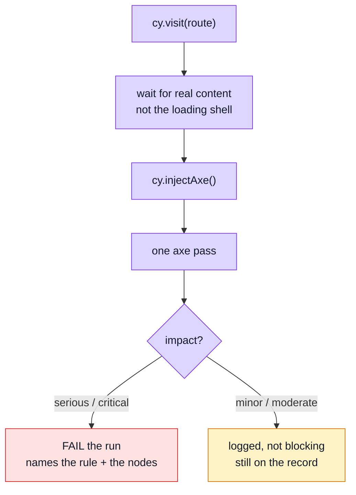

# Accessibility Testing

Automated accessibility checks over the routes a user actually reaches. `axe` is injected into the running page and run against the DOM as it currently stands.

## What this can and cannot tell you

Worth stating plainly, because automated a11y testing is easy to over-trust.

Automated rules catch perhaps **30–40%** of real accessibility problems. They are very good at the mechanical, checkable ones — a control with no accessible name, an image with no alternative text, a form field with no label, an ARIA attribute on an element that may not carry it. They are blind to everything that needs judgement: whether the focus order makes sense, whether an error message explains what to do, whether a custom widget is actually operable by keyboard.

So this suite is a **floor, not a ceiling**. Passing means the obvious mechanical failures are absent. It does not mean the app is accessible, and it is not a substitute for keyboard-navigating the thing or hearing it read aloud.



## Where the line is drawn, and why

The run fails on **`serious` and `critical` only**. Everything lighter is still run and still logged.

That is a deliberate trade. `minor` and `moderate` findings are largely advisory — a contrast ratio a designer chose on purpose, a landmark preference, a heading-order nicety. Gating merges on those produces failures nobody agrees with, and **a gate nobody agrees with is a gate that gets disabled**. Once disabled, the serious findings stop being caught either.

`serious`/`critical` are the ones that mean *unusable*: no accessible name on a control, no alt text, no label. Those are not matters of taste.

The lighter findings are logged rather than dropped so the information exists on the record. Tightening the threshold later is then a decision made from data, not a rediscovery.

## Waiting for content, not the shell

Every case waits for real content (`cy.get('h1')`) before running axe. Auditing a loading skeleton reports a nearly-empty page as nearly perfect — a green result that means nothing, which is worse than a red one.

## What it actually found

Worth recording, because all five are **boilerplate** defects rather than demo-app ones — every project copied from this repository would have inherited them, and none is visible in any other test layer.

| Violation | Where it lived | Fix |
| --------- | -------------- | --- |
| `aria-progressbar-name` | `LayoutDefault.vue` — the full-page and corner loaders | An `aria-label` on each. `role="progressbar"` with no name is announced as an unlabelled control, and the full-page one is the *only* thing on screen while the app boots |
| `aria-progressbar-name` | `v-data-table`'s internal loading bar | The `#loader` slot, replacing Vuetify's unnamed bar with a named one. Component `defaults` cannot fix this: `aria-label` is not a declared prop of `v-progress-linear`, so the value never reaches the element |
| `color-contrast` 3.32:1 | every input label in the app | Vuetify's "medium emphasis" resolves to `#898d95` on white. Raised via a rule on `.v-label`/`.v-field-label` in `main.css` |
| `color-contrast` ~2:1 | the "Forgot password?" link | It used `text-primary`. Brand `primary` is designed as a *background* with `on-primary` text over it; used as text on white it fails badly. A dedicated `link` colour now exists in both themes |
| `color-contrast` 1.74:1 | table column headers, while loading | Vuetify dims the header row to `opacity: 0.38` for as long as `loading` is set. Undimmed — the loading bar is already the cue, and it is announced as well as drawn |

The last one also made the suite **timing-dependent**: audit before the rows arrived and it failed, audit after and it passed, with nothing about the code having changed. A gate whose result depends on how fast the API replied is not a gate, so this was a correctness fix as much as an accessibility one.

Two of these were only reachable at all after a bug in the shared `cy.visit()` override was fixed — until then most cases were quietly auditing the *previous* route. That story is in [Visual Regression](./visual-regression.md#the-bug-this-suite-found-in-the-test-harness), which is where it surfaced.

## Everything on the page is ours

The sweep audits the whole document, with no exclusions and no suppressed rules.

That is a property of the server, not of the audit. Every headless e2e script serves a BUILT bundle through `vite preview`, and `vite-plugin-vue-devtools` is `apply: 'serve'` — so its floating anchor, which axe used to report `aria-prohibited-attr` on across all 13 routes, is not in the page at all. Auditing a dev server meant carrying a selector exclusion for markup the visitor never receives, and an exclusion list is a place for real findings to hide.

If an exclusion ever becomes necessary again, exclude the ELEMENT and never the rule: suppressing a rule globally suppresses it on our own markup too.

## Why a sweep per module, and not one central list

This was one central spec listing every route in the app, and that shape had real arguments behind it: the coverage was a list you could read, a failure named the route rather than the domain spec it was hiding inside, and adding a route was adding a line.

What it could not survive is a **deleted module**. `rm -rf src/modules/users` left the central list still naming `/en/users` and `/en/users/create`, so the a11y suite failed on routes the app no longer served — an orphan, and precisely the failure that moved the other e2e specs into their modules. Routes belong to modules; their accessibility coverage does too.

The readable list was not discarded, it was **upgraded into an assertion**. `tests/cross-cutting/a11yCoverage.spec.ts` fails when a module declaring routes has no sweep, and fails the other way too when a sweep outlives the routes it audited. A list that is checked beats a list that is merely readable, because nothing obliges a reader to read it.

Modules serving no page — `delivery`, `payments`, reached through the cart and the order flow — are exempt, and that exemption is the rule rather than a hole in it: there is nothing for axe to visit.

**The cost is real**: ten extra Cypress spec startups, about +50s on the e2e gate. That is what co-location costs here, and it buys coverage that cannot rot into an orphan.

### It found a bug immediately

Splitting per module meant auditing routes the central list had never contained. `/en/playground/realtime` turned out to have a serious colour-contrast violation on its empty-state paragraph — `opacity-60` on a card background. Raised to `opacity-75`, the codebase's dominant muted level. A route nobody had listed was a route nobody had checked.

## File map

| Path | Contents |
| ---- | -------- |
| `src/modules/<name>/tests/e2e/a11y.cy.ts` | One per routed module: the route list, and the auth level to read it at |
| `tests/e2e/specs/a11y.cy.ts` | The shell's own routes — home, and the 404 page |
| `tests/support/e2e/a11ySweep.ts` | `sweepA11y()`: the describe, the login, the wait-for-content, the axe call. Names no domain |
| `tests/cross-cutting/a11yCoverage.spec.ts` | Fails when a routed module has no sweep, or a sweep outlives its routes |
| `tests/support/e2e/commands.ts` | `cy.checkPageA11y()`: the single axe pass, the impact threshold, the devtools exclusion |
| `tests/support/e2e/e2e.ts` | Imports `cypress-axe`, making `cy.injectAxe()` / `cy.checkA11y()` available |

## Commands

| Command | Effect |
| ------- | ------ |
| `npm run test:e2e` | Runs every module's sweep with the rest of the suite |
| `E2E_SPEC='src/modules/*/tests/e2e/a11y.cy.ts' npm run test:e2e:spec` | Every sweep, and nothing else |
| `E2E_SPEC=src/modules/users/tests/e2e/a11y.cy.ts npm run test:e2e:spec` | One module's |
| `npx vitest run tests/cross-cutting/a11yCoverage.spec.ts` | Just the "is every module covered" check |

## Adding a route

Add a line to the owning module's sweep:

```ts
sweepA11y('products — admin', [['product edit', '/en/products/65dc8a99604c307b702b5ccc/edit']], 'admin');
```

A **new module** with pages needs its own `src/modules/<name>/tests/e2e/a11y.cy.ts`. You will not forget: the coverage guard fails until it exists, and names the module.

## Extending it

Add a route to the relevant list in the spec. If it needs a session, it goes in the user or admin list, which handle login.

If you want to tighten the threshold, change `BLOCKING_IMPACTS` in the command — and expect to fix things, because the lighter findings are already being logged and are therefore already known.

## Related pages

- [Visual Regression](./visual-regression.md) — the other layer that looks at the rendered page; it records appearance, this one judges it
- [The demo profile](./demo-profile.md) — the backend these run against
- [Component Testing](./component-testing.md) — the layer below, where markup is asserted directly
- [Testing & Docs](./testing-and-docs.md) — the map
