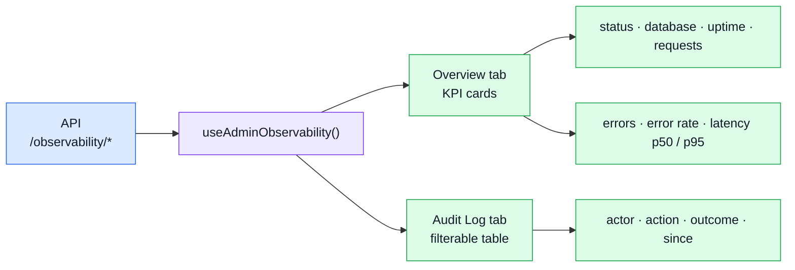

# Admin Dashboard

Route: `/:locale/admin`. Requires the admin role — non-admins are redirected Home by the route's
`meta.access`, not by a check inside the component. See
[Sitemap & Access Control](../theory/sitemap.md).

It is the one screen that reads the API's **operational** surface rather than a domain one, which
is why it lives in its own module and talks to `/observability/*` instead of to a resource.

## What it shows



### Overview tab

Eight KPI cards, fetched live:

```text
┌─────────────┐ ┌──────────────┐ ┌──────────┐ ┌──────────────┐
│  API Status │ │   Database   │ │  Uptime  │ │  Requests    │
│     ok      │ │  connected   │ │  1h 30m  │ │    1042      │
└─────────────┘ └──────────────┘ └──────────┘ └──────────────┘
┌─────────────┐ ┌──────────────┐ ┌──────────┐ ┌──────────────┐
│   Errors    │ │  Error Rate  │ │ Lat. p50 │ │  Lat. p95    │
│     12      │ │    1.2%      │ │  18ms    │ │    85ms      │
└─────────────┘ └──────────────┘ └──────────┘ └──────────────┘
```

### Audit Log tab

Audit events with optional filters — **actor** (user id), **action** (dot-notation string),
**outcome** (success / failure), **since** (ISO-8601). Rendered as a colour-coded table with
truncated request and trace ids; hover for the full value.

The trace id is the useful one: it is the same id the API reports to Tempo, so a row here is a
starting point for a distributed trace rather than a dead end.

## Files

| File | Role |
| ---- | ---- |
| `src/modules/admin/views/Admin.vue` | Tab shell (Overview + Audit Log) |
| `src/modules/admin/composables/use-admin-observability.ts` | Fetches health, metrics and audit; exposes reactive state |
| `src/modules/admin/types.ts` | View-model types (`IAdminKpi`, `IAdminAuditFilters`) |
| `src/modules/admin/mocks/handlers.ts` | MSW responses, so the dashboard works with no backend |

::: warning `useAdminObservability` has no unit tests
It is one of the three files carrying almost all of this repo's no-coverage mutants. See
[Mutation testing](./mutation-testing.md#reading-a-0-and-why-it-is-kept).
:::
