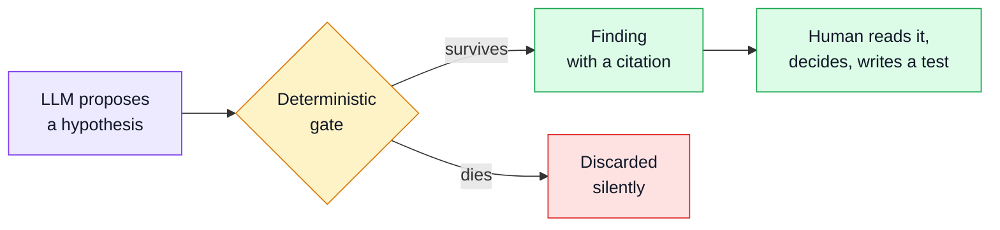
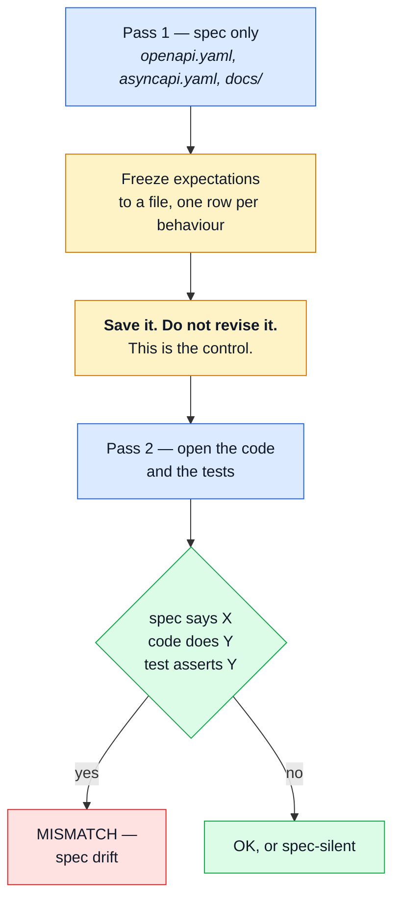

# AI Auditing

Every other instrument in this repo compares the system **to itself**: component to snapshot, mutant
to suite, response to generated schema. That is what makes them deterministic, and it is also their
ceiling. Stryker cannot read `docs/theory/domain-layer.md`. axe cannot read a ticket. orval cannot
notice that the docs promise a rule the contract never encodes.

**Prose ↔ code is the gap**, and it is the one place a language model beats a program rather than
approximating one. This repo has ~70 files under `docs/` stating rules no schema enforces.

`tests/audit/` holds three prompts that live in exactly that gap. They are plain markdown, run by
hand against an LLM, and they write reports — never code.

## The one rule

> The model proposes. A deterministic oracle disposes.



Two consequences, both non-negotiable:

- **Nothing AI-generated gates CI.** A red build must be reproducible by re-running it. An LLM
  verdict is not, so these report and never block.
- **A finding without a citation is not a finding.** Either a `file:line` in the spec, or nothing.
  Prose confidence is not evidence.

## The three prompts

| File                         | Asks                                                                          | Writes to                    |
| ---------------------------- | ----------------------------------------------------------------------------- | ---------------------------- |
| `tests/audit/spec-drift.md`  | Which tests assert what the **code** does rather than what the **spec** says? | `reports/audit/spec-drift/`  |
| `tests/audit/spec-gaps.md`   | Which business rules and security boundaries have **zero** coverage?          | `reports/audit/spec-gaps/`   |
| `tests/audit/suite-bloat.md` | Which tests cost CI time and discriminate nothing?                            | `reports/audit/suite-bloat/` |

All three take one argument — a module (`orders`), a path, or `--diff` for whatever the working
tree touched.

The prompts are deliberately repo-agnostic: the same three files live in
`boilerplate-node-backend`, and a change worth making to one is worth copying to the other.

### Naming the scope

The argument decides the filename, one way only:

| Argument | `<SCOPE>`                                       |
| -------- | ----------------------------------------------- |
| a module | the module name — `orders`                      |
| a path   | slugged, `src/` dropped — `infrastructure-http` |
| `--diff` | the current branch name, slugged                |

`orders.findings.md` tells the next reader what it covers. A batch number does not — never invent
one.

### The reports are disposable

`reports/` is gitignored, and that is the intended end state, not an oversight. A report is working
evidence: once its conclusions land as a fixed test, a commit message or a tracked issue, the file
has done its job. Audit paperwork that outlives the audit goes stale silently and misleads the next
reader — the prompts are the durable asset here, not their output.

## The two-pass method

`spec-drift.md` is the one worth understanding, because its **ordering is the method**. Spec drift is
a test and an implementation sharing one wrong reading of the spec — CI is green, and the test proves
only that the test agrees with the code.

You cannot find that by reading the test, because the test looks correct. You find it by deriving
what the behaviour _should_ be **before** the implementation can contaminate you.



Writing the expectations down before opening `src/` is not ceremony — it is the only thing keeping
the control uncontaminated. Skip it and the audit degrades into a code review that agrees with
whatever it just read.

The freeze is procedural, not cryptographic: the file is gitignored, so nothing stops you editing it
after the fact. Nothing except the fact that doing so destroys the only reason the second pass is
worth running. If a pass-1 row turns out to be wrong, add a pass-2 row saying so — do not quietly
rewrite the control to match what you just learned.

## How to run one

The prompts are written in Claude Code's slash-command format, so the cheapest way to use them is to
let it find them:

```bash
mkdir -p .claude/commands
ln -s ../../tests/audit .claude/commands/audit
```

That gives `/audit:spec-drift orders`, `/audit:spec-gaps inventory`, `/audit:suite-bloat --diff`.
The symlink is local, gitignored and regenerable — the files under `tests/audit/` remain the only
copy.

Without the symlink, either works:

- **Claude Code** — _"Follow `tests/audit/spec-drift.md`, scope `orders`."_
- **Any other LLM** — strip the YAML frontmatter, replace `$1` with the scope, paste the body. It
  needs to be able to read the repo; an audit that cannot open `openapi.yaml` has nothing to
  compare against.

The frontmatter is not decoration. `allowed-tools` is the read-only boundary — `Read`, `Glob`,
`Grep`, `Write` and a few `Bash` verbs, with no `Edit`. These commands report; they never touch
source.

::: tip Which model
Claude for `spec-drift` and `spec-gaps` — long-context reasoning over prose vs. code is exactly
where small local models confabulate citations most confidently, and a fabricated `file:line` costs
more than the finding was worth.

`suite-bloat` is the exception. It is bookkeeping over `reports/mutation/mutation.json`, and a local
Ollama model handles it.
:::

## Reading the output

A findings table uses four verdicts, and only one of them is a bug:

| Verdict           | Means                                                                              |
| ----------------- | ---------------------------------------------------------------------------------- |
| **MISMATCH-CODE** | Spec says X, code does Y, the test asserts Y. The thing this audit exists to find. |
| **TAUTOLOGY**     | The assertion cannot fail — the expected value is produced by the code under test. |
| **SPEC-SILENT**   | A sensible assertion no document actually requires. Worth knowing, not a defect.   |
| **OK**            | Test and spec agree.                                                               |

`TAUTOLOGY` is the quiet one. `expect(f(x)).toEqual(g(x))` where `g` is a sibling export, an
expectation recomputed with the very schema the view uses, or a clamp asserted against the module's
own `MIN_*` constant, is a test that cannot fail and therefore proves nothing. Stryker finds some of
these; the audit finds the rest.

The counter-case matters as much: a value generated **from** the contract — an orval enum, a
generated Zod schema — is an independent anchor, not a tautology. Check where a value is born before
calling it one.

### Read `SPEC-SILENT` as the headline, not as a pass

A row the audit could not grade is not a row that passed. Where the spec is silent, code and test
always agree — there is nothing to drift from — so those rows are precisely where drift hides.

The first frontend batch made this concrete: 396 rows over the HTTP layer, roughly 381 of them
`SPEC-SILENT`, because URL parsing, route-table matching, env config and refresh/retry policy are
frontend mechanics the OpenAPI contract never speaks to. "One defect in 396 rows" would be a
flattering misreading. Report the answerable denominator instead — and when it collapses like that,
the finding is that **the contract is the thin layer**, which is worth more than any single
mismatch.

## Does it work?

Four scopes ran on this side — the HTTP layer and response validation, the payments store, login-view
i18n, and the cart quantity domain — plus the frontend half of a cross-repo differential against
`boilerplate-node-backend`.

It produced fixes, not a report nobody read:

- `ResponseReject.errors` was typed and asserted as `string[]`; the contract's `ErrorResponse.errors`
  is an `ErrorItem[]` of `{code, message}` objects. Type and every fixture corrected.
- A payments decline test stubbed an undefined response and asserted only `rejects.toThrow()` — it
  passed identically for a 404, a 500, or a real decline. Now pinned to `409 PAYMENT_DECLINED`.
- A login i18n test computed its expected message with the same schema the view uses, so a wrong
  dictionary string would have kept both sides agreeing. Now anchored to the literal locale string.
- Quantity floor-clamp tests asserted against `MIN_LINE_QUANTITY`, a sibling export of the module
  under test, instead of the contract's literal `minimum: 1`.
- The login fixture mocked a bare `{token}` while the backend envelope wraps it under `data` — the
  auth tests would have passed against a server violating the contract.

Run them before a refactor, after a contract change, or when a module's docs and tests have drifted
apart — not on a schedule.

---

## Footnote: the tools we evaluated, and why none were adopted

Checked **2026-09-03**. Treat that as an expiry date, not a warranty — the whole reason this
footnote exists is that the previous round of claims had quietly gone stale.

| Tool                                 | State                                | Why not                                                                                                                                                                        |
| ------------------------------------ | ------------------------------------ | ------------------------------------------------------------------------------------------------------------------------------------------------------------------------------ |
| **Mutahunter** (LLM mutants)         | Dead — last release 2025-04-17       | Also removed its coverage-driven mode in 1.3.2, the one feature that made it fit here.                                                                                         |
| **LLMorpheus** (LLM mutants, JS)     | Archived 2025-02-03                  | The only JS-native equivalent, and it stopped.                                                                                                                                 |
| **Qodo Cover / Cover-Agent**         | Unmaintained notice since 2025-06-15 | Gates generated tests on coverage and pass/fail, never the spec — so every test it keeps agrees with the code by construction. That is the defect `spec-drift` exists to find. |
| **CodeRabbit / PR-Agent / Greptile** | Alive and healthy                    | Duplicate review surface. `/code-review` and `/security-review` already cover the diff, and there is no PR workflow here for a bot to attach to.                               |
| **promptfoo**                        | Alive, MIT, weekly releases          | ~600 MB and 524 packages for a YAML runner — 513 MB of it a local ONNX inference runtime we would never call.                                                                  |

Two notes worth keeping, because they outlived the tools:

- **The reason for rejecting the review bots changed.** It used to be "a hosted bot cannot read
  `CLAUDE.md`". That is no longer true — CodeRabbit reads that exact filename by default now. They
  are rejected on redundancy and cost, which is a different argument, and the old one should not be
  repeated.
- **Nothing in this niche is alive.** StrykerJS has not added LLM-authored mutants either. Meta run
  the idea in production internally, but it is not a product. If that changes, the prompt files here
  are the thing that would be replaced.

## Related

- [Mutation Testing](./mutation-testing.md) — the deterministic instrument this one complements
- [Unit Testing](./unit-testing.md) — where a finding usually lands as a real assertion
- [Testing & Docs](./testing-and-docs.md) — every layer, and which question each answers
