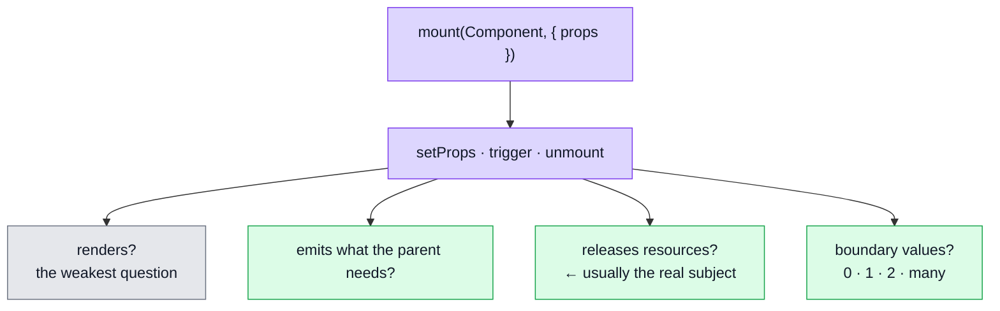

# Component Testing

Mounting a single `.vue` component with `@vue/test-utils` and asserting what it renders, what it emits, and what it cleans up.

## What a component test is actually for

The tempting answer is "check the markup". That is usually the least valuable thing a component test does, and the fastest to rot — assert on class names and the test breaks every time a designer touches the template, without ever having caught a bug.

The valuable questions are the ones no other layer asks:

| Question | Why nothing else catches it |
| -------- | --------------------------- |
| Does it release the **resources** it acquires? | An object URL never revoked is a leak; e2e never notices, and it is invisible on screen |
| Does it distinguish states that **look** similar? | `undefined` (idle) versus `0` (started, nothing sent) render almost identically and mean opposite things |
| Does it emit what the parent's model **expects**? | A component that emits an array where the contract declares a single value breaks the parent, not itself |
| Does the **boundary** behave? | 0 pages, 1 page, 2 pages — a pager is nothing but boundaries |

## Resources are the real subject

`FormImageUpload` is the worked example. Its validation logic lives in `utils/uploads.ts` and is well covered there. What the *component* owns is a resource: `URL.createObjectURL` pins a blob in memory until `revokeObjectURL` releases it.

There are three moments where failing to release leaks an entire image, and none of them is visible in the UI or catchable by e2e:

1. **replacing** one pick with another — the easiest to forget, because clearing is usually handled
2. **clearing** the field
3. **unmounting** while a file is picked

All three are asserted against a counted stub, because a revoke that did not happen is only observable by counting.

## Select by `data-testid`, not by vendor class

The specs select `[data-testid=upload-progress]`, and that is not a style preference — it is load-bearing.

Vuetify's `v-file-input` renders **its own** `.v-progress-linear` inside the field loader. A spec written against the class matches that one too, so it passes whether the component's own bar is rendered or not. It asserted nothing, in both directions.

This is the general hazard of asserting on a component library's markup: you are testing their DOM, not yours, and theirs can change without your behaviour changing. A `data-testid` is a contract *you* own.

## Boundaries, stated as boundaries

`ListPagination` is twenty lines and its entire logic is `v-if="length > 1"`. That single comparison has three interesting inputs, and they fail in different directions:

- **0 pages** — an empty result set. A pager offering "page 1 of 0" is a control with nothing to do.
- **1 page** — the case `>= 1` gets wrong, and the common one: a filter that narrowed to a handful of rows.
- **2 pages** — the case `> 2` gets wrong.

Written as three cases rather than one, so a failure says which side of the comparison moved.

## What to assert on when i18n is involved

Unit tests load locale dictionaries lazily, so a rendered label is often the raw message key rather than the copy. Asserting on visible text there is asserting on a loading detail.

Prefer the accessible value where one exists — `aria-valuenow` on a progress bar is both stable and the thing a screen reader announces. That is a better assertion than the label in every respect.

## Where this sits relative to mutation testing

`.vue` files are **not** currently in Stryker's `mutate` scope, and component tests are what unblocks that. Stryker can mutate a single-file component — it maps the file to the HTML parser and mutates the `<script>` block — but it does **not** mutate template expressions. Including SFCs before components have specs would report a number implying template coverage nobody has.

So the sequence is: component tests first, `.vue` into the mutation scope second.

## File map

| Path | Contents |
| ---- | -------- |
| `tests/unit/ui/form-image-upload.spec.ts` | The object-URL lifecycle, the preview precedence, the idle-vs-zero distinction, the model shape |
| `tests/unit/ui/list-pagination.spec.ts` | The render boundary and the visible-page cap |
| `tests/unit/ui/form-counter-input.spec.ts` | The original example — Vuetify's own test hooks, hold-to-repeat |
| `tests/unit/app/app-navigation.spec.ts` | Route-driven rendering |
| `tests/support/unit/setup.ts` | jsdom polyfills Vuetify needs — `ResizeObserver`, `matchMedia`, pointer capture, `visualViewport` |

## Commands

| Command | Effect |
| ------- | ------ |
| `npm run test:unit` | Runs component specs with the rest of the unit suite |
| `npx vitest run tests/unit/ui/` | Just the component specs |

## Extending it

Priority is by **risk**, not by file size. In rough order: components that own a resource or a subscription, components with boundary logic, form views that surface validation errors, and finally the paths that only run once something else has already broken (`Error.vue`, `LayoutDefault.vue`).

## Related pages

- [Unit Testing](./unit-testing.md) — the wider suite these live in
- [Accessibility Testing](./accessibility-testing.md) — the layer that checks the rendered result is usable
- [Mutation Testing](./mutation-testing.md) — why `.vue` is not yet in scope, and what would put it there
- [Testing & Docs](./testing-and-docs.md) — the map
