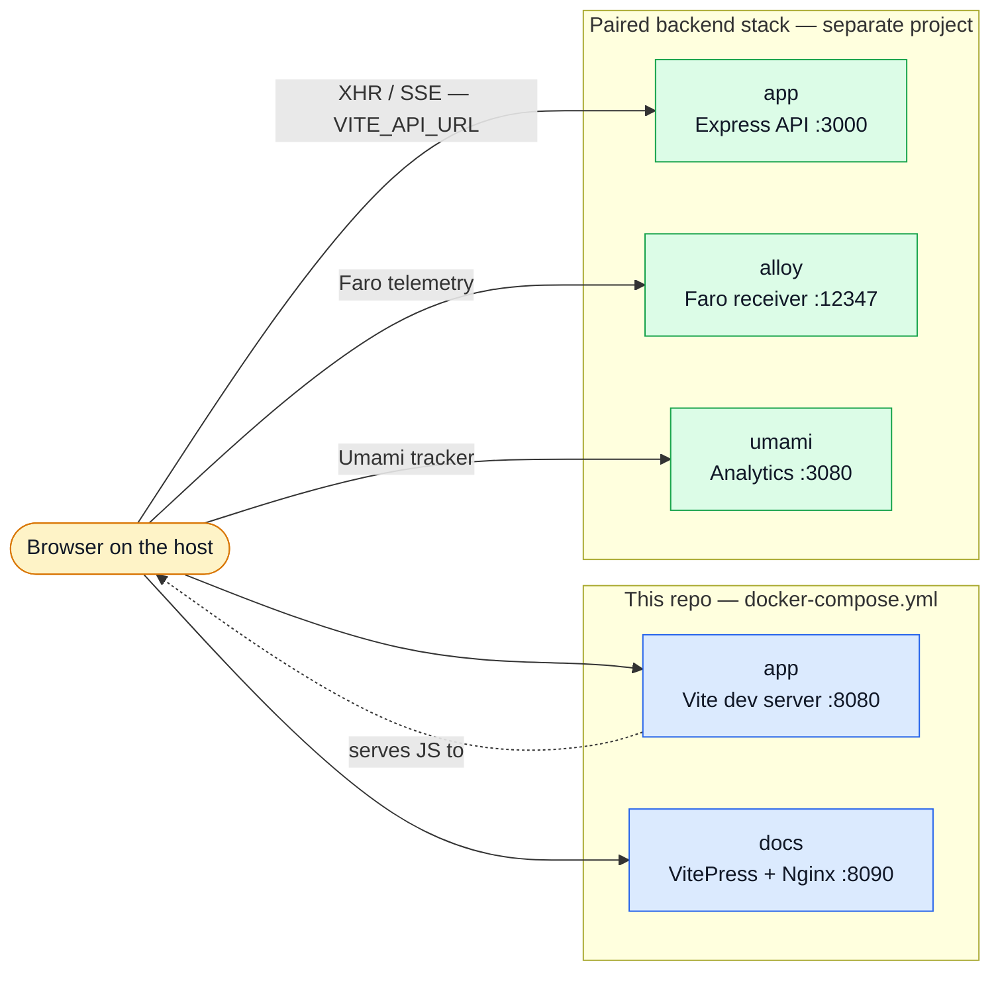

# Docker & Podman

This repo ships a small `docker-compose.yml`: the Vite dev server and the VitePress docs site,
nothing else. All the infrastructure — API, Mongo, Grafana, Alloy, Umami — lives in the
[paired backend](https://github.com/Guebbit/boilerplate-node-backend) stack.

```bash
cp .env-example .env     # required, see below
npm run compose -- up    # podman by default; CONTAINER_ENGINE=docker in your shell to switch
```

`CONTAINER_ENGINE` is a **shell** variable, not a `.env` one. Compose reads `.env` — which is how
every path and port below reaches it — but npm does not, so the one thing `.env` cannot decide is
which binary npm invokes. Your engine is a property of your machine anyway, so it belongs in your
shell profile rather than in a file the repo ships.

## Container map



The dotted line is the whole point: **the container serves JavaScript, the browser makes the
requests.** Nothing in this compose file ever opens a connection to the backend.

## Pairing with the backend

The two stacks are separate compose projects on separate networks, and they stay that way — there
is no shared network to configure and nothing to join. The only thing crossing the boundary is
your browser, running on the host.

That single fact decides everything else: `VITE_API_URL`, `VITE_API_SSE`, `VITE_FARO_URL` and
`VITE_UMAMI_SRC` are resolved **by the browser**, so they must always be **host** ports
(`http://localhost:3000`) — never compose service names like `http://app:3000`, which only resolve
inside the backend's own network.

To run the pair:

1. Start the **backend** stack first — it owns the API, Alloy and Umami this app points at.
2. Start this one. `VITE_API_MOCK_ENABLED` defaults to `false`, so the app talks to the real API.
3. Check `NODE_CORS_ORIGIN` in the backend's `.env` includes `http://localhost:8080`.

Keeping the two host-port blocks disjoint (`8080–8099` here, `3000–3099` there) is what lets both
be up at once — the full map lives in
[Getting Started → Host port map](../getting-started.md#host-port-map).

## `.env` is required for the container too

`cp .env-example .env` is not just the host workflow. Compose bind-mounts the repo at `/app`, so
Vite reads that same `.env` from inside the container. Without it you get compose's built-in
fallbacks and nothing else: no Faro, no Umami, no locale configuration.

The compose `environment:` block therefore lists **only** the pairing-critical variables
(`VITE_APP_PORT`, `VITE_API_URL`, `VITE_API_SSE`, `VITE_API_MOCK_ENABLED`). Everything else is
meant to arrive through the mounted `.env`.

> **Do not "helpfully" add more variables to that block.** Compose `environment:` entries become
> `process.env`, and Vite's `loadEnv` applies `process.env` _after_ the `.env` files. Anything
> listed there silently overrides `.env` and can no longer be changed by editing it — only by
> exporting a shell variable before `compose up`.

## Two things that make the container work

Both are easy to break and fail in ways that give you no error message.

**`--host 0.0.0.0` in the compose `command`.** Vite binds `127.0.0.1` by default, which inside a
container means the published port forwards to a socket nobody is listening on: `compose up`
appears to succeed and the browser gets a connection refused. It is set in the compose `command`
rather than in the `dev` script so that running on the host does not expose the dev server to your
LAN.

**The port lives in `vite.config.ts`, not in the `dev` script.** It is read from `VITE_APP_PORT`
via `loadEnv`, so the published port and the listening port cannot drift apart — the compose
mapping is `${VITE_APP_PORT}:${VITE_APP_PORT}`. `strictPort` is on: a busy port fails loudly
instead of quietly hopping to the next free one, which in a container would leave the published
port pointing at nothing. A `--port` on the command line still wins, which is how the e2e scripts
run on `8085`.

## Running this container alone

Supported, but it has no API to call. Set `VITE_API_MOCK_ENABLED=true` in `.env` and MSW serves
every request from its in-memory database — see [Mocking (MSW)](./mocking.md).

That is the deliberate trade in the default: a lone container is loudly broken rather than quietly
mocked, because a frontend that silently mocks the backend you just started looks like it works
and does not.

## Related pages

- [Package Scripts](./package-scripts.md) — the `compose:*` helpers
- [Live E2E](./live-e2e.md) — running the real backend against this app's e2e suite
- [Observability](./observability.md) — what Faro and Umami need from the backend stack
