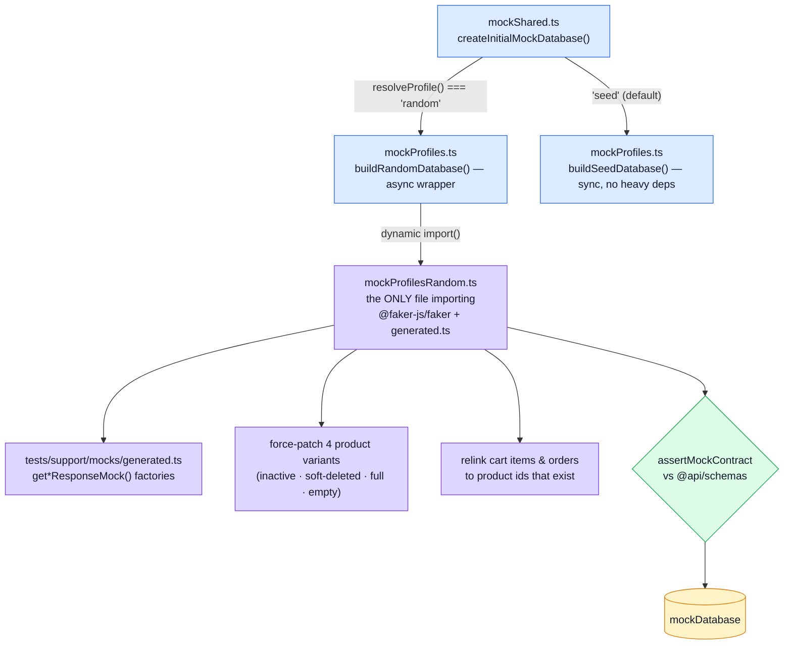
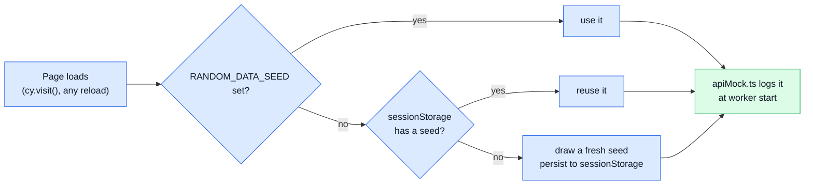

# E2E — Random-Data Profile

The mock profile ([Mocking (MSW)](./mocking.md)) answers "does the app behave correctly against **known** data?" This layer answers a different question: **does the app survive *any* contract-valid response?** Missing optional fields, an inactive-but-not-deleted product next to a deleted-but-active one, an order whose owner is picked at random — the fixed seed can't produce these by design (it's fixed), and a spec asserting exact counts/titles against it would be meaningless if it could.

Run with `npm run test:e2e:random`. It boots its own Vite dev server with `VITE_MOCK_PROFILE=random` and runs exactly one spec: `tests/e2e/specs/resilience.cy.ts`.

## Why it never gates a PR

This profile asserts invariants against a different faker-seeded dataset on every run, not exact values — a failure needs a human to read the trace and decide whether it's a real bug or a rare-but-valid combination the spec didn't anticipate, not something that should block a merge on its own. For that reason it isn't part of `.github/workflows/ci.yml`; it lives in its own workflow, `.github/workflows/e2e-random.yml`, on a nightly schedule plus `workflow_dispatch` — the same structural reason [mutation testing](./mutation-testing.md) lives apart from `ci.yml`. Before this workflow existed, the profile was reachable only via `npm run test:e2e:random` run by hand, which in practice meant it was never run at all.

On failure, the run log carries the faker seed (`apiMock.ts`, via `resolveMockSeed()`) that produced the failing dataset — reproduce locally with `RANDOM_DATA_SEED=<seed> npm run test:e2e:random`.

## Tools

Same base as the mock profile (Cypress + MSW), plus:

| Tool | Role |
| --- | --- |
| A hand-rolled seeded PRNG bridge over `tests/support/mocks/generated.ts`'s faker factories | See "Why a dynamic import", below |
| `sessionStorage` | Persists the RNG seed across the full page reload every `cy.visit()` causes — the same trick `mockShared.ts` uses to persist the logged-in identity |
| `assertMockContract` (the same one [Mocking](./mocking.md) uses) | Validates the *generator's own output*, not just hand-written responses — the generator is itself a thing that can drift |

## Architecture

### Why a dynamic import

`mockProfilesRandom.ts` is the only module that imports `@faker-js/faker` and the 4 800-line `tests/support/mocks/generated.ts`. `mockProfiles.ts` reaches it only through `await import('./mockProfilesRandom.ts')`, gated on `resolveProfile() === 'random'`.

This split exists because of a real regression, not upfront design: `mockProfiles.ts` used to import faker and `generated.ts` unconditionally. That pulled both into the **seed profile's** module graph too — every `npm run test:e2e` run, not just `test:e2e:random` — and on a cold `vite dev` boot, Vite's one-time dependency pre-bundling step triggered a page reload mid-test, discovered while building this profile's own resilience spec (a `cy.spy(...).as(...)` registered before the reload silently vanished after it). The fix was structural: keep the seed profile's default path completely free of the random profile's dependencies, not just fast.

### Seed lifecycle

`sessionStorage` matters for the same reason it matters in `mockShared.ts`: a full page reload re-evaluates every ES module from scratch, wiping any plain module-level `let`. Without the bridge, "random" would mean "a different dataset on every single navigation" instead of "a different dataset per run" — `cy.resetState()` between specs would never see the same data twice, and a reported failure would be unreproducible even with the exact seed in hand.

## Design constraints

These aren't incidental — violating any one of them defeats the profile's purpose:

1. **Vary the data, never the handlers.** Only `mockDatabase`'s contents change; every handler in `src/modules/<name>/mocks/*` runs identically regardless of profile.
2. **The generated factories are per-operation envelopes, not entity factories.** They return `{ success, status, message, data }` with garbage envelope fields (`status: faker.number.int()`). Only `.data` is used.
3. **Auth identity stays fixed.** `cy.loginAs()` types `root@root.it` / `gino@pino.it` into a real form. Only cosmetic fields (`username`, `imageUrl`, timestamps) are randomised; `active` is pinned `true` for both so login never randomly fails.
4. **Relations are relinked after generating.** Each factory call is independent, so a fresh call for cart items would reference product ids that don't exist. Products are generated first; cart items and orders are built from ids that are actually present. `cartItemToOrderItem` (`mockShared.ts`) throws on incoherent data — the canary that this relinking broke.
5. **Role-scoping branches are force-patched to survive randomisation.** `buildRandomProducts()` guarantees at least one `active: false` product, one soft-deleted product, one with every optional field populated, and one with every optional field absent — so `isVisibleToCaller`'s two branches are never untested just because faker didn't happen to roll them. (This mirrors a real incident: the fixed seed's split was added after a mock once returned all 5 products to everyone while the real API returned 3 — see [Mocking](./mocking.md).)
6. **Observability payloads are data, not constants.** The three `/observability/*` responses behind the admin dashboard live in `mockDatabase.observability`, populated per profile, not as frozen constants inside `adminMockHandlers.ts`. While they *were* constants, `AdminOverviewTab.vue` — the most numeric and most layout-fragile screen in the app — was the one screen this profile could never stress: `resilience.cy.ts` visited `/en/admin` and asserted it rendered, but it rendered the same `uptimeSeconds: 3600` / `totalRequests: 1042` / `loadAvg: [0.5, 0.4, 0.3]` every single run. The ranges are chosen for what breaks a layout rather than for variety: counters from a zero-request cold start to seven digits, a `loadAvg` whose length is *not* pinned to 3 (the contract says "array of number" — a component destructuring `[one, five, fifteen]` is assuming something the API never promised), an audit page that is sometimes empty, and an `errorRate` derived from its two counters so the dashboard is never asked to show 0 errors beside a 40% rate.
7. **Orders are fully faker-derived, not `createMockOrder`.** `mockOrderMath.ts`'s `createMockOrder` — correct for the seed profile and for orders placed at runtime — stamps `id`/`createdAt`/`updatedAt` from wall-clock time and `Math.random()`, which would make this profile *unreproducible* under a fixed seed. `buildRandomOrders()` builds orders by hand instead, so every value traces back to the seeded PRNG.

## The resilience spec

`tests/e2e/specs/resilience.cy.ts` is written to hold under **any** dataset this profile can produce — no exact counts, no exact titles. What it asserts:

- every route renders (public, guest-only, authenticated, admin-only) without an uncaught exception — including `/admin`, whose observability numbers are now randomised too (constraint 6), so "the dashboard rendered" means something it did not before
- no `console.error`/`console.warn` beyond documented, known noise (Grafana Faro's own transport failure when no collector is running; a pre-existing vue-i18n lazy-load warning) — see the file for the exact filter and why each entry is there
- every product an admin can see — including the one guaranteed to have every optional field absent — has a detail page that renders
- a list that happens to be empty (a non-admin whose random order ownership left them with none) still renders, not crashes
- pagination controls agree with the row count actually rendered
- no horizontal overflow from a long random string

## File map

| Path | Contents |
| --- | --- |
| `tests/support/mocks/mockProfiles.ts` | `resolveProfile()`, `buildSeedDatabase()` (sync, no heavy deps), the async `buildRandomDatabase()`/`resolveMockSeed()` wrappers |
| `tests/support/mocks/seed-identities.ts` | The seed dataset's ids/emails/prices — byte-identical to `db/seeds/seed-identities.ts` in the BE. Fixed profile only; the random profile overwrites everything but the two login identities |
| `tests/support/mocks/mockProfilesRandom.ts` | The random profile's real implementation; the only importer of faker + `generated.ts` |
| `tests/support/mocks/mockOrderMath.ts` | `computeOrderTotals`/`createMockOrder` — shared by the seed profile, the random profile (totals only), and runtime checkout |
| `tests/support/mocks/generated.ts` | Orval-generated faker factories, one per operation — raw material, not consumed directly by handlers |
| `tests/e2e/specs/resilience.cy.ts` | The one spec this profile runs |
| `tests/unit/mocks/mockProfiles.spec.ts` | Unit coverage of both builders without Cypress — see [Unit Testing](./unit-testing.md) |
| `.github/workflows/e2e-random.yml` | Nightly schedule + `workflow_dispatch`, uploads Cypress screenshots/videos on failure |

## Related pages

- [Mocking (MSW)](./mocking.md) — the fixed-seed profile this one varies from
- [Unit Testing](./unit-testing.md) — `mockProfiles.spec.ts`
- [Live E2E](./live-e2e.md) — the third profile, against a real backend
- [Testing](./testing-and-docs.md) — suite overview
