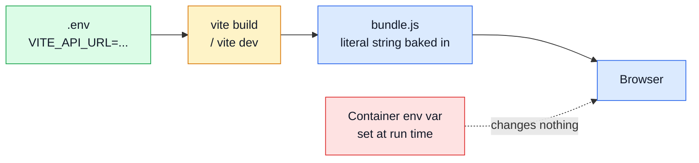

# Environment Variables

Source of truth: [`.env-example`](https://github.com/Guebbit/boilerplate-vue-frontend/blob/main/.env-example).
Copy it to `.env` before the first run — see [Getting Started](../getting-started.md).

## The one rule that explains most surprises

**`import.meta.env.VITE_*` is replaced with a string literal at build time.** It is not read when
the app runs. Setting an environment variable on a running container changes nothing; the value
was decided when the bundle was produced. A production image is therefore specific to the
environment it was built for — see the build args in `.docker/Dockerfile.production`.

The second half of the same rule: **the browser resolves these URLs, not the container.** So
`VITE_API_URL` must always be a host address (`http://localhost:3000`), never a compose service
name like `http://app:3000`, even when both stacks run in containers.

## Application

| Variable | Purpose |
| -------- | ------- |
| `VITE_APP_BASE_URL` | Sub-path the app is served from, e.g. `/app/`. Passed to `createWebHistory`; leave unset when serving from the domain root |
| `VITE_APP_PORT` | Dev-server port. Read in `vite.config.ts` via `loadEnv`, so the server and the compose publish always agree |
| `VITE_APP_EMPTY_VALUE` | Placeholder for empty/unavailable display values (default `—`) |

## Locales

| Variable | Purpose |
| -------- | ------- |
| `VITE_APP_DEFAULT_LOCALE` | Initial locale (e.g. `en`) |
| `VITE_APP_FALLBACK_LOCALE` | Locale used when a key is missing from the active one — `vue-i18n` `fallbackLocale` (default `en`) |
| `VITE_APP_SUPPORTED_LOCALES` | Comma-separated supported locales (e.g. `en,it`). When it names anything usable it wins over the folder scan, which is how a locale served by the API but absent from the bundle gets offered at all |

## API and realtime

| Variable | Purpose |
| -------- | ------- |
| `VITE_API_URL` | Backend API base URL |
| `VITE_API_SSE` | SSE URL for the realtime observability stream |
| `VITE_API_MOCK_ENABLED` | `true` turns on [MSW](./mocking.md) and the app needs no backend. Also the flag the bundler uses to drop MSW, every module's handlers and the whole fixture database from a production build |
| `VITE_MOCK_PROFILE` | `seed` (deterministic) or `random` — see [E2E Random Profile](./e2e-random-profile.md) |
| `VITE_AXIOS_TIMEOUT` | Axios timeout in ms |
| `VITE_MAX_UPLOAD_BYTES` | Client-side upload ceiling. A UX affordance only — the server re-checks |
| `VITE_VALIDATE_RESPONSES` | Validate every response against its Zod envelope schema. Costs main-thread CPU per request; a development and live-E2E instrument, off in production |

## Logging

| Variable | Purpose |
| -------- | ------- |
| `VITE_APP_LOG_LEVEL` | `error` \| `warn` \| `info` \| `debug`. Same ladder as the API's `NODE_LOG_LEVEL`; defaults to `debug` in dev, `warn` in production |
| `VITE_APP_LOG_SCOPES` | Areas that emit `debug`/`info`: comma-separated, or `*`. Empty means none. Known areas: `router`, `http`, `observability`, `demo` |

## Telemetry

Every value here is optional, and an empty one disables the integration rather than pointing it at
nothing. See [Observability](./observability.md).

| Variable | Purpose |
| -------- | ------- |
| `VITE_FARO_URL` | Grafana Faro receiver URL — Alloy `/collect` (empty = off) |
| `VITE_FARO_APP_NAME` | App name reported to Faro (default `frontend`) |
| `VITE_FARO_APP_VERSION` | App version reported to Faro |
| `VITE_FARO_ENVIRONMENT` | Faro environment tag (defaults to Vite `MODE`) |
| `VITE_UMAMI_WEBSITE_ID` | [Umami](./umami.md) website id (empty = off) |
| `VITE_UMAMI_SRC` | Umami tracker script URL |
