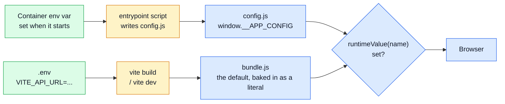

# Environment Variables

Source of truth: [`.env-example`](https://github.com/Guebbit/boilerplate-vue-frontend/blob/main/.env-example).
Copy it to `.env` before the first run — see [Getting Started](../getting-started.md).

## The one rule that explains most surprises

A value reaches the browser by one of two routes. Which one it takes decides whether a container
can change it.


```mermaid
%%{init: {'flowchart': {'nodeSpacing': 45, 'rankSpacing': 50}}}%%
flowchart LR
    ENV[".env<br/>VITE_API_URL=..."] --> VITE["vite build<br/>/ vite dev"]
    VITE --> BUNDLE["bundle.js<br/>the default, baked in as a literal"]
    CONTAINER["Container env var<br/>set when it starts"] --> ENTRY["entrypoint script<br/>writes config.js"]
    ENTRY --> CONFIG["config.js<br/>window.__APP_CONFIG"]
    CONFIG --> READ{"runtimeValue(name)<br/>set?"}
    BUNDLE --> READ
    READ --> BROWSER["Browser"]

    classDef src fill:#dcfce7,stroke:#16a34a,color:#111827;
    classDef build fill:#fef3c7,stroke:#d97706,color:#111827;
    classDef out fill:#dbeafe,stroke:#2563eb,color:#111827;
    class ENV,CONTAINER src;
    class VITE,ENTRY build;
    class BUNDLE,CONFIG,READ,BROWSER out;
```

**`import.meta.env.VITE_*` is replaced with a string literal at build time.** That is the default,
and the only route for a handful of values (see [What stays build-time](#what-stays-build-time)).
Everything on the whitelist below can also be overridden when a container **starts**, so one image
serves every environment: a config change is a restart, not a rebuild.

The second half of the same rule: **the browser resolves these URLs, not the container.** So
`VITE_API_URL` must always be a host address (`http://localhost:3000`), never a compose service
name like `http://app:3000`, even when both stacks run in containers.

## Runtime configuration (`config.js`)

How a running container changes a value, with no rebuild:

1. At start, `docker/docker-entrypoint.d/40-generate-runtime-config.sh` reads the container's own
   environment and writes `/config.js`: `window.__APP_CONFIG = { "API_URL": "...", ... }`.
   A variable that is unset or blank is left out of the file.
2. `index.html` loads `config.js` **before** the app bundle. nginx serves it with
   `Cache-Control: no-store`, so a restart shows up on the next page load.
3. Each read goes through `runtimeValue(name)` (`src/infrastructure/runtime-config.ts`):
   the `config.js` value, trimmed, or `undefined` when unset or blank. The call site then falls
   back to its own default: `runtimeValue('API_URL') || import.meta.env.VITE_API_URL`.
4. In dev, in unit tests and under `vite preview` there is no `config.js` (the request 404s
   harmlessly), so every read lands on its `import.meta.env` default. The same code path runs
   everywhere; there is no central config object.

```sh
docker run -e VITE_API_URL=https://api.example.com -p 8080:80 boilerplate-frontend:production
```

**Never put a secret here.** Every value ships to every browser, with or without `config.js`.

### The whitelist

Only the keys of `RuntimeConfig` are written, and only these. Adding one means a key in that
interface, a `config_entry` line in the entrypoint script, and the call site's `runtimeValue()`.

| `config.js` key                                                     | Container variable                                                          |
| ------------------------------------------------------------------- | --------------------------------------------------------------------------- |
| `API_URL`, `API_SSE`                                                | `VITE_API_URL`, `VITE_API_SSE`                                              |
| `APP_NAME`, `APP_LOGO`, `APP_EMPTY_VALUE`                           | `VITE_APP_NAME`, `_LOGO`, `_EMPTY_VALUE`                                    |
| `LOCALE_TENANT`, `APP_DEFAULT_LOCALE`, `APP_FALLBACK_LOCALE`        | `VITE_LOCALE_TENANT`, `VITE_APP_DEFAULT_LOCALE`, `VITE_APP_FALLBACK_LOCALE` |
| `APP_LOG_LEVEL`, `APP_LOG_SCOPES`                                   | `VITE_APP_LOG_LEVEL`, `VITE_APP_LOG_SCOPES`                                 |
| `AXIOS_TIMEOUT`, `MAX_UPLOAD_BYTES`                                 | `VITE_AXIOS_TIMEOUT`, `VITE_MAX_UPLOAD_BYTES`                               |
| `FARO_URL`, `FARO_APP_NAME`, `FARO_APP_VERSION`, `FARO_ENVIRONMENT` | `VITE_FARO_*`                                                               |
| `UMAMI_SRC`, `UMAMI_WEBSITE_ID`, `UMAMI_REQUIRE_CONSENT`            | `VITE_UMAMI_*`                                                              |

The container variable keeps its `VITE_` name, so the same `.env` line works for a dev server and
for `docker run -e`.

### What stays build-time

| Value                                               | Why a container cannot change it                                                                |
| --------------------------------------------------- | ----------------------------------------------------------------------------------------------- |
| `VITE_APP_BASE_URL`                                 | Vite bakes it into every emitted asset URL; it is a build arg of `docker/Dockerfile.production` |
| `MODE`, `DEV`                                       | Vite decides them while bundling, and dead code is removed on them                              |
| `VITE_VALIDATE_REQUESTS`, `VITE_VALIDATE_RESPONSES` | Not on the whitelist: read from `import.meta.env` only                                          |
| `VITE_APP_PORT`                                     | The dev server's port, read in `vite.config.ts`; a production container serves on 80            |

`VITE_SECURITY_*` is a third case: `docker/docker-entrypoint.d/41-generate-security-txt.sh` reads
them from the container at start, but it writes a file for nginx, not `config.js`
(see [`security.txt`](#security-txt)).

## Application

| Variable               | Purpose                                                                                                                                                                                                                                                                                                               |
| ---------------------- | --------------------------------------------------------------------------------------------------------------------------------------------------------------------------------------------------------------------------------------------------------------------------------------------------------------------- |
| `VITE_APP_NAME`        | The product name shown after every page title in the browser tab (`<page> — <name>`) and alone on a route with none. The one variable to change first when rebranding                                                                                                                                                 |
| `VITE_APP_LOGO`        | The app bar's logo: a path under the base (a file in `public/images/`) or an absolute URL. Unset uses the bundled logo. The other half of rebranding, beside `VITE_APP_NAME`                                                                                                                                          |
| `VITE_APP_BASE_URL`    | Sub-path the app is served from, e.g. `/app/`. Passed to `createWebHistory`; leave unset when serving from the domain root. A production container still serves from `/` unchanged — a reverse proxy in front maps the public sub-path back to it, see [Docker and Podman](docker-and-podman.md#sub-path-deployments) |
| `VITE_APP_PORT`        | Dev-server port. Read in `vite.config.ts` via `loadEnv`, so the server and the compose publish always agree                                                                                                                                                                                                           |
| `VITE_APP_EMPTY_VALUE` | Placeholder for empty/unavailable display values (default `—`)                                                                                                                                                                                                                                                        |

## Locales

| Variable                   | Purpose                                                                                                                                                                                                                                 |
| -------------------------- | --------------------------------------------------------------------------------------------------------------------------------------------------------------------------------------------------------------------------------------- |
| `VITE_APP_DEFAULT_LOCALE`  | Initial locale (e.g. `en`)                                                                                                                                                                                                              |
| `VITE_LOCALE_TENANT`       | This frontend's translation tenant — whose dictionary `GET /locales/{locale}/messages` builds for it. Must be one of the ids `GET /locales/tenants` lists; unset means the demo pair's `demo-fe`. See [Internationalisation](./i18n.md) |
| `VITE_APP_FALLBACK_LOCALE` | Locale used when a key is missing from the active one — `vue-i18n` `fallbackLocale` (default `en`). Must name a locale this build BUNDLES, or the fallback cannot answer offline                                                        |

Which languages the app offers is not configured here. `src/locales/*.json` is the offline floor, discovered by a glob at build time, and `GET /locales` adds whatever the API offers at boot — including languages translated in its database that this build ships no file for. See [Layers → files are defaults, the database overrides them](../theory/layers.md#files-are-defaults-the-database-overrides-them).

## API and realtime

| Variable                  | Purpose                                                                                                                                                                                                                                                                                                                                                                       |
| ------------------------- | ----------------------------------------------------------------------------------------------------------------------------------------------------------------------------------------------------------------------------------------------------------------------------------------------------------------------------------------------------------------------------- |
| `VITE_API_URL`            | Backend API base URL                                                                                                                                                                                                                                                                                                                                                          |
| `VITE_API_SSE`            | SSE URL for the realtime observability stream                                                                                                                                                                                                                                                                                                                                 |
| `VITE_AXIOS_TIMEOUT`      | Axios timeout in ms                                                                                                                                                                                                                                                                                                                                                           |
| `VITE_MAX_UPLOAD_BYTES`   | Client-side upload ceiling. A UX affordance only — the server re-checks                                                                                                                                                                                                                                                                                                       |
| `VITE_VALIDATE_REQUESTS`  | Validate every outgoing JSON body against its generated request schema, before it is sent. Same three states as the response flag. Dev, unit and e2e **throw**, naming the field and the rule; production **reports to Faro and sends anyway** — the backend answers a real 422. A multipart body is not checked                                                              |
| `VITE_VALIDATE_RESPONSES` | Validate every REST response and SSE frame against its generated contract schema. Unset means ON everywhere but the unit tests, which default to off. In production the validation is always **report-only**: unknown keys are stripped, and a mismatch reports to Faro without rejecting the call — the flag never re-enables a blocking outage there, whatever it is set to |

Deploy order for a contract change: the backend adds a field additively (never removes or
retypes one without a version bump this pair doesn't have yet), ships first, and the frontend
redeploys whenever it likes after that — production's report-only validation above is exactly
what makes that gap safe to leave open for a while, rather than a race the two deploys have to win
together.

## Logging

| Variable              | Purpose                                                                                                                              |
| --------------------- | ------------------------------------------------------------------------------------------------------------------------------------ |
| `VITE_APP_LOG_LEVEL`  | `error` \| `warn` \| `info` \| `debug`. Same ladder as the API's `NODE_LOG_LEVEL`; defaults to `debug` in dev, `warn` in production  |
| `VITE_APP_LOG_SCOPES` | Areas that emit `debug`/`info`: comma-separated, or `*`. Empty means none. Known areas: `router`, `http`, `observability`, `example` |

## Telemetry

Every value here is optional, and an empty one disables the integration rather than pointing it at
nothing. See [Observability](./observability.md).

| Variable                     | Purpose                                                                                          |
| ---------------------------- | ------------------------------------------------------------------------------------------------ |
| `VITE_FARO_URL`              | Grafana Faro receiver URL — Alloy `/collect` (empty = off)                                       |
| `VITE_FARO_APP_NAME`         | App name reported to Faro (default `frontend`)                                                   |
| `VITE_FARO_APP_VERSION`      | App version reported to Faro (default: `package.json`'s version; leave unset)                    |
| `VITE_FARO_ENVIRONMENT`      | Faro environment tag (defaults to Vite `MODE`)                                                   |
| `VITE_UMAMI_WEBSITE_ID`      | [Umami](./umami.md) website id (empty = off)                                                     |
| `VITE_UMAMI_SRC`             | Umami tracker script URL                                                                         |
| `VITE_UMAMI_REQUIRE_CONSENT` | `true` (default) loads Umami only after the visitor accepts the banner; `false` loads it unasked |

## `security.txt`

The production container writes `/.well-known/security.txt` (RFC 9116) at start, from
`VITE_SECURITY_CONTACT`, `VITE_SECURITY_EXPIRES` and the optional `VITE_SECURITY_POLICY_URL`.
Both of the first two must be set; otherwise nothing is written and nginx answers 404. `Expires`
is a renewal duty: set a date and renew it before it passes. The backend serves its own copy;
see its "Reporting a vulnerability" section.
