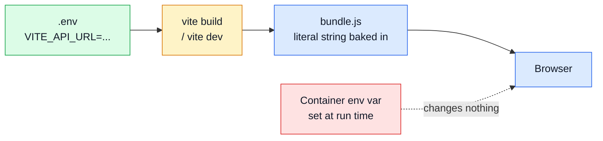

# Environment Variables

Source of truth: [`.env-example`](https://github.com/Guebbit/boilerplate-vue-frontend/blob/main/.env-example).
Copy it to `.env` before the first run — see [Getting Started](../getting-started.md).

## The one rule that explains most surprises

```mermaid
%%{init: {'flowchart': {'nodeSpacing': 45, 'rankSpacing': 50}}}%%
flowchart LR
    ENV[".env<br/>VITE_API_URL=..."] --> VITE["vite build<br/>/ vite dev"]
    VITE --> BUNDLE["bundle.js<br/>literal string baked in"]
    BUNDLE --> BROWSER["Browser"]
    RUNTIME["Container env var<br/>set at run time"] -.->|"changes nothing"| BROWSER

    classDef src fill:#dcfce7,stroke:#16a34a,color:#111827;
    classDef build fill:#fef3c7,stroke:#d97706,color:#111827;
    classDef out fill:#dbeafe,stroke:#2563eb,color:#111827;
    classDef dead fill:#fee2e2,stroke:#dc2626,color:#111827;
    class ENV src;
    class VITE build;
    class BUNDLE,BROWSER out;
    class RUNTIME dead;
```

**`import.meta.env.VITE_*` is replaced with a string literal at build time.** It is not read when
the app runs. Setting an environment variable on a running container changes nothing; the value
was decided when the bundle was produced. A production image is therefore specific to the
environment it was built for — see the build args in `docker/Dockerfile.production`.

The second half of the same rule: **the browser resolves these URLs, not the container.** So
`VITE_API_URL` must always be a host address (`http://localhost:3000`), never a compose service
name like `http://app:3000`, even when both stacks run in containers.

## Application

| Variable                       | Purpose                                                                                                                                                                                                                                                                                                               |
| ------------------------------ | --------------------------------------------------------------------------------------------------------------------------------------------------------------------------------------------------------------------------------------------------------------------------------------------------------------------- |
| `VITE_APP_NAME`                | The product name shown after every page title in the browser tab (`<page> — <name>`) and alone on a route with none. The one variable to change first when rebranding                                                                                                                                                 |
| `VITE_APP_LOGO`                | The app bar's logo: a path under the base (a file in `public/images/`) or an absolute URL. Unset uses the bundled logo. The other half of rebranding, beside `VITE_APP_NAME`                                                                                                                                          |
| `VITE_APP_BASE_URL`            | Sub-path the app is served from, e.g. `/app/`. Passed to `createWebHistory`; leave unset when serving from the domain root. A production container still serves from `/` unchanged — a reverse proxy in front maps the public sub-path back to it, see [Docker and Podman](docker-and-podman.md#sub-path-deployments) |
| `VITE_APP_PORT`                | Dev-server port. Read in `vite.config.ts` via `loadEnv`, so the server and the compose publish always agree                                                                                                                                                                                                           |
| `VITE_APP_EMPTY_VALUE`         | Placeholder for empty/unavailable display values (default `—`)                                                                                                                                                                                                                                                        |
| `VITE_ANALYTICS_GUEST_CONSENT` | Ships the guest analytics-consent banner (`true` = on). Off by default — a fresh deployment captures no guest-triggered event server-side either way, since the backend requires the header this banner's acceptance turns on. See [Umami](./umami.md) and `boilerplate-node-backend/docs/tools/analytics.md#consent` |

## Locales

| Variable                   | Purpose                                                                                                                                                                                                                                 |
| -------------------------- | --------------------------------------------------------------------------------------------------------------------------------------------------------------------------------------------------------------------------------------- |
| `VITE_APP_DEFAULT_LOCALE`  | Initial locale (e.g. `en`)                                                                                                                                                                                                              |
| `VITE_LOCALE_TENANT`       | This frontend's translation tenant — whose dictionary `GET /locales/{locale}/messages` builds for it. Must be one of the ids `GET /locales/tenants` lists; unset means the demo pair's `demo-fe`. See [Internationalisation](./i18n.md) |
| `VITE_APP_FALLBACK_LOCALE` | Locale used when a key is missing from the active one — `vue-i18n` `fallbackLocale` (default `en`). Must name a locale this build BUNDLES, or the fallback cannot answer offline                                                        |

Which languages the app offers is not configured here. `src/locales/*.json` is the offline floor, discovered by a glob at build time, and `GET /locales` adds whatever the API offers at boot — including languages translated in its database that this build ships no file for. See [Layers → files are defaults, the database overrides them](../theory/layers.md#files-are-defaults-the-database-overrides-them).

## API and realtime

| Variable                  | Purpose                                                                                                                                                                                                                                                                                                                                                                       |
| ------------------------- | ----------------------------------------------------------------------------------------------------------------------------------------------------------------------------------------------------------------------------------------------------------------------------------------------------------------------------------------------------------------------------- |
| `VITE_API_URL`            | Backend API base URL                                                                                                                                                                                                                                                                                                                                                          |
| `VITE_API_SSE`            | SSE URL for the realtime observability stream                                                                                                                                                                                                                                                                                                                                 |
| `VITE_AXIOS_TIMEOUT`      | Axios timeout in ms                                                                                                                                                                                                                                                                                                                                                           |
| `VITE_MAX_UPLOAD_BYTES`   | Client-side upload ceiling. A UX affordance only — the server re-checks                                                                                                                                                                                                                                                                                                       |
| `VITE_VALIDATE_REQUESTS`  | Validate every outgoing JSON body against its generated request schema, before it is sent. Same three states as the response flag. Dev, unit and e2e **throw**, naming the field and the rule; production **reports to Faro and sends anyway** — the backend answers a real 422. A multipart body is not checked                                                              |
| `VITE_VALIDATE_RESPONSES` | Validate every REST response and SSE frame against its generated contract schema. Unset means ON everywhere but the unit tests, which default to off. In production the validation is always **report-only**: unknown keys are stripped, and a mismatch reports to Faro without rejecting the call — the flag never re-enables a blocking outage there, whatever it is set to |

Deploy order for a contract change: the backend adds a field additively (never removes or
retypes one without a version bump this pair doesn't have yet), ships first, and the frontend
redeploys whenever it likes after that — production's report-only validation above is exactly
what makes that gap safe to leave open for a while, rather than a race the two deploys have to win
together.

## Logging

| Variable              | Purpose                                                                                                                             |
| --------------------- | ----------------------------------------------------------------------------------------------------------------------------------- |
| `VITE_APP_LOG_LEVEL`  | `error` \| `warn` \| `info` \| `debug`. Same ladder as the API's `NODE_LOG_LEVEL`; defaults to `debug` in dev, `warn` in production |
| `VITE_APP_LOG_SCOPES` | Areas that emit `debug`/`info`: comma-separated, or `*`. Empty means none. Known areas: `router`, `http`, `observability`, `demo`   |

## Telemetry

Every value here is optional, and an empty one disables the integration rather than pointing it at
nothing. See [Observability](./observability.md).

| Variable                | Purpose                                                    |
| ----------------------- | ---------------------------------------------------------- |
| `VITE_FARO_URL`         | Grafana Faro receiver URL — Alloy `/collect` (empty = off) |
| `VITE_FARO_APP_NAME`    | App name reported to Faro (default `frontend`)             |
| `VITE_FARO_APP_VERSION` | App version reported to Faro                               |
| `VITE_FARO_ENVIRONMENT` | Faro environment tag (defaults to Vite `MODE`)             |
| `VITE_UMAMI_WEBSITE_ID` | [Umami](./umami.md) website id (empty = off)               |
| `VITE_UMAMI_SRC`        | Umami tracker script URL                                   |

## `security.txt`

The production container writes `/.well-known/security.txt` (RFC 9116) at start, from
`VITE_SECURITY_CONTACT`, `VITE_SECURITY_EXPIRES` and the optional `VITE_SECURITY_POLICY_URL`.
Both of the first two must be set; otherwise nothing is written and nginx answers 404. `Expires`
is a renewal duty: set a date and renew it before it passes. The backend serves its own copy;
see its "Reporting a vulnerability" section.
