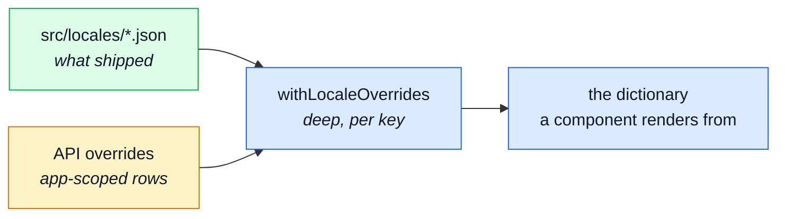

# Internationalisation

Three things decide what text a visitor sees: what this build **bundled**, what the API has been
**told** since, and what a person has **edited**. This page is how those three combine, and where
each one stops.

The paired backend has a page of the same name for its own half. The two are not the same
mechanism and are not meant to be — see [What this does not fetch](#what-this-does-not-fetch).

---

## Files are defaults, the database overrides them



`src/locales/<locale>.json` is what this build renders with **no network at all** — every key, in
the languages that shipped. The API stores overrides of those same keys, edited by people who never
open a code editor, and they are merged on top **per key**.

So a key nobody has touched keeps its bundled text, and a language nobody bundled arrives as
overrides alone and falls back per key for the rest. **A half-translated language is a usable state
here, not a broken one.**

::: warning Nothing in this tier may be load-bearing
Every function resolves rather than rejects, and the app is fully usable when all of them return
nothing — that is the offline floor the bundled files exist to be. A locale switch must never be
blocked by an API that is slow, old or absent.
:::

### The merge is deep, and that is the whole point

An override names one leaf — `generic.product`. A shallow assign would replace the entire `generic`
group with the one key that was edited, silently deleting the twenty nobody touched.

Anything that is not two objects is a leaf the override replaces, **arrays included**: a translated
list is edited whole or not at all, and merging two arrays by index would produce a sentence half
in each language.

Neither side is mutated. The base is the imported JSON module object, shared with every other
consumer of that import for the life of the page.

## Which languages exist

The list **starts as the folder** — what this build can render unaided — and is extended at boot by
whatever the API says it offers. A language added by a translator therefore appears in the switcher
without a frontend deploy.

There is deliberately **no environment list**. Naming a language in `.env` claimed it was supported
without supplying anything able to render it: the folder knows what shipped, the API knows what has
been translated since, and a third list could only disagree with both.

### Two scopes, and neither is checked against the other

The API's manifest marks each language `app`, `api`, or both:

| Scope | Means                                 | A language with only this                                                   |
| ----- | ------------------------------------- | --------------------------------------------------------------------------- |
| `app` | a dictionary can be downloaded for it | the interface translates; API messages arrive in the fallback               |
| `api` | the API can _answer_ in it            | the UI falls back per key, but every error message is in the right language |

Both belong in the switcher, and **neither is validated against the other**. This app can bundle
`it.json` while the API has no Italian at all. That inconsistency is a _human_ decision — someone
wanted the interface translated and did not care about the backend's half — so nothing here
prevents it or warns about it. If it is ever wrong, it is wrong in a way only a person can judge.

## Translating outside a component

`translate()` is a key lookup against the active locale that works outside any component's setup.
It exists for the Zod schemas in `src/modules/<domain>/schemas.ts`, where every validation message
is a **thunk**:

```ts
{
    error: () => translate('…');
}
```

Zod calls the thunk at **parse** time, so one module-scope schema speaks every language. It does
not re-translate an error already on screen — pass `{ revalidateOn: locale }` to the form
validation composable for that.

`tests/cross-cutting/schemas-i18n.spec.ts` asserts every one of those messages resolves to a real
key, so a form can never render a raw key at a user.

## What this does not fetch

**The API's own dictionary.** It resolves its own keys and puts finished text on the wire, so a
response already arrives translated and there is nothing for a client to look up.

Its overrides — the `api`-scoped rows — are layered onto its files _inside_ the API and never leave
it. A frontend that merged them would be adopting the backend's keyspace as its own, and both sides
declare a top-level `generic`. See [Layers](../theory/layers.md).

## Related pages

- [State & Routing](./state-and-routing.md) — the locale is in the URL, so switching it is a navigation
- [Admin Dashboard](./admin-dashboard.md) — the screens that edit the overrides
- [Modules](../theory/modules.md) — how a module contributes its own dictionary
