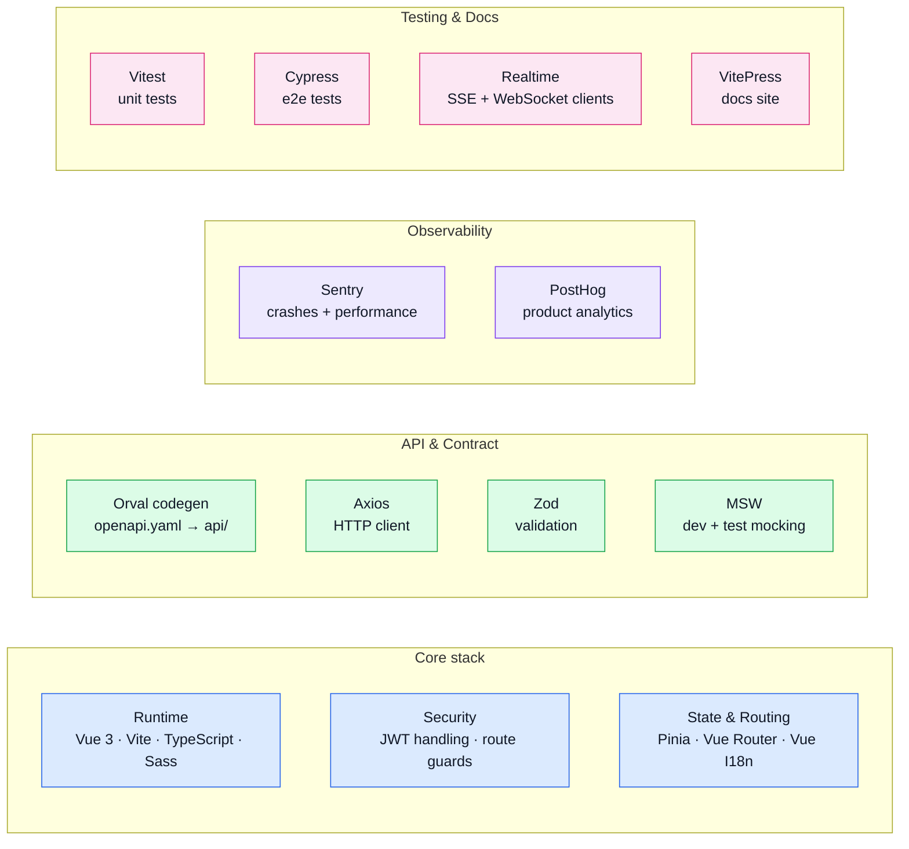

# Tools

This section explains **why dependencies exist** and where they fit in the app.

> OpenAPI-specific tools are documented in [API](../api/), not here.

## Tool map

## Read by intent

| Group | Page | What you'll find |
| ----- | ---- | ---------------- |
| Overview | **[Tools Explained](./tools-explained.md)** | "What is X and why is it here?" for every tool: plain-English definition, problem it solves, and how it's wired in this repo. |
| Setup | **[Runtime](./runtime.md)** | Vue 3, Vite, TypeScript, Sass, @vitejs/plugin-vue: the framework-level packages that make the app build and run. |
| Setup | **[Security](./security.md)** | How the FE handles JWT access tokens, refresh cookies, and route guards. |
| Setup | **[Package Dependencies](./package-dependencies.md)** | Guided tour of `package.json` grouped by concern. |
| Setup | **[Package Scripts](./package-scripts.md)** | What every `npm run <script>` does and when to reach for it. |
| Framework | **[State & Routing](./state-and-routing.md)** | Pinia stores, Vue Router locale routing and guards, Vue I18n setup. |
| Framework | **[Realtime](./websockets.md)** | FE SSE and WebSocket clients, `createSseClient`, `createChatClient`, realtime stores. |
| Observability | **[Observability](./observability.md)** | Sentry (errors + session replay) and PostHog (analytics + feature flags) wired into one Pinia store. |
| Observability | **[PostHog](./posthog.md)** | Product analytics events, feature flags, and the event taxonomy used in this repo. |
| Testing | **[Testing](./testing-and-docs.md)** | Vitest, @vue/test-utils, Cypress, and VitePress: how the repo tests itself and builds this docs site. |
| Testing | **[Mocking (MSW)](./mocking.md)** | MSW handler architecture, in-memory DB, how to add a handler, and Cypress integration. |
| API | **[API](../api/)** | Orval, Spectral, generated client, and contract-first workflow. |
