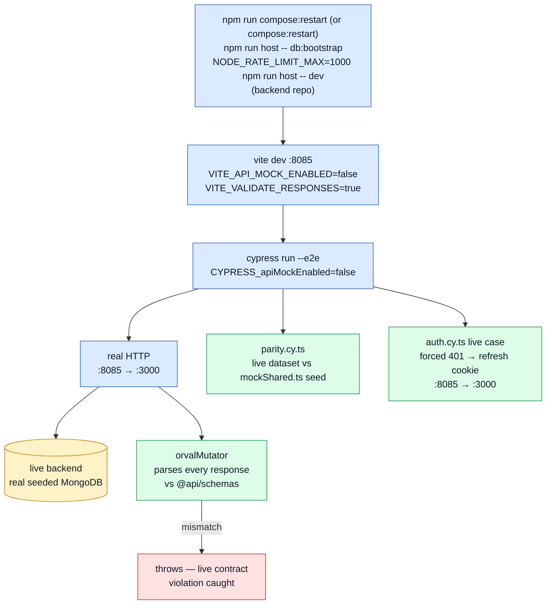

# Live E2E (FE ↔ real backend)

The fixed-seed mock profile ([Mocking](./mocking.md)) proves the frontend agrees with its own MSW handlers. It cannot prove those handlers agree with the real API — that gap is closed by running the same Cypress specs against a live, seeded backend instead. This page documents that profile: how to run it by hand, when CI runs it for you, and what guards it.

## Where it runs, and where it does not

Two places, and the difference matters when you are deciding whether a change has been covered:

- **Nightly in CI**, via `.github/workflows/e2e-live.yml` (03:15 UTC, plus `workflow_dispatch`). That job checks out both repos, starts Mongo and Redis as service containers, migrates and seeds, boots the backend and runs the whole suite against it.
- **By hand**, with the boot sequence below — which is the only option while your work is on a branch.

**Scheduled workflows only ever run on the default branch.** A `cron` trigger fires against `main` and nothing else, so a feature branch is *not* covered by the nightly run no matter how long it sits there: the first live exercise of a change on a branch happens after it merges, or when someone dispatches the workflow manually against that branch from the Actions tab.

That is the reason the live run is **mandatory before tagging either repo** rather than something to assume CI has handled.

## Why it is nightly rather than a merge gate

A cost decision, not a confidence one. This profile needs both repos, a Mongo, a Redis and a seeded database, so it is minutes where the mock profile is seconds. The mock suite stays the thing that blocks a merge; this is the thing that tells you the mock suite is still describing reality.

What carries the weight in between:

- **response validation** (`VITE_VALIDATE_RESPONSES`), which turns any live contract violation into a hard failure instead of something that only surfaces if an unrelated assertion happens to trip on it
- the **parity spec**, which turns a silent drift between the mock seed and the real seed into a failing test the first time this profile runs after the drift — not into a bug a user finds

## Architecture



## Boot sequence

```sh
# terminal 1 — backend
cd boilerplate-node-backend
npm run compose:restart   # or: npm run compose:restart
npm run host -- db:bootstrap

# terminal 2 — frontend
cd boilerplate-vue-frontend
npm run test:e2e:live
```

### Raise the backend's rate limits, or the suite fails halfway through

The backend ships `NODE_RATE_LIMIT_MAX=100` per minute per IP — sized for a person browsing. This suite is not a person: 85 specs drive real page loads, real logins and real uploads from one address, and `uploads.cy.ts` alone clears 100 requests a minute on its own. Past the budget the API answers **429**, the app bounces to `/login`, and the failure reads as "login is broken" rather than "we ran out of allowance". That is a genuinely expensive hour of debugging, because every assertion downstream fails for a reason unrelated to what it was testing.

Boot the backend with the same allowance its own test suites use (`tests/helpers/setup.ts` sets `1000`):

```sh
# terminal 1 — backend, for a live E2E run
NODE_RATE_LIMIT_MAX=1000 NODE_AUTH_RATE_LIMIT_MAX=1000 npm run host -- dev
```

Both are needed and they are separate buckets: the global one covers browsing, the auth one covers `POST /account/login` and its neighbours. Do not raise them in a deployed environment — the small credential budget is what makes password guessing expensive, and the two are deliberately decoupled so that widening one never widens the other (see `src/middlewares/security.ts` in the backend).

`host -- db:bootstrap` runs migrations and seeds against the containerized Mongo/Redis exposed on the host (`27017`/`6379`), matching the ports `host -- db:seed:reset` uses to reset state between specs. `test:e2e:live` itself starts Vite on `:8085` with `VITE_API_MOCK_ENABLED=false` and `VITE_VALIDATE_RESPONSES=true`, then runs Cypress against it with `CYPRESS_apiMockEnabled=false`.

Boot the backend first. Nothing here waits for it: with no backend listening on `VITE_API_URL` (default `http://localhost:3000`), every spec fails on a network error rather than on anything it was written to check.

Run `npm run check:spec-identity` alongside it when the pair has moved — a forked `seed-identities.ts` makes a live run fail on *data* rather than on behaviour, and that is a confusing hour if you are not expecting it.

## `BACKEND_PATH`

`cy.resetState()` shells out to the backend checkout for `host -- db:seed:reset` (see [Mocking](./mocking.md) and `tests/support/e2e/commands.ts`). Which checkout that is comes from `scripts/backendPath.ts`, which `cypress.config.ts` reads:

```sh
# default: a sibling checkout
../boilerplate-node-backend

# override for a different layout
BACKEND_PATH=/path/to/boilerplate-node-backend npm run test:e2e:live
```

The resolved value is always an absolute path, so `npm --prefix` errors name a real location instead of something relative to whatever `cwd` Cypress happened to have.

## Response validation

`orvalMutator` (`src/infrastructure/http/index.ts`) normally just unwraps `response.data`. Behind `VITE_VALIDATE_RESPONSES`, it additionally parses every response through the Zod schema matching its route (`src/infrastructure/http/responseSchemaMap.ts`, hand-mapped from `contracts/rest/index.ts`) and throws on a mismatch — the live-backend mirror of `assertMockContract` on the mock side, and of the backend's own `toSatisfyApiSpec()` contract tests.

- `test:e2e:live` sets it to `true` explicitly.
- Otherwise it defaults to on for an actual `vite dev` server (`DEV` true) — so it also fires during ordinary local development against a live API — but off inside Vitest (`MODE === 'test'`), where plenty of unit tests exercise `orvalMutator` against deliberately partial fixtures.
- A route with no entry in `responseSchemaMap.ts` logs a dev-only warning rather than throwing: a missing map entry means the map is stale, not that the response is wrong.

This is the single highest-value piece of this profile: it converts all five pre-existing specs into live contract tests for free, closing the exact bug class that has previously shipped (an `_id`/`id` mismatch, a leaked password field) unnoticed by a green suite.

## Mock/seed parity

`tests/e2e/specs/parity.cy.ts` runs only under this profile (`cy.skipUnlessLive()` — reported as *pending* under the mock profile, not silently omitted). After logging in via `cy.request`, it hits the live API directly as admin and as anonymous and asserts the returned dataset matches the hand-mirrored seed in `tests/support/mocks/mockShared.ts`: same product ids and visibility split, same user ids, same order ids and totals.

This mechanises the "DATA parity" and "BEHAVIOUR parity" invariants documented at the top of `mockShared.ts`, which were previously held by review only. If a future edit changes a seed id, count or total in one repo without the other, this is the test that fails — loudly, the first time this profile runs after the drift, rather than silently describing an API that no longer exists.

## Live session refresh

`tests/e2e/specs/auth.cy.ts` has one live-only case: it forces a single `401` on an otherwise-valid authenticated request and asserts the session survives. MSW is same-origin, in-page, and never exercises `withCredentials: true` carrying the refresh cookie across `:8085 → :3000` — this does, over a real network round-trip, without needing a test-only hook into Pinia state.

## File map

| Path | Contents |
| --- | --- |
| `scripts/backendPath.ts` | `resolveBackendPath()`, read by `cypress.config.ts` |
| `src/infrastructure/http/index.ts` | `orvalMutator`, `VITE_VALIDATE_RESPONSES` gate |
| `src/infrastructure/http/responseSchemaMap.ts` | Route → Zod schema table `orvalMutator` validates against |
| `tests/e2e/specs/parity.cy.ts` | Mock/seed parity, live profile only |
| `tests/e2e/specs/auth.cy.ts` | Live session-refresh case (alongside the mock-profile auth specs) |
| `tests/support/e2e/commands.ts` | `cy.resetState()`'s live branch, `cy.skipUnlessLive()` |
| `cypress.config.ts` | `env.backendPath`, `env.apiMockEnabled` |

## Related pages

- [Testing](./testing-and-docs.md) — suite overview
- [Unit Testing](./unit-testing.md) — `httpValidateResponses.spec.ts` unit-tests the gate this page's response validation relies on
- [Mocking (MSW)](./mocking.md) — the fixed-seed profile this one checks against
- [E2E — Random Profile](./e2e-random-profile.md) — the third Cypress profile
- [OpenAPI Workflow](../api/openapi-workflow.md)
