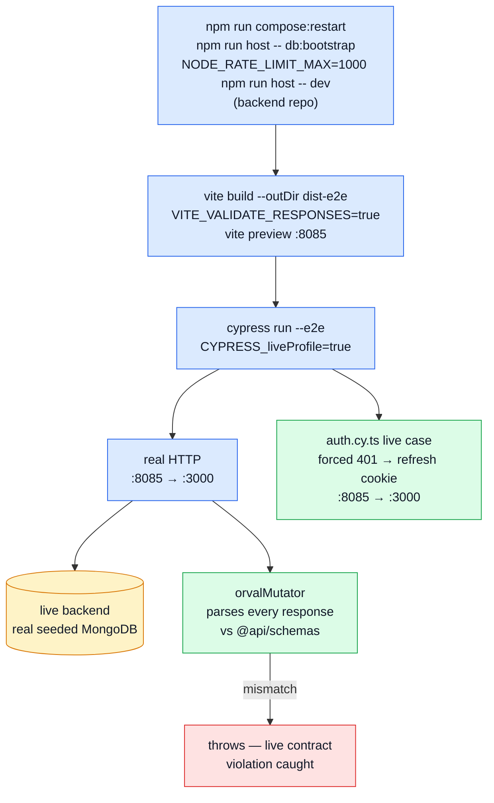

# Live E2E (FE ↔ real backend)

The demo profile ([The demo profile](./demo-profile.md)) runs the same API this one does, minus the infrastructure: in-memory Mongo, cache and queue disabled. What it cannot prove is full-stack behaviour — a real Redis, a real broker, a session cookie crossing a real network — and that gap is closed by running the same Cypress specs against the fully-composed backend instead.

**This is the full-stack profile.** Both profiles run the real application; this one runs it with everything attached. This page documents it: when CI runs it, how to run it by hand, and what guards it.

## Where it runs, and where it does not

Three places:

- **On every PR**, as the required `test-e2e-live` job in `.github/workflows/ci.yml`. That job delegates to `e2e-live.yml` through `workflow_call` rather than duplicating its setup — one definition of the datastores, the sibling checkout and the seeding, so the gate and the nightly cannot drift apart.
- **Nightly**, via `e2e-live.yml`'s own `cron` (03:15 UTC, plus `workflow_dispatch`). This answers a question no PR run can: does `main` still agree with the _backend's_ default branch? The backend moves on its own, so a frontend that was green yesterday can be wrong today without anyone touching it.
- **By hand**, with the boot sequence below.

**Scheduled workflows only ever run on the default branch.** A `cron` trigger fires against `main` and nothing else — but that no longer leaves a branch uncovered, because the PR gate runs the same job against the branch.

## Why it gates rather than merely reports

Because cache- and queue-enabled behaviour is real behaviour: an invalidation bug or a queue-path regression is invisible to a profile that runs both `disabled`. The demo suite fails fast on ordinary regressions; this one is where the full stack answers.

It costs what it costs: this profile needs both repos, a Mongo, a Redis and a seeded database, so it is minutes where the demo profile is seconds-per-boot. The demo suite still runs first and still fails fast on ordinary regressions; this is the one that also exercises the infrastructure.

What carries the weight in between:

- **response validation** (`VITE_VALIDATE_RESPONSES`), which turns any live contract violation into a hard failure instead of something that only surfaces if an unrelated assertion happens to trip on it
- the **specs themselves**, which run unchanged against the real API: a handler that has drifted from the service it mirrors fails here, on the PR that introduced it

## Architecture



## Boot sequence

```sh
# terminal 1 — backend
cd boilerplate-node-backend
npm run compose:restart
npm run host -- db:bootstrap

# terminal 2 — frontend
cd boilerplate-vue-frontend
npm run test:e2e:live
```

### Raise the backend's rate limits, or the suite fails halfway through

The backend ships `NODE_RATE_LIMIT_MAX=100` per minute per IP — sized for a person browsing. This suite is not a person: 85 specs drive real page loads, real logins and real uploads from one address, and `uploads.cy.ts` alone clears 100 requests a minute on its own. Past the budget the API answers **429**, the app bounces to `/login`, and the failure reads as "login is broken" rather than "we ran out of allowance". That is a genuinely expensive hour of debugging, because every assertion downstream fails for a reason unrelated to what it was testing.

Boot the backend with the same allowance its own test suites use (`tests/support/setup.ts` sets `1000`):

```sh
# terminal 1 — backend, for a live E2E run
NODE_RATE_LIMIT_MAX=1000 NODE_AUTH_RATE_LIMIT_MAX=1000 NODE_AUTH_RATE_LIMIT_ADDRESS_MAX=1000 npm run host -- dev
```

All three are needed and they are separate buckets: the global one covers browsing, and the credential budget is itself a pair — one per account named, one per address calling — so raising only the first just moves which of them the suite trips over. Only FAILED credential attempts spend the credential budgets, which is why a suite that signs in correctly on every spec still gets through. Do not raise them in a deployed environment — the small credential budget is what makes password guessing expensive, and the two are deliberately decoupled so that widening one never widens the other (see `src/infrastructure/http/middlewares/security.ts` in the backend).

### Why `test:e2e:live` runs on Chromium, not Cypress' default Electron

`uploads.cy.ts`'s upload-and-wait-for-the-server-image cases (`Product edit`, `Product create`,
`User create`, `Signup`, `Live backend`) crash the bundled Electron browser outright on at least one
Linux host — a deterministic `trap invalid opcode` in the Electron binary itself (confirmed by
running the spec alone, repeatedly, at the identical offset every time), not a timeout, a memory
leak, or anything in this app's own code. Real Chromium runs the same interaction without crashing.
`--browser chromium` is scoped to this one script: the demo-profile suites do not hit it (the demo
backend's upload response is faster/smaller) and stay on Electron.

### Point the backend at Umami, or the analytics spec fails with Umami running

`compose:restart` starts Umami on `:3080`, and the frontend's tracker finds it on its own — `VITE_UMAMI_SRC` and `VITE_UMAMI_WEBSITE_ID` in `.env-example` already name it. The **backend** is the half that does not: `NODE_UMAMI_*` is commented out there, because the compose stack sets it on the `app` service, and `npm run host` runs the backend outside that service. So a backend booted the way this page describes emits nothing, logs `Analytics provider is 'umami' but ... events are being discarded`, and carries on.

That failure is quiet in the worst way. `analytics.cy.ts` asserts that ONE add-to-cart writes ONE row, and with the backend silent the frontend's own row is still written — one row, spec green, for exactly the wrong reason. Its control assertion catches the mirror case (a silent _frontend_) but nothing catches a silent backend except knowing to set these:

```sh
# terminal 1 — backend, for a live E2E run (with the rate limits above)
NODE_ANALYTICS_PROVIDER=umami \
NODE_UMAMI_INGEST_HOST=http://localhost:3080 \
NODE_UMAMI_WEBSITE_ID=00000000-0000-4000-8000-000000000001 \
npm run host -- dev
```

`INGEST_HOST` is `localhost:3080` and not the compose stack's `http://umami:3000`: that hostname resolves only from inside the job network, and `host` puts the process outside it. The website id is the fixed UUID `umami-init` stamps, and it must match the frontend's — both trackers writing into **one** website is the arrangement `analytics.cy.ts` exists to police, not an accident to tidy up.

The `test-e2e-live` CI job sets all of this itself, including the two `VITE_UMAMI_*` build variables, since a runner has no `.env`.

`host -- db:bootstrap` runs migrations and seeds against the containerized Mongo/Redis exposed on the host (`27017`/`6379`), matching the ports `host -- db:seed:reset` uses to reset state between specs. `test:e2e:live` itself builds the bundle with `VITE_VALIDATE_RESPONSES=true`, serves it on `:8085` with `vite preview`, then runs Cypress against it with `CYPRESS_liveProfile=true`.

Boot the backend first. Nothing here waits for it: with no backend listening on `VITE_API_URL` (default `http://localhost:3000`), every spec fails on a network error rather than on anything it was written to check.

Run `npm run check:spec-identity` alongside it when the pair has moved — a forked contract makes a live run fail on _shape_ rather than on behaviour, and that is a confusing hour if you are not expecting it. It compares the two contract bundles only; the demo dataset is not among them (see below).

## `BACKEND_PATH`

`cy.resetState()` shells out to the backend checkout for `host -- db:seed:reset` (under the demo profile it POSTs the backend's in-process `/__demo/reset` instead — see `tests/support/e2e/commands.ts`). Which checkout that is comes from `scripts/paired-backend-path.ts`, which `cypress.config.ts` reads:

```sh
# default: a sibling checkout
../boilerplate-node-backend

# override for a different layout
BACKEND_PATH=/path/to/boilerplate-node-backend npm run test:e2e:live
```

The resolved value is always an absolute path, so `npm --prefix` errors name a real location instead of something relative to whatever `cwd` Cypress happened to have.

## Response validation

`orvalMutator` (`src/infrastructure/http/index.ts`) normally just unwraps `response.data`. Behind `VITE_VALIDATE_RESPONSES`, it additionally parses every response through the Zod schema matching its route (`src/infrastructure/http/response-schema-map.ts`, hand-mapped from `contracts/rest/index.ts`) and throws on a mismatch — the client-side mirror of the backend's own `toSatisfyApiSpec()` contract tests.

- `build:e2e` bakes it to `true`, so every e2e profile carries it.
- Otherwise it defaults to on (`MODE !== 'test'`) — so it also fires during ordinary local development against a live API — but off inside Vitest, where plenty of unit tests exercise `orvalMutator` against deliberately partial fixtures.
- A route with no entry in `response-schema-map.ts` logs a dev-only warning rather than throwing: a missing map entry means the map is stale, not that the response is wrong.

This is the single highest-value piece of this profile: it converts all five pre-existing specs into live contract tests for free, closing the exact bug class that has previously shipped (an `_id`/`id` mismatch, a leaked password field) unnoticed by a green suite.

## Where seed drift is caught

Not here, and not in a copy either. The demo dataset is published by the backend's `npm run seed:export` and stays there: it is not in `SHARED_FILES`, so nothing copies it over and `check:spec-identity` never compares it. This repo reads the backend's seeded database through the API like any client, and the login credentials the suites type are their own — `tests/support/e2e/accounts.ts`, which any paired backend must honour. Whether the _database a deployment actually builds_ matches the published dataset is a property of the backend's migrations, and the backend asserts it directly in `tests/unit/db/migration-demo-data.test.ts` — seeding and migrating one database in both orders and comparing the result to the published artefact.

That check used to live here, as a Cypress spec pinning seeded ids by hand. It ran in the slowest harness available, in the repo that cannot fix a migration, and it went stale the first time the backend added a product.

## Live session refresh

`src/modules/account/tests/e2e/auth.cy.ts` has one live-only case: it forces a single `401` on an otherwise-valid authenticated request and asserts the session survives. It runs here rather than in the demo suite for history's sake more than necessity — both profiles now cross `:8085 → :3000` over a real network — and stays live-only so the case also covers the fully-composed stack.

## File map

| Path                                             | Contents                                                          |
| ------------------------------------------------ | ----------------------------------------------------------------- |
| `scripts/paired-backend-path.ts`                 | `resolveBackendPath()`, read by `cypress.config.ts`               |
| `src/infrastructure/http/index.ts`               | `orvalMutator`, `VITE_VALIDATE_RESPONSES` gate                    |
| `src/infrastructure/http/response-schema-map.ts` | Route → Zod schema table `orvalMutator` validates against         |
| `src/modules/account/tests/e2e/auth.cy.ts`       | Live session-refresh case (alongside the demo-profile auth specs) |
| `tests/support/e2e/commands.ts`                  | `cy.resetState()`'s live branch, `cy.skipUnlessLive()`            |
| `cypress.config.ts`                              | `env.backendPath`, `env.liveProfile`, `env.apiUrl`                |

## Related pages

- [Testing](./testing-and-docs.md) — suite overview
- [Unit Testing](./unit-testing.md) — `http-validate-responses.spec.ts` unit-tests the gate this page's response validation relies on
- [The demo profile](./demo-profile.md) — the fast profile this one complements
- [OpenAPI Workflow](../api/openapi-workflow.md)
