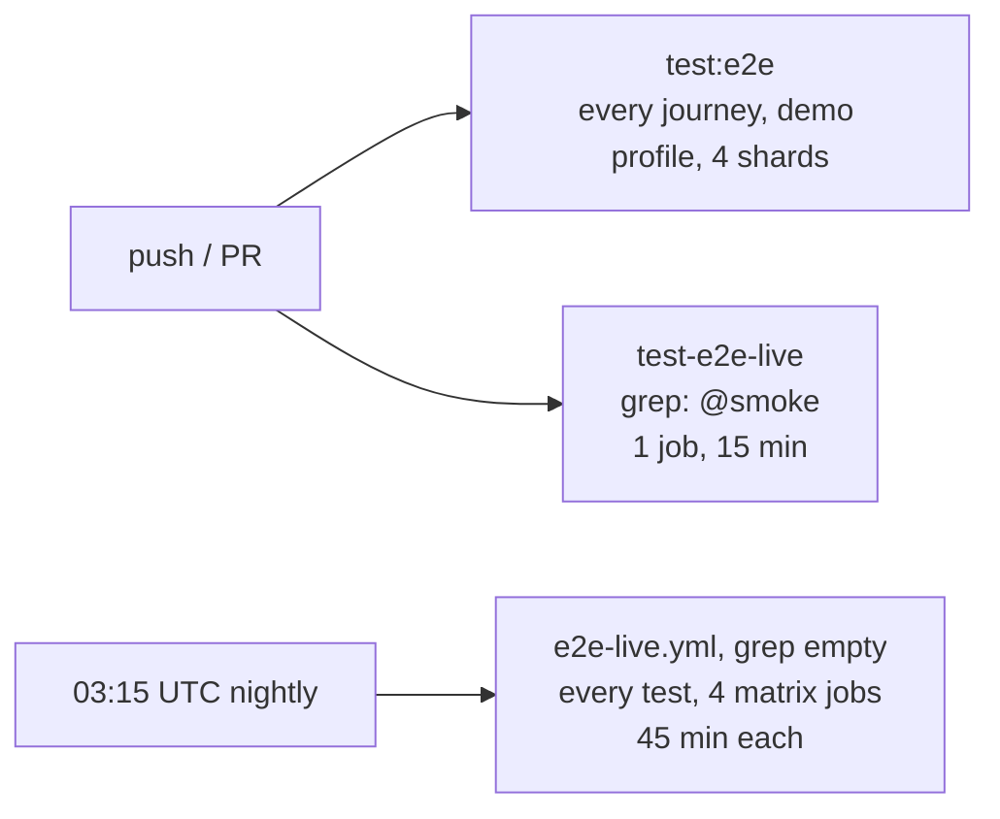
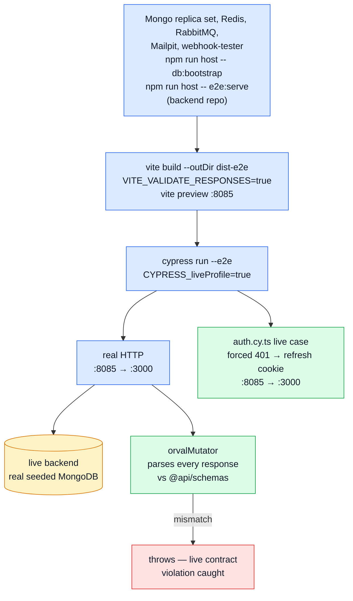

# Live E2E (FE ↔ real backend)

The demo profile ([The demo profile](./demo-profile.md)) runs the same API this one does, minus the infrastructure: in-memory Mongo, cache and queue disabled. What it cannot prove is full-stack behaviour — a real Redis, a real broker, a session cookie crossing a real network — and that gap is closed by running the same Cypress specs against the fully-composed backend instead.

**This is the full-stack profile.** Both profiles run the real application; this one runs it with everything attached. This page documents it: when CI runs it, how to run it by hand, and what guards it.

## Where it runs, and where it does not

Two tiers and a hand run, all through the same `e2e-live.yml`:

- **Every push: a `@smoke` subset.** The `test-e2e-live` job in `.github/workflows/ci.yml` calls `e2e-live.yml` through `workflow_call` with `grep: '@smoke'`: one job, only the tests tagged `@smoke`, a 15-minute budget. It is a required job of the `ci` aggregate, so it gates. Every journey also runs on every push in the demo profile (`test:e2e`), so breadth costs nightly minutes, not push time.
- **Nightly: everything.** `e2e-live.yml`'s own `cron` (03:15 UTC), or a manual run with an empty `grep`, runs every test, split into a matrix of jobs (see [Tiers](#tiers)). It reports; it does not block a push. It also answers a question no push can: does `main` still agree with the _backend's_ default branch? The backend moves on its own, so a frontend that was green yesterday can be wrong today without anyone touching it.
- **By hand**, with [the recipe](#the-recipe) below. It is the same recipe: `e2e-live.yml` is this page, service for service and variable for variable, so change one and change the other.

Both tiers share one definition of the services, the sibling checkout and the seeding, so they cannot drift apart. **Scheduled workflows only ever run on the default branch**: a `cron` fires against `main` and nothing else.

## Tiers


```mermaid
flowchart LR
    Push["push / PR"] --> Demo["test:e2e\nevery journey, demo profile, 4 shards"]
    Push --> Smoke["test-e2e-live\ngrep: @smoke\n1 job, 15 min"]
    Cron["03:15 UTC nightly"] --> Full["e2e-live.yml, grep empty\nevery test, 4 matrix jobs\n45 min each"]
```

A test joins the smoke tier by carrying the tag; a test with no tag runs nightly:

```ts
it('a customer buys a product', { tags: '@smoke' }, () => { … });
describe('Checkout', { tags: '@smoke' }, () => { … }); // every test inside
```

Tags come from [`@cypress/grep`](https://github.com/cypress-io/cypress/tree/develop/npm/grep), registered in `tests/support/e2e/e2e.ts` and `cypress.config.ts`. Tags, not file names: `@smoke` works in any file layout and keeps each spec's recorded run time. The catalogue in [Tests](../reference/tests.md#the-journey-catalogue) says which tier each journey is in.

| Tier     | Runs               | Grep     | Jobs                                | Budget per job |
| -------- | ------------------ | -------- | ----------------------------------- | -------------- |
| Per push | the `@smoke` tests | `@smoke` | 1                                   | 15 min         |
| Nightly  | every test         | empty    | 4 (`LIVE_SHARDS` in the `plan` job) | 45 min         |

- **The `grep` input** (`workflow_call` and `workflow_dispatch`) takes any `@cypress/grep` expression: space is OR, `+` is AND, `-` is NOT. Run `grep: '@smoke'` by hand from the Actions tab to reproduce the push tier. It reaches Cypress as `E2E_GREP_TAGS`, which `cypress.config.ts` puts in `expose.grepTags`. (v7 reads `expose`, not `env`: a `CYPRESS_grepTags` variable is silently ignored.)
- **The matrix.** Live specs share one seeded Mongo and reset it between specs, so slices cannot share a database: each matrix job has its own services and runs its slice sequentially. `scripts/e2e/print-live-shard.ts <i> <n>` prints slice `i` of `n` as a `--spec` value, balanced by recorded duration like the demo shards, and `npm run test:e2e:live:spec` runs it (`E2E_SPEC=<specs>`). Between them the slices cover the suite exactly once. Raise `LIVE_SHARDS` as journeys are added; the full run is ~85-115 min sequential.
- **An empty tier warns, it does not fail.** If no spec carries the tag, the run ends with a warning annotation ("No spec carries @smoke") rather than Cypress's "no spec files were found". Until the first `@smoke` journey lands, the push tier therefore runs nothing: it is green and says so.
- **By hand**, `E2E_GREP_TAGS=@smoke npm run test:e2e:live` runs the smoke tier locally.

## Why the push tier is only a subset

A full live run is minutes to hours, not seconds, and live CI must stay a signal people read. So the push tier is the smallest set that answers "does the real infrastructure work" — a real Mongo replica set, Redis, a real broker, a cookie over a real network — and the nightly is the full sweep. The price: a live-only break outside `@smoke` shows up the next morning, not on the push. Everything else is covered on the push by the demo run, which already runs every journey.

What carries the weight for the infrastructure the demo profile lacks:

- **response validation** (`VITE_VALIDATE_RESPONSES`), which turns any live contract violation into a hard failure instead of something that only surfaces if an unrelated assertion happens to trip on it
- the **specs themselves**, which run unchanged against the real API: a handler that has drifted from the service it mirrors fails here, on the push that introduced it (when the test is `@smoke`) or the next morning

## Architecture


```mermaid
%%{init: {'flowchart': {'nodeSpacing': 50, 'rankSpacing': 65}}}%%
flowchart TB
    Boot["Mongo replica set, Redis, RabbitMQ,\nMailpit, webhook-tester\nnpm run host -- db:bootstrap\nnpm run host -- e2e:serve\n(backend repo)"] --> Vite["vite build --outDir dist-e2e\nVITE_VALIDATE_RESPONSES=true\nvite preview :8085"]
    Vite --> Cypress["cypress run --e2e\nCYPRESS_liveProfile=true"]
    Cypress --> Real["real HTTP\n:8085 → :3000"]
    Real --> Backend[("live backend\nreal seeded MongoDB")]
    Real --> Mutator["orvalMutator\nparses every response\nvs @api/schemas"]
    Mutator -->|mismatch| Fail["throws — live contract\nviolation caught"]
    Cypress --> Refresh["auth.cy.ts live case\nforced 401 → refresh cookie\n:8085 → :3000"]

    classDef step fill:#dbeafe,stroke:#2563eb,color:#111827;
    classDef check fill:#dcfce7,stroke:#16a34a,color:#111827;
    classDef fail fill:#fee2e2,stroke:#dc2626,color:#111827;
    classDef data fill:#fef3c7,stroke:#d97706,color:#111827;
    class Boot,Vite,Cypress,Real step;
    class Mutator,Parity,Refresh check;
    class Fail fail;
    class Backend data;
```

## The recipe

One recipe, for CI and for a person. The backend needs five things around it, and a live run is
one lane at a time: every run binds the same ports (27017, 6379, 5672, 1025/8025, 3070, 3000).

### 1. Services

Plain `docker run` (or `podman run`) is enough; nothing needs compose.

```sh
# Mongo must be a REPLICA SET: the backend runs transactions, a standalone mongod refuses them.
# The member host must be 127.0.0.1.
docker run -d --name e2e-mongo -p 27017:27017 mongo:8 --replSet rs0 --bind_ip_all
docker exec e2e-mongo mongosh --eval 'rs.initiate({_id:"rs0",members:[{_id:0,host:"127.0.0.1:27017"}]})'

docker run -d --name e2e-redis -p 6379:6379 redis:8
docker run -d --name e2e-rabbit -p 5672:5672 rabbitmq:4-management

# Mail: an SMTP catcher with an HTTP API. cy.emailTo() reads it; cy.restore() empties it.
docker run -d --name e2e-mailpit -p 1025:1025 -p 8025:8025 \
  -e MP_SMTP_AUTH_ACCEPT_ANY=true -e MP_SMTP_AUTH_ALLOW_INSECURE=true axllent/mailpit

# Webhooks land here; the specs read it to check the delivery and its signature.
docker run -d --name e2e-webhooks -p 3070:8080 \
  -e AUTO_CREATE_SESSIONS=true -e STORAGE_DRIVER=memory \
  ghcr.io/tarampampam/webhook-tester:2.3.0
```

`analytics.cy.ts` also needs Umami and its Postgres (see [below](#point-the-backend-at-umami-or-the-analytics-spec-fails-with-umami-running)). Without them that one spec fails; the rest do not need it.

### 2. Backend

The backend repo's compose file carries the same services under `--profile integrations`, if you have compose.

```sh
cd boilerplate-node-backend

# What the backend needs to boot without a .env; throwaway values.
export NODE_ENV=development            # the seeder's public demo passwords, and the webhook sink, need it
export NODE_CLUSTER_WORKERS=1          # else one worker per core, all fighting over port 3000
export NODE_PSEUDONYM_KEY=any-throwaway-value
export NODE_RABBITMQ_HOST=127.0.0.1    # `host` sets the database and Redis, not the broker
export NODE_FRONTEND_URL=http://localhost:8085
export NODE_WEBHOOK_DEMO_SINK_URL=http://127.0.0.1:3070   # the literal IP: the SSRF guard's DNS lookup skips /etc/hosts

# Mail into Mailpit. `e2e:serve` refuses any SMTP host but localhost, 127.0.0.1, ::1 or mailpit,
# so a live run cannot send real mail. NODE_MAIL_TRANSPORT=log sends nothing at all, but then
# no mailed link or code can be read back.
export NODE_MAIL_TRANSPORT=smtp NODE_SMTP_HOST=127.0.0.1 NODE_SMTP_PORT=1025 \
       NODE_SMTP_USER=e2e NODE_SMTP_PASS=e2e NODE_SMTP_SENDER='E2E <noreply@example.com>'

# Volume budgets only (see below). Payments, invoicing and returns keep their defaults.
export NODE_RATE_LIMIT_MAX=100000 NODE_AUTH_RATE_LIMIT_MAX=1000 NODE_AUTH_RATE_LIMIT_ADDRESS_MAX=1000 \
       NODE_SIGNUP_RATE_LIMIT_MAX=1000 NODE_RESET_RATE_LIMIT_MAX=1000

npm run host -- db:bootstrap    # migrate + seed
npm run host -- e2e:serve       # the backend, marked as an e2e run
```

`host` is a PREFIX runner: it points the database and Redis at 127.0.0.1 and runs whatever `npm run` script follows the `--`. Nothing waits for the backend: with none listening on `VITE_API_URL` (default `http://localhost:3000`), every spec fails on a network error rather than on anything it was written to check.

### 3. Frontend

```sh
cd boilerplate-vue-frontend
MAILPIT_URL=http://localhost:8025 npm run test:e2e:live
```

Between specs `cy.restore()` runs `LIVE_RESET_COMMAND` (see [`BACKEND_PATH`](#backend_path)), which reseeds through the backend checkout. It needs the same `NODE_ENV`, `NODE_PSEUDONYM_KEY` and encryption keys as the running backend, so export them in this shell too; CI puts them on the command itself.

With no `MAILPIT_URL`, the mail-driven specs report as skipped (`cy.skipUnlessMailbox()`) rather than failing. `test:e2e:live` builds the bundle with `VITE_VALIDATE_RESPONSES=true`, serves it on `:8085` with `vite preview`, then runs Cypress against it with `CYPRESS_liveProfile=true`.

Run `npm run check:spec-identity` alongside it when the pair has moved — a forked contract makes a live run fail on _shape_ rather than on behaviour, and that is a confusing hour if you are not expecting it. It compares the two contract bundles only; the demo dataset is not among them (see below).

### Raise the volume budgets, or the suite fails halfway through

The backend ships `NODE_RATE_LIMIT_MAX=100` per minute per IP — sized for a person browsing. This suite is not a person: 85 specs drive real page loads, real logins and real uploads from one address, and `uploads.cy.ts` alone clears 100 requests a minute on its own. Past the budget the API answers **429**, the app bounces to `/login`, and the failure reads as "login is broken" rather than "we ran out of allowance". That is a genuinely expensive hour of debugging, because every assertion downstream fails for a reason unrelated to what it was testing.

The recipe raises exactly the volume buckets: the global one (`100000` — `1000` a minute still gave 429s on login), the credential pair (per account named, per address calling), signup and password reset. They are separate buckets, so raising only the first just moves which of them the suite trips over. Only FAILED credential attempts spend the credential budgets, which is why a suite that signs in correctly on every spec still gets through. Payments, invoicing and returns stay at their defaults. Do not raise any of these in a deployed environment — the small credential budget is what makes password guessing expensive, and the buckets are deliberately decoupled so that widening one never widens the other (see `boilerplate-node-backend/src/infrastructure/http/middlewares/rate-limit.ts`).

The variables go in front of `compose:restart` when the backend runs in its container — they are declared in `docker-compose.yml` precisely so a run can raise them from the shell.

This covers the BROWSER's traffic only. `cy.restore()` is several hundred API requests of its own now that the backend builds its demo shop by driving it, and those are deliberately kept off these buckets entirely: the seeder counts in its own memory rather than the deployment's Redis, so it neither spends a real visitor's allowance nor inherits what one already spent. See `boilerplate-node-backend/scenarios/rate-limits.ts`.

### Why `test:e2e:live` runs on Chromium, not Cypress' default Electron

`uploads.cy.ts`'s upload-and-wait-for-the-server-image cases (`Product edit`, `Product create`,
`User create`, `Signup`, `Live backend`) crash the bundled Electron browser outright on at least one
Linux host — a deterministic `trap invalid opcode` in the Electron binary itself (confirmed by
running the spec alone, repeatedly, at the identical offset every time), not a timeout, a memory
leak, or anything in this app's own code. Real Chromium runs the same interaction without crashing.
`--browser chromium` is scoped to this one script: the demo-profile suites do not hit it (the demo
backend's upload response is faster/smaller) and stay on Electron.

### Point the backend at Umami, or the analytics spec fails with Umami running

`compose:restart` starts Umami on `:3080`, and the frontend's tracker finds it on its own — `VITE_UMAMI_SRC` and `VITE_UMAMI_WEBSITE_ID` in `.env-example` already name it. The **backend** is the half that does not: `NODE_UMAMI_*` is commented out there, because the compose stack sets it on the `app` service, and `npm run host` runs the backend outside that service. So a backend booted the way the recipe above describes emits nothing, logs `Analytics provider is 'umami' but ... events are being discarded`, and carries on.

That failure is quiet in the worst way. `analytics.cy.ts` asserts that ONE add-to-cart writes ONE row, and with the backend silent the frontend's own row is still written — one row, spec green, for exactly the wrong reason. Its control assertion catches the mirror case (a silent _frontend_) but nothing catches a silent backend except knowing to set these, in step 2:

```sh
export NODE_ANALYTICS_PROVIDER=umami \
       NODE_UMAMI_INGEST_HOST=http://localhost:3080 NODE_UMAMI_HOST=http://localhost:3080 \
       NODE_UMAMI_WEBSITE_ID=00000000-0000-4000-8000-000000000001
```

`INGEST_HOST` is `localhost:3080` and not the compose stack's `http://umami:3000`: that hostname resolves only from inside the job network, and `host` puts the process outside it. The website id is the fixed UUID `umami-init` stamps, and it must match the frontend's — both trackers writing into **one** website is the arrangement `analytics.cy.ts` exists to police, not an accident to tidy up.

The `test-e2e-live` CI job sets all of this itself, including the two `VITE_UMAMI_*` build variables, since a runner has no `.env`.

## `BACKEND_PATH`

`cy.restore()` shells out to the backend checkout for `host -- scenario:apply:reset` (under the demo profile it POSTs the backend's in-process `/__test/restore` instead — see `tests/support/e2e/commands.ts`). The live command also carries `--describe-to={describeTo}`: a live deployment mounts no `/__test/scenario`, so the reset writes the accounts and subject ids to a file that `tests/support/e2e/scenario.ts` reads back. Without `LIVE_RESET_COMMAND` there is no reset and no description, and a spec asking for either says so. The command's `{scenario}` placeholder is where `cy.restore('name')` puts the scenario name (empty for a plain `cy.restore()`, so the backend's default `shop`). Naming a scenario against a command with no placeholder throws, rather than quietly reseeding `shop`. Which checkout that is comes from `scripts/pairing/paired-backend-path.ts`, which `cypress.config.ts` reads:

```sh
# default: a sibling checkout
../boilerplate-node-backend

# override for a different layout
BACKEND_PATH=/path/to/boilerplate-node-backend npm run test:e2e:live
```

The resolved value is always an absolute path, so `npm --prefix` errors name a real location instead of something relative to whatever `cwd` Cypress happened to have.

## Response validation

`orvalMutator` (`src/infrastructure/http/index.ts`) normally just unwraps `response.data`. Behind `VITE_VALIDATE_RESPONSES`, it additionally parses every response through the Zod schema matching its route (`src/infrastructure/http/response-schema-map.ts`, hand-mapped from `contracts/rest/index.ts`) and throws on a mismatch — the client-side mirror of the backend's own `toSatisfyApiSpec()` contract tests.

- `build:e2e` bakes it to `true`, so every e2e profile carries it.
- Otherwise it defaults to on (`MODE !== 'test'`) — so it also fires during ordinary local development against a live API — but off inside Vitest, where plenty of unit tests exercise `orvalMutator` against deliberately partial fixtures.
- A route with no entry in `response-schema-map.ts` logs a dev-only warning rather than throwing: a missing map entry means the map is stale, not that the response is wrong.

This is the single highest-value piece of this profile: it converts all five pre-existing specs into live contract tests for free, closing the exact bug class that has previously shipped (an `_id`/`id` mismatch, a leaked password field) unnoticed by a green suite.

## Where seed drift is caught

Not here, and not in a copy either. The demo dataset lives in the backend's `scenarios/` and stays there: nothing in it is in `SHARED_FILES`, so nothing copies it over and `check:spec-identity` never compares it. This repo reads the backend's seeded database through the API like any client, and it no longer keeps a copy of the credentials either: the backend publishes them, along with a row id per guarantee name, and `tests/support/e2e/scenario.ts` asks. Whether those rows still hold what the specs lean on is a property of the backend's scenarios, and the backend asserts it in its own test suite: each module declares the guarantees its scenario makes, and `boilerplate-node-backend/scenarios/check.ts` fails the suite when a built scenario stops offering one.

That check used to live here, as a Cypress spec pinning seeded ids by hand. It ran in the slowest harness available, in the repo that cannot fix a migration, and it went stale the first time the backend added a product.

## Live session refresh

`src/modules/account/tests/e2e/auth.cy.ts` has one live-only case: it forces a single `401` on an otherwise-valid authenticated request and asserts the session survives. It runs here rather than in the demo suite for history's sake more than necessity — both profiles now cross `:8085 → :3000` over a real network — and stays live-only so the case also covers the fully-composed stack.

## File map

| Path                                             | Contents                                                            |
| ------------------------------------------------ | ------------------------------------------------------------------- |
| `scripts/pairing/paired-backend-path.ts`         | `resolveBackendPath()`, read by `cypress.config.ts`                 |
| `src/infrastructure/http/index.ts`               | `orvalMutator`, `VITE_VALIDATE_RESPONSES` gate                      |
| `src/infrastructure/http/response-schema-map.ts` | Route → Zod schema table `orvalMutator` validates against           |
| `src/modules/account/tests/e2e/auth.cy.ts`       | Live session-refresh case (alongside the demo-profile auth specs)   |
| `tests/support/e2e/commands.ts`                  | `cy.restore()`'s live branch, `cy.skipUnlessLive()`, `cy.emailTo()` |
| `scripts/e2e/mail-message.ts`                    | A Mailpit message read back into the outbox's shape                 |
| `tests/support/e2e/scenario.ts`                  | the accounts and subject ids, from the route or the described file  |
| `cypress.config.ts`                              | `env.backendPath`, `env.liveProfile`, `env.apiUrl`                  |

## Related pages

- [Testing](./testing-and-docs.md) — suite overview
- [Unit Testing](./unit-testing.md) — `http-validate-responses.spec.ts` unit-tests the gate this page's response validation relies on
- [The demo profile](./demo-profile.md) — the fast profile this one complements
- [OpenAPI Workflow](../api/openapi-workflow.md)
