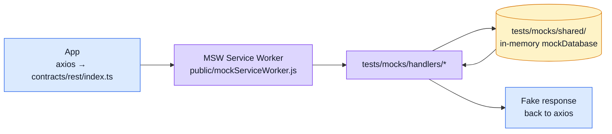

# Mocking (MSW)

[MSW (Mock Service Worker)](https://mswjs.io/) intercepts HTTP requests at the network layer — inside the browser's Service Worker, before they reach the network — so the SPA runs without a backend while using the real axios client and real stores.

## When mocking activates

Controlled by a single env var:

```dotenv
VITE_API_MOCK_ENABLED=true
```

When `true`, `src/main.ts` starts the MSW Service Worker before mounting the app. All axios requests are intercepted; nothing reaches the network.

Cypress e2e tests always run with `VITE_API_MOCK_ENABLED=true` for deterministic results.

## Architecture



## File map

| File | Purpose |
| ---- | ------- |
| `public/mockServiceWorker.js` | MSW service worker (generated by `msw init` — do not edit) |
| `tests/mocks/generated.ts` | Orval-generated stubs + `@faker-js/faker` factories (do not edit by hand) |
| `tests/mocks/handlers/` | Hand-written handlers with in-memory DB logic |
| `tests/mocks/shared/` | Shared in-memory DB (users, products, orders, etc.) |
| `src/main.ts` | Conditionally starts MSW before Vue mounts |

## Handler structure

Orval generates a stub for every operation in `openapi.yaml` into `tests/mocks/generated.ts`. Each stub returns random faker data.

For richer behavior (stateful CRUD, auth, pagination), copy the stub into `tests/mocks/handlers/` and add business logic against the shared in-memory DB:

```ts
// tests/mocks/handlers/productsMockHandlers.ts
import { http, HttpResponse } from 'msw';
import { mockDatabase } from '../shared/mockDatabase';

export const productsMockHandlers = [
    http.get('/products', () => {
        return HttpResponse.json({ data: mockDatabase.products });
    }),
    http.post('/products', async ({ request }) => {
        const body = await request.json();
        const product = { id: crypto.randomUUID(), ...body };
        mockDatabase.products.push(product);
        return HttpResponse.json({ data: product }, { status: 201 });
    }),
];
```

## Adding a new handler

1. Check `tests/mocks/generated.ts` for the auto-generated stub.
2. Copy the stub to the relevant handler file in `tests/mocks/handlers/`.
3. Replace the faker response with in-memory DB logic as needed.
4. Export the new handler from `tests/mocks/handlers/index.ts`.

Do not edit `generated.ts` — it is overwritten by `npm run genapi`.

## Cypress integration

`npm run test:e2e` runs `start-server-and-test` which:
1. Starts Vite with `VITE_API_MOCK_ENABLED=true`.
2. Waits for `:8080` to be ready.
3. Runs `cypress run`.

This means e2e specs interact with the full Vue app + MSW handlers, with no real network calls.

## External references

- [MSW browser integration](https://mswjs.io/docs/integrations/browser)
- [MSW handler API](https://mswjs.io/docs/api/http)
- [faker.js guide](https://fakerjs.dev/guide/)

## Related pages

- [Testing](./testing-and-docs.md)
- [OpenAPI Workflow](../api/openapi-workflow.md)
