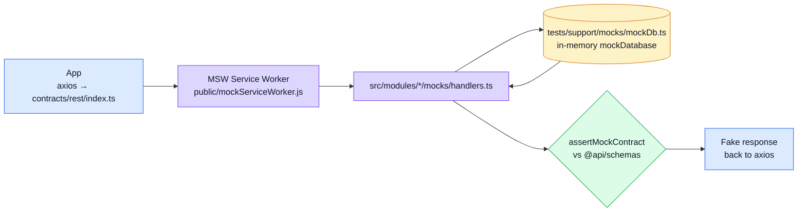

# Mocking (MSW)

[MSW (Mock Service Worker)](https://mswjs.io/) intercepts HTTP requests at the network layer — inside the browser's Service Worker, before they reach the network — so the SPA runs without a backend while using the real axios client and real stores.

## What MSW does and does not promise

This is the part that is easy to get wrong when editing them, so it comes first.

**MSW is a convenience, not a contract.** It exists so the app runs, and the fast suite runs, without a backend. It is *allowed* to be wrong about the API. What proves this frontend agrees with that backend is `test-e2e-live` — a required CI job that stands up a real backend checkout, a real Mongo and a really seeded database, and runs these same specs with MSW off.

Two things are still true of the mock layer, and the difference between them is the whole design:

1. **Data is structurally correct.** The mock database holds the backend's own rows — same ids, same credentials, same content. This is what lets `cy.loginAs('user')` (`gino@pino.it` / `password`) work identically against MSW and against the real API. Nothing is maintained by hand: the backend's `npm run seed:export` seeds a throwaway database with the real seeders, reads every row back through the real serializers, and publishes the result as `db/demo/demo-data.json`. `npm run sync:frontend` copies that file here as `tests/support/mocks/demo-data.json`, **byte-identical**. `npm run check:spec-identity` answers "have the two forked?", and the `spec-identity` CI job fails the build on the commit that forks them:

    ```bash
    diff boilerplate-node-backend/db/demo/demo-data.json \
         boilerplate-vue-frontend/tests/support/mocks/demo-data.json
    ```

    There is no mapper on either side any more, which is the point: what is shared is the API's own OUTPUT, not a set of facts each repo then interprets. The two repos used to share plain facts and map them separately, and the mappers drifted silently — this one invented `active: true` to mirror a backend default nobody had checked, and carried no `locale` at all. `@mocks/mockDataset.ts` applies exactly two deliberate divergences (drop `imageUrl`, restamp dates) and nothing else.
2. **Behaviour is best-effort.** A handler should apply the same filtering, scoping and visibility rules as the backend service behind that endpoint, and should name that service in a comment — that is genuinely useful to the next reader. But nothing here can *prove* the two agree: the mock filters an in-memory array in JavaScript where the API builds a Mongo query. Treat a green mock suite as evidence about the app, never as evidence about the backend.

### Why this promise is deliberately weak

A strong version is available — state behaviour parity as an invariant, and hold it up with per-module spec files that re-assert the backend's rules against the mock. It does not work. A hand-written mirror of the backend's rules fails in the same places the mock does, so it certifies the mock against a second guess rather than against the API, and the failure it invites is the expensive one: a green suite describing an API that does not exist.

It happened. The product-list handler returned every product in the in-memory DB, while `BE src/services/products.ts` hides inactive and soft-deleted products from non-admins. The mock returned 5, the real API returned 3, and `products.cy.ts` asserted `5` — so the spec passed, and would have failed the moment it met a real backend. The assertion was not merely untested against reality; it was **pinned to the wrong value**.

So the mirror is not load-bearing here: the real backend is the gate. What that costs is a fast signal about behaviour; what it buys is a signal that is actually true, on every PR, in CI.

**The rule that still follows:** when a spec asserts a count, it is also asserting a role. Non-admins see 4 of the 6 seeded products. If you change what a handler returns and the live run goes red, the handler is wrong — not the backend.

## Contract enforcement — what is already guaranteed

Every handler validates its own response before sending it:

```ts
return toMockJsonResponse(createSuccessEnvelope(product), { schema: GetProductByIdResponse });
```

`toMockJsonResponse` runs `assertMockContract` (`tests/support/mocks/mockValidation.ts`), which parses the payload against the Zod schema generated from `openapi.yaml`, and **sends what it validated**. A handler that returns a wrong *shape* throws loudly in the dev console, the Cypress run and the vitest suite.

Undeclared keys are rejected, not stripped. The schemas are generated with orval's `override.zod.strict` (see `orval.config.ts`), so they emit `zod.strictObject`: every object schema in the spec is `additionalProperties: false`, and a mock returning *more* than the contract allows is a mock describing an API that does not exist. Without strict, Zod's default is to silently drop the extra key — the guard would pass and delete the evidence in the same breath.

So the mocks cannot silently drift from the contract's **shape**. What Zod cannot check is **behaviour** — the right shape containing the wrong rows is perfectly valid. That gap is closed by running the real backend, not by anything in this repo: see [Live E2E](./live-e2e.md) and the `test-e2e-live` job in `ci.yml`.

## When mocking activates

Controlled by a single env var:

```dotenv
VITE_API_MOCK_ENABLED=true
```

When `true`, `src/main.ts` starts the MSW Service Worker before mounting the app. All axios requests are intercepted; nothing reaches the network. Cypress e2e specs always run with it enabled.

An unhandled request to the API origin calls `print.error()` (`tests/support/mocks/apiMock.ts`) rather than falling through. **A missing handler is meant to fail loudly** — this is a deliberate choice, and anything that adds a catch-all fallback silently disables it.

## Architecture


```mermaid
%%{init: {'flowchart': {'nodeSpacing': 50, 'rankSpacing': 65}}}%%
flowchart LR
    App["App\naxios → contracts/rest/index.ts"] --> SW["MSW Service Worker\npublic/mockServiceWorker.js"]
    SW --> Handlers["src/modules/*/mocks/handlers.ts"]
    Handlers --> DB[("tests/support/mocks/mockDb.ts\nin-memory mockDatabase")]
    DB --> Handlers
    Handlers --> Validate{"assertMockContract\nvs @api/schemas"}
    Validate --> Response["Fake response\nback to axios"]

    classDef app fill:#dbeafe,stroke:#2563eb,color:#111827;
    classDef msw fill:#ddd6fe,stroke:#7c3aed,color:#111827;
    classDef data fill:#fef3c7,stroke:#d97706,color:#111827;
    classDef check fill:#dcfce7,stroke:#16a34a,color:#111827;
    class App app;
    class SW,Handlers msw;
    class DB data;
    class Validate check;
    class Response app;
```

## File map

| File | Purpose |
| ---- | ------- |
| `public/mockServiceWorker.js` | MSW service worker (generated by `msw init` — do not edit) |
| `tests/support/mocks/apiMock.ts` | Builds the worker from `collectModuleMockHandlers(enabledModules)` plus the core `/locales` handlers; names no domain |
| `src/modules/<name>/mocks/handlers.ts` | Hand-written handlers with in-memory DB logic — **this is what actually runs offline**. Declared by the module manifest, so a domain brings its mock backend with it and takes it away when deleted |
| `tests/support/mocks/localesHandlers.ts` | The one handler file that stays central: `/locales` belongs to `infrastructure`, not to a domain |
| `tests/support/mocks/mockDb.ts` | In-memory DB, session bridging, envelope helpers, role-scoping helpers |
| `tests/support/mocks/mockDataset.ts` | Reads `demo-data.json` and applies the two divergences this repo needs; each module's `mocks/register.ts` routes a slice of it into the mock database |
| `tests/support/mocks/mockOrderMath.ts` | Pure order-total/id helpers, for handlers that create orders at runtime |
| `tests/support/mocks/mockTransport.ts` | Response builders that enforce the contract on the way out |
| `tests/support/mocks/mockValidation.ts` | `assertMockContract` + the one hand-written error schema |
| `tests/support/mocks/demo-data.json` | The demo dataset as the API answers it — byte-identical to `db/demo/demo-data.json` in the BE |
| `src/main.ts` | Conditionally starts MSW before Vue mounts |

## Where the orval MSW stubs went

Orval can emit one MSW stub and one faker factory per operation, and this repo does not ask it to — `orval.config.ts` declares `api` and `zodSchemas` and no `mocks` block.

They were generated and committed once, as a 9,431-line file. Nothing imported the stubs: they are stateless — no cart persistence, no login, no filtering — so wiring them in as a fallback layer would have replaced working behaviour with random data and silenced the unhandled-request error that exists on purpose. Their only consumer was a faker-driven test profile that has since been deleted.

If you want a skeleton when adding an endpoint, copy the nearest existing handler. It already has the envelope, the schema check and the role scoping, which a generated stub does not.

## Test profiles

| Profile | Data source | Backend | Assertion style | Status |
| --- | --- | --- | --- | --- |
| **mock** | `demo-data.json`, via each module's `mocks/register.ts` | none (MSW) | exact — counts, titles, prices | fast feedback, and the offline dev loop — `npm run test:e2e` |
| **live** (authoritative) | backend's real seeded DB | real API | exact + parity | **required CI job**, and `npm run test:e2e:live` locally — see [Live E2E](./live-e2e.md) |

They answer different questions, and one of them outranks the other:

- **mock** — does the app behave correctly against known data? Deterministic and seconds long, so it runs first on every PR and catches ordinary regressions immediately. It certifies nothing about the backend. The rest of this page is about this profile specifically.
- **live** — does the frontend agree with the *actual* backend? This is the one that decides. It is a required job in `ci.yml`, so a handler that has drifted from the service it mirrors fails the PR that introduced it rather than surviving until someone runs the live suite by hand.

Running both is not redundancy — it is a fast wrong answer followed by a slow right one, and the fast one is worth having as long as nobody mistakes it for the other.

The demo dataset is what carries the awkward shapes a test needs and a shop would not have: one soft-deleted product, one inactive one, one soft-deleted order, and one product whose optional fields are all at their schema defaults — empty description, no categories, no tags. Those records exist so the branches behind them are reachable; see the backend's `src/modules/products/demo.ts`.

## Role scoping — the rules the handlers mirror

| Rule | Backend source | Mock helper |
| --- | --- | --- |
| Non-admins see only `active`, non-soft-deleted products | `src/modules/products/service.ts` `search()` | `isVisibleToCaller()` |
| Same rule on single-product fetch, as a 404 (existence is not disclosed) | `src/modules/products/service.ts` `getById()` | `isVisibleToCaller()` |
| Non-admins are pinned to their own orders; their `userId` filter is discarded | `orderService.callerScope()`, applied in the orders controller | `getMockUserScope()` |
| Admin flag comes from the authenticated user | `request.authContext?.admin` | `isCurrentMockUserAdmin()` |

The demo data is built to exercise both branches: of the six seeded products one is soft-deleted and one is inactive, so **admins see 6 and everyone else sees 4**.

### `active` and soft-deletion are independent

Worth stating plainly, because the backend used to conflate them for users and the mock never did:

- `active` and `deletedAt` are **separate facts**. A record can be deactivated without being deleted, and a soft-deleted record keeps whatever `active` it had. Either can be true without the other.
- What they share is an **effect**, not a value: a non-admin sees a record only when it is active **and** not soft-deleted. So from outside, a soft-deleted record behaves exactly like an inactive one — which is why one filter reading like the other went unnoticed for so long.
- A record created without `active` is **active** — `openapi.yaml` declares `default: true` on the create bodies. It is declared precisely because leaving it undeclared is how the two repos came to disagree: the mock created products active, the real API created them inactive, and the same request produced a public product against one and a hidden one against the other with nothing failing.

The demo dataset can only reach two of the four `active` × `deletedAt` combinations. The other two — deleted-but-active, and both-at-once — are not modelled here at all. They are reachable through the API, so a spec that needs one should create it against the live profile rather than expect the mock to have it.

### Session state

`resetMockDatabase()` always clears the session, so **every Cypress spec starts as an anonymous visitor** unless it calls `cy.loginAs()`. Outside Cypress (plain `npm run dev`) the default session is root/admin, so the dev app opens with data visible.

## Adding a new handler

1. Copy the nearest existing handler in the owning module's `src/modules/<name>/mocks/handlers.ts` as a starting point.
2. Add it to the exported `register*MockHandlers()` array in that file.
3. Replace its body with in-memory DB logic against `mockDatabase`.
    - **Check `_meta.shapes` in `demo-data.json` first** — it says whether the rows you are about to return are what a GET actually answers. `"response"` (`products`, `users`, `orders`) means hand the row straight back. `"stored"` (`addressBooks`, `carts`, `wishlists`, `locales`, `localeMessages`) means no endpoint serves it raw and you are composing the response around it: `GET /account/addresses` answers `{ addresses: [...] }` from a book's `items`, `GET /locales` answers a capabilities envelope. Returning a `stored` row verbatim passes the shape check and fails the live run.
4. **Read the backend service behind the endpoint** and mirror any filtering, scoping or soft-delete rules you reasonably can. Leave a comment naming the file and function you mirrored — for the next reader, not as a guarantee. The live run is what will tell you whether you got it right.
5. Return through `toMockJsonResponse(..., { schema })` so the response is contract-checked.
6. A new domain needs no edit to `apiMock.ts`: declare `mockHandlers` in its `module.ts` and the registry picks it up. Copy the `import.meta.env.VITE_API_MOCK_ENABLED` ternary from an existing module verbatim — that literal is what keeps MSW out of the production bundle.

## Known gaps

Recorded deliberately; none of these are accidents.

- **The handlers do not model auth guards.** The backend guards every `/orders` route with `isAuth` and many write routes with `isAdmin`; the mocks apply role *scoping* but never return 401/403 for a missing or non-admin session. Specs therefore cannot test authorization failure through the mock profile.
- **The handlers do not re-validate uploads.** The seven multipart operations send an `imageUpload` part; the handlers separate it from the scalar fields (`readRequestParts`) and synthesise an `imageUrl` in the backend's shape (`resolveMockImageUrl`), but they never look at the bytes. The real API gates twice — `fileFilter` on the declared `Content-Type`, then `identifyImageFile()` on the actual magic bytes, answering **422** when the two disagree. Only the live profile can exercise that; see `tests/e2e/specs/uploads.cy.ts`.
- **`imageUrl` is deliberately dropped from the mocked dataset.** `demo-data.json` carries the real `/images/seed/*.jpg` paths, but the backend serves those out of its own `public/` and this repo ships no such files — under MSW they would 404 and every seeded avatar and product image would render broken. `mockDataset.ts` sets `imageUrl: undefined` instead. Only the live profile sees the real URLs.
- **Behaviour is not guaranteed, by design.** A handler can disagree with the service it mirrors and the fast suite will stay green. That is the accepted trade: `test-e2e-live` is a required CI job, so the disagreement surfaces on the PR that introduces it rather than in production.

## Cypress integration

`npm run test:e2e` runs `start-server-and-test`, which:

1. Builds the app once with `VITE_API_MOCK_ENABLED=true` into `dist-e2e/` (`npm run build:e2e`), so MSW and the handlers are in the bundle.
2. Serves that build with `vite preview` on port **8085** — static files, so nothing compiles while Cypress is driving.
3. Waits for `http://localhost:8085` to be ready.
4. Runs `cypress run --e2e`.

The build goes to `dist-e2e/` rather than `dist/` deliberately: `dist/` stays the production bundle, which carries no MSW.

Specs exercise the full Vue app plus MSW handlers, with no real network calls. `cy.resetState()` (in every spec's `beforeEach`) POSTs to the test-only `/__mock/reset` endpoint under this profile, which calls `resetMockDatabase()`. The same command drives the live profile too — see [Live E2E](./live-e2e.md) for what it does there instead.

## External references

- [MSW browser integration](https://mswjs.io/docs/integrations/browser)
- [MSW handler API](https://mswjs.io/docs/api/http)

## Related pages

- [Testing](./testing-and-docs.md)
- [Unit Testing](./unit-testing.md)
- [Live E2E (FE ↔ real backend)](./live-e2e.md)
- [OpenAPI Workflow](../api/openapi-workflow.md)

## Why the handlers live under `src/`

A module is meant to be deletable: `rm -rf src/modules/products` plus one line in `src/modules.ts`.
While its mock handlers sat in `src/modules/<name>/mocks/`, deleting the folder left an orphan file
that `apiMock.ts` still imported, and the build broke on something unrelated to the domain being
removed. Moving them beside the module fixes that, at the cost of test-only code living under
`src/`.

That cost is bounded deliberately:

- Each `module.ts` declares `mockHandlers` behind
  `import.meta.env.VITE_API_MOCK_ENABLED === 'true' ? () => import('./mocks/handlers')… :
  undefined`. Vite replaces the env read with a literal, so a production build drops the branch and
  everything reachable only through it. **`dist/` contains no MSW and no handler code** —
  verified by grepping the built assets, and worth re-checking if that ternary is ever refactored
  into a helper, because passing the loader as an argument would make the chunk reachable again.
- `vitest.config.ts` excludes `src/modules/*/mocks/**` from coverage: these are test doubles, not
  app code.
- Shared helpers stay in `tests/support/mocks/` and are reached through the `@mocks` alias, so the
  mock layer can be relocated by editing one path entry.
