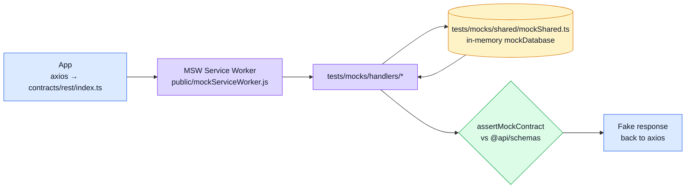

# Mocking (MSW)

[MSW (Mock Service Worker)](https://mswjs.io/) intercepts HTTP requests at the network layer — inside the browser's Service Worker, before they reach the network — so the SPA runs without a backend while using the real axios client and real stores.

## Why the mocks look the way they do

This is the part that is easy to get wrong when editing them, so it comes first.

The mocks are **not** a convenience stub that returns "some plausible JSON". They are a deliberate offline replica of the backend, and they carry two invariants:

1. **Data parity.** The seed records mirror the backend's — same ids, same credentials, same content. This is what lets `cy.loginAs('user')` (`gino@pino.it` / `password`) work identically against MSW and against the real API. It is no longer maintained by hand: both sides read `seed-identities.ts`, a dependency-free data file that is **byte-identical** in this repo (`tests/mocks/shared/`) and in the backend (`db/seeds/`), on the same convention as `scripts/gen-asyncapi-types.ts`. Change it in one repo, copy it to the other, and let `diff` answer "have the seeds drifted?":

    ```bash
    diff boilerplate-node-api-mongodb-mongoose/db/seeds/seed-identities.ts \
         boilerplate-vue-frontend/tests/mocks/shared/seed-identities.ts
    ```

    Each repo keeps its own mapper over that file, because the two sides need different *shapes* from the same facts — mongoose documents with `ObjectId`s and hashed-on-save passwords there, API response entities with string ids and no password here. What is shared is exactly what a drift would break: ids, emails, admin flags, titles, prices, active/deleted state, and which product sits in whose cart and whose order.
2. **Behaviour parity.** A handler must apply the same filtering, scoping and visibility rules as the backend service behind that endpoint. Data parity without behaviour parity produces the worst possible outcome: a green suite that describes an API that does not exist.

Invariant 2 was violated once already and is worth understanding as a cautionary example. The product-list handler returned every product in the in-memory DB, while `BE src/services/products.ts` hides inactive and soft-deleted products from non-admins. The mock returned 5 products, the real API returned 3, and `products.cy.ts` asserted `5` — so the spec passed, and would have failed the moment it met a real backend. The assertion was not merely untested against reality; it was **pinned to the wrong value**.

The rule that follows: **when a spec asserts a count, it is also asserting a role.** If you change what a handler returns, find the backend service it mirrors and check you are still describing it.

## Contract enforcement — what is already guaranteed

Every handler validates its own response before sending it:

```ts
return toMockJsonResponse(createSuccessEnvelope(product), { schema: GetProductByIdResponse });
```

`toMockJsonResponse` runs `assertMockContract` (`tests/mocks/shared/mockValidation.ts`), which parses the payload against the Zod schema generated from `openapi.yaml`, and **sends what it validated**. A handler that returns a wrong *shape* throws loudly in the dev console, the Cypress run and the vitest suite.

Undeclared keys are rejected, not stripped. The schemas are generated with orval's `override.zod.strict` (see `orval.config.ts`), so they emit `zod.strictObject`: every object schema in the spec is `additionalProperties: false`, and a mock returning *more* than the contract allows is a mock describing an API that does not exist. Without strict, Zod's default is to silently drop the extra key — the guard would pass and delete the evidence in the same breath.

So the mocks cannot silently drift from the contract's **shape**. What Zod cannot check is **behaviour** — the right shape containing the wrong rows is perfectly valid. That gap is what invariant 2 above is for, and what a live-backend test profile would close structurally.

## When mocking activates

Controlled by a single env var:

```dotenv
VITE_API_MOCK_ENABLED=true
```

When `true`, `src/main.ts` starts the MSW Service Worker before mounting the app. All axios requests are intercepted; nothing reaches the network. Cypress e2e specs always run with it enabled.

An unhandled request to the API origin calls `print.error()` (`tests/mocks/apiMock.ts`) rather than falling through. **A missing handler is meant to fail loudly** — this is a deliberate choice, and anything that adds a catch-all fallback silently disables it.

## Architecture


```mermaid
%%{init: {'flowchart': {'nodeSpacing': 50, 'rankSpacing': 65}}}%%
flowchart LR
    App["App\naxios → contracts/rest/index.ts"] --> SW["MSW Service Worker\npublic/mockServiceWorker.js"]
    SW --> Handlers["tests/mocks/handlers/*"]
    Handlers --> DB[("tests/mocks/shared/mockShared.ts\nin-memory mockDatabase")]
    DB --> Handlers
    Handlers --> Validate{"assertMockContract\nvs @api/schemas"}
    Validate --> Response["Fake response\nback to axios"]

    classDef app fill:#dbeafe,stroke:#2563eb,color:#111827;
    classDef msw fill:#ddd6fe,stroke:#7c3aed,color:#111827;
    classDef data fill:#fef3c7,stroke:#d97706,color:#111827;
    classDef check fill:#dcfce7,stroke:#16a34a,color:#111827;
    class App app;
    class SW,Handlers msw;
    class DB data;
    class Validate check;
    class Response app;
```

## File map

| File | Purpose |
| ---- | ------- |
| `public/mockServiceWorker.js` | MSW service worker (generated by `msw init` — do not edit) |
| `tests/mocks/apiMock.ts` | Builds the worker from the six `register*MockHandlers()` calls; logs the active profile (and seed, for random) at start |
| `tests/mocks/handlers/*MockHandlers.ts` | Hand-written handlers with in-memory DB logic — **this is what actually runs** |
| `tests/mocks/shared/mockShared.ts` | In-memory DB, session bridging, envelope helpers, role-scoping helpers |
| `tests/mocks/shared/mockProfiles.ts` | `resolveProfile()`, the fixed-seed builder, and the async entry points into the random profile |
| `tests/mocks/shared/mockProfilesRandom.ts` | The random profile's actual implementation — the only file that imports `@faker-js/faker` and `generated.ts`, reached only via a dynamic `import()` |
| `tests/mocks/shared/mockOrderMath.ts` | Pure order-total/id helpers shared by the seed and random builders, and by handlers that create orders at runtime |
| `tests/mocks/shared/mockTransport.ts` | Response builders that enforce the contract on the way out |
| `tests/mocks/shared/mockValidation.ts` | `assertMockContract` + the one hand-written error schema |
| `tests/mocks/shared/seed-identities.ts` | The seed dataset's facts — byte-identical to `db/seeds/seed-identities.ts` in the BE |
| `tests/unit/mocks/mockHandlerParity.spec.ts` | Unit coverage of the handlers' filtering, scoping and pagination, shaped after the BE's own tests |
| `tests/mocks/generated.ts` | Orval-generated stubs + faker factories (regenerated by `npm run genapi` — do not edit) |
| `src/main.ts` | Conditionally starts MSW before Vue mounts |

## The role of `tests/mocks/generated.ts`

Orval generates one MSW stub and one faker factory per operation into this file. **Nothing imports the stubs.** They are not wired into the worker, and `apiMock.ts` builds exclusively from the hand-written handlers. The faker factories, though, are consumed — by `mockProfilesRandom.ts`, as the raw material for the random profile below.

It is kept for two reasons:

- **A skeleton when adding an endpoint.** Copy the stub out, then replace the faker body with real in-memory-DB logic.
- **The random-data test profile's raw material.** See "Test profiles" below.

Do not wire its *handlers* into the worker as a fallback layer. They are stateless: no cart persistence, no login, no filtering. Using them would replace working behaviour with random data and silence the unhandled-request error that exists on purpose.

## Test profiles

| Profile | Data source | Backend | Assertion style | Status |
| --- | --- | --- | --- | --- |
| **fixed** (default) | `mockProfiles.ts`'s `buildSeedDatabase()` | none (MSW) | exact — counts, titles, prices | in use — `npm run test:e2e` |
| **random** | faker factories from `generated.ts`, via `mockProfilesRandom.ts` | none (MSW) | invariants only | in CI nightly (`e2e-random.yml`) + on demand — `npm run test:e2e:random`, see [E2E — Random Profile](./e2e-random-profile.md) |
| **live** | backend's real seeded DB | real API | exact + parity | in use, run by hand — `npm run test:e2e:live`, see [Live E2E](./live-e2e.md) |

They answer different questions and none replaces another:

- **fixed** — does the app behave correctly against known data? Deterministic, so it can assert exact values. The rest of this page is about this profile specifically.
- **random** — does the app survive *any* contract-valid data? Catches hardcoded assumptions, missing empty states, layout breaking on long strings, null handling. Cannot assert counts — full architecture, the seed lifecycle and the design constraints that keep it honest are on its own page: [E2E — Random Profile](./e2e-random-profile.md).
- **live** — does the frontend agree with the *actual* backend? The only profile that catches behaviour drift structurally rather than by review — see [Live E2E](./live-e2e.md) for the preflight, response-validation and parity-spec machinery that makes it catch bugs rather than merely exercise code.

## Role scoping — the rules the handlers mirror

| Rule | Backend source | Mock helper |
| --- | --- | --- |
| Non-admins see only `active`, non-soft-deleted products | `src/services/products.ts` `search()` | `isVisibleToCaller()` |
| Same rule on single-product fetch, as a 404 (existence is not disclosed) | `src/services/products.ts` `getById()` | `isVisibleToCaller()` |
| Non-admins are pinned to their own orders; their `userId` filter is discarded | `src/core/http/scopes.ts` `userScope()` | `getMockUserScope()` |
| Admin flag comes from the authenticated user | `request.authContext?.admin` | `isCurrentMockUserAdmin()` |

The seed data is built to exercise both branches: of the five seeded products one is soft-deleted and one is inactive, so **admins see 5 and everyone else sees 3**.

### `active` and soft-deletion are independent

Worth stating plainly, because the backend used to conflate them for users and the mock never did:

- `active` and `deletedAt` are **separate facts**. A record can be deactivated without being deleted, and a soft-deleted record keeps whatever `active` it had. Either can be true without the other.
- What they share is an **effect**, not a value: a non-admin sees a record only when it is active **and** not soft-deleted. So from outside, a soft-deleted record behaves exactly like an inactive one — which is why one filter reading like the other went unnoticed for so long.
- A record created without `active` is **active** — `openapi.yaml` declares `default: true` on the create bodies. It is declared precisely because leaving it undeclared is how the two repos came to disagree: the mock created products active, the real API created them inactive, and the same request produced a public product against one and a hidden one against the other with nothing failing.

The fixed seed can only reach two of the four `active` × `deletedAt` combinations. The other two — deleted-but-active, and both-at-once — are covered by `tests/unit/mocks/mockHandlerParity.spec.ts`, below.

### Behaviour parity is tested now, not just reviewed

`tests/unit/mocks/mockHandlerParity.spec.ts` drives the handlers through `setupServer` (`msw/node`) and asserts they still answer the questions the backend's own tests ask, in the same way. Each case names its backend counterpart, so a divergence is visible when either side changes.

It is deliberately **not** a second copy of the backend's suite — that suite already proves the API's behaviour thoroughly, and duplicating it would double the maintenance without adding signal. These cases sit only where the two implementations could plausibly disagree: this side filters a JavaScript array, the other builds a Mongo query, so the risk lives in combinations and arithmetic boundaries rather than on the happy path a spec already walks.

No new runner or npm script — it runs under `npm run test:unit` with everything else.

### Session state

`resetMockDatabase()` always clears the session, so **every Cypress spec starts as an anonymous visitor** unless it calls `cy.loginAs()`. Outside Cypress (plain `npm run dev`) the default session is root/admin, so the dev app opens with data visible.

## Adding a new handler

1. Copy the stub for the operation out of `tests/mocks/generated.ts` as a starting point.
2. Add it to the relevant `tests/mocks/handlers/*MockHandlers.ts` file, inside the exported `register*MockHandlers()` array.
3. Replace the faker body with in-memory DB logic against `mockDatabase`.
4. **Read the backend service behind the endpoint** and mirror any filtering, scoping or soft-delete rules. Leave a comment naming the file and function you mirrored.
5. Return through `toMockJsonResponse(..., { schema })` so the response is contract-checked.
6. If you added a whole handler file, register it in `tests/mocks/apiMock.ts` — there is no `handlers/index.ts`.

Do not edit `generated.ts` — `npm run genapi` overwrites it.

## Known gaps

Recorded deliberately; none of these are accidents.

- **The handlers do not model auth guards.** The backend guards every `/orders` route with `isAuth` and many write routes with `isAdmin`; the mocks apply role *scoping* but never return 401/403 for a missing or non-admin session. Specs therefore cannot test authorization failure through the mock profile.
- **The handlers do not re-validate uploads.** The seven multipart operations send an `imageUpload` part; the handlers separate it from the scalar fields (`readRequestParts`) and synthesise an `imageUrl` in the backend's shape (`resolveMockImageUrl`), but they never look at the bytes. The real API gates twice — `fileFilter` on the declared `Content-Type`, then `identifyImageFile()` on the actual magic bytes, answering **422** when the two disagree. Only the live profile can exercise that; see `tests/e2e/specs/uploads.cy.ts`.
- **`imageUrl` is deliberately dropped from the mocked seed.** `seed-identities.ts` carries the real `/images/seed/*.jpg` paths, but the backend serves those out of its own `public/` and this repo ships no such files — under MSW they would 404 and every seeded avatar and product image would render broken. The mappers in `mockProfiles.ts` set `imageUrl: undefined` instead. Only the live profile sees the real URLs.
- **Behaviour parity is maintained by review day-to-day, spot-checked by a test.** `tests/e2e/specs/parity.cy.ts` (live profile only, see [Live E2E](./live-e2e.md)) asserts the seeded ids/counts/totals still match, but only when someone runs the live profile — nothing in CI runs it automatically, since the two repos are independently versioned and hand-paired (see that page for why).

## Cypress integration

`npm run test:e2e` runs `start-server-and-test`, which:

1. Starts Vite on port **8085** with `VITE_API_MOCK_ENABLED=true`.
2. Waits for `http://localhost:8085` to be ready.
3. Runs `cypress run --e2e`.

Specs exercise the full Vue app plus MSW handlers, with no real network calls. `cy.resetState()` (in every spec's `beforeEach`) POSTs to the test-only `/__mock/reset` endpoint under this profile, which calls `resetMockDatabase()`. The same command drives the live profile too — see [Live E2E](./live-e2e.md) for what it does there instead.

## External references

- [MSW browser integration](https://mswjs.io/docs/integrations/browser)
- [MSW handler API](https://mswjs.io/docs/api/http)
- [faker.js guide](https://fakerjs.dev/guide/)

## Related pages

- [Testing](./testing-and-docs.md)
- [Unit Testing](./unit-testing.md)
- [E2E — Random Profile](./e2e-random-profile.md)
- [Live E2E (FE ↔ real backend)](./live-e2e.md)
- [OpenAPI Workflow](../api/openapi-workflow.md)
