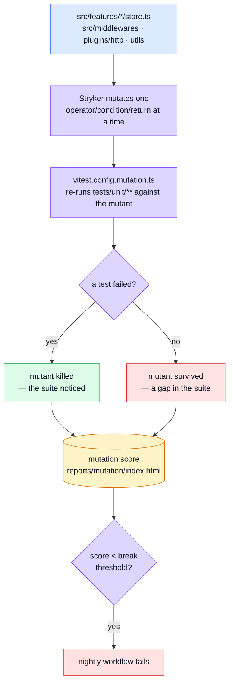

# Mutation Testing

Every layer above this one answers "does the code do the right thing?" This one answers a different question: **do the *tests* actually notice when it doesn't?** Line coverage can be satisfied by executing a line without asserting anything about its result; mutation testing can't — it edits the source thousands of times (`>` to `>=`, `&&` to `||`, a function body emptied out) and reports every edit the suite failed to catch. A **surviving mutant** is a bug the tests are structurally blind to.

## Tools

| Tool | Role |
| --- | --- |
| [Stryker](https://stryker-mutator.io/) | Generates mutants, re-runs the suite once per mutant, scores what survived |
| `@stryker-mutator/vitest-runner` | Drives Vitest as the test runner, against a narrower config than the normal suite (see below) |

## Architecture



## Why it never gates a PR

A run re-executes the whole unit suite once per mutant — minutes, not seconds. `stryker.config.json` is explicit that this is structural, not a convention that could erode: mutation testing is **not** part of `.github/workflows/ci.yml`, it lives in its own workflow (`.github/workflows/mutation.yml`) on a nightly schedule plus `workflow_dispatch`. Keeping it in a separate file means it cannot become a PR gate by accident the way a "just this once" addition to the CI job could.

## Scope — why `mutate` is narrow

```json
"mutate": [
    "src/features/*/store.ts",
    "src/middlewares/**/*.ts",
    "src/plugins/http/**/*.ts",
    "src/utils/**/*.ts",
    "!src/utils/i18n.ts"
]
```

Deliberately excludes `contracts/` (generated), `tests/mocks/generated.ts` (generated), and view templates (`.vue` components) — all three produce mutation noise without a meaningful "did the tests notice" question behind them. What's left is exactly the logic layer: store actions, route guards, `orvalMutator` and its response-validation gate, formatting/error utilities.

## Thresholds — measured, not invented

```json
"thresholds": { "high": 75, "low": 56, "break": 50 }
```

`stryker.config.json`'s own comment is explicit about where these numbers came from: the first real run (55.95% total / 65.98% of covered code, 435 mutants, ~1m40s), not a target picked in advance. `break` sits below that measured score on purpose — it exists to catch a real regression, not to enforce normal run-to-run drift. Raise it when the score rises for real; never lower it to make a run pass.

That first run is also what produced `tests/unit/utils/formatters.spec.ts` — `formatters.ts` scored 0% because no test called it at all, something line-coverage reports had never said out loud.

## File map

| Path | Contents |
| --- | --- |
| `stryker.config.json` | Scope (`mutate`), thresholds, reporters, the vitest runner config pointer |
| `vitest.config.mutation.ts` | The narrower Vitest config Stryker actually runs against |
| `.github/workflows/mutation.yml` | Nightly schedule + `workflow_dispatch`, uploads `reports/mutation/` even on failure |
| `reports/mutation/index.html` | HTML report (git-ignored, generated per run) |

## Commands

| Command | Effect |
| --- | --- |
| `npm run test:mutation` | Full mutation run — slow, meant for a nightly or before a refactor, never mid-PR |

## Related pages

- [Testing](./testing-and-docs.md) — suite overview
- [Unit Testing](./unit-testing.md) — the layer being mutated
