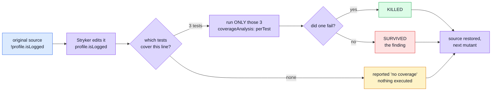
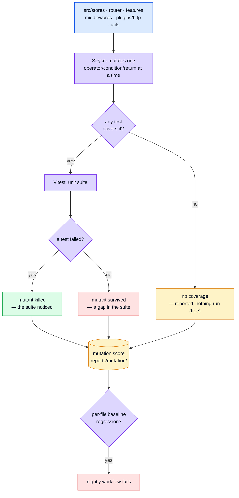
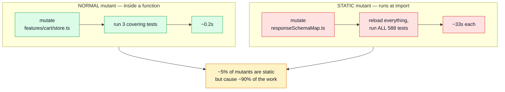
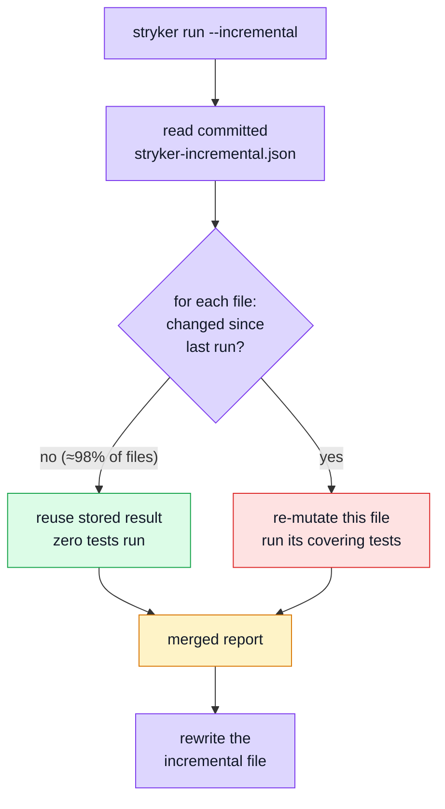
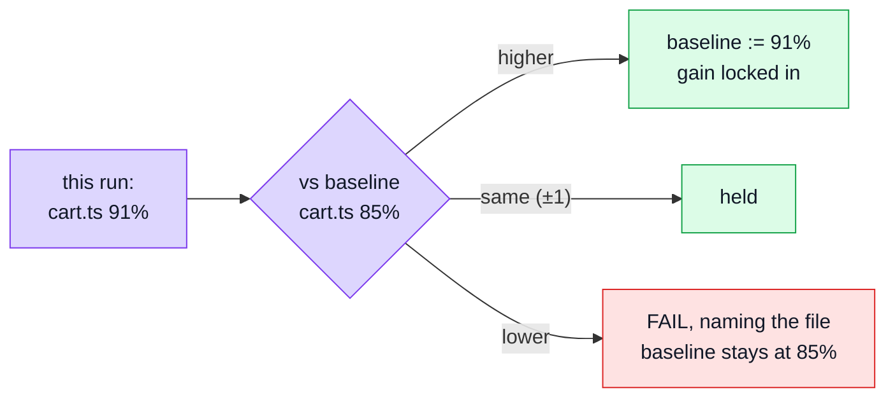

# Mutation Testing

Every other layer on this site answers "does the code do the right thing?" This one answers a different question: **do the _tests_ actually notice when it doesn't?** Line coverage can be satisfied by executing a line without asserting anything about its result; mutation testing can't — it edits the source thousands of times (`>` to `>=`, `&&` to `||`, a function body emptied out) and reports every edit the suite failed to catch. A **surviving mutant** is a bug the tests are structurally blind to.

## Glossary

Read this first. The rest of the page uses these words precisely, and several of them mean something narrower than they sound.

| Term                   | What it means here                                                                                                                                                                                                                                                                       |
| ---------------------- | ---------------------------------------------------------------------------------------------------------------------------------------------------------------------------------------------------------------------------------------------------------------------------------------- |
| **Mutant**             | One deliberate edit to one place in the source. `a > b` becomes `a >= b`. Stryker makes thousands, one at a time. See [What a mutant actually is](#what-a-mutant-actually-is).                                                                                                           |
| **Killed**             | At least one test failed when the mutant was active. Good — the suite noticed.                                                                                                                                                                                                           |
| **Survived**           | Every test still passed with broken code. **This is the finding.** It means no assertion anywhere depends on that behaviour.                                                                                                                                                             |
| **No coverage**        | No test executes that code at all, so Stryker doesn't even run anything — it reports the mutant immediately. Different from "survived": survived means tested-but-not-asserted, no-coverage means not-tested. **Costs nothing**, which is why untested files are cheap to keep in scope. |
| **Timeout**            | The mutant made the suite hang (a mutated loop condition, typically). Counted as **killed** — the suite did notice, just expensively.                                                                                                                                                    |
| **Mutation score**     | Killed ÷ (all viable mutants). Reported twice: over _everything_, and over _covered code only_. The gap between the two is the size of the untested surface.                                                                                                                             |
| **`break` threshold**  | The score below which the run fails. A backstop for "has this collapsed", not a target.                                                                                                                                                                                                  |
| **Baseline / ratchet** | `mutation-baseline.json` records what **each file** scored. Improvements are written back, regressions fail. See [The per-file ratchet](#the-per-file-ratchet).                                                                                                                          |
| **Nightly**            | A GitHub Actions workflow on a `cron` schedule (03:00 UTC) rather than on push. Nothing waits for it; it reports the next morning. Mutation lives here because a run takes minutes-to-hours.                                                                                             |
| **Concurrency**        | How many mutants Stryker tests **in parallel**. Each one is a separate OS process running a full test runner _and its own jsdom environment_, so the limit is memory as much as CPU cores.                                                                                                      |
| **`coverageAnalysis`** | Set to `perTest`: Stryker first records which tests touch which code, then runs **only the covering tests** for each mutant instead of the whole suite. This is the main reason a run is minutes and not days — except for static mutants, below.                                        |
| **Static mutant**      | A mutant in code that runs when the file is **imported**, not when a test calls it — a `new Schema({...})`, a repository built at module scope, a config object. See [Why a run is slow](#why-a-run-is-slow-static-mutants); it is the single biggest cost in this repo.                 |
| **Incremental**        | Stryker remembers per-mutant results in a committed file, so the next run only re-mutates what changed. See [Incremental mode](#incremental-mode--what-it-is). Not enabled here yet.                                                                                                     |

## What a mutant actually is

A mutant is **one small, deliberate edit to your source code**. Stryker makes it, runs the tests, and puts the code back. That is the whole idea.

Take a real line from this codebase:

```ts
// src/middlewares/authentications.ts
if (!profile.isLogged || profile.user?.admin !== true) return { name: 'Error' };
```

Stryker generates a separate mutant for each thing it can change here:

| #   | Mutant                                        | What it is asking                                  |
| --- | --------------------------------------------- | -------------------------------------------------- |
| 1   | `attemptsLeft < 1`                            | Does any test pin the exact retry boundary?        |
| 2   | `attemptsLeft >= 1`                           | Same boundary, the other direction                 |
| 3   | `attemptsLeft <= 1 && !isDuplicateKey(error)` | Does anything depend on this being **or**?         |
| 4   | `isDuplicateKey(error)` (negation removed)    | Does a test cover the non-duplicate error path?    |
| 5   | `if (false) throw error;`                     | Does anything notice if we never give up retrying? |

Each one is run **on its own**, never together. Then:

- a test fails → **killed**. Some assertion depended on that behaviour. Good.
- every test passes → **survived**. You just broke the retry budget and nothing complained.

A survivor is not "a test is missing" in the abstract. It is a specific, reproducible statement: _this exact change to your code is invisible to your test suite._

### One mutant's lifecycle



The source on disk is never left mutated — Stryker works in a throwaway copy under `.stryker-tmp/`.

## Tools

| Tool                                   | Role                                                                          |
| -------------------------------------- | ----------------------------------------------------------------------------- |
| [Stryker](https://stryker-mutator.io/) | Generates mutants, re-runs the suite once per mutant, scores what survived    |
| `@stryker-mutator/vitest-runner`       | Drives Vitest as the test runner, via `vitest.config.mutation.ts`             |

## Architecture



## Why the e2e suite is not mutated

Stryker drives **Vitest only** (`vitest.config.mutation.ts`). The Cypress e2e suite is not part of a mutation run and cannot be: it needs a dev server and a browser, so a single mutant would cost minutes rather than milliseconds.

That is why `.vue` files are not in `mutate` yet either — see [Scope](#scope--what-is-mutated).

## Why it never gates a PR

A run re-executes the unit suite once per mutant. `.github/workflows/mutation.yml` is a separate workflow from `ci.yml` — **nightly** (`cron: '0 3 * * *'`) plus manual dispatch. Kept structurally separate rather than folded into `ci.yml` behind a conditional: a separate file can't become a PR gate by accident.

## Why a run is slow — static mutants

This is the thing worth understanding, because it explains an otherwise baffling number.

`coverageAnalysis: perTest` means Stryker normally runs only the handful of tests that touch the mutated line. But some mutants are **static** — they live in code that executes when the module is _imported_ rather than when a test calls it:

```ts
export const userSchema = new Schema({ ... });        // runs at import
export const userRepository = createBaseRepository(); // runs at import
```

Stryker cannot swap those in and out per test. It has to reload the whole environment — and so, from its planner:

```js
else {  // static, and ignoreStatic is off
    return this.createMutantRunPlan(mutant, {
        netTime: this.timeSpentAllTests,
        testFilter: this.globalTestFilter,   // ← every test in the suite
    });
}
```

Visually, the difference:



**One static mutant runs the entire suite.** Measured directly from this repo's JSON report (2026-08-09): **363 of 1347 mutants are static (26.9%)**, and they are heavily concentrated:

| File                              | Static mutants |
| --------------------------------- | -------------- |
| `plugins/http/responseSchemaMap.ts` | 241            |
| `router/index.ts`                  | 35             |
| `features/users/schemas.ts`        | 22             |
| `utils/uploads.ts`                 | 16             |

`responseSchemaMap.ts` is a 52-row lookup table declared at module scope, so nearly every mutant in it is static. That single file is the dominant cost of a frontend run.

It also inflates timeouts, because the timeout is derived from how long the tests are expected to take:

```
timeout = timeoutFactor × netTime + timeoutMS + overhead
        = 1.5 × 33,406 + 30,000 + 22,963  ≈ 103 seconds
```

for a static mutant, because its `netTime` is the whole suite. Declarative module-scope code — lookup tables, zod schemas, route arrays — is idiomatic here, so the static surface is large by design.

### What can be done about it — an open question

| Option                                   | Effect                                                            | Status                                                            |
| ---------------------------------------- | ----------------------------------------------------------------- | ----------------------------------------------------------------- |
| Raise `concurrency`                      | Near-linear speed-up, **changes no measurement**                  | **Done** — 4 → 12                                                 |
| `incremental: true`                      | PR runs re-mutate only changed files                              | Not done                                                          |
| Split the nightly into one job per layer | Wall-clock becomes the slowest group, not the sum                 | Not done; probably unnecessary if the cost is fixed at the source |
| `ignoreStatic: true`                     | Removes the whole-suite reruns — but stops measuring some mutants | **Not enabled. Deliberately undecided — see below.**              |
| Move logic out of module scope           | The only fix that costs nothing in measurement                    | Invasive; module-scope schemas are idiomatic Mongoose             |

`ignoreStatic` is a real, documented Stryker option, and Stryker's own description of it says "it might make sense to ignore static mutants". But **its default is `false`**, and that default is a judgement by the people who wrote the tool: measuring those mutants is the safer behaviour.

Two things argue for caution before switching it on here:

1. **It is a trade-off, not a fix.** It buys speed by not measuring some code. Measured here: **335 of 363** static mutants also have per-test coverage and would still be scored — only **28 (2% of all mutants)** would be dropped. That is a good ratio, but it is 28 mutants nobody would be measuring any more, and they should be listed before they are silenced.
2. **Soundness.** With `ignoreStatic` on, a static-but-covered mutant is activated at _runtime_ rather than at module load (`mutantActivation: 'runtime'` in the planner). A mutant whose only effect happens during import may then never actually trigger, and be reported as survived when it was never really tested. That is a quieter failure than a slow run.

The honest position: it is standard and supported, it is probably the right call eventually, and it should be decided from a measurement of _this_ repo — one run with the JSON reporter enumerating exactly which mutants would stop being measured, recorded in the config — rather than from the frontend's numbers.

## Incremental mode — what it is

Not enabled here yet, but it is the change that would make mutation testing usable on a pull request, so it is worth understanding.

**The problem.** Every run starts from scratch. Change one line in one service, and Stryker still re-mutates all ~2,700 mutants across the whole codebase — including the thousands in files you did not touch, whose results will be identical to last time.

**The mechanism.** With `incremental: true`, Stryker writes every mutant's result to `reports/stryker-incremental.json` and **you commit that file**. On the next run it compares the new source against what the file remembers:

- file unchanged → reuse the stored result, run nothing
- file changed → re-mutate it properly
- a _test_ changed → re-run the mutants that test covers, because the answer may now be different



**What it changes in practice.** A pull request touching one service goes from ~2,700 mutants to perhaps 30 — seconds instead of an hour. That is what turns mutation testing from "a nightly you read the next morning" into "a check on your PR".

**The catch, and why the nightly still runs in full.** The incremental file is a cache, and caches go stale — a refactor that moves code between files, a dependency upgrade, or a merge conflict resolved badly can leave it describing a codebase that no longer exists. So the intended shape is two runs with different jobs:

| Run     | Trigger | Setting             | Purpose                                    |
| ------- | ------- | ------------------- | ------------------------------------------ |
| PR      | push    | `incremental: true` | Fast feedback on what you actually changed |
| Nightly | cron    | `force: true`       | Full run; refreshes the file from scratch  |

`force: true` tells Stryker to ignore the stored results entirely, which is what stops staleness accumulating.

## Scope — what is mutated

```json
"mutate": [
    "src/features/*/store.ts",
    "src/features/*/schemas.ts",
    "src/features/*/routes.ts",
    "src/features/*/composables/**/*.ts",
    "src/features/realtime/**/*.ts",
    "src/stores/**/*.ts",
    "src/router/**/*.ts",
    "src/middlewares/**/*.ts",
    "src/plugins/http/**/*.ts",
    "src/utils/**/*.ts",
    "!src/utils/i18n.ts"
]
```

A counterintuitive but important consequence of the table above: **untested files are free to include.** A mutant with no covering test is reported `NoCoverage` without running anything, so `core/adapters/pdf.ts` and `core/observability/stream.ts` at 0% cost nothing and honestly record the gap. The cost lives entirely in _well-covered_ code — especially static-and-covered code.

So the scope is not narrowed to save time. `utils/i18n.ts` is excluded because its mutants ask about vue-i18n's behaviour rather than this app's.

**`.vue` files are deliberately still out.** Stryker *can* mutate a single-file component — it maps the file to the HTML parser and mutates the `<script>` block — but it does **not** mutate template expressions. Including SFCs would therefore report a number that implies template coverage nobody has. It is sequenced after component tests exist; today only two of ~34 components have specs.

## The per-file ratchet

Stryker's own thresholds are **global** — `high`, `low`, `break`, and nothing else. That is the same pooling failure that directory-shaped coverage thresholds have: a strong file carries a weak one, and the number that passes is an average nobody can act on. It gets worse as `mutate` widens, not better.

So `mutation-baseline.json` records a score **per file**, and `scripts/check-mutation-baseline.ts` compares each run against it:

- a file that drops below its recorded score **fails**;
- a file that improves has its baseline **rewritten upward**, locking the gain in;
- a new file is recorded at whatever it first measures, **including `0`** — an honest zero in a diff beats a zero dissolved into a mean.



A regression **cannot be laundered**: running with `--update` on a regressed file keeps the higher value _and_ still exits non-zero.

A one-point tolerance absorbs the timeout/survivor race (whether a hanging mutant is recorded as a timeout or a survivor depends on machine load), not genuine weakening.

## Thresholds — measured, not invented

Both the band and the per-file baseline come from real runs, dated in `stryker.config.json`. The rule: raise `break` when a score **sustains** a higher band; never lower it to make a run pass. The single sanctioned exception is a change to `mutate` — which changes the population, so old and new numbers are not measurements of the same thing — re-recorded in the same commit with both numbers and the reason.

## File map

| Path                                 | Contents                                                                       |
| ------------------------------------ | ------------------------------------------------------------------------------ |
| `stryker.config.json`                | Scope (`mutate`), the narrowed Jest config, thresholds, concurrency, reporters |
| `mutation-baseline.json`             | Per-file scores. Committed. The ratchet's memory.                              |
| `scripts/mutationBaseline.ts`        | Ratchet logic — scoring, comparison, the "never lower" rule                    |
| `scripts/check-mutation-baseline.ts` | CLI for the two commands below                                                 |
| `.github/workflows/mutation.yml`     | Nightly schedule + dispatch, uploads the report even on failure                |
| `reports/mutation/index.html`        | Human-readable report (generated per run)                                      |
| `reports/mutation/mutation.json`     | Machine-readable report the ratchet reads                                      |

## Commands

| Command                          | Effect                                                                           |
| -------------------------------- | -------------------------------------------------------------------------------- |
| `npm run test:mutation`          | Full run — slow, meant for a nightly or before a refactor, never mid-PR          |
| `npm run test:mutation:check`    | Compare the last run against the per-file baseline. Fails naming what regressed. |
| `npm run test:mutation:baseline` | Record the last run (improvements only). Use when `mutate` changed, and say why. |

## Related pages

- [Testing](./testing-and-docs.md) — suite overview
- [Unit Testing](./unit-testing.md) — the layer being mutated
- [Testing and Docs](./testing-and-docs.md) — where mutation sits among the other suites
