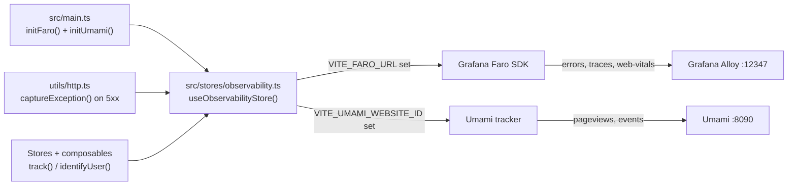

# Observability

The FE observability layer covers two complementary concerns, both wired into a **single Pinia store** at `src/stores/observability.ts`. Everything runs against a **self-hosted, local stack** (Docker/Podman) — there are no external SaaS accounts.

| Tool | Role | Endpoint |
| ---- | ---- | -------- |
| **Grafana Faro** (`@grafana/faro-web-sdk` + `@grafana/faro-web-tracing`) | Error/crash monitoring, frontend tracing, Core Web Vitals | Grafana Alloy Faro receiver on `http://localhost:12347/collect` |
| **Umami** (`script.js` tracker) | Product analytics — pageviews + custom events | `http://localhost:8090` |

Both are no-ops when their env vars are absent, so local dev works without the stack running. You verify the data in **Grafana** (`http://localhost:3001`, default `admin/admin`) and the **Umami dashboard** (`http://localhost:8090`).

> The browser **only ever talks to Alloy** on `:12347` (never directly to the OTel collector `:4318`, Loki, or Prometheus). Alloy fans the signals out to Loki/Tempo/Prometheus.

## Architecture



## Initialization

Both tools are initialized in `src/main.ts` via the store:

```ts
const obs = useObservabilityStore();
obs.initFaro();    // no-op if VITE_FARO_URL is absent
obs.initUmami();   // no-op if VITE_UMAMI_WEBSITE_ID is absent
```

## Grafana Faro

### What it captures

Registering `getWebInstrumentations()` automatically captures:

- Uncaught errors + unhandled promise rejections
- Console errors
- Core Web Vitals (LCP / CLS / INP …)
- Session tracking

The `TracingInstrumentation` opens a span for every `fetch`/XHR and **propagates the W3C `traceparent` header to the API origin** (`VITE_API_URL`). Because the header is propagated, a single trace spans _"button click in the browser → API handler → Mongoose query"_ inside Grafana/Tempo.

Manual exceptions go through `captureException()` — called from `utils/http.ts` on `5xx` responses and from `router.onError`. Faro pushes them via `faro.api.pushError()`.

> **Backend note:** for traces to link, the API must allow the `traceparent` request header in its CORS config.

### Environment variables

| Variable | Purpose |
| -------- | ------- |
| `VITE_FARO_URL` | Alloy Faro receiver URL — empty disables Faro entirely |
| `VITE_FARO_APP_NAME` | App name reported to Faro (default `frontend`) |
| `VITE_FARO_APP_VERSION` | App version (default `1.0.0`) |
| `VITE_FARO_ENVIRONMENT` | Environment tag (default: Vite `MODE`) |

The trace-propagation origin is derived from `VITE_API_URL`.

### External references

- [Grafana Faro Web SDK](https://grafana.com/docs/grafana-cloud/monitor-applications/frontend-observability/faro-web-sdk/)

---

## Umami

### What it captures

- **Pageviews** — automatic. The tracker script hooks SPA history changes, so there is **no manual `page_view` event** in the router.
- **Custom product events** via `track()`.
- **User identity** via `identifyUser()` after login (best-effort; Umami `identify` is optional).

### Rules

- **No PII** — never send email, name, or personal data in event properties.
- **Use constants** from `analyticsEvents` — never hardcode event name strings.
- **Match the backend** — the event constants are the canonical names the backend emits, so FE and BE analytics line up.
- **Fire-and-forget** — never `await` a `track()` call.

### Event taxonomy

Event names mirror the backend's canonical events so both sides line up in Umami.

| Category | Events |
| -------- | ------ |
| Lifecycle (FE-only) | `app_started`, `app_ready` |
| Auth | `user_signed_up`, `user_logged_in`, `user_logged_out` (FE-only), `user_profile_viewed`, `account_deleted` |
| Products | `products_searched`, `product_viewed` |
| Cart | `cart_viewed`, `cart_item_added`, `cart_item_updated`, `cart_item_removed`, `cart_cleared` |
| Checkout / Orders | `checkout_completed`, `checkout_failed`, `order_created`, `orders_viewed` |

Pageviews are handled automatically by Umami and are **not** in this table.

### Environment variables

| Variable | Purpose |
| -------- | ------- |
| `VITE_UMAMI_WEBSITE_ID` | Umami website id (from the Umami dashboard) — empty disables Umami |
| `VITE_UMAMI_SRC` | Tracker script URL (default `http://localhost:8090/script.js`) |

### Feature flags

The local stack has **no feature-flag provider**. `isFeatureEnabled()` is kept for API compatibility but always returns `false`.

### External references

- [Umami tracker](https://umami.is/docs/tracker-configuration)
- [Umami custom events](https://umami.is/docs/track-events)

---

## Usage

All observability calls go through `useObservabilityStore()`. Never import the Faro SDK or touch `window.umami` directly in components.

```ts
import { useObservabilityStore, analyticsEvents } from '@/stores/observability';

const obs = useObservabilityStore();

// Track a named event
obs.track(analyticsEvents.PRODUCT_VIEWED, { product_id: '123' });

// Convenience helpers
obs.trackProductView('123', 'Widget');
obs.trackItemAddedToCart('123', 2);
obs.trackOrderPlaced('order-abc', 49.99, 3);

// Identify user after login
obs.identifyUser(userId);

// Capture an exception manually (sent to Faro → Grafana)
obs.captureException(error);
```

## Verifying it works

- **Error:** throw a test error in the FE → see it in Grafana (Explore → Loki).
- **Trace:** load a page that calls the API → see one linked trace in Grafana (Explore → Tempo).
- **Event:** trigger a product event → see it in the Umami dashboard.

## Related pages

- [Umami](./umami.md)
- [Request Flow](../theory/request-flow.md)
- [Observability Endpoints](../api/observability.md)
