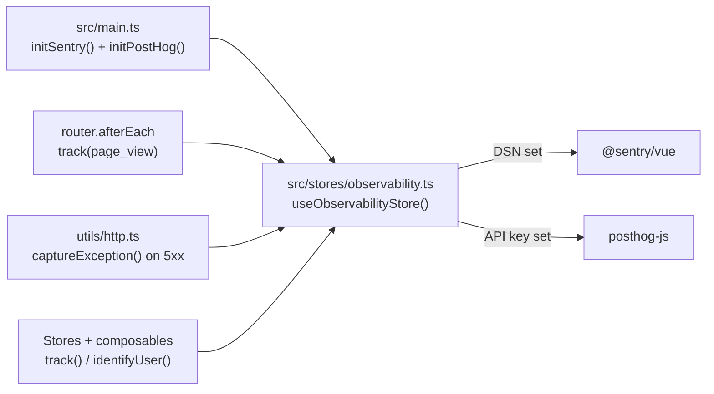

# Observability

The FE observability layer covers two complementary concerns, both wired into a **single Pinia store** at `src/stores/observability.ts`.

| Tool | Role |
| ---- | ---- |
| **Sentry** (`@sentry/vue`) | Crash reporting, performance tracing, session replay |
| **PostHog** (`posthog-js`) | Product analytics, event tracking, feature flags |

Both are no-ops when their env vars are absent, so local dev works without any external accounts.

## Architecture



## Initialization

Both tools are initialized in `src/main.ts` via the store:

```ts
const obs = useObservabilityStore();
obs.initSentry(router);   // no-op if VITE_SENTRY_DSN is absent
obs.initPostHog();        // no-op if VITE_POSTHOG_API_KEY is absent
```

## Sentry

### What it captures

- Unhandled JS exceptions (auto-instrumented by `@sentry/vue`)
- Navigation performance (via `browserTracingIntegration`)
- Session replays (via `replayIntegration` — text masked, media blocked by default)
- Manual exceptions via `captureException()` — called from `utils/http.ts` on `5xx` responses

### Environment variables

| Variable | Purpose |
| -------- | ------- |
| `VITE_SENTRY_DSN` | Sentry DSN — empty disables Sentry entirely |
| `VITE_SENTRY_ENVIRONMENT` | Environment tag (defaults to Vite `MODE`) |
| `VITE_SENTRY_TRACES_SAMPLE_RATE` | Performance trace sample rate `0`..`1` |
| `VITE_SENTRY_REPLAYS_SESSION_SAMPLE_RATE` | Session replay rate `0`..`1` (default `0.1`) |
| `VITE_SENTRY_REPLAYS_ON_ERROR_SAMPLE_RATE` | Replay-on-error rate `0`..`1` (default `1`) |
| `VITE_SENTRY_DEBUG` | Enable Sentry debug logging |

### External references

- [Sentry Vue guide](https://docs.sentry.io/platforms/javascript/guides/vue/)

---

## PostHog

### What it captures

- Custom product events via `track()`
- Page views via `router.afterEach` (automatic — do not call manually in views)
- User identity via `identifyUser()` after login

### Rules

- **No PII** — never send email, name, or personal data in event properties.
- **Use constants** from `analyticsEvents` — never hardcode event name strings.
- **Fire-and-forget** — never `await` a `track()` call.

### Event taxonomy

| Category | Events |
| -------- | ------ |
| Lifecycle | `app_started`, `app_ready` |
| Navigation | `page_view` |
| Auth | `user_signed_up`, `user_logged_in`, `user_logged_out` |
| Cart | `item_added_to_cart`, `item_removed_from_cart`, `cart_cleared` |
| Orders | `order_checkout_started`, `checkout_completed`, `order_placed` |
| Products | `product_viewed`, `product_searched` |
| Feedback | `feedback_submitted` |

### Environment variables

| Variable | Purpose |
| -------- | ------- |
| `VITE_POSTHOG_API_KEY` | PostHog project API key — empty disables PostHog |
| `VITE_POSTHOG_API_HOST` | PostHog host (default: `https://app.posthog.com`) |
| `VITE_POSTHOG_DEBUG` | Enable PostHog debug logging |

### External references

- [PostHog JS SDK](https://posthog.com/docs/libraries/js)

---

## Usage

All observability calls go through `useObservabilityStore()`. Never import `@sentry/vue` or `posthog-js` directly in components.

```ts
import { useObservabilityStore, analyticsEvents } from '@/stores/observability';

const obs = useObservabilityStore();

// Track a named event
obs.track(analyticsEvents.PRODUCT_VIEWED, { product_id: '123' });

// Convenience helpers
obs.trackProductView('123', 'Widget');
obs.trackItemAddedToCart('123', 2);
obs.trackOrderPlaced('order-abc', 49.99, 3);

// Identify user after login
obs.identifyUser(userId);

// Capture an exception manually
obs.captureException(error);

// Feature flag check
const isEnabled = obs.isFeatureEnabled('new-checkout-flow');
```

## Related pages

- [PostHog](./posthog.md)
- [Request Flow](../theory/request-flow.md)
- [Observability Endpoints](../api/observability.md)
