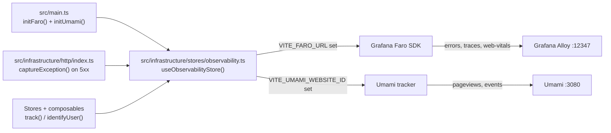

# Observability

The FE observability layer covers two complementary concerns, both wired into a **single Pinia store** at `src/infrastructure/stores/observability.ts`. Everything runs against a **self-hosted, local stack** (Docker/Podman) — there are no external SaaS accounts.

| Tool                                                                     | Role                                                      | Endpoint                                                        |
| ------------------------------------------------------------------------ | --------------------------------------------------------- | --------------------------------------------------------------- |
| **Grafana Faro** (`@grafana/faro-web-sdk` + `@grafana/faro-web-tracing`) | Error/crash monitoring, frontend tracing, Core Web Vitals | Grafana Alloy Faro receiver on `http://localhost:12347/collect` |
| **Umami** (`script.js` tracker)                                          | Product analytics — pageviews + custom events             | `http://localhost:3080`                                         |

Both are no-ops when their env vars are absent, so local dev works without the stack running. You verify the data in **Grafana** (`http://localhost:3001`, default `admin/admin`) and the **Umami dashboard** (`http://localhost:3080`).

> The browser **only ever talks to Alloy** on `:12347` (never directly to the OTel collector `:4318`, Loki, or Prometheus). Alloy fans the signals out to Loki/Tempo/Prometheus.

## Architecture


```mermaid
%%{init: {'flowchart': {'nodeSpacing': 50, 'rankSpacing': 65}}}%%
flowchart LR
    Main["src/main.ts\ninitFaro() + initUmami()"]
    Store["src/infrastructure/stores/observability.ts\nuseObservabilityStore()"]
    HTTP["src/infrastructure/http/index.ts\ncaptureException() on 5xx"]
    Components["Stores + composables\ntrack() / identifyUser()"]

    Main --> Store
    HTTP --> Store
    Components --> Store
    Store -->|VITE_FARO_URL set| Faro["Grafana Faro SDK"]
    Store -->|VITE_UMAMI_WEBSITE_ID set| Umami["Umami tracker"]
    Faro -->|errors, traces, web-vitals| Alloy["Grafana Alloy :12347"]
    Umami -->|pageviews, events| UmamiServer["Umami :3080"]
```

## Initialization

Both tools are initialized in `src/main.ts` via the store:

```ts
const obs = useObservabilityStore();
obs.initFaro(); // no-op if VITE_FARO_URL is absent
obs.initUmami(); // no-op if VITE_UMAMI_WEBSITE_ID is absent
```

## Grafana Faro

### What it captures

Registering `getWebInstrumentations()` automatically captures:

- Uncaught errors + unhandled promise rejections
- Console errors
- Core Web Vitals (LCP / CLS / INP …)
- Session tracking

The `TracingInstrumentation` opens a span for every `fetch`/XHR and **propagates the W3C `traceparent` header to the API origin** (`VITE_API_URL`). Because the header is propagated, a single trace spans _"button click in the browser → API handler → Mongoose query"_ inside Grafana/Tempo.

Manual exceptions go through `captureException()` — called from `src/infrastructure/http/index.ts` on `5xx` responses and from `router.onError`. Faro pushes them via `faro.api.pushError()`.

> **Backend note:** for traces to link, the API must allow the `traceparent` request header in its CORS config.

### Environment variables

| Variable                | Purpose                                                |
| ----------------------- | ------------------------------------------------------ |
| `VITE_FARO_URL`         | Alloy Faro receiver URL — empty disables Faro entirely |
| `VITE_FARO_APP_NAME`    | App name reported to Faro (default `frontend`)         |
| `VITE_FARO_APP_VERSION` | App version (default `1.0.0`)                          |
| `VITE_FARO_ENVIRONMENT` | Environment tag (default: Vite `MODE`)                 |

The trace-propagation origin is derived from `VITE_API_URL`.

### External references

- [Grafana Faro Web SDK](https://grafana.com/docs/grafana-cloud/monitor-applications/frontend-observability/faro-web-sdk/)

---

## Umami

### What it captures

- **Pageviews** — automatic. The tracker script hooks SPA history changes, so there is **no manual `page_view` event** in the router.
- **Custom product events** via `track()`.
- **User identity** via `identifyUser()` after login (best-effort; Umami `identify` is optional).

### Rules

- **No PII** — never send email, name, or personal data in event properties.
- **Fire-and-forget** — never `await` a `track()` call.
- **Check the backend first** — see below. Almost every event worth having belongs there.

### Event taxonomy

**This app emits no custom events at all**, and that is the design rather than an omission. Two
things cover the ground:

- **Pageviews**, including SPA route changes, are written by the Umami tag itself. There is nothing
  to call and nothing to maintain.
- **Web vitals, errors and a span per fetch/XHR** go to Faro, which is the better tool for each of
  them anyway.

**Everything else is the backend's**, emitted from the handler that decided the outcome — where an
extension cannot block it, a closing tab cannot lose it and a console cannot forge it. Reading one
Umami dashboard, the rule tells you which side produced a row without anyone maintaining a list:
**if an API call happens at that moment, the row is the backend's; otherwise it is a pageview.**
Signups, logins, logouts, every cart and wishlist mutation, checkout outcomes, orders and payments
are all emitted there.

The names live beside the controllers that fire them, in the backend's
`src/modules/<name>/analytics.ts` — deliberately not restated here. A list in this repo is a copy of
the other repo's data with nothing comparing the two, which is the same failure that once had both
sides emitting the same event; the last copy that lived here had already lost four names before
anyone noticed.

There is no `track()` on the store. An app built on this boilerplate that genuinely has a moment
only the browser can see adds one back — but check first that the backend cannot report the same
fact, because a name emitted from both sides writes two rows nothing downstream can tell apart.

### Environment variables

| Variable                | Purpose                                                            |
| ----------------------- | ------------------------------------------------------------------ |
| `VITE_UMAMI_WEBSITE_ID` | Umami website id (from the Umami dashboard) — empty disables Umami |
| `VITE_UMAMI_SRC`        | Tracker script URL (default `http://localhost:3080/script.js`)     |

### External references

- [Umami tracker](https://umami.is/docs/tracker-configuration)
- [Umami custom events](https://umami.is/docs/track-events)

---

## Usage

All observability calls go through `useObservabilityStore()`. Never import the Faro SDK or touch `window.umami` directly in components.

```ts
import { useObservabilityStore } from '@/infrastructure/stores/observability.ts';

const obs = useObservabilityStore();

// Identify the visitor after login, and drop the association on logout
obs.identifyUser(userId);
obs.unidentifyUser();

// Capture an exception manually (sent to Faro → Grafana)
obs.captureException(error);
```

## Verifying it works

- **Error:** throw a test error in the FE → see it in Grafana (Explore → Loki).
- **Trace:** load a page that calls the API → see one linked trace in Grafana (Explore → Tempo).
- **Event:** trigger a product event → see it in the Umami dashboard.

## Related pages

- [Umami](./umami.md)
- [Request Flow](../theory/request-flow.md)
- [Observability Endpoints](../api/observability.md)
