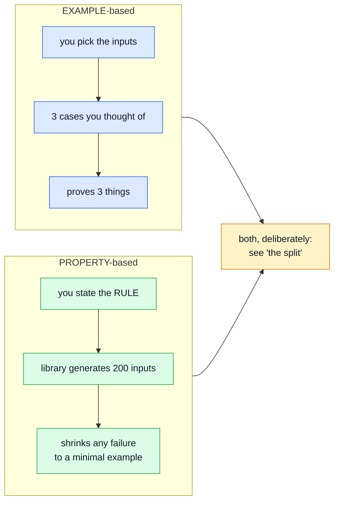

# Property-Based Testing

An ordinary test says _"for this input, expect that output."_ A property says _"for **every** input, this must hold."_ The library generates the inputs, and when it finds one that breaks the rule it shrinks it to the smallest example that still fails.

## The idea

Example-based tests encode the cases someone thought of. That is genuinely useful — an example is readable, it documents intent, and it pins a specific historical bug. But it is bounded by imagination, and the bugs that survive to production are usually the ones nobody imagined.

This repo learned the value the expensive way, before adopting the technique. `src/infrastructure/http/responseSchemaMap.ts` is a 52-row lookup table that was tested by sampling a handful of rows. It scored 55% on mutation with 182 survivors in that one file. Replacing the sample with exhaustive generation took the file to ~96% and the whole suite from 55% to 81%.

**Sampling a space you could have generated is the failure mode to watch for.** Property testing is the general form of that fix.

## What makes a good target

Pure, total, and rich in invariants:

| Target                   | Invariants worth stating                                                                                                              |
| ------------------------ | ------------------------------------------------------------------------------------------------------------------------------------- |
| `infrastructure/totals.ts`         | order-independent, non-negative, zero for empty, additive over concatenation, never `NaN`                                             |
| `models/serialize.ts`    | `_id` → `id` always, `__v` always gone, omitted keys always gone, never mutates its input, idempotent                                 |
| `repositories/search.ts` | `escapeRegex` never produces an uncompilable pattern, always matches its own input literally, strips every metacharacter of its power |

A function whose only "invariant" is its exact return value for one input is not a property target — write an example.

## Two rules, both about determinism

**Seed every run.** `fast-check` defaults to a random seed. That makes a failure irreproducible and, worse, makes a test that fails one run in fifty look like flake — and flake teaches a team to press retry. Every property file here fixes a seed at the top.

**Commit every counterexample.** When generation finds a failure, the property stays as the general rule and the specific input becomes an ordinary example with its seed in a comment. The property states what must be true; the example remembers what once was not.

## The split with example tests

Both kinds live side by side, and each owns what the other cannot say. The headers of the property files name the division explicitly, so nobody re-adds the overlap.

| The example file owns                                                                                  | The property file owns                                  |
| ------------------------------------------------------------------------------------------------------ | ------------------------------------------------------- |
| A named case per metacharacter — better diagnostics than a generated blob                              | Totality over arbitrary input                           |
| A **timing** assertion that a catastrophic pattern is defused — a property cannot measure elapsed time | Generated _combinations_, not one value at a time       |
| Specific historical inputs, and negatives like "`1.5` must not match `1x5`"                            | Algebraic laws: idempotence, non-mutation, monotonicity |

A fact asserted twice is a fact maintained twice — and it costs more than it looks in this repo, because a static mutant replays the entire suite (see [Mutation Testing](./mutation-testing.md)).

## What it has actually caught

Two things, and the second is the more instructive:

**A real bug, in the paired backend.** `sumLineItems` promised never to return `NaN`. `Number(x) || 0` rejects `NaN` because `NaN` is falsy — but `Infinity` is truthy and passes straight through, and `Infinity * 0` is `NaN`. One line with an infinite quantity poisoned an entire order total, which reaches a customer as a blank price. Found on the seventh generated case.

**A wrong test.** A property asserted that no sensitive value appears in `JSON.stringify(redacted)`. Generation produced the secret `"p"` — which occurs inside the _key_ `"password"`. The claim had never been about key names. The property was rewritten to walk the output's string values.

That second one is worth internalising: a property that fails on your own assertion is doing its job. It is the difference between "my test passes" and "my claim is true".

## Running budget

`numRuns` is deliberately modest. These execute on the pre-commit path, which is already the slower of the two repos' gates, and a property that needs ten thousand cases to find its bug belongs in a nightly, not a commit hook. Raise it while hunting something specific, not as a default.

## File map

| Path                                                    | Contents                                                          |
| ------------------------------------------------------- | ----------------------------------------------------------------- |
| `src/modules/orders/tests/unit/totals.property.test.ts` | Arithmetic invariants, totality against hostile line items        |
| `tests/cross-cutting/serialize.property.test.ts`        | Serializer guarantees over arbitrary document shapes              |
| `tests/cross-cutting/search.property.test.ts`           | `escapeRegex` as a denial-of-service control; pagination totality |
| `tests/cross-cutting/search-regex.test.ts`              | The example-based half — timing, named metacharacters, negatives  |

The same technique and the same two rules apply in the paired frontend, over `utils/formatters.ts` and `utils/uploads.ts`.

## Related pages

- [Unit Testing](./unit-testing.md) — the example-based layer these sit beside
- [Component Testing](./component-testing.md) — the other half of the unit suite
- [Mutation Testing](./mutation-testing.md) — how you find out whether either kind actually asserts anything
- [Testing & Docs](./testing-and-docs.md) — the map
