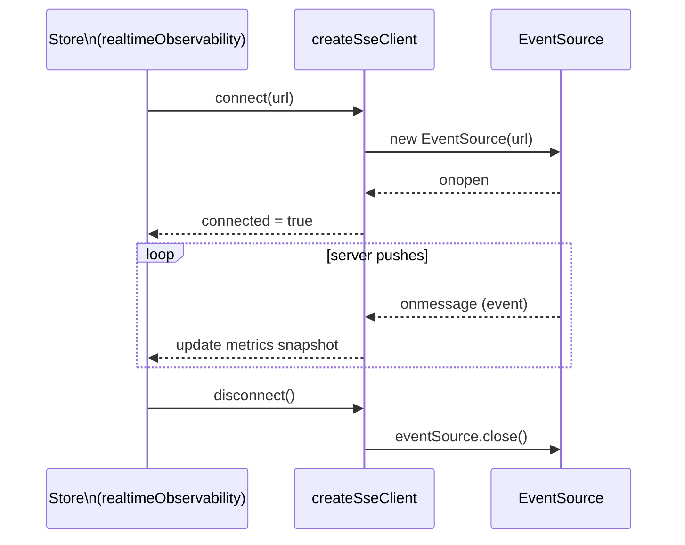

# Realtime (SSE)

The boilerplate exposes one realtime transport — Server-Sent Events — driven by contracts in `asyncapi.yaml` and demonstrated in the `RealtimePlayground` view (`/:locale/playground/realtime`).

Requires the admin role — non-admins are redirected Home by the route's `meta.access`, not by a
check inside the component. See [Sitemap & Access Control](../theory/sitemap.md). The gate exists
because the stream itself (`GET /observability/events`) is admin-only on the API side too — see
[Admin Dashboard](admin-dashboard.md).

## Transport at a glance

| Transport | URL env var | Direction | Use case |
| --------- | ----------- | --------- | -------- |
| **SSE** | `VITE_API_SSE` | server → client only | Live metrics / observability stream |

SSE is the only realtime transport: nothing on the FE needs to push over a persistent
connection, so everything client → server goes through the REST API instead.

## Where the code lives

| Concern | File |
| ------- | ---- |
| SSE client factory | `src/infrastructure/createSseClient.ts` |
| SSE composable | `src/modules/realtime/useRealtimeObservability.ts` |
| Observability SSE store + state | `src/modules/realtime/realtimeObservability.ts` |
| Generated realtime types | `src/types/realtime.generated.ts` (DO NOT edit) |
| App-level type helpers | `src/types/realtime.ts` |
| Route | `src/modules/realtime/views/RealtimePlayground.vue` |
| Route definition | `src/modules/realtime/routes.ts` |

## SSE client lifecycle



## Observability event contract

Event names come from `REALTIME_SSE_EVENT_NAMES`, generated into `src/types/realtime.generated.ts` — never hardcode the strings. `createSseClient` registers one listener per name so the browser dispatches each event type individually, and `ISseEventPayload<TEventName>` narrows the payload to the matching contract type.

**Server → Client**

| Event | Payload | When |
| ----- | ------- | ---- |
| `observability.metrics.snapshot` | `ObservabilityMetricsPayload` | Initial snapshot, sent on connect |
| `observability.metrics.updated` | `ObservabilityMetricsPayload` | Periodic metrics update |
| `observability.heartbeat` | `ObservabilityMetricsPayload` | Keep-alive heartbeat |

All three carry the same payload shape (timestamp, uptime, memory, HTTP counters, `realtime.sseClients`); the store keeps them apart so the feed can label each kind.

## AsyncAPI workflow

Regenerate types after editing `asyncapi.yaml`:

```bash
npm run gen:asyncapi
```

→ [AsyncAPI Workflow](../api/asyncapi-workflow.md)

## Dev strategy

- HTTP stays mocked by MSW (`VITE_API_MOCK_ENABLED=true`).
- SSE connects to a real URL (`VITE_API_SSE`) — a running backend is required to test it, or a lightweight fake `EventSource` in unit tests.
- Keep realtime logic in stores; keep the `RealtimePlayground` view thin.

## External references

- [EventSource / SSE (MDN)](https://developer.mozilla.org/en-US/docs/Web/API/EventSource)
- [AsyncAPI specification](https://www.asyncapi.com/docs/reference/specification/latest)

## Related pages

- [AsyncAPI Workflow](../api/asyncapi-workflow.md)
- [State & Routing](./state-and-routing.md)
- [Sitemap & Access Control](../theory/sitemap.md)
