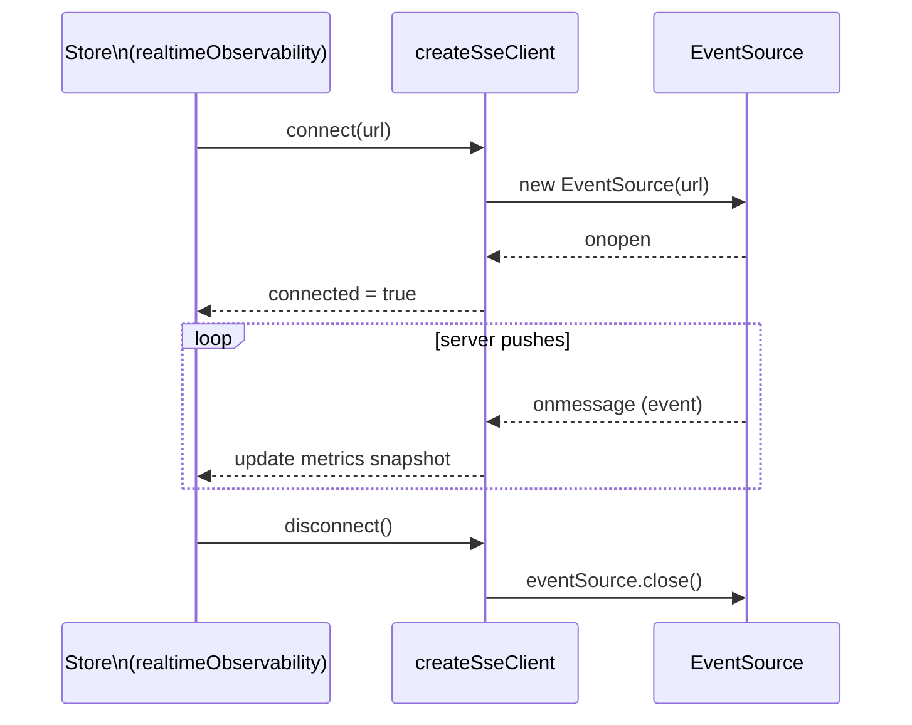

# Realtime (SSE)

::: tip Mechanism here, domain on its module page
The SSE client, its reconnection behaviour and the generated event types are here. What the `realtime` **module** is — one screen, one store, and why the transport is not part of it — is on [its module page](../modules/realtime.md).
:::

The boilerplate exposes one realtime transport — Server-Sent Events — driven by contracts in `asyncapi.yaml` and demonstrated in the `RealtimePlayground` view (`/:locale/playground/realtime`).

`asyncapi.yaml` here is the SHARED half of the backend's async contract:
`boilerplate-node-backend/asyncapi.public.yaml`, copied over verbatim. The backend's own document also declares RabbitMQ worker queues, and those
never reach this repo — a browser cannot open a broker connection, so their payload types would be a
contract this app carries and cannot honour. See [AsyncAPI Workflow](../api/asyncapi-workflow.md).

Requires the admin role — non-admins are redirected Home by the route's `meta.access`, not by a
check inside the component. See [Sitemap & Access Control](../theory/sitemap.md). The gate exists
because the stream itself (`GET /observability/events`) needs `platform.observability.read` on the
API side too — see
[Admin Dashboard](admin-dashboard.md).

## Transport at a glance

| Transport | URL env var    | Direction            | Use case                            |
| --------- | -------------- | -------------------- | ----------------------------------- |
| **SSE**   | `VITE_API_SSE` | server → client only | Live metrics / observability stream |

SSE is the only realtime transport: nothing on the FE needs to push over a persistent
connection, so everything client → server goes through the REST API instead.

## Where the code lives

| Concern                         | File                                                 |
| ------------------------------- | ---------------------------------------------------- |
| SSE client factory              | `src/infrastructure/create-sse-client.ts`            |
| SSE composable                  | `src/modules/realtime/use-realtime-observability.ts` |
| Observability SSE store + state | `src/modules/realtime/store.ts`                      |
| Generated realtime types        | `src/types/asyncapi.generated.ts` (DO NOT edit)      |
| App-level type helpers          | `src/types/realtime.ts`                              |
| Route                           | `src/modules/realtime/views/RealtimePlayground.vue`  |
| Route definition                | `src/modules/realtime/routes.ts`                     |

## SSE client lifecycle



## Observability event contract

Event names come from `REALTIME_SSE_EVENT_NAMES`, generated into `src/types/asyncapi.generated.ts` — never hardcode the strings. `createSseClient` registers one listener per name so the browser dispatches each event type individually, and `SseEventPayload<TEventName>` narrows the payload to the matching contract type.

**Server → Client**

| Event                            | Payload                       | When                              |
| -------------------------------- | ----------------------------- | --------------------------------- |
| `observability.metrics.snapshot` | `ObservabilityMetricsPayload` | Initial snapshot, sent on connect |
| `observability.metrics.updated`  | `ObservabilityMetricsPayload` | Periodic metrics update           |
| `observability.heartbeat`        | `ObservabilityMetricsPayload` | Keep-alive heartbeat              |

All three carry the same payload shape (timestamp, uptime, memory, HTTP counters, `realtime.sseClients`); the store keeps them apart so the feed can label each kind.

### Frames are checked against the contract

The types above are a compile-time promise; a frame off the wire is only a string. With
`VITE_VALIDATE_RESPONSES` on — the same switch that makes `orvalMutator` parse every REST
response, and on in the e2e build — `createSseClient` parses each frame's payload against the
schema `asyncapi.yaml` declares for its event. The generator emits those schemas as
`SSE_EVENT_PAYLOAD_SCHEMAS` (JSON Schema, every `$ref` inlined), and Zod's own `fromJSONSchema`
turns each into a validator on first use — nothing hand-written. A frame that fails is logged
with the fields that broke and dropped, never forwarded to the store.

**Where the stream is opened:** the e2e shard runner's runtime `__E2E_API_URL`, when set, wins
over the build-time `VITE_API_SSE` — the same precedence every REST call already has — so one
built bundle can stream from whichever shard's backend served the page.

## AsyncAPI workflow

Regenerate types after editing `asyncapi.yaml`:

```bash
npm run gen:asyncapi
```

→ [AsyncAPI Workflow](../api/asyncapi-workflow.md)

## Dev strategy

- HTTP goes to the same demo backend as everything else.
- SSE connects to a real URL (`VITE_API_SSE`) — a running backend is required to test it, or a lightweight fake `EventSource` in unit tests. `src/modules/realtime/tests/e2e/realtime.cy.ts` drives the real stream in the demo profile.
- Keep realtime logic in stores; keep the `RealtimePlayground` view thin.

## External references

- [EventSource / SSE (MDN)](https://developer.mozilla.org/en-US/docs/Web/API/EventSource)
- [AsyncAPI specification](https://www.asyncapi.com/docs/reference/specification/latest)

## Related pages

- [AsyncAPI Workflow](../api/asyncapi-workflow.md)
- [State & Routing](./state-and-routing.md)
- [Sitemap & Access Control](../theory/sitemap.md)
