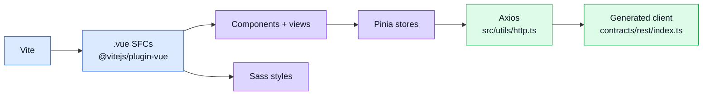

# Runtime

## Main runtime tools

| Tool | Why it is here | Repo role |
| ---- | -------------- | --------- |
| [Vue 3](https://vuejs.org/) | Reactive UI framework, Composition API, SFCs | source of all components and views in `src/` |
| [TypeScript](https://www.typescriptlang.org/) | Static types | source language; `vue-tsc` type-checks `.vue` files |
| [Node.js 22+](https://nodejs.org/) | JavaScript runtime | required for dev tooling (`vite`, `vitest`, `orval`, etc.) |
| [Vite](https://vite.dev/) | Dev server + production bundler | `vite.config.ts`; dev on `:8080`, production via `npm run build` |
| [@vitejs/plugin-vue](https://github.com/vitejs/vite-plugin-vue) | `.vue` SFC support in Vite | transforms SFCs in both dev and build |
| [vue-tsc](https://github.com/vuejs/language-tools/tree/master/packages/tsc) | TypeScript type-check for `.vue` files | runs in `npm run build` and CI |
| [Sass / sass-embedded](https://sass-lang.com/) | SCSS authoring | `src/styles/` global styles; design tokens from `@guebbit/css-toolkit` |
| [Axios](https://axios-http.com/) | HTTP client | used by the generated API client; interceptors in `src/utils/http.ts` |

## Runtime visual

## How to think about runtime here

- **Vite** owns the dev experience and production bundle — keep `vite.config.ts` minimal.
- **Vue 3 Composition API** is the only style used — no Options API.
- **Axios** is configured once in `src/utils/http.ts`; the generated client uses it transparently.
- **`vue-tsc`** runs in CI; fix type errors before merging.

## Path aliases

| Alias | Resolves to |
| ----- | ----------- |
| `@/` | `src/` |
| `@api` | `contracts/rest/index.ts` |
| `@api/schemas` | `contracts/rest/schemas.zod.ts` |

## Related pages

- [State & Routing](./state-and-routing.md)
- [Security](./security.md)
- [API overview](../api/)
- [Realtime](./websockets.md)
