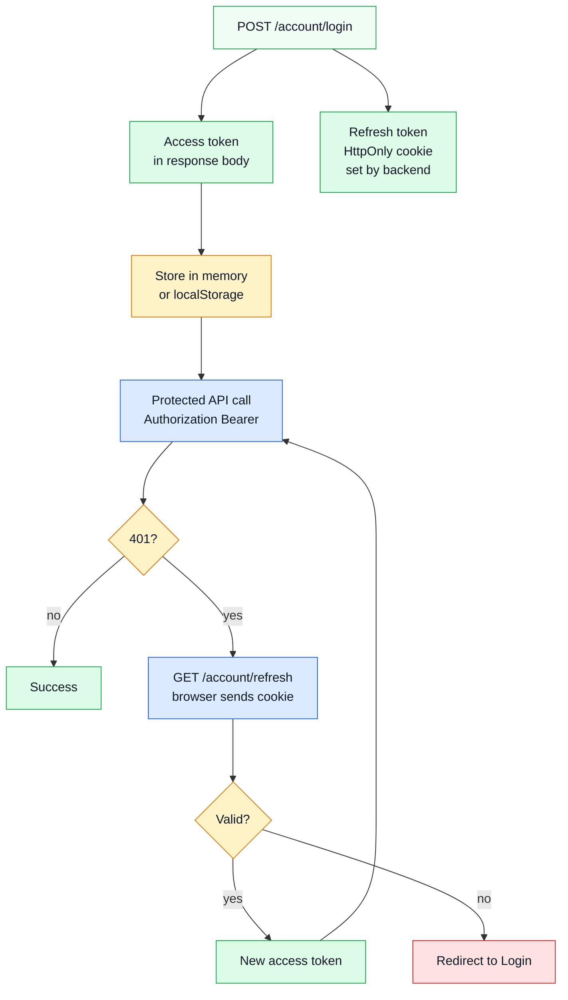

# Security

This page describes security from the **frontend perspective**: how the SPA stores and uses auth tokens, and how route guards enforce access control.

For the backend auth architecture (JWT signing, bcrypt, refresh token DB storage), see the [backend docs](https://github.com/Guebbit/boilerplate-node-backend).

## Auth token model (what the FE sees)

The backend uses a **split-token model**. The FE receives:

- **Access token** — short-lived JWT returned in the login response body. Sent on every protected API call as `Authorization: Bearer <token>`.
- **Refresh token** — longer-lived JWT stored in an `HttpOnly` cookie set by the backend. The browser sends it automatically on `GET /account/refresh`; the FE never reads it directly.

This keeps the refresh token out of JavaScript access (no `localStorage`, no `document.cookie`).

## Login → auth → refresh flow

## Where token logic lives

| Concern | File |
| ------- | ---- |
| Token storage + profile state | `src/stores/profile.ts` |
| Attaching Bearer token to requests | `src/utils/http.ts` (request interceptor) |
| Handling `401` responses | `src/utils/http.ts` (response interceptor) |
| Restoring auth on page reload | `src/middlewares/authentications.ts` → `tryRestoreAuth` |
| Route guards | `src/middlewares/authentications.ts` → `isAuth`, `isAdmin`, `isGuest` |

## Route guards

| Guard | Effect |
| ----- | ------ |
| `isAuth` | Must be logged in. Redirects to `/login?continue=<current-path>` on failure. |
| `isAdmin` | Must have admin role. Redirects to Home on failure. |
| `isGuest` | Must NOT be logged in. Redirects to Home if already authenticated. |

`tryRestoreAuth` runs on **every** navigation (`router.beforeEach`) and silently restores the token and profile from storage. This ensures public pages (e.g. `ProductsList`) render admin controls correctly after a hard reload.

## Interceptor error handling

| Status | What happens |
| ------ | ------------ |
| `401` | Redirect to Login with `?continue=` preserved; form-level actions show auth-focused messages |
| `403` | Show a clear "forbidden" message (never treated as a server error) |
| `5xx` | Navigate to `/error/500`; `captureException()` sends the error to Sentry |

## Security properties provided

- **Bearer transport**: access token is not auto-attached by the browser; every protected request must explicitly include it.
- **HttpOnly refresh cookie**: the refresh token is inaccessible to JavaScript, reducing XSS exposure.
- **`sameSite=lax`** (set by backend): reduces cross-site cookie sending in common CSRF scenarios.
- **No PII in analytics**: `useObservabilityStore()` rules forbid sending email, name, or personal data in PostHog events.

## External references

- [OWASP SPA Security Cheat Sheet](https://cheatsheetseries.owasp.org/cheatsheets/HTML5_Security_Cheat_Sheet.html)
- [OWASP JWT Cheat Sheet](https://cheatsheetseries.owasp.org/cheatsheets/JSON_Web_Token_for_Java_Cheat_Sheet.html)

## Related pages

- [Sitemap & Access Control](../theory/sitemap.md)
- [Request Flow](../theory/request-flow.md)
- [State & Routing](./state-and-routing.md)
