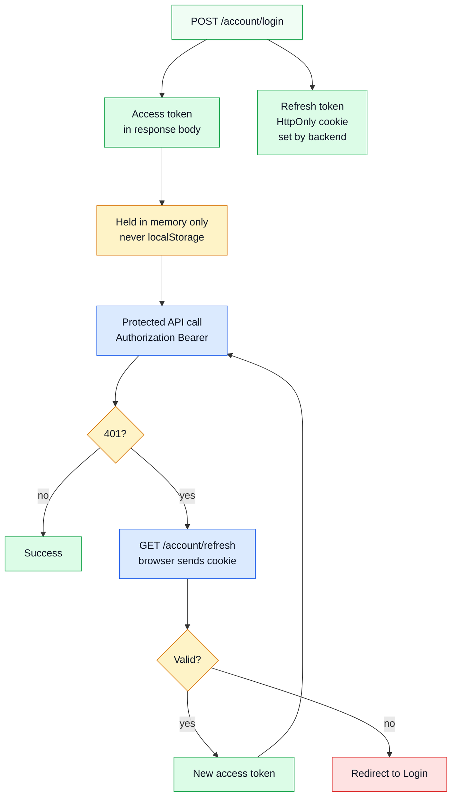

# Security

This page describes security from the **frontend perspective**: how the SPA stores and uses auth tokens, and how route guards enforce access control.

For the backend auth architecture (JWT signing, bcrypt, refresh token DB storage), see the [backend docs](https://github.com/Guebbit/boilerplate-node-backend).

## Auth token model (what the FE sees)

The backend uses a **split-token model**. The FE receives:

- **Access token** — short-lived JWT returned in the login response body. Sent on every protected API call as `Authorization: Bearer <token>`.
- **Refresh token** — longer-lived JWT stored in an `HttpOnly` cookie set by the backend. The browser sends it automatically on `GET /account/refresh`; the FE never reads it directly.

This keeps the refresh token out of JavaScript access (no `localStorage`, no `document.cookie`).

## Login → auth → refresh flow

```mermaid
%%{init: {'flowchart': {'nodeSpacing': 60, 'rankSpacing': 80}}}%%
flowchart TD
    A[POST /account/login] --> B[Access token\nin response body]
    A --> C[Refresh token\nHttpOnly cookie\nset by backend]
    B --> D[Held in memory only\nnever localStorage]
    D --> E[Protected API call\nAuthorization Bearer]
    E --> F{401?}
    F -- no --> G[Success]
    F -- yes --> H[GET /account/refresh\nbrowser sends cookie]
    H --> I{Valid?}
    I -- yes --> J[New access token]
    J --> E
    I -- no --> K[Redirect to Login]

    classDef entry fill:#f0fdf4,stroke:#16a34a,color:#111827;
    classDef token fill:#dcfce7,stroke:#16a34a,color:#111827;
    classDef store fill:#fef3c7,stroke:#d97706,color:#111827;
    classDef transport fill:#dbeafe,stroke:#2563eb,color:#111827;
    classDef decision fill:#fef3c7,stroke:#d97706,color:#111827;
    classDef success fill:#dcfce7,stroke:#16a34a,color:#111827;
    classDef error fill:#fee2e2,stroke:#dc2626,color:#111827;

    class A entry;
    class B,C token;
    class D store;
    class E,H transport;
    class F,I decision;
    class G,J success;
    class K error;
```

## Where token logic lives

| Concern                            | File                                                                                                           |
| ---------------------------------- | -------------------------------------------------------------------------------------------------------------- |
| Token storage + session state      | `src/infrastructure/session.ts` — the token, a `{ id, email, role, … }` projection, and the caller's own rules |
| The visitor's own account record   | `src/modules/account/stores/profile.ts`                                                                        |
| Attaching Bearer token to requests | `src/infrastructure/http/index.ts` (request interceptor)                                                       |
| Handling `401` responses           | `src/infrastructure/http/index.ts` (response interceptor)                                                      |
| Restoring auth on page reload      | `src/app/guards/authentications.ts` → `tryRestoreAuth`                                                         |
| Route guards                       | `src/app/guards/authentications.ts` → `canAccess`, `enforceRouteAccess`                                        |

## Route guards

A route declares its requirement once, on its own record; `enforceRouteAccess` runs globally in
`router.beforeEach` and applies `canAccess` to it. There is no `isAuth`/`isGuest` guard — one
predicate covers every case, and `AppNavigation` calls the same one to decide whether to show a
link, so a visible link can never bounce you.

The requirement has two halves, and they are ANDed:

| Field                         | Effect                                                                                                                              |
| ----------------------------- | ----------------------------------------------------------------------------------------------------------------------------------- |
| `meta.access` absent          | No standing required.                                                                                                               |
| `meta.access: 'auth'`         | Must be logged in. Redirects to `/login?continue=<current-path>` on failure.                                                        |
| `meta.access: 'guest'`        | Must NOT be logged in. Redirects to Home if already authenticated.                                                                  |
| `meta.can: [action, subject]` | Must hold that rule. Redirects to Home on failure — logging in again cannot grant a permission, so no `continue` target is offered. |

**There is no `admin` level, and that is the point.** A screen names the permission it needs —
`['update', 'Product']`, `['read', 'User']` — and the answer comes from the rules the API
published for this caller at `GET /account/abilities`, which are the same rules the server
enforces. A ladder of role names cannot express the model behind it: `warehouse` may move stock and
not answer a message, `support` may answer a message and not move stock — neither is "more
privileged" than the other — and the boolean that used to stand in for all of it could not say
_administrator of what_.

A rule always implies a session — rules are published for a caller the server identified — so a
stranger is refused before the abilities are consulted at all.

Every refusal notifies the visitor — silently bouncing someone reads as a broken link.

`tryRestoreAuth` runs first in the same `beforeEach` and silently restores the token (via the
refresh endpoint, gated on the `isAuth` cookie), then the viewer, then the rules that go with
them. This ensures public pages (e.g. `ProductsList`) render staff controls correctly after a hard
reload.

### The two scopes

`GET /account/abilities` answers **two** rule lists, and the store keeps them as two abilities:

| Ability           | What it covers                                                      | Who has any                                         |
| ----------------- | ------------------------------------------------------------------- | --------------------------------------------------- |
| `tenantAbility`   | this shop — products, orders, users, locales, webhooks, credentials | everyone, down to the `guest` role a stranger holds |
| `platformAbility` | the installation — health, metrics, the operational audit           | a platform operator, and nobody else                |

They are never merged. A tenant rule can never satisfy a platform key and the reverse is equally
impossible, so `session.can(action, subject)` asks each in turn: a subject is declared in exactly
one scope, so at most one of them can answer yes. That is what lets the observability dashboard be
gated on `['read', 'ObservabilitySnapshot']` like any other screen, instead of on a shop key that
merely correlated with it.

::: warning The client's copy has no authority
It decides what to RENDER, never what is allowed. Every request is re-evaluated server-side. An
empty ability — before the fetch lands, or after it fails — is the least-privileged answer, so a
slow network greys things out rather than opening them.
:::

## Interceptor error handling

| Status | What happens                                                                                 |
| ------ | -------------------------------------------------------------------------------------------- |
| `401`  | Redirect to Login with `?continue=` preserved; form-level actions show auth-focused messages |
| `403`  | Show a clear "forbidden" message (never treated as a server error)                           |
| `5xx`  | Navigate to `/error/500`; `captureException()` sends the error to Grafana Faro               |

## Security properties provided

- **Bearer transport**: access token is not auto-attached by the browser; every protected request must explicitly include it.
- **HttpOnly refresh cookie**: the refresh token is inaccessible to JavaScript, reducing XSS exposure.
- **`sameSite=lax`** (set by backend): reduces cross-site cookie sending in common CSRF scenarios.
- **No PII in Umami**: `identifyUser()` passes the email to Faro (this deployment's own error/session tool, for triage) but strips it before calling Umami's `identify()` — Umami markets itself as privacy-respecting, cookieless analytics, and gets the user id only.

## External references

- [OWASP SPA Security Cheat Sheet](https://cheatsheetseries.owasp.org/cheatsheets/HTML5_Security_Cheat_Sheet.html)
- [OWASP JWT Cheat Sheet](https://cheatsheetseries.owasp.org/cheatsheets/JSON_Web_Token_for_Java_Cheat_Sheet.html)

## Related pages

- [Sitemap & Access Control](../theory/sitemap.md)
- [Request Flow](../theory/request-flow.md)
- [State & Routing](./state-and-routing.md)
