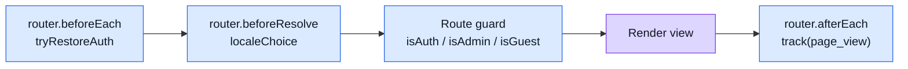

# State & Routing

This page covers the three libraries that manage reactive state, navigation, and localisation.

## Pinia (state management)

### Why it is here

Pinia is the official state management library for Vue 3. Stores hold reactive data and expose actions that call the generated API client. Views never call `api/index.ts` directly — they always go through a store or feature composable.

### Stores in this repo

| Store | File | Owns |
| ----- | ---- | ---- |
| Profile | `src/stores/profile.ts` | auth state, access token, current user, login/logout/refresh |
| Observability | `src/stores/observability.ts` | Sentry init, PostHog init, `track()`, `captureException()`, `identifyUser()` |
| Realtime chat | `src/stores/realtimeChat.ts` | WebSocket connection state, chat messages |
| Realtime observability | `src/stores/realtimeObservability.ts` | SSE connection, live metrics stream |
| Counter (example) | `src/stores/counter.ts` | minimal Pinia example |

Feature-level stores live inside `src/features/<feature>/composables/` and follow the same pattern.

### Usage pattern

```ts
// Always call useXYZStore() inside functions, not at top level
// Avoids circular dependency issues
const doSomething = () => {
    const profileStore = useProfileStore();
    profileStore.login({ email, password });
};
```

### External references

- [Pinia introduction](https://pinia.vuejs.org/introduction.html)
- [Pinia with Vue 3 Composition API](https://pinia.vuejs.org/core-concepts/)

---

## Vue Router

### Why it is here

Vue Router maps URL paths to view components in a SPA. All route definitions live in feature `routes.ts` files and are composed in `src/router/index.ts`.

### Locale prefix

Every route is nested under `/:locale`:

```
/:locale/               → Home
/:locale/products       → ProductsList
/:locale/admin          → Admin (admin only)
```

If the locale segment is absent, the `localeChoice` middleware injects the default locale (`VITE_APP_DEFAULT_LOCALE`) and redirects.

### Router lifecycle



### Error routing

| Situation | Outcome |
| --------- | ------- |
| Unknown path | Redirect to `Error` with `status=404` |
| `401` from HTTP interceptor | Redirect to `Login` with `?continue=<path>` |
| `403` from HTTP interceptor | Navigate to `Error` with `status=403` |
| `5xx` from HTTP interceptor | Navigate to `Error` with `status=500` |
| Unhandled `router.onError` | Navigate to `Error`; exception captured in Sentry |

### External references

- [Vue Router guide](https://router.vuejs.org/guide/)
- [Navigation guards](https://router.vuejs.org/guide/advanced/navigation-guards.html)

---

## Vue I18n

### Why it is here

Vue I18n externalises all user-facing strings into locale message files. Switching language is a single reactive update; no strings are hard-coded in components.

### Locale flow

1. URL contains `/:locale` segment (e.g. `/en/products`).
2. `localeChoice` middleware validates the locale against `VITE_APP_SUPPORTED_LOCALES`.
3. If invalid or absent, the default locale from `VITE_APP_DEFAULT_LOCALE` is injected.
4. Vue I18n's active locale is set to match; translations are loaded lazily.

### Message files

```
src/locales/
├── en.ts    ← default
├── it.ts
└── …
```

### External references

- [Vue I18n guide](https://vue-i18n.intlify.dev/guide/)

## Related pages

- [Security](./security.md)
- [Sitemap & Access Control](../theory/sitemap.md)
- [Request Flow](../theory/request-flow.md)
