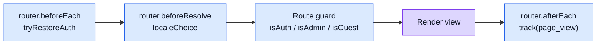

# State & Routing

This page covers the three libraries that manage reactive state, navigation, and localisation.

## Pinia (state management)

### Why it is here

Pinia is the official state management library for Vue 3. Stores hold reactive data and expose actions that call the generated API client. Views never call `contracts/rest/index.ts` directly — they always go through a store or a module composable.

### Stores in this repo

| Store | File | Owns |
| ----- | ---- | ---- |
| Session | `src/infrastructure/session.ts` | access token, `isAuth`/`isAdmin`, the `viewer` projection, refresh, logout-all |
| Account | `src/modules/account/store.ts` | the visitor's own `User` record: login, signup, password resets, profile edits |
| Observability | `src/infrastructure/observability.ts` | Faro init, Umami init, `track()`, `captureException()`, `identifyUser()` |
| Realtime observability | `src/modules/realtime/realtimeObservability.ts` | SSE connection state, live metrics stream |
| Counter (example) | `src/kernel/counter.ts` | minimal Pinia example |

Domain stores live inside `src/modules/<name>/store.ts` and follow the same pattern. They are
reached through the module's barrel (`@/modules/<name>`), never by their file path.

### Usage pattern

```ts
// Always call useXYZStore() inside functions, not at top level
// Avoids circular dependency issues
const doSomething = () => {
    const profileStore = useProfileStore();
    profileStore.login({ email, password });
};
```

### External references

- [Pinia introduction](https://pinia.vuejs.org/introduction.html)
- [Pinia with Vue 3 Composition API](https://pinia.vuejs.org/core-concepts/)

---

## Vue Router

### Why it is here

Vue Router maps URL paths to view components in a SPA. Each module declares its own `routes.ts` and contributes it through the registry; `src/kernel/router/index.ts` splices them in without naming a single domain.

### Locale prefix

Every route is nested under `/:locale`:

```
/:locale/               → Home
/:locale/products       → ProductsList
/:locale/admin          → Admin (admin only)
```

If the locale segment is absent, the `localeChoice` middleware injects the default locale (`VITE_APP_DEFAULT_LOCALE`) and redirects.

### Router lifecycle


```mermaid
%%{init: {'flowchart': {'nodeSpacing': 45, 'rankSpacing': 60}}}%%
flowchart LR
    Before["router.beforeEach\ntryRestoreAuth"] --> BeforeResolve["router.beforeResolve\nlocaleChoice"]
    BeforeResolve --> RouteGuard["Route guard\nisAuth / isAdmin / isGuest"]
    RouteGuard --> View["Render view"]
    View --> After["router.afterEach\ntrack(page_view)"]

    classDef hook fill:#dbeafe,stroke:#2563eb,color:#111827;
    classDef view fill:#ddd6fe,stroke:#7c3aed,color:#111827;
    class Before,BeforeResolve,RouteGuard,After hook;
    class View view;
```

### Error routing

| Situation | Outcome |
| --------- | ------- |
| Unknown path | Redirect to `Error` with `status=404` |
| `401` from HTTP interceptor | Redirect to `Login` with `?continue=<path>` |
| `403` from HTTP interceptor | Navigate to `Error` with `status=403` |
| `5xx` from HTTP interceptor | Navigate to `Error` with `status=500` |
| Unhandled `router.onError` | Navigate to `Error`; exception captured in Grafana Faro |

### External references

- [Vue Router guide](https://router.vuejs.org/guide/)
- [Navigation guards](https://router.vuejs.org/guide/advanced/navigation-guards.html)

---

## Vue I18n

### Why it is here

Vue I18n externalises all user-facing strings into locale message files. Switching language is a single reactive update; no strings are hard-coded in components.

### Locale flow

1. URL contains `/:locale` segment (e.g. `/en/products`).
2. `localeChoice` middleware validates the locale against `VITE_APP_SUPPORTED_LOCALES`.
3. If invalid or absent, the default locale from `VITE_APP_DEFAULT_LOCALE` is injected.
4. Vue I18n's active locale is set to match; translations are loaded lazily.

### Message files

Shared copy lives centrally; every domain ships its own and they are deep-merged into the active
locale at boot (decision D6 — merged at boot, not at build, so each dictionary stays a lazy chunk).

```
src/locales/                      ← shared: generic, navigation shell, error and home pages
├── en.json    ← default
└── it.json

src/modules/<name>/locales/       ← one domain's pages, forms and its own navigation.label-*
├── en.json
└── it.json
```

A module declares its dictionaries in `module.ts` (`locales: { en: () => import(…) }`);
`src/main.ts` hands them to `registerLocaleContributors` because `infrastructure/i18n.ts` may not import
`@/modules`. Deleting a domain removes its copy with it, rather than leaving orphan keys in a file
nobody dares prune.

### External references

- [Vue I18n guide](https://vue-i18n.intlify.dev/guide/)

## Related pages

- [Security](./security.md)
- [Sitemap & Access Control](../theory/sitemap.md)
- [Request Flow](../theory/request-flow.md)
