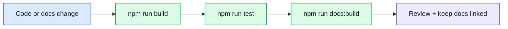

# Testing & Docs

## Quality tools

| Tool | Why it is here |
| ---- | -------------- |
| [Vitest](https://vitest.dev/) | Unit test runner built on Vite — same config, fast |
| [@vue/test-utils](https://test-utils.vuejs.org/) | Vue-specific component mounting and assertion helpers |
| [jsdom](https://github.com/jsdom/jsdom) | DOM environment for unit tests |
| [Cypress](https://www.cypress.io/) | Browser-based end-to-end tests |
| [start-server-and-test](https://github.com/bahmutov/start-server-and-test) | Boots Vite + waits before running Cypress |
| [MSW](https://mswjs.io/) | Intercepts HTTP in Cypress so e2e is deterministic (see [Mocking](./mocking.md)) |
| [ESLint](https://eslint.org/) + plugins | Code consistency and correctness checks |
| [Prettier](https://prettier.io/) | Predictable formatting |
| [VitePress](https://vitepress.dev/) | Documentation site + offline local search |
| [Mermaid](https://mermaid.js.org/) + [vitepress-plugin-mermaid](https://emersonbottero.github.io/vitepress-plugin-mermaid/) | ADHD-friendly visual diagrams |

## Testing layers

| Layer | Tool(s) | Where | Command |
| ----- | ------- | ----- | ------- |
| Unit | Vitest + @vue/test-utils + jsdom | `tests/unit/` | `npm run test:unit` |
| E2E | Cypress + MSW | `cypress/e2e/` | `npm run test:e2e` |

## Maintenance flow

## Test conventions

- Target **behavior**, not implementation — prefer component contracts (props/emits/slots) over snapshots.
- Use **generated Zod schemas** from `@api/schemas` for mock response validation in unit tests.
- E2E tests run with `VITE_API_MOCK_ENABLED=true` — never hit a real backend.

## Documentation rule of thumb

- Keep docs grouped by concept.
- Prefer visual maps when they help.
- Use the local search bar first when you only need to jump to one concept.
- Keep code comments brief and move long explanations here.

## External references

- [Vitest matchers](https://vitest.dev/api/expect.html) — assertion reference
- [@vue/test-utils guide](https://test-utils.vuejs.org/guide/) — mounting and querying components
- [Cypress best practices](https://docs.cypress.io/guides/references/best-practices) — selector and assertion guidance
- [Mermaid diagram syntax](https://mermaid.js.org/intro/syntax-reference.html) — for adding new diagrams to these docs

## Related pages

- [Mocking (MSW)](./mocking.md)
- [API](../api/)
