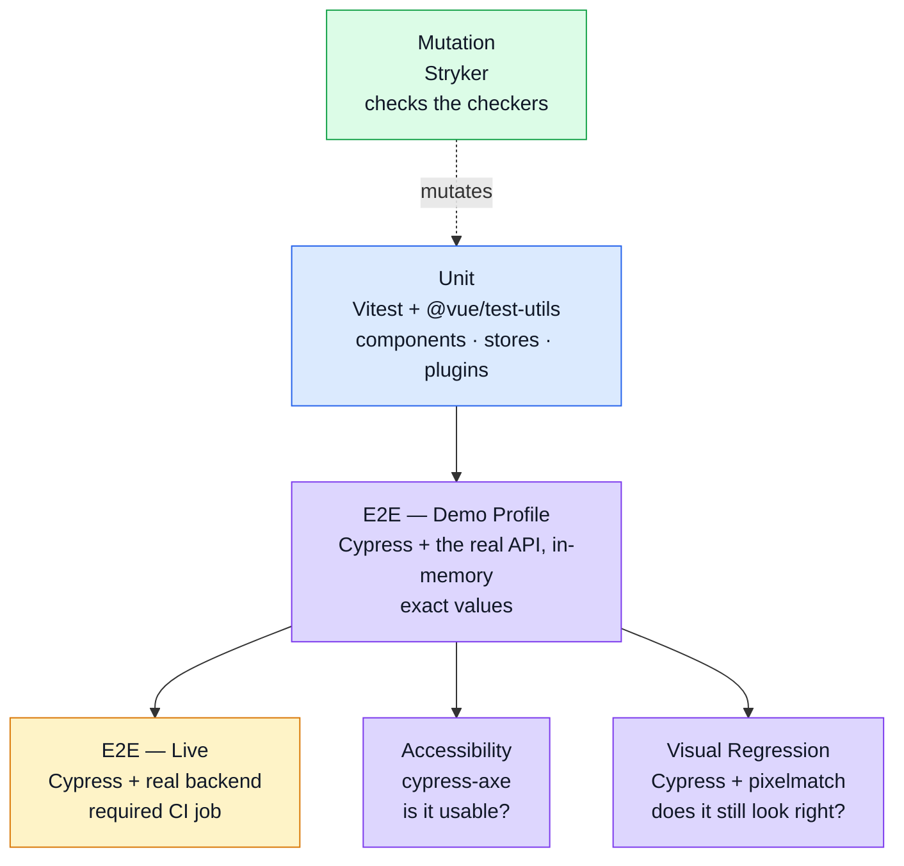
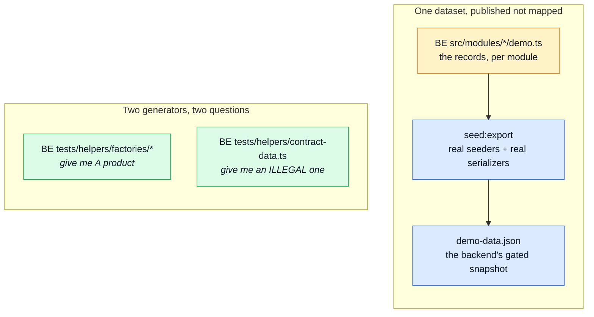
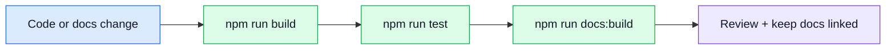

# Testing & Docs

This page is the map. Each layer has its own detail page — code, tools, patterns, file map and a diagram — linked from the table below and from "Related pages" at the bottom of every one of them, so you can start anywhere and always find your way back here.

## The layers, end to end


```mermaid
%%{init: {'flowchart': {'nodeSpacing': 50, 'rankSpacing': 60}}}%%
flowchart TB
    Unit["Unit\nVitest + @vue/test-utils\ncomponents · stores · plugins"]
    Demo["E2E — Demo Profile\nCypress + the real API, in-memory\nexact values"]
    Live["E2E — Live\nCypress + real backend\nrequired CI job"]
    A11y["Accessibility\ncypress-axe\nis it usable?"]
    Visual["Visual Regression\nCypress + pixelmatch\ndoes it still look right?"]
    Mutation["Mutation\nStryker\nchecks the checkers"]

    Unit --> Demo
    Demo --> Live
    Demo --> A11y
    Demo --> Visual
    Mutation -.mutates.-> Unit

    classDef fast fill:#dbeafe,stroke:#2563eb,color:#111827;
    classDef e2e fill:#ddd6fe,stroke:#7c3aed,color:#111827;
    classDef live fill:#fef3c7,stroke:#d97706,color:#111827;
    classDef meta fill:#dcfce7,stroke:#16a34a,color:#111827;
    class Unit fast;
    class Demo e2e;
    class A11y,Visual e2e;
    class Live live;
    class Mutation meta;
```

| Layer              | Question it answers                                                         | Tool(s)                                              | Command                                  | Detail page                                               |
| ------------------ | --------------------------------------------------------------------------- | ---------------------------------------------------- | ---------------------------------------- | --------------------------------------------------------- |
| Unit               | Does this one component/store/plugin behave correctly in isolation?         | Vitest + @vue/test-utils + jsdom                     | `npm run test:unit`                      | [Unit Testing](./unit-testing.md)                         |
| Component          | Does this `.vue` render, emit and **clean up** correctly?                   | @vue/test-utils                                      | `npm run test:unit` (same suite)         | [Component Testing](./component-testing.md)               |
| Property           | Does the rule hold for _every_ input, not just the ones someone thought of? | fast-check                                           | `npm run test:unit` (same suite)         | [Property Testing](./property-testing.md)                 |
| Cross-cutting      | Is the repository still the shape it claims to be?                          | Vitest, reading the filesystem                       | `npm run test:unit` (same suite)         | [Unit Testing](./unit-testing.md#the-cross-cutting-layer) |
| Accessibility      | Are there mechanical a11y failures on the routes a user reaches?            | cypress-axe                                          | `npm run test:e2e` (same suite)          | [Accessibility Testing](./accessibility-testing.md)       |
| Visual Regression  | Does the page still **look** the way it did?                                | Cypress + pixelmatch                                 | `npm run test:e2e:visual`                | [Visual Regression](./visual-regression.md)               |
| E2E — Demo Profile | Does the app behave correctly against **known** data?                       | Cypress + the real API on an in-memory Mongo, seeded | `npm run test:e2e`                       | [The demo profile](./demo-profile.md)                     |
| E2E — Live         | Does the frontend agree with the **actual** backend?                        | Cypress + real API                                   | `npm run test:e2e:live` (required in CI) | [Live E2E](./live-e2e.md)                                 |
| Mutation           | Do the tests **notice** when the source is wrong?                           | Stryker + vitest-runner                              | `npm run test:mutation`                  | [Mutation Testing](./mutation-testing.md)                 |

None of these layers replaces another — each closes a gap the others structurally cannot:

- **Unit** is fast and isolated, but a component that's individually correct can still be wired up wrong, or agree with a fixture that's drifted from reality.
- **Cross-cutting** tests no behaviour at all. It reads the filesystem and the manifests, and it is the only layer that can fail on a file **nobody wrote** — a module with no accessibility sweep, a store the coverage glob cannot see, a form missing the wiring that moves focus. Every one of those is invisible to a suite that can only run the code that exists.
- **Demo profile** runs the whole app against the real API — the paired backend's [demo profile](./demo-profile.md), one in-memory instance per shard — deterministic because the seeds are, so it can assert exact counts and values. The awkward shapes it needs (a soft-deleted product, an inactive one, one whose optional fields are all at their schema defaults) are records in the backend's demo dataset rather than generated: a named record can be asserted on, and it is a shape the real API actually answers with, because the real API is answering.
- **Live** runs the same specs against the fully-composed stack — the real cache, the real broker, a cookie over a real network — everything the demo profile deliberately disables. It needs both repos plus a Mongo and a Redis, so it is minutes rather than seconds; it still gates every PR, after the fast layers have had their say.
- **Mutation** doesn't test the app at all — it tests the _tests_, and only for the layer it's pointed at (unit).

## Reading a run

Every layer above answers "did it break". None of them answers **which module owns the break**, or **where the four minutes went** — the suites are organised by layer and the codebase is organised by module, so a raw log can never bridge the two.

`npm run test:report` does. It reads the JSON a run writes (`npm run test:unit:report`) and rolls it up:

```
[test-report] 1094 tests in 72 suites — 1094 passed, 0 failed (8.6s of suite time)

  module           suites  tests  failed     time
  account               4     47       0     0.2s
  products              4     34       0     0.1s
  (infrastructure)     30    771       0     6.1s

  slowest suites / slowest tests / line coverage per module / failures named by module
```

JSON rather than JUnit, and the choice is not incidental: Vitest emits both, Jest emits only JSON without a dependency, and JSON carries strictly more — per-assertion durations, ancestor titles, full failure messages. So the artefact is JSON and `scripts/report-test-results.ts` is the reader, **byte-identical in both repos** because Vitest's `json` reporter emits the shape Jest's `--json` does. `check:spec-identity` keeps the two copies honest.

If PR-line annotations are ever wanted, that is the moment to add a JUnit reporter _alongside_ this one, not to replace it.

A failing e2e shard additionally writes its whole Cypress output to `reports/e2e/shard-<n>.log`. That exists because stderr is the one copy that can be lost — piped through `tail`, truncated by a log limit — and when it is lost the failure is undiagnosable. It has already earned its keep.

## Where test data comes from

Four things across the two repos can hand you an entity, and each answers a question the others cannot.

| Source                           | Repo                  | What it is for                                                                                                                                                                                                                                                                                                                                                                                                                                                                                                                                                                        |
| -------------------------------- | --------------------- | ------------------------------------------------------------------------------------------------------------------------------------------------------------------------------------------------------------------------------------------------------------------------------------------------------------------------------------------------------------------------------------------------------------------------------------------------------------------------------------------------------------------------------------------------------------------------------------- |
| `db/demo/demo-data.json`         | both (byte-identical) | **The demo dataset, as the API answers it.** Every seeded row, serialized — ids, emails, admin flags, titles, prices, who has what in their cart and their orders, and the schema defaults each record actually ended up with. The one dataset a human sees when they open either app. **Produced and kept in the backend** by `npm run seed:export`, which seeds a throwaway database with the real seeders and reads it back through the real serializers. This repo holds no copy any more: the demo profile the suites run against seeds from the backend's own fixtures directly |
| `src/modules/<name>/demo.ts`     | BE                    | **The records themselves**, per module, before the schema and serializer have had their say. The file you edit to change what the demo data IS                                                                                                                                                                                                                                                                                                                                                                                                                                        |
| `src/modules/<name>/factory.ts`  | BE                    | **Arbitrary throwaway entities** — "give me _a_ product, I do not care which, and let me override one field". The opposite need to a fixed demo dataset, and one per module, beside the `demo.ts` that fixes the dataset. This repo has no equivalent yet; see the note below                                                                                                                                                                                                                                                                                                         |
| `tests/support/contract-data.ts` | BE                    | **Payloads derived from the zod schemas**, valid and — uniquely — invalid, each violating exactly one declared constraint. The only source that can produce something the API is supposed to _reject_                                                                                                                                                                                                                                                                                                                                                                                 |

Reading it as a shape: **one** dataset, authored once and published as the API's own output, plus **two** generators that exist because "the demo data" and "some data" and "deliberately illegal data" are three different questions.

There is no mapper on either side, and that is the property worth protecting. The two repos used to share a file of plain FACTS and map it separately, and the two mappers drifted silently: this one invented `active: true` to mirror a backend default nobody had checked, and carried no `locale` at all. Publishing the API's output instead of the inputs killed that class of bug — there is only one mapper now, and it is the API's.


```mermaid
%%{init: {'flowchart': {'nodeSpacing': 45, 'rankSpacing': 55}}}%%
flowchart TB
    subgraph one["One dataset, published not mapped"]
        direction TB
        Records["BE src/modules/*/demo.ts<br/>the records, per module"]
        Records --> Export["seed:export<br/>real seeders + real serializers"]
        Export --> Dataset["demo-data.json<br/>the backend's gated snapshot"]
    end

    subgraph two["Two generators, two questions"]
        direction TB
        Factories["BE tests/helpers/factories/*<br/><i>give me A product</i>"]
        ContractData["BE tests/helpers/contract-data.ts<br/><i>give me an ILLEGAL one</i>"]
    end

    classDef source fill:#fef3c7,stroke:#d97706,color:#111827;
    classDef mapper fill:#dbeafe,stroke:#2563eb,color:#111827;
    classDef gen fill:#dcfce7,stroke:#16a34a,color:#111827;
    class Records source;
    class Export,Dataset mapper;
    class Factories,ContractData gen;
```

### The three questions, and why none absorbs another

- **"Give me _the_ demo data."** → `demo-data.json`, changed through the `demo.ts` of the backend module that owns the records and republished with `npm run seed:export`. Fixed, shared, and the one a human sees on screen. `cy.loginAs('user')` types these credentials into a real form, so it cannot be randomised or generated. A shape the demo data cannot currently produce is a record to ADD, not a generator to introduce.
- **"Give me _a_ product, I do not care which."** → the backend's `factories/*`. The opposite need: fresh, isolated, overridable per test, and never the demo data — 25 test files there would interfere with each other if they shared rows.
- **"Give me one the API must _reject_."** → the backend's `contract-data.ts`. Derived from the zod schemas so each payload violates exactly one declared constraint. Nothing else can produce something deliberately illegal, which is the difference between a contract test and a fixture.

Merging any two would mean one of those questions stops being asked. The merge that _was_ worth doing — the demo dataset, previously written out by hand on both sides — is the one already done.

**The one gap:** this repo has no counterpart to the backend's per-module `factory.ts`, so "give me a product" is hand-rolled wherever it is needed — `src/modules/products/tests/store.spec.ts` carries its own literal. One literal is not yet a pattern; worth folding into a shared builder when a second call site appears.

## What each layer can and cannot catch

Worth being explicit, because the boundary has bitten this project before.

| Failure                                                                                                         | Caught by                                                                                                                                               |
| --------------------------------------------------------------------------------------------------------------- | ------------------------------------------------------------------------------------------------------------------------------------------------------- |
| Component or store logic error                                                                                  | [Unit Testing](./unit-testing.md)                                                                                                                       |
| A component that leaks a resource, or confuses idle with zero                                                   | [Component Testing](./component-testing.md)                                                                                                             |
| A rule that holds for the tested inputs but not for all of them                                                 | [Property Testing](./property-testing.md)                                                                                                               |
| A control with no accessible name, an image with no alt text                                                    | [Accessibility Testing](./accessibility-testing.md)                                                                                                     |
| A layout shift, a dropped stylesheet, a font that failed to load — every DOM assertion still passing            | [Visual Regression](./visual-regression.md)                                                                                                             |
| A test that asserts nothing                                                                                     | [Mutation Testing](./mutation-testing.md)                                                                                                               |
| Wrong response **shape** from the API                                                                           | response validation — `orvalMutator` parses every response against the generated Zod schema in every profile but Vitest — see [Live E2E](./live-e2e.md) |
| Generated client out of step with `openapi.yaml`                                                                | the `api-freshness` CI job                                                                                                                              |
| App breaks on unusual but valid data (a record with every optional field at its default, an unusual role split) | add the record to the backend's demo dataset — [The demo profile](./demo-profile.md)                                                                    |
| The demo dataset disagreeing with what the real backend answers, or a live contract violation                   | [Live E2E](./live-e2e.md) — the `test-e2e-live` CI gate, plus response validation                                                                       |

Both e2e profiles run the real backend, so "does this frontend agree with that backend" is answered by construction rather than by a reviewer checking a handler against a service. What the two profiles split between them is infrastructure: the demo profile answers fast with the cache and queue disabled, the live profile answers on every PR with everything attached. See [The demo profile](./demo-profile.md) and [Live E2E](./live-e2e.md).

## Test timings

Measured 2026-08-14 on a 16-core / 30 GB machine. They are here so a number that doubles is visible
as a regression rather than as "tests feel slow lately" — treat them as an order of magnitude, not a
promise.

| Command                   | Time       | What it runs                                                                             |
| ------------------------- | ---------- | ---------------------------------------------------------------------------------------- |
| `npm run test:unit`       | **~8s**    | 70 files, 1043 tests, jsdom                                                              |
| `npm run test:e2e`        | **~3m30s** | 17 specs, 136 tests, sharded across `E2E_SHARDS` Cypress processes                       |
| `npm run complete`        | **~5m**    | the gate: lint + both spec lints + format + contract identity + build + all of the above |
| `npm run test:mutation`   | ~9m        | 2182 mutants, incremental; nightly in CI                                                 |
| `npm run test:e2e:visual` | ~1m        | pixel diffs — `complete:manual`, not the gate                                            |
| `npm run test:e2e:live`   | ~13m       | the full suite against a real backend — `complete:manual`, sequential                    |

**Cypress is the gate**, and the reason `test:e2e` is sharded. Sequentially those 17 specs take
**12m54s** on one core; `scripts/run-e2e-shards.ts` splits them across processes sharing one preview server.
`npm run test:e2e:serial` keeps the old behaviour for when an interleaved failure is hard to read.

Measured on the 16-core / 30 GB machine, same 17 specs:

| `E2E_SHARDS`          | Wall-clock | Result                  |
| --------------------- | ---------- | ----------------------- |
| 1 (`test:e2e:serial`) | 774s       | green                   |
| **4**                 | **214s**   | **green — the default** |
| 6                     | 158s       | **2 shards failed**     |

**More shards is not simply better.** At six, six Chrome instances took the machine to 1.6 GB free
and two shards failed on commands exceeding a 15-second timeout — a budget already four times
Cypress's default, so that is starvation rather than a tight setting. Four leaves headroom and the
box stays usable while it runs. Raise it only with the memory measured, not the core count.

Two further limits:

- **Wall-clock cannot go below the longest single spec** — `uploads.cy.ts` at ~86s. Even a perfect
  split cannot beat it, which is what caps the return well before the core count does.
- **The live profile is never sharded.** `cy.resetState()` re-seeds the paired backend's real
  database there, which every shard would reset out from under the others. The script refuses rather
  than trusting the caller to remember.

## Quality tools

| Tool                                                                                                                        | Why it is here                                                               |
| --------------------------------------------------------------------------------------------------------------------------- | ---------------------------------------------------------------------------- |
| [Vitest](https://vitest.dev/)                                                                                               | Unit test runner built on Vite — same config, fast                           |
| [@vue/test-utils](https://test-utils.vuejs.org/)                                                                            | Vue-specific component mounting and assertion helpers                        |
| [jsdom](https://github.com/jsdom/jsdom)                                                                                     | DOM environment for unit tests                                               |
| [Cypress](https://www.cypress.io/)                                                                                          | Browser-based end-to-end tests, both profiles plus the visual suite          |
| [start-server-and-test](https://github.com/bahmutov/start-server-and-test)                                                  | Boots Vite + waits before running Cypress                                    |
| [MSW](https://mswjs.io/)                                                                                                    | Node adapter standing in for a server in the transport-layer unit specs only |
| [Stryker](https://stryker-mutator.io/)                                                                                      | Mutation testing — see [Mutation Testing](./mutation-testing.md)             |
| [ESLint](https://eslint.org/) + plugins                                                                                     | Code consistency and correctness checks                                      |
| [Prettier](https://prettier.io/)                                                                                            | Predictable formatting                                                       |
| [VitePress](https://vitepress.dev/)                                                                                         | Documentation site + offline local search                                    |
| [Mermaid](https://mermaid.js.org/) + [vitepress-plugin-mermaid](https://emersonbottero.github.io/vitepress-plugin-mermaid/) | ADHD-friendly visual diagrams                                                |

## Maintenance flow


```mermaid
%%{init: {'flowchart': {'nodeSpacing': 45, 'rankSpacing': 60}}}%%
flowchart LR
    Change[Code or docs change] --> Build[npm run build]
    Build --> Test[npm run test]
    Test --> Docs[npm run docs:build]
    Docs --> Review[Review + keep docs linked]

    classDef work fill:#dbeafe,stroke:#2563eb,color:#111827;
    classDef checks fill:#dcfce7,stroke:#16a34a,color:#111827;
    classDef finish fill:#ede9fe,stroke:#7c3aed,color:#111827;
    class Change work;
    class Build,Test,Docs checks;
    class Review finish;
```

`npm run test` runs `test:unit` then `test:e2e` — the two layers fast and deterministic enough to gate a PR. The live profile and mutation testing are run separately, by hand or on a schedule; see each one's own page for why.

## Test conventions

- Target **behavior**, not implementation — prefer component contracts (props/emits/slots) over snapshots.
- Use **generated Zod schemas** from `@api/schemas` for mock response validation in unit tests.
- By default, e2e tests run against per-shard demo backends — the real API, in-memory. `npm run test:e2e:live` runs the same specs against the fully-composed stack — see [Live E2E](./live-e2e.md).
- Specs start **logged out**: `cy.resetState()` reseeds the shard's own demo backend (demo profile) or the real database (live profile). Call `cy.loginAs('admin')` when a spec needs elevated visibility.
- Specs move through the chrome by **path, never by label**: `cy.navigateTo('/en/products')` for the bar, `cy.navigateViaMenu('account' | 'admin', path)` for an entry folded into a menu, `cy.logout()` to end the session. A label is translated copy; the `href` is what the entry is in every locale.
- **An assertion on a count is an assertion about a role.** Non-admins see 4 of the 6 seeded products (one is soft-deleted, one inactive). If you change an expected count, confirm you are still describing what the backend would return.

## Documentation rule of thumb

- Keep docs grouped by concept.
- Prefer visual maps when they help.
- Use the local search bar first when you only need to jump to one concept.
- Keep code comments brief and move long explanations here.

## External references

- [Vitest matchers](https://vitest.dev/api/expect.html) — assertion reference
- [@vue/test-utils guide](https://test-utils.vuejs.org/guide/) — mounting and querying components
- [Cypress best practices](https://docs.cypress.io/guides/references/best-practices) — selector and assertion guidance
- [Mermaid diagram syntax](https://mermaid.js.org/intro/syntax-reference.html) — for adding new diagrams to these docs

## Gate or hunter

Worth naming explicitly, because it decides where a suite runs and how a failure is read.

A **gate** answers a yes/no question definitively enough to block a merge. Unit, component, property, the mock e2e profile, the a11y pass and the **live e2e profile** are gates: a failure means "do not merge this".

A **hunter** goes looking for problems nobody asked about. Mutation testing is the hunter: slower, nightly, and a failure is usually a **finding to read** rather than a merge to stop. A hunter wired as a gate gets switched off the first week it is inconvenient — which is why it lives in its own workflow file, where it cannot become a PR gate by accident.

Note that "gate" is about the strength of the answer, not its speed. The live profile is minutes rather than seconds and gates anyway, because it is the only layer that can answer "does this frontend agree with that backend" — and a question that important, answered only nightly, is answered too late. It still runs _after_ the fast gates, so an ordinary regression is caught in seconds and never reaches it.

The live profile keeps a nightly schedule as well, and that run is a hunter: it asks whether `main` still agrees with the backend's default branch, which no PR run can, because the backend moves on its own.

The corollary: a green pull request is a claim that this frontend and that backend agreed at that moment. It is not a claim that the mutation run is happy.

## Deliberately not done

Recorded rather than dropped silently, because "absent" and "rejected for a reason" look identical in
a codebase. The backend keeps the same list, in its own `docs/tools/testing-and-docs.md`, and the
reasoning is shared; what differs is the frontend-specific shape of each.

### Performance testing

**What it is.** Every layer above asks "is the answer correct?". This one asks "is it _fast enough_",
and on a frontend that splits into two unrelated questions:

| Kind         | Question                                                                                      | Typical tool              |
| ------------ | --------------------------------------------------------------------------------------------- | ------------------------- |
| **Runtime**  | Does this list still render in one frame with 500 rows, or did a `computed` become quadratic? | a benchmark harness       |
| **Delivery** | Did the bundle grow 400 KB, and did Largest Contentful Paint move?                            | Lighthouse CI, size-limit |

**Why it is not here.** The demo's data volumes are fixtures — a handful of products and orders — so
any threshold measured against them is inherited by forks as authoritative while describing nothing
they will experience. Timing numbers are also a property of the machine, and on a shared CI runner a
render benchmark largely measures the runner; that flakiness is what gets a job disabled.

**What would change it.** In a fork with real page weights and a real device profile, the **delivery**
half is the one to add first — a bundle-size budget is deterministic, cheap, and catches the single
most common frontend regression (an accidental import pulling a library into the main chunk). It does
not need the load rig that runtime benchmarking does.

### Diff coverage as a separate gate

Superseded here by two existing gates: `coverage.thresholds.perFile` answers "is this code executed",
and the per-file mutation baseline answers "did the tests get weaker". A third gate over the same
ground buys CI complexity and a second number to argue about. It becomes the right tool if a large
untested area ever lands below the floors, where fixing history is not realistic.

### Type-level tests

Assertions about types rather than values — that a prop signature did not widen to `any`, that a
generic infers correctly. They earn their place when the types **are** the product, as in a published
library. Here the public contract is `openapi.yaml`, and the types over it are _generated_ by orval
rather than hand-written, then checked by `check:spec-identity` against the backend's copy. Writing
type assertions over generated types mostly tests the generator.

### Incremental mutation mode

Stryker can cache per-mutant results and re-test only what a diff touched. Not enabled: the cache
invalidates far more broadly than intuition suggests, so the saving is unpredictable rather than
proportional to the diff, and a stale-but-trusted cache reports green for mutants nobody re-ran. Worth
revisiting if mutation ever moves from nightly onto pull requests.

## Related pages

- [Unit Testing](./unit-testing.md)
- [The demo profile](./demo-profile.md)
- [Live E2E (FE ↔ real backend)](./live-e2e.md)
- [Component Testing](./component-testing.md) — resources, boundaries, and why not to select on vendor classes
- [Property Testing](./property-testing.md) — generation over enumeration
- [Accessibility Testing](./accessibility-testing.md) — what automated a11y can and cannot tell you
- [Mutation Testing](./mutation-testing.md)
- [API](../api/)
