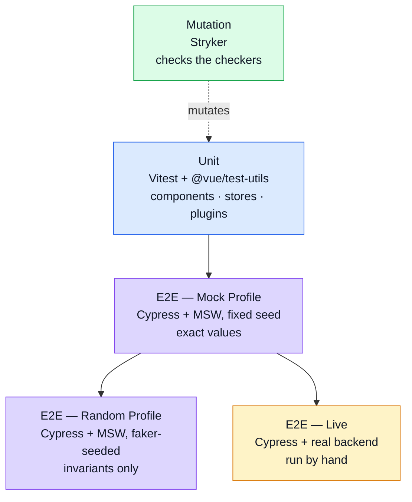
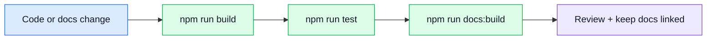

# Testing & Docs

This page is the map. Each layer has its own detail page — code, tools, patterns, file map and a diagram — linked from the table below and from "Related pages" at the bottom of every one of them, so you can start anywhere and always find your way back here.

## The layers, end to end

```mermaid
%%{init: {'flowchart': {'nodeSpacing': 50, 'rankSpacing': 60}}}%%
flowchart TB
    Unit["Unit\nVitest + @vue/test-utils\ncomponents · stores · plugins"]
    Mock["E2E — Mock Profile\nCypress + MSW, fixed seed\nexact values"]
    Random["E2E — Random Profile\nCypress + MSW, faker-seeded\ninvariants only"]
    Live["E2E — Live\nCypress + real backend\nrun by hand"]
    Mutation["Mutation\nStryker\nchecks the checkers"]

    Unit --> Mock
    Mock --> Random
    Mock --> Live
    Mutation -.mutates.-> Unit

    classDef fast fill:#dbeafe,stroke:#2563eb,color:#111827;
    classDef e2e fill:#ddd6fe,stroke:#7c3aed,color:#111827;
    classDef live fill:#fef3c7,stroke:#d97706,color:#111827;
    classDef meta fill:#dcfce7,stroke:#16a34a,color:#111827;
    class Unit fast;
    class Mock,Random e2e;
    class Live live;
    class Mutation meta;
```

| Layer | Question it answers | Tool(s) | Command | Detail page |
| --- | --- | --- | --- | --- |
| Unit | Does this one component/store/plugin behave correctly in isolation? | Vitest + @vue/test-utils + jsdom | `npm run test:unit` | [Unit Testing](./unit-testing.md) |
| E2E — Mock Profile | Does the app behave correctly against **known** data? | Cypress + MSW, fixed seed | `npm run test:e2e` | [Mocking (MSW)](./mocking.md) |
| E2E — Random Profile | Does the app survive **any** contract-valid data? | Cypress + MSW, faker-seeded | `npm run test:e2e:random` | [E2E — Random Profile](./e2e-random-profile.md) |
| E2E — Live | Does the frontend agree with the **actual** backend? | Cypress + real API, hand-run | `npm run test:e2e:live` | [Live E2E](./live-e2e.md) |
| Mutation | Do the tests **notice** when the source is wrong? | Stryker + vitest-runner | `npm run test:mutation` | [Mutation Testing](./mutation-testing.md) |

None of the four testing layers replaces another — each closes a gap the others structurally cannot:

- **Unit** is fast and isolated, but a component that's individually correct can still be wired up wrong, or agree with a mock that's drifted from reality.
- **Mock profile** proves the app agrees with its own MSW handlers — deterministic, so it can assert exact counts and values — but it cannot prove those handlers agree with the real API.
- **Random profile** proves the app doesn't fall over on data the fixed seed can't produce by construction (an empty optional field, an unusual role split) — but by design it can't assert exact values, so it can't replace the mock profile either.
- **Live** is the only layer that checks the mocks against reality, but it needs a hand-booted paired backend, so it can't run on every commit the way the others do.
- **Mutation** doesn't test the app at all — it tests the *tests*, and only for the layer it's pointed at (unit).

## What each layer can and cannot catch

Worth being explicit, because the boundary has bitten this project before.

| Failure | Caught by |
| --- | --- |
| Component or store logic error | [Unit Testing](./unit-testing.md) |
| A test that asserts nothing | [Mutation Testing](./mutation-testing.md) |
| Wrong response **shape** from a mock | `assertMockContract` in every handler, generated **strict** — see [Mocking](./mocking.md) |
| Generated client out of step with `openapi.yaml` | the `api-freshness` CI job |
| App breaks on unusual but valid data (missing optional field, an unusual role split) | [E2E — Random Profile](./e2e-random-profile.md) |
| Mock **behaviour** disagreeing with the real backend, or a live contract violation | [Live E2E](./live-e2e.md) — response validation + `parity.cy.ts` |

The last row used to read "nothing yet". The mock-profile suite proves the frontend agrees with its own mocks; on its own it cannot prove the mocks agree with the backend — that gap is now closed structurally by the live profile rather than by review alone, though it still only runs when someone runs it by hand (see [Live E2E](./live-e2e.md) for why it isn't in CI). A mock handler must still name the backend service it mirrors — see the parity invariants in [Mocking](./mocking.md).

## Quality tools

| Tool | Why it is here |
| ---- | -------------- |
| [Vitest](https://vitest.dev/) | Unit test runner built on Vite — same config, fast |
| [@vue/test-utils](https://test-utils.vuejs.org/) | Vue-specific component mounting and assertion helpers |
| [jsdom](https://github.com/jsdom/jsdom) | DOM environment for unit tests |
| [Cypress](https://www.cypress.io/) | Browser-based end-to-end tests, all three profiles |
| [start-server-and-test](https://github.com/bahmutov/start-server-and-test) | Boots Vite + waits before running Cypress |
| [MSW](https://mswjs.io/) | Intercepts HTTP in Cypress so the mock and random profiles are deterministic (see [Mocking](./mocking.md)) |
| [Stryker](https://stryker-mutator.io/) | Mutation testing — see [Mutation Testing](./mutation-testing.md) |
| [ESLint](https://eslint.org/) + plugins | Code consistency and correctness checks |
| [Prettier](https://prettier.io/) | Predictable formatting |
| [VitePress](https://vitepress.dev/) | Documentation site + offline local search |
| [Mermaid](https://mermaid.js.org/) + [vitepress-plugin-mermaid](https://emersonbottero.github.io/vitepress-plugin-mermaid/) | ADHD-friendly visual diagrams |

## Maintenance flow

```mermaid
%%{init: {'flowchart': {'nodeSpacing': 45, 'rankSpacing': 60}}}%%
flowchart LR
    Change[Code or docs change] --> Build[npm run build]
    Build --> Test[npm run test]
    Test --> Docs[npm run docs:build]
    Docs --> Review[Review + keep docs linked]

    classDef work fill:#dbeafe,stroke:#2563eb,color:#111827;
    classDef checks fill:#dcfce7,stroke:#16a34a,color:#111827;
    classDef finish fill:#ede9fe,stroke:#7c3aed,color:#111827;
    class Change work;
    class Build,Test,Docs checks;
    class Review finish;
```

`npm run test` runs `test:unit` then `test:e2e` (the mock profile only) — the two layers fast and deterministic enough to gate a PR. The random and live profiles, and mutation testing, are run separately and by hand or on a schedule; see each one's own page for why.

## Test conventions

- Target **behavior**, not implementation — prefer component contracts (props/emits/slots) over snapshots.
- Use **generated Zod schemas** from `@api/schemas` for mock response validation in unit tests.
- By default, e2e tests run with `VITE_API_MOCK_ENABLED=true` and never hit a real backend. `npm run test:e2e:live` is the deliberate, hand-run exception — see [Live E2E](./live-e2e.md).
- Specs start **logged out**: `cy.resetState()` clears the session (mock/random profiles) or reseeds the real database (live profile). Call `cy.loginAs('admin')` when a spec needs elevated visibility.
- **An assertion on a count is an assertion about a role.** Non-admins see 3 of the 5 seeded products (one is soft-deleted, one inactive). If you change an expected count, confirm you are still describing what the backend would return — this only holds under the fixed seed; the random profile deliberately never asserts counts, see [E2E — Random Profile](./e2e-random-profile.md).

## Documentation rule of thumb

- Keep docs grouped by concept.
- Prefer visual maps when they help.
- Use the local search bar first when you only need to jump to one concept.
- Keep code comments brief and move long explanations here.

## External references

- [Vitest matchers](https://vitest.dev/api/expect.html) — assertion reference
- [@vue/test-utils guide](https://test-utils.vuejs.org/guide/) — mounting and querying components
- [Cypress best practices](https://docs.cypress.io/guides/references/best-practices) — selector and assertion guidance
- [Mermaid diagram syntax](https://mermaid.js.org/intro/syntax-reference.html) — for adding new diagrams to these docs

## Related pages

- [Unit Testing](./unit-testing.md)
- [Mocking (MSW)](./mocking.md)
- [E2E — Random Profile](./e2e-random-profile.md)
- [Live E2E (FE ↔ real backend)](./live-e2e.md)
- [Mutation Testing](./mutation-testing.md)
- [API](../api/)
