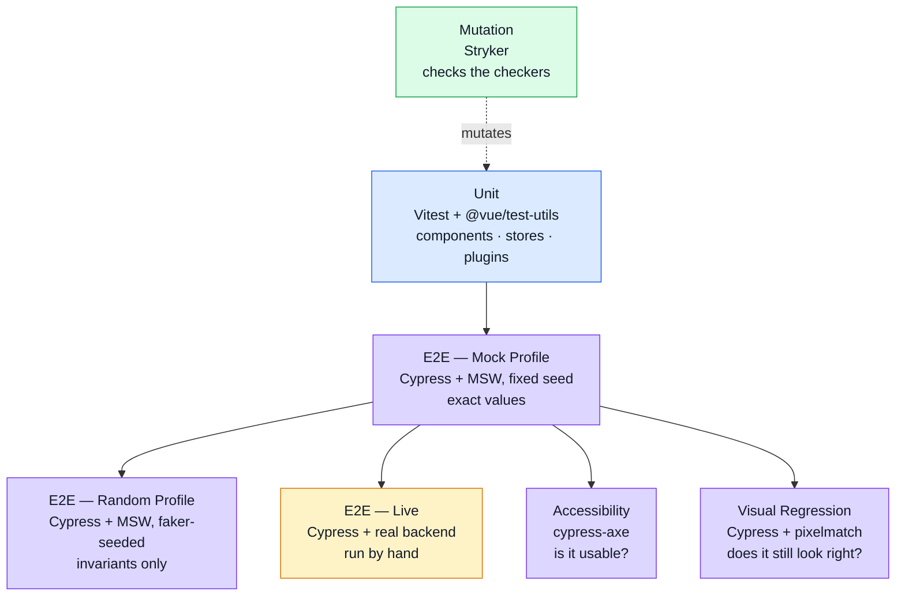
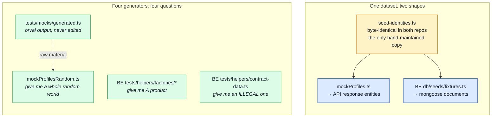
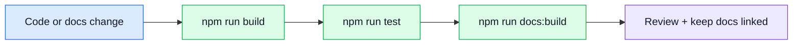

# Testing & Docs

This page is the map. Each layer has its own detail page — code, tools, patterns, file map and a diagram — linked from the table below and from "Related pages" at the bottom of every one of them, so you can start anywhere and always find your way back here.

## The layers, end to end

```mermaid
%%{init: {'flowchart': {'nodeSpacing': 50, 'rankSpacing': 60}}}%%
flowchart TB
    Unit["Unit\nVitest + @vue/test-utils\ncomponents · stores · plugins"]
    Mock["E2E — Mock Profile\nCypress + MSW, fixed seed\nexact values"]
    Random["E2E — Random Profile\nCypress + MSW, faker-seeded\ninvariants only"]
    Live["E2E — Live\nCypress + real backend\nrun by hand"]
    A11y["Accessibility\ncypress-axe\nis it usable?"]
    Visual["Visual Regression\nCypress + pixelmatch\ndoes it still look right?"]
    Mutation["Mutation\nStryker\nchecks the checkers"]

    Unit --> Mock
    Mock --> Random
    Mock --> Live
    Mock --> A11y
    Mock --> Visual
    Mutation -.mutates.-> Unit

    classDef fast fill:#dbeafe,stroke:#2563eb,color:#111827;
    classDef e2e fill:#ddd6fe,stroke:#7c3aed,color:#111827;
    classDef live fill:#fef3c7,stroke:#d97706,color:#111827;
    classDef meta fill:#dcfce7,stroke:#16a34a,color:#111827;
    class Unit fast;
    class Mock,Random e2e;
    class A11y,Visual e2e;
    class Live live;
    class Mutation meta;
```

| Layer | Question it answers | Tool(s) | Command | Detail page |
| --- | --- | --- | --- | --- |
| Unit | Does this one component/store/plugin behave correctly in isolation? | Vitest + @vue/test-utils + jsdom | `npm run test:unit` | [Unit Testing](./unit-testing.md) |
| Component | Does this `.vue` render, emit and **clean up** correctly? | @vue/test-utils | `npm run test:unit` (same suite) | [Component Testing](./component-testing.md) |
| Property | Does the rule hold for *every* input, not just the ones someone thought of? | fast-check | `npm run test:unit` (same suite) | [Property Testing](./property-testing.md) |
| Accessibility | Are there mechanical a11y failures on the routes a user reaches? | cypress-axe | `npm run test:e2e` (same suite) | [Accessibility Testing](./accessibility-testing.md) |
| Visual Regression | Does the page still **look** the way it did? | Cypress + pixelmatch | `npm run test:e2e:visual` | [Visual Regression](./visual-regression.md) |
| E2E — Mock Profile | Does the app behave correctly against **known** data? | Cypress + MSW, fixed seed | `npm run test:e2e` | [Mocking (MSW)](./mocking.md) |
| E2E — Random Profile | Does the app survive **any** contract-valid data? | Cypress + MSW, faker-seeded | `npm run test:e2e:random` | [E2E — Random Profile](./e2e-random-profile.md) |
| E2E — Live | Does the frontend agree with the **actual** backend? | Cypress + real API, hand-run | `npm run test:e2e:live` | [Live E2E](./live-e2e.md) |
| Mutation | Do the tests **notice** when the source is wrong? | Stryker + vitest-runner | `npm run test:mutation` | [Mutation Testing](./mutation-testing.md) |

None of the four testing layers replaces another — each closes a gap the others structurally cannot:

- **Unit** is fast and isolated, but a component that's individually correct can still be wired up wrong, or agree with a mock that's drifted from reality.
- **Mock profile** proves the app agrees with its own MSW handlers — deterministic, so it can assert exact counts and values — but it cannot prove those handlers agree with the real API.
- **Random profile** proves the app doesn't fall over on data the fixed seed can't produce by construction (an empty optional field, an unusual role split) — but by design it can't assert exact values, so it can't replace the mock profile either.
- **Live** is the only layer that checks the mocks against reality, but it needs a hand-booted paired backend, so it can't run on every commit the way the others do.
- **Mutation** doesn't test the app at all — it tests the *tests*, and only for the layer it's pointed at (unit).

## Where test data comes from

Seven things across the two repos can hand you an entity, and it is reasonable to wonder whether that is six too many. It is not: each answers a question the others cannot, and the one genuine duplicate — the demo dataset, which used to be written out by hand on both sides and kept in step by a comment — has been merged into a single shared file.

| Source | Repo | What it is for |
| --- | --- | --- |
| `tests/mocks/shared/seed-identities.ts` | both (byte-identical) | **The demo dataset's facts.** Ids, emails, admin flags, titles, prices, who has what in their cart and their orders. The one dataset a human sees when they open either app, and the only hand-maintained copy of it. Dependency-free so both toolchains can load it; `npm run check:spec-identity` compares the two copies and the `spec-identity` CI job gates on it |
| `tests/mocks/shared/mockProfiles.ts` | FE | **Maps those facts into API response entities** — string ids, no password, timestamps stamped at build time. Also holds the fixed observability payloads behind the admin dashboard |
| `db/seeds/fixtures.ts` | BE | **Maps the same facts into mongoose documents** — `ObjectId`s, real `Date`s, the embedded cart, the denormalised product snapshot each order item carries. The mirror of `mockProfiles.ts`, and the reason the shared file holds facts rather than whole records: the two sides need different shapes from the same truth |
| `tests/mocks/shared/mockProfilesRandom.ts` | FE | **A whole random dataset**, faker-seeded and reproducible, for the question "does the app survive *any* contract-valid data". Pins the two login identities and force-patches the role-scoping branches, so randomisation cannot quietly stop testing them |
| `tests/mocks/generated.ts` | FE | **Orval output** — one faker factory per operation, regenerated by `npm run genapi`, never edited. Raw material for the random profile above, not consumed directly by handlers |
| `tests/helpers/factories/*.ts` | BE | **Arbitrary throwaway entities** — "give me *a* product, I do not care which, and let me override one field". The opposite need to a fixed demo dataset, and used by 25 test files there. This repo has no equivalent yet; see the note below |
| `tests/helpers/contract-data.ts` | BE | **Payloads derived from the zod schemas**, valid and — uniquely — invalid, each violating exactly one declared constraint. The only source that can produce something the API is supposed to *reject* |

Reading it as a shape: **one** hand-maintained dataset, **two** mappers over it (one per runtime), and **four** generators that exist because "the demo data" and "some data" and "deliberately illegal data" are three different questions.

```mermaid
%%{init: {'flowchart': {'nodeSpacing': 45, 'rankSpacing': 55}}}%%
flowchart TB
    subgraph one["One dataset, two shapes"]
        direction TB
        Seed["seed-identities.ts<br/>byte-identical in both repos<br/>the only hand-maintained copy"]
        Seed --> FEMap["mockProfiles.ts<br/>→ API response entities"]
        Seed --> BEMap["BE db/seeds/fixtures.ts<br/>→ mongoose documents"]
    end

    subgraph four["Four generators, four questions"]
        direction TB
        Random["mockProfilesRandom.ts<br/><i>give me a whole random world</i>"]
        Generated["tests/mocks/generated.ts<br/><i>orval output, never edited</i>"]
        Factories["BE tests/helpers/factories/*<br/><i>give me A product</i>"]
        ContractData["BE tests/helpers/contract-data.ts<br/><i>give me an ILLEGAL one</i>"]
    end

    Generated -.raw material.-> Random

    classDef source fill:#fef3c7,stroke:#d97706,color:#111827;
    classDef mapper fill:#dbeafe,stroke:#2563eb,color:#111827;
    classDef gen fill:#dcfce7,stroke:#16a34a,color:#111827;
    class Seed source;
    class FEMap,BEMap mapper;
    class Random,Generated,Factories,ContractData gen;
```

### The four questions, and why none absorbs another

- **"Give me *the* demo data."** → `seed-identities.ts`. Fixed, shared, and the one a human sees on screen. `cy.loginAs('user')` types these credentials into a real form, so it cannot be randomised or generated.
- **"Give me a whole world I have never seen."** → `mockProfilesRandom.ts`. Seeded and reproducible, for "does the app survive *any* contract-valid data" rather than "is this value right". See [E2E — Random Profile](./e2e-random-profile.md).
- **"Give me *a* product, I do not care which."** → the backend's `factories/*`. The opposite need: fresh, isolated, overridable per test, and never the demo data — 25 test files there would interfere with each other if they shared rows.
- **"Give me one the API must *reject*."** → the backend's `contract-data.ts`. Derived from the zod schemas so each payload violates exactly one declared constraint. Nothing else can produce something deliberately illegal, which is the difference between a contract test and a fixture.

Merging any two would mean one of those questions stops being asked. The merge that *was* worth doing — the demo dataset, previously written out by hand on both sides — is the one already done.

**The one gap:** this repo has no counterpart to the backend's `factories/`, so "give me a product" is hand-rolled wherever it is needed — `tests/unit/mocks/mockHandlerParity.spec.ts` and `tests/unit/features/products/store.spec.ts` each carry their own literal. Two literals are not yet a pattern; worth folding into a shared builder when a third call site appears.

## What each layer can and cannot catch

Worth being explicit, because the boundary has bitten this project before.

| Failure | Caught by |
| --- | --- |
| Component or store logic error | [Unit Testing](./unit-testing.md) |
| A component that leaks a resource, or confuses idle with zero | [Component Testing](./component-testing.md) |
| A rule that holds for the tested inputs but not for all of them | [Property Testing](./property-testing.md) |
| A control with no accessible name, an image with no alt text | [Accessibility Testing](./accessibility-testing.md) |
| A layout shift, a dropped stylesheet, a font that failed to load — every DOM assertion still passing | [Visual Regression](./visual-regression.md) |
| A test that asserts nothing | [Mutation Testing](./mutation-testing.md) |
| Wrong response **shape** from a mock | `assertMockContract` in every handler, generated **strict** — see [Mocking](./mocking.md) |
| Generated client out of step with `openapi.yaml` | the `api-freshness` CI job |
| App breaks on unusual but valid data (missing optional field, an unusual role split) | [E2E — Random Profile](./e2e-random-profile.md) |
| Mock **behaviour** disagreeing with the real backend, or a live contract violation | [Live E2E](./live-e2e.md) — response validation + `parity.cy.ts` |

The last row used to read "nothing yet". The mock-profile suite proves the frontend agrees with its own mocks; on its own it cannot prove the mocks agree with the backend — that gap is now closed structurally by the live profile rather than by review alone, though it still only runs when someone runs it by hand (see [Live E2E](./live-e2e.md) for why it isn't in CI). A mock handler must still name the backend service it mirrors — see the parity invariants in [Mocking](./mocking.md).

## Quality tools

| Tool | Why it is here |
| ---- | -------------- |
| [Vitest](https://vitest.dev/) | Unit test runner built on Vite — same config, fast |
| [@vue/test-utils](https://test-utils.vuejs.org/) | Vue-specific component mounting and assertion helpers |
| [jsdom](https://github.com/jsdom/jsdom) | DOM environment for unit tests |
| [Cypress](https://www.cypress.io/) | Browser-based end-to-end tests, all three profiles |
| [start-server-and-test](https://github.com/bahmutov/start-server-and-test) | Boots Vite + waits before running Cypress |
| [MSW](https://mswjs.io/) | Intercepts HTTP in Cypress so the mock and random profiles are deterministic (see [Mocking](./mocking.md)) |
| [Stryker](https://stryker-mutator.io/) | Mutation testing — see [Mutation Testing](./mutation-testing.md) |
| [ESLint](https://eslint.org/) + plugins | Code consistency and correctness checks |
| [Prettier](https://prettier.io/) | Predictable formatting |
| [VitePress](https://vitepress.dev/) | Documentation site + offline local search |
| [Mermaid](https://mermaid.js.org/) + [vitepress-plugin-mermaid](https://emersonbottero.github.io/vitepress-plugin-mermaid/) | ADHD-friendly visual diagrams |

## Maintenance flow

```mermaid
%%{init: {'flowchart': {'nodeSpacing': 45, 'rankSpacing': 60}}}%%
flowchart LR
    Change[Code or docs change] --> Build[npm run build]
    Build --> Test[npm run test]
    Test --> Docs[npm run docs:build]
    Docs --> Review[Review + keep docs linked]

    classDef work fill:#dbeafe,stroke:#2563eb,color:#111827;
    classDef checks fill:#dcfce7,stroke:#16a34a,color:#111827;
    classDef finish fill:#ede9fe,stroke:#7c3aed,color:#111827;
    class Change work;
    class Build,Test,Docs checks;
    class Review finish;
```

`npm run test` runs `test:unit` then `test:e2e` (the mock profile only) — the two layers fast and deterministic enough to gate a PR. The random and live profiles, and mutation testing, are run separately and by hand or on a schedule; see each one's own page for why.

## Test conventions

- Target **behavior**, not implementation — prefer component contracts (props/emits/slots) over snapshots.
- Use **generated Zod schemas** from `@api/schemas` for mock response validation in unit tests.
- By default, e2e tests run with `VITE_API_MOCK_ENABLED=true` and never hit a real backend. `npm run test:e2e:live` is the deliberate, hand-run exception — see [Live E2E](./live-e2e.md).
- Specs start **logged out**: `cy.resetState()` clears the session (mock/random profiles) or reseeds the real database (live profile). Call `cy.loginAs('admin')` when a spec needs elevated visibility.
- **An assertion on a count is an assertion about a role.** Non-admins see 3 of the 5 seeded products (one is soft-deleted, one inactive). If you change an expected count, confirm you are still describing what the backend would return — this only holds under the fixed seed; the random profile deliberately never asserts counts, see [E2E — Random Profile](./e2e-random-profile.md).

## Documentation rule of thumb

- Keep docs grouped by concept.
- Prefer visual maps when they help.
- Use the local search bar first when you only need to jump to one concept.
- Keep code comments brief and move long explanations here.

## External references

- [Vitest matchers](https://vitest.dev/api/expect.html) — assertion reference
- [@vue/test-utils guide](https://test-utils.vuejs.org/guide/) — mounting and querying components
- [Cypress best practices](https://docs.cypress.io/guides/references/best-practices) — selector and assertion guidance
- [Mermaid diagram syntax](https://mermaid.js.org/intro/syntax-reference.html) — for adding new diagrams to these docs

## Gate or hunter

Worth naming explicitly, because it decides where a suite runs and how a failure is read.

A **gate** answers a yes/no question fast enough to block a merge. Unit, component, property, the mock e2e profile and the a11y pass are gates: they run on every push, and a failure means "do not merge this".

A **hunter** goes looking for problems nobody asked about. Mutation, the random e2e profile and the live e2e profile are hunters: slower, nightly, and a failure is usually a **finding to read** rather than a merge to stop. A hunter wired as a gate gets switched off the first week it is inconvenient — which is why each lives in its own workflow file, where it cannot become a PR gate by accident.

The corollary: a green pull request is not a claim the hunters agree. That is what the nightlies are for.

## Deliberately not done

Recorded rather than dropped silently, because "absent" and "rejected for a reason" look identical in
a codebase. The backend keeps the same list, in its own `docs/tools/testing-and-docs.md`, and the
reasoning is shared; what differs is the frontend-specific shape of each.

### Performance testing

**What it is.** Every layer above asks "is the answer correct?". This one asks "is it *fast enough*",
and on a frontend that splits into two unrelated questions:

| Kind | Question | Typical tool |
| --- | --- | --- |
| **Runtime** | Does this list still render in one frame with 500 rows, or did a `computed` become quadratic? | a benchmark harness |
| **Delivery** | Did the bundle grow 400 KB, and did Largest Contentful Paint move? | Lighthouse CI, size-limit |

**Why it is not here.** The demo's data volumes are fixtures — a handful of products and orders — so
any threshold measured against them is inherited by forks as authoritative while describing nothing
they will experience. Timing numbers are also a property of the machine, and on a shared CI runner a
render benchmark largely measures the runner; that flakiness is what gets a job disabled.

**What would change it.** In a fork with real page weights and a real device profile, the **delivery**
half is the one to add first — a bundle-size budget is deterministic, cheap, and catches the single
most common frontend regression (an accidental import pulling a library into the main chunk). It does
not need the load rig that runtime benchmarking does.

### Diff coverage as a separate gate

Superseded here by two existing gates: `coverage.thresholds.perFile` answers "is this code executed",
and the per-file mutation baseline answers "did the tests get weaker". A third gate over the same
ground buys CI complexity and a second number to argue about. It becomes the right tool if a large
untested area ever lands below the floors, where fixing history is not realistic.

### Type-level tests

Assertions about types rather than values — that a prop signature did not widen to `any`, that a
generic infers correctly. They earn their place when the types **are** the product, as in a published
library. Here the public contract is `openapi.yaml`, and the types over it are *generated* by orval
rather than hand-written, then checked by `check:spec-identity` against the backend's copy. Writing
type assertions over generated types mostly tests the generator.

### Incremental mutation mode

Stryker can cache per-mutant results and re-test only what a diff touched. Not enabled: the cache
invalidates far more broadly than intuition suggests, so the saving is unpredictable rather than
proportional to the diff, and a stale-but-trusted cache reports green for mutants nobody re-ran. Worth
revisiting if mutation ever moves from nightly onto pull requests.

## Related pages

- [Unit Testing](./unit-testing.md)
- [Mocking (MSW)](./mocking.md)
- [E2E — Random Profile](./e2e-random-profile.md)
- [Live E2E (FE ↔ real backend)](./live-e2e.md)
- [Component Testing](./component-testing.md) — resources, boundaries, and why not to select on vendor classes
- [Property Testing](./property-testing.md) — generation over enumeration
- [Accessibility Testing](./accessibility-testing.md) — what automated a11y can and cannot tell you
- [Mutation Testing](./mutation-testing.md)
- [API](../api/)
