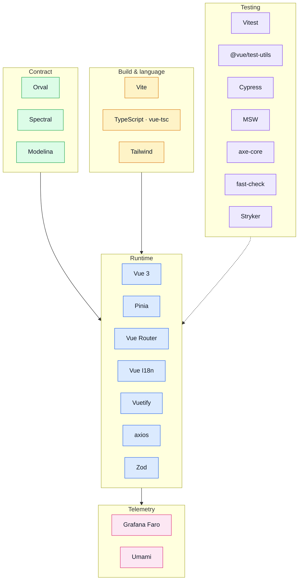

# Tools Explained

This page answers three questions for every tool in the stack: **what it is**, **what problem it solves**, and **what it does in this repo**.
Each section links to the dedicated page for configuration details and code pointers.

## The whole stack on one page

Colour is the job a tool does, not the layer it sits in.

**Contract points into the app, never the other way round.** That single arrow is the rule the
whole repository is arranged around: `openapi.yaml` and `asyncapi.yaml` come from the backend, and
everything under `contracts/` is generated from them. Editing generated output is the one mistake
this diagram exists to prevent.

---

## Core stack

### Vue 3 + TypeScript

**What it is.** Vue 3 is a progressive JavaScript framework for building reactive UIs with the Composition API and Single File Components (SFCs). TypeScript adds a static type system on top of JavaScript.

**Problem it solves.** Without a framework, UI state and DOM updates are managed manually — error-prone and hard to test. Vue's reactivity system keeps data and UI in sync automatically. TypeScript catches type errors at compile time and makes refactors safe.

**In this repo.** Vue 3 with the Composition API (`<script setup>`) is used throughout. TypeScript is the source language for everything in `src/`. `vue-tsc` type-checks `.vue` files in CI.

→ [Runtime](./runtime.md)

---

### Vite

**What it is.** Vite is a next-generation build tool that provides an extremely fast dev server (using native ES modules) and a production bundler (Rollup under the hood).

**Problem it solves.** Traditional bundlers like webpack process the entire module graph on startup — slow for large projects. Vite serves source files directly in dev and only bundles for production, keeping the feedback loop fast.

**In this repo.** Dev server on `:8080` (`npm run dev`). Production build via `npm run build`. Configured in `vite.config.ts`.

→ [Runtime](./runtime.md)

---

### Sass / sass-embedded

**What it is.** Sass is a CSS preprocessor that adds variables, nesting, mixins, and functions on top of plain CSS.

**Problem it solves.** Plain CSS has no shared variables or reusable patterns. Sass lets you define design tokens once and use them everywhere, keeping styles consistent and maintainable.

**In this repo.** Global styles live in `src/styles/` (theme, main). Shared design tokens come from `@guebbit/css-toolkit`.

→ [Runtime](./runtime.md)

---

### Pinia

**What it is.** Pinia is the official state management library for Vue 3. Stores are defined with `defineStore()` and are fully typed and devtools-integrated.

**Problem it solves.** Without a shared state layer, data-fetching logic leaks into components and props need to be drilled across many levels. Pinia centralises reactive state and makes it accessible from any component without prop drilling.

**In this repo.** All API calls happen inside Pinia stores (or module composables that call stores). Views never call the generated API client directly.

→ [State & Routing](./state-and-routing.md)

---

### Vue Router

**What it is.** Vue Router is the official router for Vue.js. It maps URL paths to view components and supports navigation guards, dynamic segments, lazy loading, and nested routes.

**Problem it solves.** SPAs need to map URLs to views and handle browser back/forward without a full page reload. Vue Router does this natively, with typed route params and composable access (`useRoute`, `useRouter`).

**In this repo.** All routes are locale-prefixed (`/:locale/…`). A route declares what it needs as `meta.access` (`guest` / `auth` / `admin`, absent meaning public) and one global guard, `enforceRouteAccess`, enforces it. Error and 404 handling happens at the router level.

→ [State & Routing](./state-and-routing.md) · [Sitemap & Access Control](../theory/sitemap.md)

---

### Vue I18n

**What it is.** Vue I18n is the standard internationalisation library for Vue. It provides translation functions, locale switching, and pluralisation.

**Problem it solves.** Hard-coding text strings in components makes localisation painful — every string must be found and replaced. Vue I18n externalises strings into locale message files so switching language is a single store update.

**In this repo.** Shared locale messages live in `src/locales/`; each domain ships its own in `src/modules/<name>/locales/`, merged into the active locale at boot. The active locale is part of the URL (`/:locale/`) and is validated against `supportedLanguages` on every navigation. Strings edited in the API's database are merged over the bundled ones, per key.

→ [State & Routing](./state-and-routing.md)

---

## API & contract tools

### Orval

**What it is.** Orval is a code generator that reads `openapi.yaml` and outputs a typed axios client and Zod schemas. The generated `contracts/rest/` directory is a derived artifact — never edit it by hand.

**Problem it solves.** Maintaining a typed API client alongside the spec means they inevitably drift. Code generation makes the client an output of the spec.

**In this repo.** `npm run gen:api` regenerates `contracts/rest/index.ts` (axios functions) and `contracts/rest/schemas.zod.ts` (Zod schemas). Configured in `orval.config.ts`. Orval's MSW-stub output is deliberately not enabled — see [The demo profile](./demo-profile.md).

→ [OpenAPI Workflow](../api/openapi-workflow.md)

---

### Axios

**What it is.** Axios is an HTTP client for the browser and Node.js. It has a cleaner API than `fetch` and supports interceptors, request cancellation, and automatic JSON serialisation.

**Problem it solves.** `fetch` requires manual error checking, JSON parsing, and has no interceptor system. Axios makes it easy to attach auth headers on every request and intercept errors globally.

**In this repo.** A single axios instance lives in `src/infrastructure/http/index.ts`. Request interceptors attach the Bearer token; response interceptors shape errors into `IResponseReject` and handle `401`/`403`/`5xx` redirects.

→ [Runtime](./runtime.md)

---

### Zod

**What it is.** Zod is a TypeScript-first schema validation library. You define a schema once and Zod both validates the data and infers the TypeScript type.

**Problem it solves.** External input (form data, API responses at runtime boundaries) is untyped. Zod enforces shape and type at the boundary and narrows the TypeScript type automatically.

**In this repo.** Zod schemas are generated from `openapi.yaml` by orval into `contracts/rest/schemas.zod.ts`. Import them from `@api/schemas` — never hand-write schemas that duplicate the spec.

→ [OpenAPI Workflow](../api/openapi-workflow.md)

---

### MSW (Mock Service Worker)

**What it is.** MSW intercepts HTTP requests at the Service Worker level in the browser (or via `node-fetch` interceptors in Node). Handlers return custom responses without touching the network.

**Problem it solves.** Some behaviour lives inside axios' interceptor chain — a 401 refreshing and replaying its request — and a stub at the module boundary never exercises it, because there is nothing left to intercept. MSW answers real HTTP, so the real client runs unchanged.

**In this repo.** Used only in the transport-layer unit specs (`msw/node` stands in for a server). Dev and e2e run against the paired backend's demo profile instead — see [The demo profile](./demo-profile.md).

→ [The demo profile](./demo-profile.md)

---

### Spectral

**What it is.** Spectral is a linter for OpenAPI documents. It applies a ruleset and reports violations — missing descriptions, inconsistent error codes, undefined refs.

**Problem it solves.** A syntactically valid OpenAPI document can still be incomplete. Spectral catches these in CI before they cause runtime surprises.

**In this repo.** `npm run lint:openapi` runs Spectral against `openapi.yaml` using `spectral.yaml`.

→ [OpenAPI Workflow](../api/openapi-workflow.md)

---

## Observability stack

### Grafana Faro (@grafana/faro-web-sdk)

**What it is.** Grafana Faro is an open-source frontend observability SDK. It captures JavaScript exceptions, Core Web Vitals, and distributed traces for every `fetch`/XHR, shipping them to a self-hosted Grafana Alloy receiver.

**Problem it solves.** Console errors in production are invisible. Faro surfaces crashes with full stack traces and browser context, and — by propagating the W3C `traceparent` header to the API — links a browser interaction to the backend handler and database query in one trace.

**In this repo.** Initialized in `src/main.ts` when `VITE_FARO_URL` is set. The browser only talks to Grafana Alloy (`:12347`). All Faro calls go through `useObservabilityStore()`. Disabled (no-op) when the URL is absent.

→ [Observability](./observability.md)

---

### Umami (tracker script)

**What it is.** Umami is a self-hosted, open-source, privacy-friendly product analytics platform. It captures pageviews and custom events and lets you analyse funnels and retention.

**Problem it solves.** Infrastructure metrics tell you the app is healthy but not whether users are completing signups or dropping off at checkout. Umami answers product questions from a user perspective.

**In this repo.** The tracker script is injected when `VITE_UMAMI_WEBSITE_ID` is set, and that is all this app asks of it: pageviews are automatic, and every custom event is emitted by the backend into the same website. Disabled (no-op) when the id is absent.

→ [Umami](./umami.md) · [Observability](./observability.md)

---

## Testing tools

### Vitest + @vue/test-utils

**What it is.** Vitest is a fast unit test runner built on Vite. `@vue/test-utils` provides Vue-specific mounting and assertion helpers for testing SFC components.

**Problem it solves.** Without tests, every change requires manual verification. Unit tests encode expectations about component and store behaviour so regressions are caught automatically.

**In this repo.** Unit tests live in `tests/unit/`. `npm run test:unit` runs them. `jsdom` provides the DOM environment.

→ [Testing](./testing-and-docs.md)

---

### Cypress

**What it is.** Cypress is a browser-based end-to-end testing framework. Tests run inside a real browser, interact with the app as a user would, and make assertions on the rendered UI.

**Problem it solves.** Unit tests cover logic; e2e tests cover the full user journey — navigating, filling forms, checking what's rendered. Cypress catches integration failures that unit tests miss.

**In this repo.** E2E specs live in two places: a domain's own under `src/modules/<name>/tests/e2e/`, the cross-cutting ones under `tests/e2e/specs/`. `npm run test:e2e` builds the bundle, serves it with `vite preview`, boots one demo backend per shard and runs Cypress headlessly. `test:e2e:dev` opens the Cypress UI.

→ [Testing](./testing-and-docs.md)

---

### @guebbit/css-toolkit + @guebbit/vue-toolkit

**What they are.** Internal shared libraries providing SCSS design tokens (`css-toolkit`) and reusable Vue components and composables (`vue-toolkit`).

**Problem they solve.** Prevents duplication of base styles and low-level UI components across multiple boilerplate variants.

**In this repo.** Imported in `src/styles/` and used directly in components where needed.
