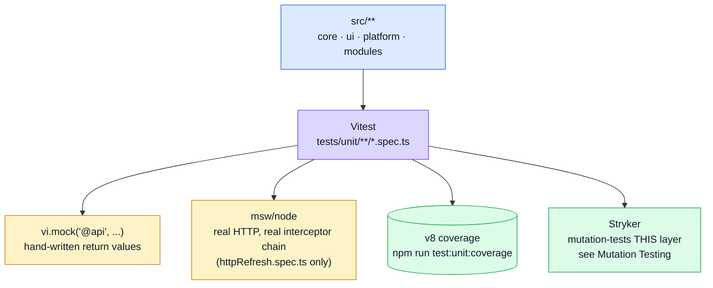

# Unit Testing

The layer that answers: **does this one piece of logic — a component, a store, a plugin — behave correctly in isolation?** Fast (whole suite runs in a few seconds), deterministic, and the only layer that stubs the network at all — every layer above it runs against the real API.

## Tools

| Tool | Role |
| --- | --- |
| [Vitest](https://vitest.dev/) | Test runner — same Vite config and transforms the app itself uses, so no separate build step |
| [@vue/test-utils](https://test-utils.vuejs.org/) | Mounts components, drives props/emits/slots |
| [jsdom](https://github.com/jsdom/jsdom) | DOM implementation Vitest runs component tests against (via `tests/support/unit/jsdom-quiet-css.env.ts` — see that file for why it's a thin wrapper around plain `jsdom` rather than the string `'jsdom'`) |
| [Pinia](https://pinia.vuejs.org/) (`createPinia()` per test) | Stores under test get a fresh instance every time — no state leaks between tests |
| `vi.mock()` | Replaces `@api` (the generated client), `@/infrastructure/observability`, etc. with hand-written stubs |
| [msw/node](https://mswjs.io/docs/integrations/node) | The *one* place this layer mocks HTTP for real instead of stubbing a module — `httpRefresh.spec.ts`, see below |

## Where it sits



Everything below this layer (components, Pinia stores, `src/infrastructure/http`, `src/infrastructure`) is exercised **without** a browser and **without** an API — a real browser talking to a real backend starts one layer up, in [The demo profile](./demo-profile.md).

## Patterns

### Component tests — mount + Vuetify plugin

Components that use Vuetify components internally (`v-number-input`, etc.) must be mounted with the app's real Vuetify plugin instance, otherwise Vuetify's own child components don't resolve:

```ts
import { mount } from '@vue/test-utils';
import vuetify from '@/ui/vuetify';

const mountCounter = (props = {}) =>
    mount(FormCounterInput, { props, global: { plugins: [vuetify] } });
```

`tests/unit/ui/FormCounterInput.spec.ts` and `tests/unit/app/AppNavigation.spec.ts` are the two examples.

### Store tests — `vi.mock('@api', ...)`

Every domain store (`cart`, `orders`, `products`, `users`) is tested by mocking the generated API client at the module boundary, not by hitting a network at all:

```ts
vi.mock('@api', () => ({
    getCart: vi.fn(() => Promise.resolve({ data: CART })),
    upsertCartItem: vi.fn(() => Promise.resolve({ data: CART }))
}));
```

`createPinia()` + `setActivePinia()` in a `beforeEach` gives every test a clean store. This is the layer that catches a store forgetting to fire (or over-firing) an analytics event, or mishandling a not-yet-fetched empty state — see `src/modules/cart/tests/store.spec.ts`'s header comment for the two specific regressions this pattern was built to catch.

### The one exception — a real HTTP server for the refresh flow

`tests/unit/infrastructure/http/httpRefresh.spec.ts` is deliberately **not** stubbed at the module boundary. The 401 → refresh → replay flow lives entirely inside axios's interceptor chain (`src/infrastructure/http/index.ts`), so a hand-rolled stub would never actually exercise it — there'd be nothing to intercept. It uses `msw/node` to run a real server and assert on the request sequence:

```ts
const server = setupServer(
    http.get(`${API}/account/refresh`, () => HttpResponse.json({ data: { token: 'fresh-token' } })),
    http.get(`${API}/orders`, ({ request }) => /* 401 unless Authorization matches */ )
);
```

`tests/unit/infrastructure/http/http.spec.ts` covers the same module's error-normalisation logic with plain stubs — the two are complementary, not overlapping.

### Response-validation and mock-transport tests

`tests/unit/infrastructure/http/httpValidateResponses.spec.ts` unit-tests the load-bearing piece behind both e2e profiles: `orvalMutator`'s contract check, which parses every response through its OpenAPI-derived Zod schema and rejects a 2xx that violates it.

## File map

| Path | Contents |
| --- | --- |
| `tests/unit/ui/**`, `tests/unit/app/*.spec.ts` | Component mount tests |
| `src/modules/*/tests/**` | A domain's own specs, co-located so `rm -rf` takes them with it |
| `tests/unit/infrastructure/http/**` | `orvalMutator`, the refresh flow, response validation |
| `tests/unit/mocks/**` | Unit coverage for the mock layer's own building blocks (not the handlers themselves — those are exercised through Cypress) |
| `tests/unit/app/**`, `tests/unit/kernel/**`, `tests/unit/infrastructure/**` | Route guards, router config, session store, formatters/error helpers, the SSE client |
| `tests/cross-cutting/**` | Specs that sweep *every* domain (i18n key coverage), so they belong to none — and must not sit inside a module that could be deleted |
| `tests/support/unit/setup.ts` | Global Vitest setup (runs before every file) |
| `tests/support/unit/wireModules.ts` | Registers the modules' response schemas and dictionaries into `infrastructure`, as `src/main.ts` does. Any spec touching either subsystem needs it |
| `tests/support/unit/jsdom-quiet-css.env.ts` | Custom environment: plain jsdom with one class of CSS-parser noise filtered — see the file's own comment |
| `vitest.config.ts` | Test runner config (environment, setup files, coverage) |
| `vitest.config.mutation.ts` | Narrower variant Stryker drives — see [Mutation Testing](./mutation-testing.md) |

## Commands

| Command | Effect |
| --- | --- |
| `npm run test:unit` | Full suite, CI mode |
| `npm run test:unit:coverage` | Same, with v8 coverage |
| `npx vitest run <path>` | One file, for fast iteration while editing it |

## Related pages

- [Testing](./testing-and-docs.md) — suite overview
- [The demo profile](./demo-profile.md) — where the stubs stop and the real API starts
- [Live E2E](./live-e2e.md) — `VITE_VALIDATE_RESPONSES`, unit-tested here, does its real work there
- [Mutation Testing](./mutation-testing.md) — mutates this layer's source and checks these tests notice

## Where a spec lives

Two homes, and the rule is ownership rather than kind (decision D4):

| Spec is about… | Lives in |
| --- | --- |
| one domain | `src/modules/<name>/tests/` — deleted with the module |
| core, ui, platform, or the mock layer | `tests/unit/<tier>/` |
| every domain at once | `tests/cross-cutting/` |
| nothing — it is shared machinery | `tests/support/{unit,e2e,mocks}/` |

**The rule that decides it:**

> A spec outside a module may **iterate** the registry. It may never **name** a domain.

A platform spec asserting `navigation.label-products-list` is the same coupling the manifest
removed from `src/`, just moved into `tests/` — deleting a domain then breaks a test that is not
about that domain at all. So mechanism tests use invented domains (`public-domain`, `/widgets`) and
invented schemas, per-domain facts live with their module, and `tests/cross-cutting/registry.spec.ts`
sweeps every enabled module for invariants without naming one.

`vitest.config.ts` collects the first three; the fourth is never collected, only imported.

E2E stays central in `tests/e2e/` regardless: every spec there is cross-app by construction —
`cart.cy.ts` walks browse → cart → checkout across three modules and belongs to none of them.
