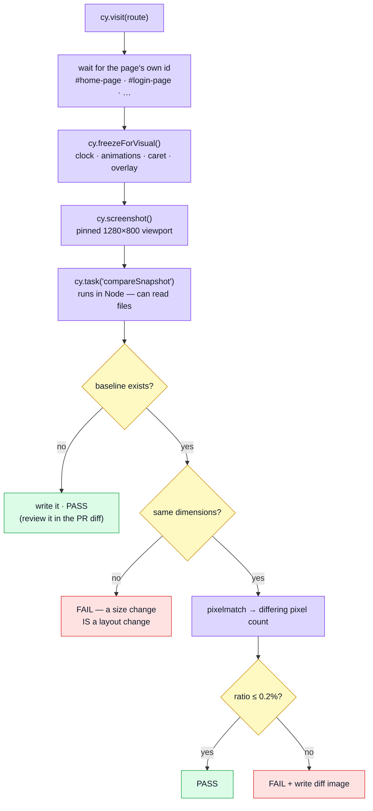
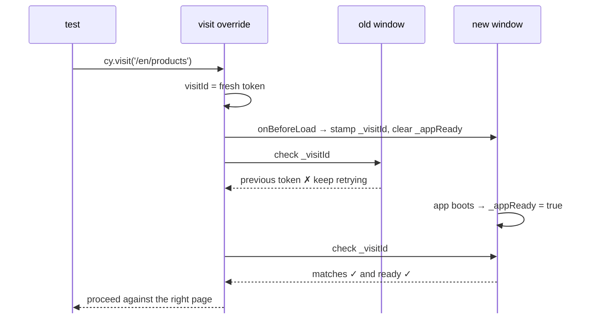

# Visual Regression Testing

Photographing a handful of screens and comparing them, pixel by pixel, against committed baseline images.

## What this layer is for

Every other test in this repository reads the DOM. They ask what exists, what it contains, what it announces. None of them asks what the page **looks like**, and there is a whole class of defect that lives exactly there:

| Defect                                 | What the DOM says                   | What the user sees                 |
| -------------------------------------- | ----------------------------------- | ---------------------------------- |
| A CSS change shifts a layout           | every element present, correct text | content overlapping the footer     |
| A web font fails to load               | text nodes intact                   | fallback font, everything reflowed |
| A dark-mode token goes wrong           | correct colour variable referenced  | grey text on a grey card           |
| A stylesheet is dropped from the build | identical markup                    | unstyled document                  |

In every row the DOM assertions pass. Only the appearance is wrong, and only a picture catches it.



## One screen per module, and why not more

Visual testing is the classic flake generator, and its failure mode is **social** rather than technical:

1. a screenshot differs for a reason that is not a bug
2. someone re-approves the baseline without looking at it
3. that becomes the habit
4. the suite now produces the paperwork of review without the review

Twelve screens that are genuinely looked at beat forty that are rubber-stamped. The rule is **one per module — its main screen — plus the two the shell owns**, which keeps the count tied to the architecture rather than to somebody's enthusiasm. A module gaining a second baseline should be a decision, not a habit.

| Screen                | Owner       | Layout family it stands for         |
| --------------------- | ----------- | ----------------------------------- |
| `home`                | shell       | marketing content, cards, hero      |
| `not-found`           | shell       | error state, empty state            |
| `products-list`       | `products`  | data table, filter form, pagination |
| `login`               | `account`   | centred narrow form                 |
| `cart`                | `cart`      | line items, totals panel            |
| `orders-list`         | `orders`    | data table, authenticated           |
| `wishlist`            | `wishlist`  | card grid, authenticated            |
| `users-list`          | `users`     | admin data table                    |
| `admin-dashboard`     | `admin`     | KPI tiles, dense numbers            |
| `inventory-ledger`    | `inventory` | admin table, board + ledger         |
| `contact`             | `feedback`  | public form                         |
| `realtime-playground` | `realtime`  | live-updating panels                |

## Where the baselines live

Beside the spec that takes them:

```
src/modules/products/tests/e2e/
  products.visual.cy.ts
  __snapshots__/products-list.png
```

`cy.compareSnapshot()` resolves the directory from `Cypress.spec.relative`, so nothing is configured per module — a new module's first baseline lands in the right place by existing. **The point is deletion**: `rm -rf src/modules/products` takes its photographs with it, where a central folder would be left holding a picture of a screen the app no longer serves and nothing would ever notice.

Diffs go the other way, to `reports/visual-diff/` — one gitignored folder, because a diff is throwaway output of a failed run and CI uploads it from one place.

## Not in the gate — deliberately

The visual specs sit inside `src/modules/*/tests/e2e/`, which is also the functional e2e glob, so `scripts/e2e/run-shards.ts` excludes them **by the `.visual.cy.ts` suffix**. Without that the merge gate would have silently acquired twelve pixel comparisons, and the first font update would have looked like an application regression.

`npm run test:e2e:visual` is where they run.

Adding a fifth is cheap. Adding a fiftieth is how the suite dies.

## The two tolerance numbers

Both live in `tests/support/e2e/visual-task.ts`, deliberately spelled out rather than hidden in a plugin's options.

**`PIXEL_THRESHOLD` (0.15)** — per-pixel colour tolerance. How different two pixels must be before `pixelmatch` counts them as different _at all_. This absorbs antialiasing and sub-pixel font rendering, which differ between machines with nothing having changed.

**`MAX_DIFFERING_RATIO` (0.002)** — how much of the image may differ before the test fails. This is the one that separates classes of change:

```
a font rendered a hair differently   →  tens of pixels     →  0.00x%   pass
one word of copy changed             →  hundreds           →  0.0x%    pass
a button restyled                    →  thousands          →  0.x%     fail
a layout shifted by 120px            →  45,000             →  4.9%     fail
```

Both are deliberately loose. A visual test that fails on noise is worse than no visual test, because it trains people to ignore it.

## Determinism: the five things that must be pinned

A screenshot is only useful if an unchanged app produces identical pixels twice. Five things break that, and the last one is the one nobody expects:

1. **Viewport** — pinned to 1280×800 in `cypress.config.ts`. Image size is part of the diff.
2. **Clock** — frozen by `cy.freezeForVisual()`. Anything rendering a date or a relative time changes by the minute.
3. **Animations** — killed by the same command, via an injected stylesheet that zeroes every `transition` and `animation`. A screenshot caught mid-transition differs from itself between runs.
4. **Data** — the demo profile, whose backend puts the same dataset back on every restore. `cy.restore()` in the `beforeEach` guarantees identical data and a signed-out session; the navigation gains a whole column (Cart, Orders, the account email, Logout) when signed in, so auth state changes the layout, not just the content.
5. **The page actually being the page.** See below — this one was a real bug.

### The bug this suite found in the test harness

`cy.visit()` is overridden in `tests/support/e2e/commands.ts` to wait for the app to finish bootstrapping. The original wait was:

```ts
cy.window().should('have.property', '_appReady', true);
```

`_appReady` is set on `window` by the app once it has booted — and the **outgoing** `window` object survives right up to the moment the new document commits. So on the second `cy.visit()` inside a test, that assertion could look at the page being navigated _away from_, see a flag it set long ago, and resolve immediately. Every command afterwards ran against the previous screen.

In an ordinary spec this is almost invisible, because `cy.get()` retries: the page swaps underneath it and the assertion passes a beat later. It is entirely visible to anything that reads the page **once** — a screenshot, `cy.document()`, `location.href`.

It surfaced as a baseline for `/en/this-route-does-not-exist` that was a photograph of the home page, and as an accessibility suite that had been auditing the previous route for most of its cases.

The fix is a per-visit token, because the flag has to be something the old window can never satisfy:



The lesson generalises: **a readiness flag that persists across navigations is not a readiness flag.** It has to be scoped to the navigation it describes.

## The three outcomes of a comparison

### No baseline yet → write it and **pass**

A first run cannot fail, because there is nothing to compare against; failing would only mean "this is new". The baseline is committed, so the diff that matters is the one a reviewer sees in the pull request when the image changes — that is where a human actually looks at the picture.

### Different dimensions → **fail immediately**

Comparing images of different sizes pixel by pixel is meaningless, and a size change is itself a layout regression. The message says both sizes rather than a percentage.

### Same size → compare

Over budget writes a diff image to `reports/visual-diff/` — red pixels mark what moved — and the failure message names the file and the update command.

## Updating a baseline

When a change to the design is intended:

```bash
npm run test:e2e:visual:update
```

Then **look at the resulting image diff in the pull request**. That review is the entire point of the layer; skipping it turns the baselines into rubber stamps and the suite into decoration.

## Proving the suite actually works

A visual suite that is silently photographing blank pages passes forever and catches nothing. This one has been falsified — the check that it can fail:

```bash
# inject a layout shift
#   <LayoutDefault style="padding-top:120px" id="home-page" …>
npm run test:e2e:visual
#   home: 45043 of 921600 pixels differ (4.887%, budget 0.200%)  ← 1 failing
#   the other three screens still pass    ← proves run-to-run stability at the same time
```

That is the check to repeat after touching anything in `freezeForVisual`, the viewport, or the visit override. It caught the blank-baseline problem: an early version recorded images with 19 distinct colours, and `home.png` was byte-identical to `not-found.png`.

A quick sanity signal, when a baseline looks suspicious — a real screenshot of this app has a few thousand distinct colours:

```bash
node -e "const {PNG}=require('pngjs'),fs=require('fs');
for (const f of fs.readdirSync('src/modules/<name>/tests/e2e/__snapshots__').filter(x=>x.endsWith('.png'))) {
  const i=PNG.sync.read(fs.readFileSync('src/modules/<name>/tests/e2e/__snapshots__/'+f)), c=new Set();
  for (let n=0;n<i.data.length;n+=4) c.add(i.data.readUInt32BE(n));
  console.log(f, c.size);
}"
```

## Running it in CI

Screenshots are machine-sensitive. Font rasterisation, subpixel hinting and the exact browser build
all differ between a developer's machine and a CI runner, by more than the 0.2% budget on
text-heavy pages. So the suite runs in **one pinned image**, and the baselines are recorded there
too — never on a host:

| What                   | Where                                                                 |
| ---------------------- | --------------------------------------------------------------------- |
| The image              | `cypress/included:<version>@sha256:<digest>` — pinned in `visual.yml` |
| The nightly comparison | `.github/workflows/visual.yml`, 02:30 UTC and on demand               |
| The diff images        | uploaded as the `visual-diff` artefact on every run                   |
| The baselines          | recorded in that same image, committed beside each spec               |

It stays a nightly rather than a merge gate: a red run means "go and look at the picture", and the
artefact is that picture.

### Re-recording the baselines

Only after looking at the diff, and only inside the pinned image. Copy both checkouts into a
container (never mount them read-write: the image's Node would rebuild the host's
`node_modules`), install, and run the update — `--network host` so the preview (8085) and the demo
backend (3000) reach each other:

```bash
IMAGE=cypress/included:15.18.1   # the tag pinned in visual.yml
docker run -d --name visual --network host \
  -v "$PWD:/src/frontend:ro" -v "$PWD/../boilerplate-node-backend:/src/backend:ro" \
  --entrypoint sleep "$IMAGE" infinity
docker exec visual bash -c '
  mkdir -p /work/frontend /work/backend
  tar -C /src/frontend --exclude=./node_modules --exclude=./.env --exclude=./.git -cf - . | tar -C /work/frontend -xf -
  tar -C /src/backend  --exclude=./node_modules --exclude=./.env --exclude=./.git -cf - . | tar -C /work/backend -xf -
  cd /work/backend && npm ci && cd /work/frontend && CYPRESS_INSTALL_BINARY=0 npm ci'
docker exec -w /work/frontend -e BACKEND_PATH=/work/backend \
  -e 'BACKEND_DEMO_COMMAND=npm --prefix {backend} run demo' visual npm run test:e2e:visual:update
docker exec -w /work/frontend visual bash -c \
  'find . -path ./node_modules -prune -o -name "*.png" -path "*__snapshots__*" -print | tar -cf - -T -' \
  | tar -xf - -C .
docker rm -f visual
```

`.env` is left behind on purpose: CI has none, and a host `.env` can name paths that do not exist
inside the image. Then review the changed PNGs in the diff, as always.

### What varies between two runs of an unchanged app

A screen that shows a value minted per run — an id created at boot, a date relative to today, a
freshly random backup code — cannot be compared as it stands. `sweepVisual`'s `redact` option
replaces those elements' text with one fixed placeholder before the photograph. Replaced, not
hidden: a hidden table cell still sizes its column by the text inside it.

## Why hand-rolled rather than a plugin

Visual regression plugins wrap roughly this much code around `pixelmatch`. The part that decides whether the suite is useful or infuriating — the tolerance, and what happens when a baseline is missing — is exactly the part a plugin hides behind options. For a boilerplate, every project copied from it inherits that choice, so it is written out where it can be read and changed.

## File map

| Path                                               | Contents                                                                                                                                       |
| -------------------------------------------------- | ---------------------------------------------------------------------------------------------------------------------------------------------- |
| `tests/e2e/visual/visual.cy.ts`                    | The four screens, the readiness selectors, the determinism `beforeEach`                                                                        |
| `tests/support/e2e/visual-task.ts`                 | The comparison itself — thresholds, the three outcomes, diff output. Runs in **Node**, because the browser cannot read the committed baselines |
| `tests/support/e2e/commands.ts`                    | `cy.freezeForVisual()`, `cy.compareSnapshot()`, and the `visit` override with its per-visit token                                              |
| `cypress.config.ts`                                | Registers the `compareSnapshot` task and pins the 1280×800 viewport                                                                            |
| `src/modules/<name>/tests/e2e/__snapshots__/*.png` | The committed baselines — reviewed as images, in the PR diff                                                                                   |
| `reports/visual-diff/`                             | Diff images written on failure. Not committed                                                                                                  |

Note the directory split: the visual spec lives under `tests/e2e/visual/` rather than `tests/e2e/specs/`, because the ordinary `npm run test:e2e` run must not record or compare screenshots. Each npm script scopes itself with `--spec`.

## Commands

| Command                          | Effect                                                           |
| -------------------------------- | ---------------------------------------------------------------- |
| `npm run test:e2e:visual`        | Compare against the committed baselines                          |
| `npm run test:e2e:visual:update` | Re-record every baseline, then review the images                 |
| `npm run test:e2e`               | The functional e2e suite — deliberately excludes the visual spec |

## Where it sits, and where it does not

It is deterministic inside its pinned image, and it runs nightly rather than on each pull request — see [Running it in CI](#running-it-in-ci). It is not a hunter: it will never tell you something you did not already have a baseline for.

It also does not replace accessibility testing. A screenshot cannot tell you that grey-on-grey text fails a contrast ratio; it will happily record it as the baseline and defend it forever. Contrast is [axe's](./accessibility-testing.md) job, and the two layers found different halves of the same theme problems.

## Related pages

- [Accessibility Testing](./accessibility-testing.md) — the other layer that looks at the rendered result, and the one that judges it
- [Component Testing](./component-testing.md) — appearance of a single component, before it reaches a page
- [The demo profile](./demo-profile.md) — the fixed dataset these screenshots depend on
- [Testing (overview)](./testing-and-docs.md) — the map of every layer
