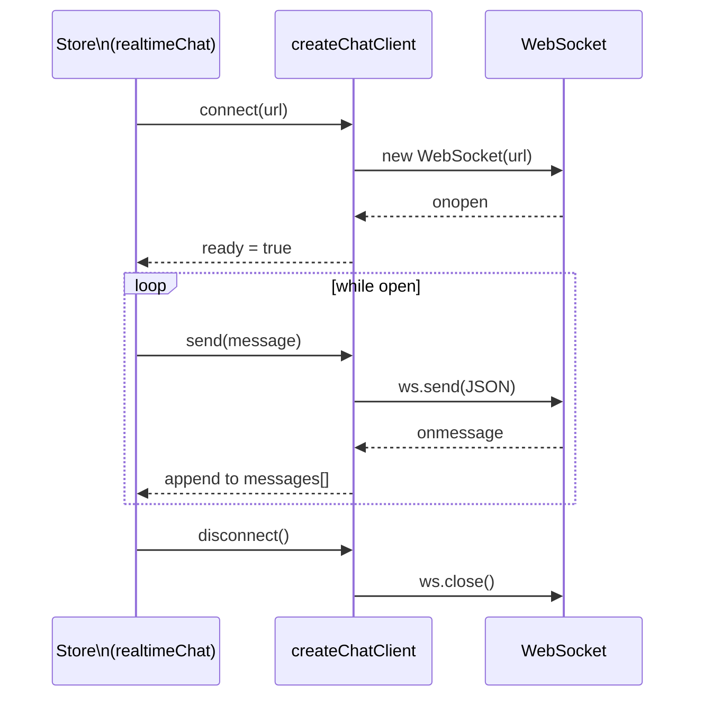
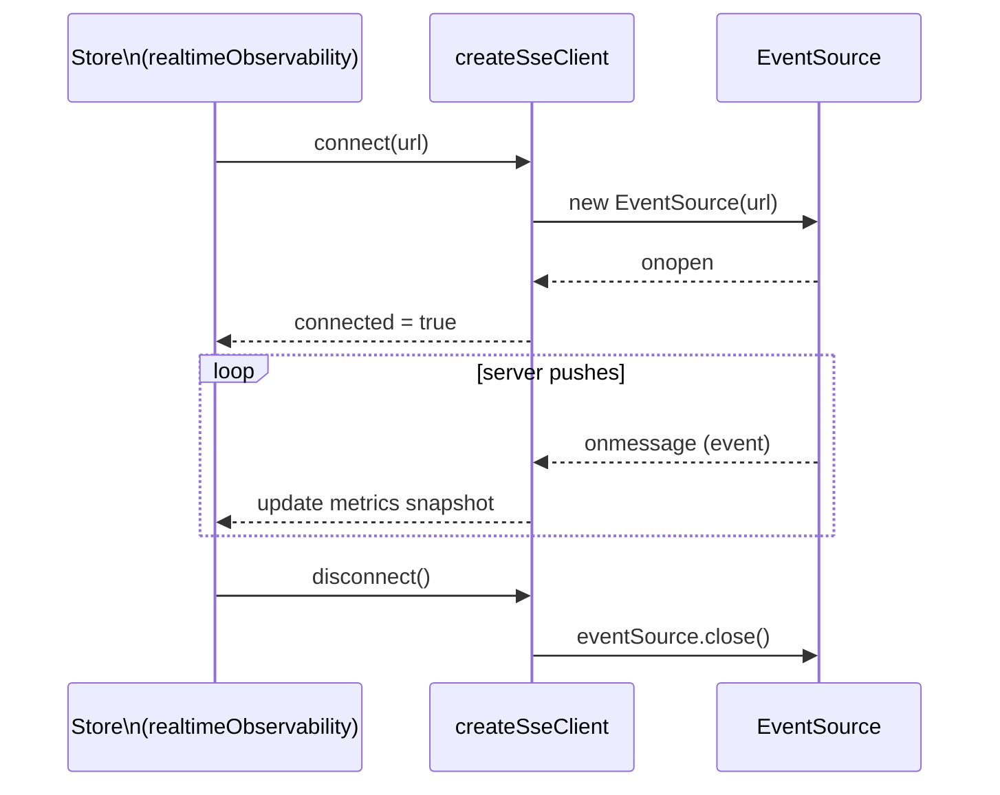

# Realtime (SSE + WebSocket)

The boilerplate exposes two realtime transports, both driven by contracts in `asyncapi.yaml` and demonstrated in the `RealtimePlayground` view (`/:locale/playground/realtime`).

## Transports at a glance

| Transport | URL env var | Direction | Use case |
| --------- | ----------- | --------- | -------- |
| **WebSocket** | `VITE_API_WEBSOCKET` | bidirectional | Chat — send and receive messages |
| **SSE** | `VITE_API_SSE` | server → client only | Live metrics / observability stream |

## Where the code lives

| Concern | File |
| ------- | ---- |
| WebSocket client factory | `src/utils/createChatClient.ts` |
| SSE client factory | `src/utils/createSseClient.ts` |
| Chat store + state | `src/stores/realtimeChat.ts` |
| Observability SSE store + state | `src/stores/realtimeObservability.ts` |
| Generated realtime types | `src/types/realtime.generated.ts` (DO NOT edit) |
| App-level type helpers | `src/types/realtime.ts` |
| Route | `src/features/realtime/views/RealtimePlayground.vue` |
| Route definition | `src/features/realtime/routes.ts` |

## WebSocket client lifecycle



## SSE client lifecycle



## Chat message contract

The event names come from the `CHAT_CHANNELS` constants generated into `src/types/realtime.generated.ts`.

**Client → Server**

| Event | Payload | When |
| ----- | ------- | ---- |
| `chat:join` | `{ username: string }` | First message after connect |
| `chat:message:send` | `{ message: string }` | Send a message |

**Server → Client**

| Event | Payload | When |
| ----- | ------- | ---- |
| `chat:joined` | `{ username, room }` | Sent back to joining client only |
| `chat:message` | `{ id, username, room, message, timestamp }` | Broadcast to all clients in the room |
| `chat:system` | `{ room, message, timestamp }` | Join / leave announcements |
| `chat:presence` | `{ room, users: string[] }` | Full user list after join or disconnect |
| `chat:error` | `{ message }` | Validation failure |

## AsyncAPI workflow

Regenerate types after editing `asyncapi.yaml`:

```bash
npm run genasyncapi
```

→ [AsyncAPI Workflow](../api/asyncapi-workflow.md)

## Dev strategy

- HTTP stays mocked by MSW (`VITE_API_MOCK_ENABLED=true`).
- SSE and WebSocket connect to real URLs (`VITE_API_SSE`, `VITE_API_WEBSOCKET`) — a running backend is required to test them, or lightweight fake servers for unit tests.
- Keep realtime logic in stores; keep the `RealtimePlayground` view thin.

## External references

- [WebSocket API (MDN)](https://developer.mozilla.org/en-US/docs/Web/API/WebSocket)
- [EventSource / SSE (MDN)](https://developer.mozilla.org/en-US/docs/Web/API/EventSource)
- [AsyncAPI specification](https://www.asyncapi.com/docs/reference/specification/latest)

## Related pages

- [AsyncAPI Workflow](../api/asyncapi-workflow.md)
- [State & Routing](./state-and-routing.md)
- [Sitemap & Access Control](../theory/sitemap.md)
